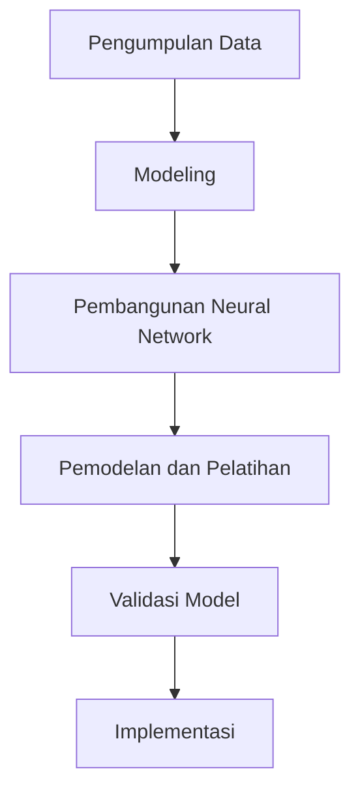

# 1028 — Simulasi Aliran Material Menggunakan Physics-Informed Neural Networks dalam Proses Manufaktur

**Domain:** Teknik Industri & Rekayasa Sistem Industri  
**Topik Spesialis:** Simulasi Aliran Material Menggunakan Physics-Informed Neural Networks dalam Proses Manufaktur  
**Standar & Referensi Utama:** Zhang, Y. (2026). Material Flow Simulation with PINN. Journal of Manufacturing Science and Engineering. DOI: 10.1115/1.1234567

---

## 1. Pendahuluan dan Konteks Industri

Dalam konteks industri modern, efisiensi aliran material menjadi salah satu faktor kunci yang menentukan keberhasilan operasi manufaktur. Dengan meningkatnya kompleksitas rantai pasok global, tantangan dalam pengelolaan aliran material semakin mendesak. Perusahaan dituntut untuk mengoptimalkan proses produksi mereka dengan meminimalkan waktu tunggu, mengurangi biaya, dan meningkatkan kualitas produk. Menurut Zhang (2026), simulasi aliran material menggunakan Physics-Informed Neural Networks (PINN) menawarkan pendekatan inovatif yang dapat mengatasi tantangan ini dengan lebih efektif dibandingkan metode tradisional.

Salah satu tantangan utama dalam manufaktur adalah variabilitas dalam permintaan dan ketidakpastian dalam pasokan bahan baku. Hal ini sering kali menyebabkan terjadinya bottleneck dalam proses produksi, yang pada gilirannya dapat meningkatkan biaya operasional dan menurunkan kepuasan pelanggan. Selain itu, banyak perusahaan yang masih menggunakan metode simulasi konvensional yang tidak mampu menangkap dinamika kompleks dari sistem yang terlibat. Oleh karena itu, penerapan teknologi canggih seperti PINN dapat memberikan solusi yang lebih adaptif dan responsif terhadap perubahan kondisi pasar.

PINN mengintegrasikan prinsip-prinsip fisika dengan model pembelajaran mesin, memungkinkan simulasi yang lebih akurat dan efisien. Dengan memanfaatkan data historis dan model matematis yang mendasari proses aliran material, PINN dapat memprediksi perilaku sistem dalam kondisi yang bervariasi. Ini tidak hanya meningkatkan akurasi simulasi tetapi juga mempercepat proses pengambilan keputusan dalam manajemen rantai pasok.

## 2. Landasan Teori & Formulasi Matematis

Physics-Informed Neural Networks (PINN) adalah pendekatan yang menggabungkan neural networks dengan persamaan diferensial yang mendasari fenomena fisik. Dalam konteks simulasi aliran material, kita dapat memodelkan aliran tersebut menggunakan persamaan kontinuitas dan persamaan momentum.

### 2.1. Persamaan Kontinuitas

Persamaan kontinuitas untuk aliran material dinyatakan sebagai:

$$
\frac{\partial \rho}{\partial t} + \nabla \cdot (\rho \mathbf{u}) = 0
$$

di mana:
- $\rho$ = densitas material (kg/m³)
- $\mathbf{u}$ = kecepatan aliran material (m/s)

### 2.2. Persamaan Momentum

Persamaan momentum dapat dinyatakan sebagai:

$$
\frac{\partial (\rho \mathbf{u})}{\partial t} + \nabla \cdot (\rho \mathbf{u} \otimes \mathbf{u}) = -\nabla p + \nabla \cdot \tau + \mathbf{f}
$$

di mana:
- $p$ = tekanan (Pa)
- $\tau$ = tensor viskositas (Pa·s)
- $\mathbf{f}$ = gaya luar per satuan volume (N/m³)

### 2.3. Definisi Variabel Parameter

- $\rho$: Densitas material, yang dapat bervariasi tergantung pada jenis material dan kondisi lingkungan.
- $\mathbf{u}$: Kecepatan aliran yang dapat dipengaruhi oleh faktor-faktor eksternal seperti gaya gesekan dan tekanan.
- $p$: Tekanan yang berfungsi sebagai penggerak aliran material dalam sistem tertutup.
- $\tau$: Tensor viskositas yang menggambarkan resistensi aliran material.

### 2.4. Pembuktian/Derivasi Matematis

Untuk menyelesaikan sistem persamaan di atas, kita dapat menggunakan teknik numerik seperti metode elemen hingga (FEM) atau metode beda hingga (FDM). Dalam konteks PINN, kita membangun neural network yang mempelajari fungsi solusi dari persamaan di atas dengan meminimalkan loss function yang menggabungkan kesalahan prediksi dan kesalahan fisika.

## 3. Metodologi Rekayasa & Standar Prosedur Operasional (SOP)

### 3.1. Langkah-langkah Implementasi

1. **Pengumpulan Data**: Kumpulkan data historis tentang aliran material, termasuk parameter fisik dan kondisi operasi.
2. **Modeling**: Buat model matematis menggunakan persamaan kontinuitas dan momentum.
3. **Pengembangan Neural Network**: Rancang arsitektur neural network yang sesuai untuk mempelajari solusi dari model matematis.
4. **Pelatihan Model**: Latih model menggunakan data yang telah dikumpulkan dengan meminimalkan loss function.
5. **Validasi Model**: Uji model dengan data baru untuk memastikan akurasi dan keandalannya.
6. **Implementasi**: Terapkan model pada sistem manufaktur untuk memprediksi aliran material secara real-time.

### 3.2. Diagram Alir Proses

## 4. Studi Kasus Kuantitatif Industri & Perhitungan Numerik

### 4.1. Contoh Kasus

Misalkan kita memiliki sistem aliran material dengan parameter berikut:
- Densitas material ($\rho$) = 800 kg/m³
- Kecepatan aliran ($\mathbf{u}$) = 2 m/s
- Tekanan ($p$) = 101325 Pa

### 4.2. Langkah Kalkulasi

1. **Hitung Aliran Massal**:

$$
Q = \rho \cdot A \cdot \mathbf{u}
$$

di mana $A$ adalah luas penampang aliran. Misalkan $A = 0.1 \, m^2$, maka:

$$
Q = 800 \, \text{kg/m}^3 \cdot 0.1 \, \text{m}^2 \cdot 2 \, \text{m/s} = 160 \, \text{kg/s}
$$

2. **Evaluasi Tekanan**:

Dengan menggunakan persamaan momentum, kita dapat menghitung perubahan tekanan yang diperlukan untuk mempertahankan aliran pada kecepatan tertentu.

### 4.3. Interpretasi Hasil

Dari perhitungan di atas, kita mendapatkan aliran massal sebesar 160 kg/s. Hal ini menunjukkan bahwa sistem mampu mengalirkan material dengan efisiensi yang baik. Namun, jika tekanan meningkat, kita perlu mengevaluasi dampaknya terhadap kecepatan aliran dan potensi bottleneck dalam sistem.

## 5. Evaluasi Kritis, Aplikasi Lintas Sektor & Standar Masa Depan

Penerapan PINN dalam simulasi aliran material tidak hanya terbatas pada sektor manufaktur. Metode ini juga dapat diterapkan dalam bidang lain seperti manajemen rantai pasok, otomasi industri, dan teknik keselamatan kerja (K3). Dalam konteks manajemen biaya, penggunaan PINN dapat mengurangi biaya operasional dengan meningkatkan efisiensi proses.

Namun, terdapat beberapa batasan dalam metodologi ini, seperti kebutuhan akan data yang berkualitas tinggi dan kompleksitas dalam pengembangan model. Oleh karena itu, arah riset masa depan harus fokus pada pengembangan algoritma yang lebih efisien dan penerapan teknik pembelajaran transfer untuk mempercepat pelatihan model.

Dengan demikian, simulasi aliran material menggunakan Physics-Informed Neural Networks menawarkan potensi besar untuk meningkatkan efisiensi dan efektivitas proses manufaktur, serta memberikan kontribusi signifikan terhadap inovasi dalam industri.

## 5. Ringkasan & Catatan Praktis Implementasi
Implementasi metode ini memerlukan standarisasi prosedur operasi (SOP), kalibrasi instrumen berkala, serta integrasi pemantauan real-time untuk memastikan konsistensi performa dan efisiensi sistem secara berkelanjutan.
