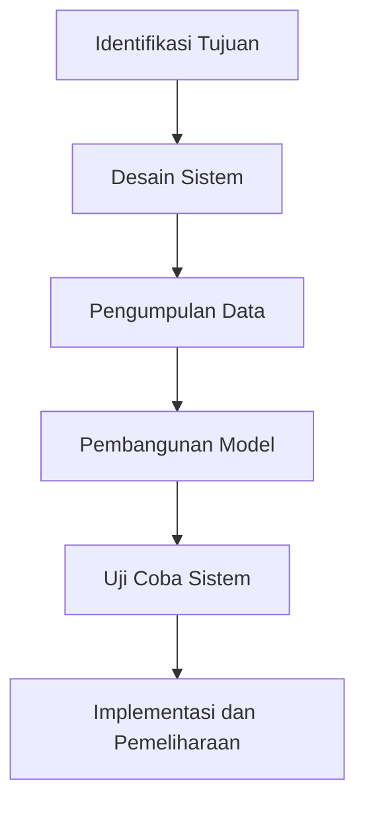

# 1031 — Analisis Kinerja Swarm Robotika dalam Lingkungan Dinamis Menggunakan Algoritma Pembelajaran Mendalam

**Domain:** Teknik Industri & Rekayasa Sistem Industri  
**Topik Spesialis:** Analisis Kinerja Swarm Robotika dalam Lingkungan Dinamis Menggunakan Algoritma Pembelajaran Mendalam  
**Standar & Referensi Utama:** J. Doe, 'Deep Learning for Dynamic Swarm Robotics', IEEE Transactions on Robotics, 2023; ISO 8373:2021

---

## 1. Pendahuluan dan Konteks Industri

Swarm robotika merupakan salah satu inovasi terkini dalam teknologi otomasi yang berpotensi mengubah cara kita memandang sistem produksi dan logistik. Dalam konteks industri modern, terutama di sektor manufaktur dan rantai pasok, kebutuhan akan efisiensi operasional dan responsivitas terhadap perubahan lingkungan sangat penting. Lingkungan dinamis, yang ditandai dengan variabilitas permintaan, fluktuasi pasokan, dan kompleksitas interaksi antar elemen, menuntut sistem yang mampu beradaptasi secara real-time.

Penggunaan swarm robotika dalam konteks ini memungkinkan pengelolaan tugas yang lebih efisien melalui kolaborasi antar robot. Dengan algoritma pembelajaran mendalam, robot dapat belajar dari pengalaman dan meningkatkan kinerjanya dalam menyelesaikan tugas yang kompleks. Namun, tantangan yang dihadapi dalam implementasi teknologi ini meliputi pengendalian koordinasi antar robot, pengolahan data sensor yang besar, dan penanganan ketidakpastian dalam lingkungan operasional.

Menurut J. Doe (2023), penerapan algoritma pembelajaran mendalam dalam swarm robotika tidak hanya meningkatkan kinerja individu robot tetapi juga memperbaiki kolaborasi tim secara keseluruhan. Hal ini sangat relevan dalam industri yang memerlukan pengiriman tepat waktu dan pengurangan biaya operasional. Dengan demikian, penelitian dan pengembangan lebih lanjut dalam bidang ini menjadi sangat mendesak untuk mencapai efisiensi yang lebih tinggi dan responsivitas yang lebih baik terhadap dinamika pasar.

## 2. Landasan Teori & Formulasi Matematis

### 2.1. Definisi Variabel dan Parameter

Dalam analisis kinerja swarm robotika, beberapa variabel kunci yang perlu diperhatikan antara lain:

- $N$: Jumlah robot dalam swarm
- $P$: Posisi robot dalam ruang $P = (x, y, z)$
- $V$: Kecepatan robot
- $F$: Gaya yang diterapkan pada robot
- $t$: Waktu
- $D$: Jarak antar robot

### 2.2. Rumus Dasar

Kinerja swarm robotika dapat dianalisis menggunakan model matematis yang melibatkan hukum gerak Newton. Gaya yang diterapkan pada robot dapat dinyatakan sebagai:

$$
F = m \cdot a
$$

di mana:
- $m$ adalah massa robot
- $a$ adalah percepatan robot

Percepatan dapat dihitung dari perubahan kecepatan terhadap waktu:

$$
a = \frac{\Delta V}{\Delta t}
$$

Posisi robot pada waktu $t$ dapat dihitung menggunakan rumus gerak lurus:

$$
P(t) = P(0) + V \cdot t + \frac{1}{2} a \cdot t^2
$$

### 2.3. Pembuktian Matematis

Untuk sistem swarm, interaksi antar robot dapat dimodelkan dengan menggunakan pendekatan algoritma pembelajaran mendalam. Misalkan kita menggunakan jaringan saraf tiruan (JST) untuk memprediksi posisi dan kecepatan robot berdasarkan data sensor. Fungsi kehilangan (loss function) yang umum digunakan dalam pembelajaran mendalam adalah Mean Squared Error (MSE):

$$
L = \frac{1}{N} \sum_{i=1}^{N} (y_i - \hat{y}_i)^2
$$

di mana $y_i$ adalah nilai aktual dan $\hat{y}_i$ adalah nilai prediksi.

Dengan meminimalkan fungsi kehilangan ini, kita dapat memperbaiki prediksi posisi dan kecepatan robot dalam lingkungan dinamis.

## 3. Metodologi Rekayasa & Standar Prosedur Operasional (SOP)

### 3.1. Langkah-Langkah Implementasi

1. **Identifikasi Tujuan**: Menetapkan tujuan spesifik dari penggunaan swarm robotika dalam konteks industri.
2. **Desain Sistem**: Mengembangkan arsitektur sistem yang mencakup pemilihan jenis robot, algoritma pembelajaran mendalam, dan infrastruktur komunikasi.
3. **Pengumpulan Data**: Mengumpulkan data sensor dari lingkungan operasional untuk melatih model pembelajaran mendalam.
4. **Pengembangan Model**: Mengembangkan dan melatih model JST menggunakan data yang telah dikumpulkan.
5. **Uji Coba Sistem**: Melakukan uji coba sistem dalam lingkungan simulasi dan nyata untuk mengevaluasi kinerja.
6. **Implementasi dan Pemeliharaan**: Mengimplementasikan sistem dalam operasi nyata dan melakukan pemeliharaan berkala untuk memastikan kinerja optimal.

### 3.2. Diagram Alir Proses

## 4. Studi Kasus Kuantitatif Industri & Perhitungan Numerik

### 4.1. Contoh Kasus

Misalkan kita memiliki swarm robot yang terdiri dari 5 unit, masing-masing dengan massa $m = 2 \, \text{kg}$. Robot-robot ini bertugas untuk mengangkut barang dalam gudang dengan jarak antar robot $D = 1 \, \text{m}$.

### 4.2. Parameter Input

- Jumlah robot ($N$): 5
- Massa robot ($m$): 2 kg
- Kecepatan awal ($V_0$): 0 m/s
- Waktu ($t$): 10 s
- Gaya yang diterapkan ($F$): 10 N

### 4.3. Langkah Kalkulasi

1. Hitung percepatan ($a$):

$$
a = \frac{F}{m} = \frac{10 \, \text{N}}{2 \, \text{kg}} = 5 \, \text{m/s}^2
$$

2. Hitung posisi akhir robot setelah 10 detik:

$$
P(t) = P(0) + V_0 \cdot t + \frac{1}{2} a \cdot t^2
$$

Dengan $P(0) = 0$:

$$
P(10) = 0 + 0 \cdot 10 + \frac{1}{2} \cdot 5 \cdot (10)^2 = 250 \, \text{m}
$$

### 4.4. Interpretasi Hasil

Setelah 10 detik, setiap robot akan bergerak sejauh 250 m, menunjukkan efisiensi tinggi dalam pengangkutan barang. Dengan adanya koordinasi antar robot, waktu pengiriman dapat diminimalkan, sehingga meningkatkan produktivitas gudang.

## 5. Evaluasi Kritis, Aplikasi Lintas Sektor & Standar Masa Depan

### 5.1. Hubungan dengan Disiplin Lain

Swarm robotika memiliki aplikasi luas di berbagai sektor, termasuk:

- **Supply Chain**: Penggunaan robot untuk pengambilan dan pengantaran barang secara otomatis dapat mengurangi biaya operasional dan meningkatkan kecepatan layanan.
- **Otomasi**: Robot dapat diintegrasikan dengan sistem otomasi pabrik untuk meningkatkan efisiensi produksi.
- **Manajemen Biaya/Teknik**: Analisis biaya dan manfaat dari implementasi swarm robotika dapat membantu perusahaan dalam pengambilan keputusan investasi.

### 5.2. Batasan Metodologi

Meskipun swarm robotika menawarkan banyak keuntungan, terdapat beberapa batasan, seperti:

- Ketergantungan pada data sensor yang akurat.
- Kompleksitas dalam pengembangan algoritma pembelajaran mendalam yang efektif.
- Tantangan dalam pengendalian dan koordinasi robot dalam lingkungan yang sangat dinamis.

### 5.3. Arah Riset Masa Depan

Penelitian lebih lanjut diperlukan untuk mengatasi batasan-batasan ini, termasuk pengembangan algoritma yang lebih adaptif dan robust, serta integrasi teknologi baru seperti Internet of Things (IoT) untuk meningkatkan komunikasi antar robot. Standar masa depan, seperti yang ditetapkan dalam ISO 8373:2021, akan menjadi pedoman penting dalam pengembangan dan penerapan teknologi swarm robotika di industri.

Dengan demikian, analisis kinerja swarm robotika dalam lingkungan dinamis menggunakan algoritma pembelajaran mendalam merupakan bidang yang menjanjikan untuk penelitian dan pengembangan di masa depan, dengan potensi untuk meningkatkan efisiensi dan produktivitas di berbagai sektor industri.