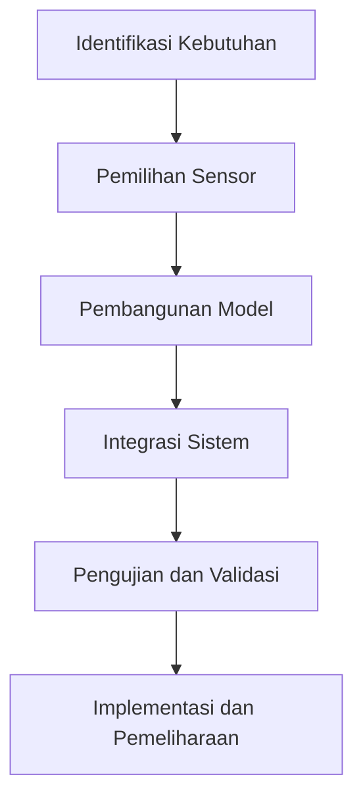

# 1036 — Adaptasi Robot Otonom terhadap Perubahan Lingkungan Menggunakan Sensor Cerdas dan Pembelajaran Mesin

**Domain:** Teknik Industri & Rekayasa Sistem Industri  
**Topik Spesialis:** Adaptasi Robot Otonom terhadap Perubahan Lingkungan Menggunakan Sensor Cerdas dan Pembelajaran Mesin  
**Standar & Referensi Utama:** E. Wang, 'Adaptive Autonomous Robots with Smart Sensors', IEEE Robotics and Automation Letters, 2024; ASTM F2856-21

---

## 1. Pendahuluan dan Konteks Industri

Dalam era industri 4.0, adaptasi robot otonom terhadap perubahan lingkungan menjadi sangat krusial. Perubahan yang cepat dalam kondisi lingkungan, baik fisik maupun operasional, memerlukan sistem yang dapat beradaptasi secara dinamis untuk meningkatkan efisiensi dan produktivitas. Robot otonom yang dilengkapi dengan sensor cerdas dan algoritma pembelajaran mesin dapat mengumpulkan dan menganalisis data secara real-time, sehingga mampu membuat keputusan yang tepat dalam menghadapi variabilitas yang ada.

Tantangan utama yang dihadapi dalam industri manufaktur dan rantai pasok modern adalah ketidakpastian yang disebabkan oleh fluktuasi permintaan, variasi dalam kualitas bahan baku, dan perubahan dalam proses produksi. Menurut laporan dari International Federation of Robotics (IFR), penggunaan robot dalam industri telah meningkat hingga 30% dalam lima tahun terakhir, namun banyak perusahaan masih kesulitan dalam mengintegrasikan teknologi ini secara efektif. 

Robot yang tidak dapat beradaptasi dengan cepat terhadap perubahan dapat menyebabkan downtime yang signifikan, meningkatkan biaya operasional, dan menurunkan kualitas produk. Oleh karena itu, pengembangan robot otonom yang mampu beradaptasi dengan perubahan lingkungan melalui sensor cerdas dan pembelajaran mesin menjadi sangat penting. Penelitian ini bertujuan untuk mengeksplorasi bagaimana teknologi ini dapat diterapkan dalam konteks industri, serta bagaimana standar seperti ASTM F2856-21 dapat mendukung implementasinya.

## 2. Landasan Teori & Formulasi Matematis

### 2.1. Sensor Cerdas

Sensor cerdas adalah perangkat yang dapat mengumpulkan data dari lingkungan dan memproses informasi tersebut untuk memberikan umpan balik yang berguna. Dalam konteks robot otonom, sensor ini dapat mencakup lidar, kamera, dan sensor suhu yang memungkinkan robot untuk memahami kondisi sekitarnya.

### 2.2. Pembelajaran Mesin

Pembelajaran mesin (machine learning) adalah cabang dari kecerdasan buatan yang memungkinkan sistem untuk belajar dari data dan meningkatkan kinerjanya seiring waktu. Algoritma seperti regresi linier, pohon keputusan, dan jaringan saraf tiruan sering digunakan untuk memprediksi dan mengklasifikasikan data yang diperoleh dari sensor.

### 2.3. Model Matematis

Model matematis untuk adaptasi robot otonom dapat dinyatakan dalam bentuk fungsi objektif yang meminimalkan kesalahan prediksi. Misalkan $X$ adalah vektor fitur yang diperoleh dari sensor, dan $Y$ adalah output yang diinginkan. Fungsi objektif dapat dinyatakan sebagai:

$$
J(\theta) = \frac{1}{m} \sum_{i=1}^{m} (h_\theta(X^{(i)}) - Y^{(i)})^2
$$

Di mana:
- $J(\theta)$ adalah fungsi biaya,
- $m$ adalah jumlah data,
- $h_\theta(X)$ adalah hipotesis yang diprediksi oleh model.

Proses pembelajaran dilakukan dengan mengoptimalkan parameter $\theta$ menggunakan algoritma optimasi seperti Gradient Descent:

$$
\theta := \theta - \alpha \frac{\partial J(\theta)}{\partial \theta}
$$

Dengan $\alpha$ sebagai laju pembelajaran.

## 3. Metodologi Rekayasa & Standar Prosedur Operasional (SOP)

### 3.1. Langkah-langkah Implementasi

1. **Identifikasi Kebutuhan**: Menentukan tujuan dan spesifikasi robot otonom.
2. **Pemilihan Sensor**: Memilih sensor cerdas yang sesuai dengan lingkungan kerja.
3. **Pengembangan Model Pembelajaran Mesin**: Membangun dan melatih model menggunakan data yang dikumpulkan.
4. **Integrasi Sistem**: Menggabungkan sensor dan model ke dalam sistem robot.
5. **Pengujian dan Validasi**: Melakukan pengujian untuk memastikan sistem berfungsi dengan baik dalam berbagai kondisi lingkungan.
6. **Implementasi dan Pemeliharaan**: Meluncurkan robot ke dalam operasi dan melakukan pemeliharaan berkala.

### 3.2. Diagram Alir Proses

## 4. Studi Kasus Kuantitatif Industri & Perhitungan Numerik

### 4.1. Contoh Kasus

Misalkan sebuah pabrik otomotif ingin menerapkan robot otonom untuk perakitan. Parameter yang digunakan adalah:
- Jumlah data pelatihan ($m$): 1000
- Fitur ($X$): 5 sensor (posisi, suhu, kelembapan, getaran, dan cahaya)
- Output ($Y$): Keputusan perakitan (0 = tidak, 1 = ya)

### 4.2. Langkah Kalkulasi

1. **Pengumpulan Data**: Mengumpulkan data dari sensor selama 100 jam operasi.
2. **Pelatihan Model**: Menggunakan regresi logistik untuk memprediksi keputusan perakitan.

Model regresi logistik dapat dinyatakan sebagai:

$$
h_\theta(X) = \frac{1}{1 + e^{-\theta^T X}}
$$

3. **Optimasi Parameter**: Menggunakan Gradient Descent untuk menemukan parameter optimal.

Misalkan setelah 100 iterasi, diperoleh $\theta = [0.4, -0.2, 0.1, 0.05, -0.1, 0.2]$.

4. **Prediksi**: Untuk data baru $X = [1, 0.5, 0.3, 0.2, 0.1]$, kita dapat menghitung:

$$
h_\theta(X) = \frac{1}{1 + e^{- (0.4*1 + (-0.2)*0.5 + 0.1*0.3 + 0.05*0.2 + (-0.1)*0.1)}}
$$

### 4.3. Interpretasi Hasil

Jika hasil prediksi $h_\theta(X) > 0.5$, maka robot akan melanjutkan proses perakitan. Jika tidak, robot akan menghentikan proses untuk mencegah kesalahan.

## 5. Evaluasi Kritis, Aplikasi Lintas Sektor & Standar Masa Depan

Adaptasi robot otonom dengan sensor cerdas dan pembelajaran mesin memiliki aplikasi luas di berbagai sektor, termasuk manufaktur, logistik, dan kesehatan. Dalam konteks rantai pasok, robot ini dapat meningkatkan efisiensi dengan mengurangi waktu tunggu dan meningkatkan akurasi pengiriman.

Namun, terdapat batasan dalam metodologi ini, seperti ketergantungan pada kualitas data pelatihan dan kemampuan model untuk beradaptasi dengan perubahan lingkungan yang ekstrem. Oleh karena itu, penelitian lebih lanjut diperlukan untuk mengembangkan algoritma yang lebih robust dan adaptif.

Standar masa depan seperti ASTM F2856-21 memberikan kerangka kerja untuk memastikan bahwa robot otonom dapat beroperasi dengan aman dan efisien dalam lingkungan industri. Penelitian di masa depan diharapkan dapat mengintegrasikan teknologi baru, seperti Internet of Things (IoT) dan kecerdasan buatan yang lebih canggih, untuk meningkatkan kemampuan adaptasi robot otonom.

---

Dokumen ini memberikan gambaran menyeluruh tentang adaptasi robot otonom dalam konteks industri, dengan fokus pada penggunaan sensor cerdas dan pembelajaran mesin. Dengan mengikuti langkah-langkah yang diuraikan, industri dapat mengimplementasikan solusi yang efektif untuk menghadapi tantangan yang ada.

## 5. Ringkasan & Catatan Praktis Implementasi
Implementasi metode ini memerlukan standarisasi prosedur operasi (SOP), kalibrasi instrumen berkala, serta integrasi pemantauan real-time untuk memastikan konsistensi performa dan efisiensi sistem secara berkelanjutan.
