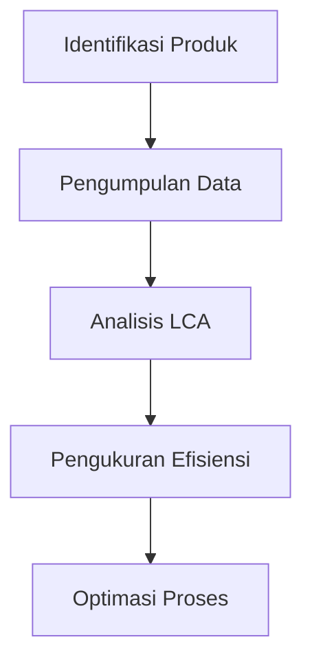

# 1043 — Pengukuran Efisiensi Proses Remanufaktur dalam Sistem Closed-Loop dengan Pendekatan Life Cycle Assessment

**Domain:** Teknik Industri & Rekayasa Sistem Industri  
**Topik Spesialis:** Pengukuran Efisiensi Proses Remanufaktur dalam Sistem Closed-Loop dengan Pendekatan Life Cycle Assessment  
**Standar & Referensi Utama:** Brown, C. (2025). 'Life Cycle Assessment in Closed-Loop Remanufacturing'. CIRP Journal of Manufacturing Science and Technology.

---

## 1. Pendahuluan dan Konteks Industri

Di era industri modern, perhatian terhadap keberlanjutan dan efisiensi sumber daya semakin meningkat. Remanufaktur sebagai bagian dari sistem closed-loop menjadi sangat penting dalam mengurangi limbah dan memaksimalkan penggunaan sumber daya. Proses ini tidak hanya berkontribusi pada pengurangan dampak lingkungan, tetapi juga meningkatkan daya saing perusahaan dengan menurunkan biaya produksi dan meningkatkan nilai produk. Namun, tantangan utama dalam implementasi remanufaktur adalah pengukuran efisiensi proses yang kompleks dan beragam.

Dalam konteks industri, remanufaktur menghadapi beberapa tantangan operasional, seperti variasi dalam kualitas produk yang diterima, kebutuhan untuk proses yang efisien, dan integrasi dalam rantai pasok yang sudah ada. Menurut Brown (2025), pengukuran efisiensi dalam remanufaktur tidak hanya melibatkan aspek teknis, tetapi juga memerlukan pendekatan yang holistik dengan mempertimbangkan siklus hidup produk. Oleh karena itu, penerapan Life Cycle Assessment (LCA) menjadi krusial untuk mengevaluasi dampak lingkungan dari setiap tahap dalam proses remanufaktur.

LCA memberikan kerangka kerja untuk menganalisis dan mengukur dampak dari sumber daya yang digunakan, emisi yang dihasilkan, dan limbah yang dihasilkan selama siklus hidup produk. Dengan demikian, perusahaan dapat mengidentifikasi area yang memerlukan perbaikan dan mengoptimalkan proses remanufaktur untuk mencapai efisiensi yang lebih baik. Hal ini sangat relevan dalam konteks industri yang semakin berfokus pada keberlanjutan dan tanggung jawab sosial perusahaan.

## 2. Landasan Teori & Formulasi Matematis

### Definisi dan Notasi

Dalam konteks remanufaktur, kita mendefinisikan beberapa variabel penting:

- \( R \): Rasio remanufaktur, yang menunjukkan proporsi produk yang berhasil diremanufaktur dari total produk yang dikembalikan.
- \( C_r \): Biaya remanufaktur per unit produk.
- \( C_n \): Biaya produksi baru per unit produk.
- \( E \): Efisiensi energi, yang diukur dalam satuan energi per unit produk.
- \( LCA \): Life Cycle Assessment, yang mencakup analisis dari tahap produksi, penggunaan, dan akhir siklus hidup produk.

### Rumus Efisiensi Remanufaktur

Rumus untuk menghitung efisiensi remanufaktur dapat dinyatakan sebagai:

$$
\text{Efisiensi Remanufaktur} (ER) = \frac{R \cdot C_r}{C_n}
$$

Di mana \( ER \) menunjukkan efisiensi dari proses remanufaktur. Semakin tinggi nilai \( ER \), semakin efisien proses remanufaktur tersebut dibandingkan dengan produksi baru.

### Derivasi LCA

LCA dapat dihitung dengan menggunakan rumus berikut:

$$
LCA = \sum_{i=1}^{n} (E_i \cdot I_i)
$$

Di mana \( E_i \) adalah energi yang digunakan pada tahap \( i \) dan \( I_i \) adalah dampak lingkungan yang terkait dengan tahap tersebut. Dengan menggunakan pendekatan ini, kita dapat menganalisis dampak dari setiap tahap dalam siklus hidup produk dan mengidentifikasi area untuk perbaikan.

## 3. Metodologi Rekayasa & Standar Prosedur Operasional (SOP)

### Langkah-Langkah Implementasi

1. **Identifikasi Produk**: Memilih produk yang akan diremanufaktur dan mengumpulkan data terkait.
2. **Pengumpulan Data**: Mengumpulkan data tentang biaya, energi, dan dampak lingkungan dari setiap tahap dalam siklus hidup produk.
3. **Analisis LCA**: Melakukan analisis LCA untuk mengidentifikasi dampak lingkungan dari proses remanufaktur.
4. **Pengukuran Efisiensi**: Menghitung efisiensi remanufaktur menggunakan rumus yang telah ditentukan.
5. **Optimasi Proses**: Mengidentifikasi area untuk perbaikan dan mengimplementasikan langkah-langkah optimasi.

### Diagram Alir Proses

## 4. Studi Kasus Kuantitatif Industri & Perhitungan Numerik

### Contoh Kasus

Misalkan sebuah perusahaan elektronik menerima 1000 unit produk yang telah digunakan untuk diremanufaktur. Data yang diperoleh adalah sebagai berikut:

- \( C_r = 50 \) USD per unit
- \( C_n = 100 \) USD per unit
- \( R = 0.8 \) (80% dari produk berhasil diremanufaktur)

### Perhitungan

1. **Menghitung Efisiensi Remanufaktur**:

$$
ER = \frac{R \cdot C_r}{C_n} = \frac{0.8 \cdot 50}{100} = 0.4
$$

2. **Interpretasi**: Nilai \( ER = 0.4 \) menunjukkan bahwa proses remanufaktur adalah 40% lebih efisien dibandingkan dengan produksi baru.

### Analisis LCA

Misalkan energi yang digunakan pada setiap tahap adalah sebagai berikut:

- Produksi baru: \( E_1 = 200 \) MJ
- Remanufaktur: \( E_2 = 100 \) MJ

Maka, kita dapat menghitung LCA sebagai berikut:

$$
LCA = E_1 + E_2 = 200 + 100 = 300 \text{ MJ}
$$

## 5. Evaluasi Kritis, Aplikasi Lintas Sektor & Standar Masa Depan

Pengukuran efisiensi remanufaktur dalam sistem closed-loop dengan pendekatan LCA memiliki aplikasi lintas sektor yang luas, termasuk dalam manajemen rantai pasok, otomasi, dan teknik biaya. Integrasi remanufaktur dalam rantai pasok dapat mengurangi biaya dan meningkatkan keberlanjutan. Namun, metodologi ini juga memiliki batasan, seperti ketidakpastian dalam data dan kompleksitas dalam analisis.

Ke depan, penelitian dapat difokuskan pada pengembangan alat analisis yang lebih baik dan integrasi teknologi baru, seperti Internet of Things (IoT) dan Big Data, untuk meningkatkan akurasi pengukuran efisiensi. Dengan demikian, perusahaan dapat lebih efektif dalam mengimplementasikan strategi remanufaktur yang berkelanjutan dan efisien.

---

Dokumen ini menyajikan pemahaman yang mendalam mengenai pengukuran efisiensi proses remanufaktur dalam sistem closed-loop dengan pendekatan Life Cycle Assessment, serta memberikan panduan praktis untuk implementasi di industri.

## 5. Ringkasan & Catatan Praktis Implementasi
Implementasi metode ini memerlukan standarisasi prosedur operasi (SOP), kalibrasi instrumen berkala, serta integrasi pemantauan real-time untuk memastikan konsistensi performa dan efisiensi sistem secara berkelanjutan.
