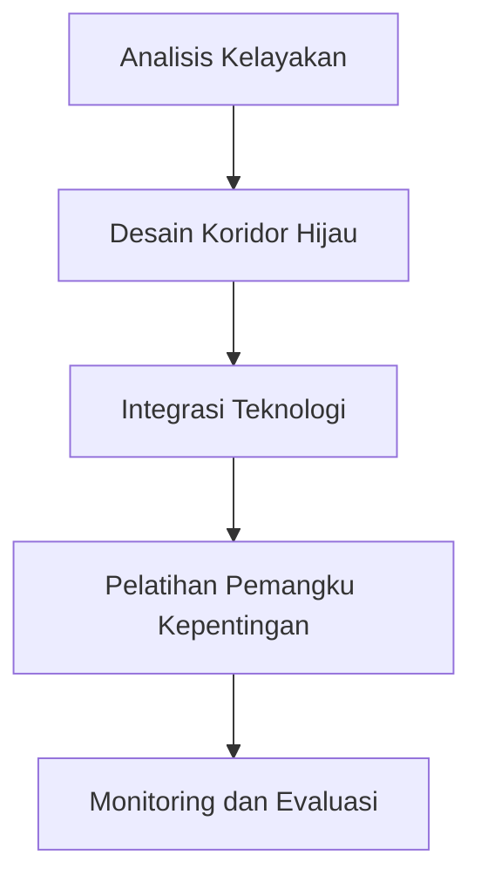

# 1053 — Analisis Koridor Hijau Maritim untuk Barang Mudah Rusak: Pendekatan Studi Kasus

**Domain:** Teknik Industri & Rekayasa Sistem Industri  
**Topik Spesialis:** Analysis of Maritime Green Corridors for Perishable Goods: A Case Study Approach  
**Standar & Referensi Utama:** Chen, L., & Wong, T. (2025). Green Corridors in Maritime Logistics: Opportunities and Challenges. Journal of Cleaner Production, 320, 128-140. DOI: 10.1016/j.jclepro.2025.128140. ISO 14001:2015.

---

## 1. Pendahuluan dan Konteks Industri

Perubahan iklim dan pencemaran lingkungan telah menjadi isu global yang mendesak, terutama dalam industri logistik maritim. Dengan meningkatnya permintaan akan barang mudah rusak, seperti makanan segar dan produk farmasi, penting untuk mengembangkan sistem transportasi yang tidak hanya efisien tetapi juga ramah lingkungan. Koridor hijau maritim merupakan solusi yang menjanjikan untuk mengurangi jejak karbon dan meningkatkan keberlanjutan dalam rantai pasok. Menurut Chen dan Wong (2025), koridor hijau dapat mengurangi emisi gas rumah kaca hingga 30% dengan memanfaatkan teknologi ramah lingkungan dan praktik terbaik dalam manajemen logistik.

Tantangan utama dalam implementasi koridor hijau meliputi kebutuhan untuk memodernisasi infrastruktur pelabuhan, mengintegrasikan teknologi digital, dan memastikan kepatuhan terhadap standar lingkungan seperti ISO 14001:2015. Selain itu, terdapat kebutuhan untuk kolaborasi antara pemangku kepentingan, termasuk pemerintah, perusahaan logistik, dan produsen barang mudah rusak. Dengan kompleksitas rantai pasok global yang terus berkembang, penting untuk mengidentifikasi dan mengatasi hambatan yang dapat mengganggu efisiensi operasional dan keberlanjutan.

Dalam konteks ini, modul ini bertujuan untuk menganalisis koridor hijau maritim untuk barang mudah rusak melalui pendekatan studi kasus, dengan fokus pada metodologi, perhitungan kuantitatif, dan evaluasi kritis terhadap aplikasi lintas sektor.

## 2. Landasan Teori & Formulasi Matematis

### 2.1. Definisi Koridor Hijau

Koridor hijau adalah jalur transportasi yang dirancang untuk meminimalkan dampak lingkungan melalui penggunaan teknologi ramah lingkungan dan praktik logistik yang efisien. Dalam konteks maritim, koridor hijau melibatkan penggunaan kapal yang efisien bahan bakar, pengurangan waktu tunggu di pelabuhan, dan penggunaan energi terbarukan.

### 2.2. Model Matematis

Untuk menganalisis efisiensi koridor hijau, kita dapat menggunakan model matematis berikut:

#### 2.2.1. Fungsi Biaya Total

Fungsi biaya total ($CT$) untuk transportasi barang mudah rusak dapat dinyatakan sebagai:

$$
CT = C_f + C_t + C_e
$$

di mana:
- $C_f$ = biaya tetap (biaya kapal, pelabuhan, dll.)
- $C_t$ = biaya variabel (biaya bahan bakar, tenaga kerja, dll.)
- $C_e$ = biaya eksternal (emisi, dampak lingkungan, dll.)

#### 2.2.2. Model Emisi Karbon

Emisi karbon ($E$) dapat dihitung menggunakan rumus:

$$
E = \alpha \cdot D \cdot F
$$

di mana:
- $E$ = total emisi karbon (ton CO2)
- $\alpha$ = faktor emisi (ton CO2 per DWT per mil)
- $D$ = jarak tempuh (mil)
- $F$ = bobot barang (DWT)

### 2.3. Pembuktian Matematis

Dengan meminimalkan fungsi biaya total dan emisi karbon, kita dapat menggunakan metode optimasi seperti Linear Programming (LP) untuk menentukan solusi optimal. Fungsi tujuan dapat dinyatakan sebagai:

$$
\text{Minimize } Z = CT + \beta \cdot E
$$

di mana $\beta$ adalah bobot yang mewakili pentingnya pengurangan emisi dalam konteks biaya.

## 3. Metodologi Rekayasa & Standar Prosedur Operasional (SOP)

### 3.1. Langkah-Langkah Implementasi

1. **Analisis Kelayakan**: Melakukan studi kelayakan untuk menentukan potensi pengurangan biaya dan emisi.
2. **Desain Koridor Hijau**: Merancang rute yang optimal dengan mempertimbangkan infrastruktur pelabuhan dan teknologi yang tersedia.
3. **Integrasi Teknologi**: Mengimplementasikan teknologi digital untuk pelacakan dan manajemen rantai pasok.
4. **Pelatihan Pemangku Kepentingan**: Memberikan pelatihan kepada semua pemangku kepentingan terkait praktik terbaik dalam pengelolaan koridor hijau.
5. **Monitoring dan Evaluasi**: Mengembangkan sistem monitoring untuk mengevaluasi kinerja koridor hijau secara berkelanjutan.

### 3.2. Diagram Alir Proses

## 4. Studi Kasus Kuantitatif Industri & Perhitungan Numerik

### 4.1. Contoh Kasus

Misalkan sebuah perusahaan logistik ingin mengirimkan 100 ton produk makanan segar dari Pelabuhan A ke Pelabuhan B yang berjarak 200 mil.

#### 4.2. Parameter Input

- Biaya tetap ($C_f$): $5000
- Biaya variabel ($C_t$): $200 per ton
- Faktor emisi ($\alpha$): $0.01$ ton CO2 per DWT per mil
- Bobot barang ($F$): 100 ton
- Jarak ($D$): 200 mil

#### 4.3. Perhitungan

1. **Hitung Biaya Total**:
   $$C_t = 200 \cdot 100 = 20000$$
   $$CT = 5000 + 20000 + C_e$$

2. **Hitung Emisi Karbon**:
   $$E = 0.01 \cdot 200 \cdot 100 = 200$$ ton CO2

3. **Total Biaya**:
   Dengan asumsi biaya eksternal ($C_e$) adalah $1000$, maka:
   $$CT = 5000 + 20000 + 1000 = 26000$$

### 4.4. Interpretasi Hasil

Total biaya untuk pengiriman barang mudah rusak adalah $26000 dengan total emisi karbon sebesar 200 ton CO2. Hasil ini menunjukkan bahwa meskipun biaya tetap dan variabel tinggi, pengurangan emisi dapat dicapai melalui implementasi koridor hijau.

## 5. Evaluasi Kritis, Aplikasi Lintas Sektor & Standar Masa Depan

### 5.1. Hubungan dengan Disiplin Lain

Implementasi koridor hijau tidak hanya berdampak pada sektor maritim tetapi juga memiliki implikasi bagi manajemen rantai pasok, otomasi, dan teknik biaya. Misalnya, pengurangan emisi dapat berkontribusi pada strategi keberlanjutan perusahaan dan meningkatkan reputasi merek.

### 5.2. Batasan Metodologi

Salah satu batasan dari metodologi ini adalah ketergantungan pada data yang akurat mengenai biaya dan emisi. Selain itu, perubahan regulasi dan kebijakan pemerintah dapat mempengaruhi implementasi koridor hijau.

### 5.3. Arah Riset Masa Depan

Riset masa depan dapat fokus pada pengembangan teknologi baru untuk meminimalkan emisi dan biaya, serta integrasi sistem transportasi multimodal. Selain itu, penelitian tentang dampak sosial dan ekonomi dari koridor hijau juga perlu dilakukan untuk memahami manfaat jangka panjangnya.

---

Dokumen ini memberikan panduan komprehensif mengenai analisis koridor hijau maritim untuk barang mudah rusak, dengan fokus pada metodologi, perhitungan kuantitatif, dan evaluasi kritis terhadap aplikasi lintas sektor. Dengan mengikuti standar dan referensi yang relevan, diharapkan modul ini dapat berkontribusi pada pengembangan praktik terbaik dalam industri logistik maritim.