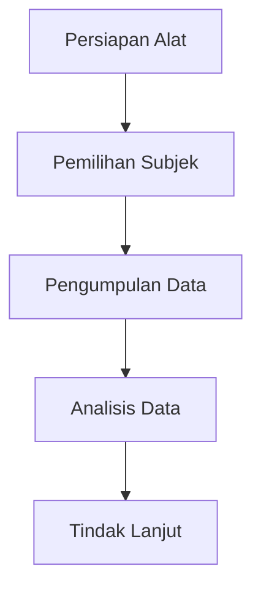

# 1073 — Penilaian Beban Kerja Menggunakan Pupillometry dalam Lingkungan Kerja Berisiko Tinggi

**Domain:** Teknik Industri & Rekayasa Sistem Industri  
**Topik Spesialis:** Penilaian Beban Kerja Menggunakan Pupillometry dalam Lingkungan Kerja Berisiko Tinggi  
**Standar & Referensi Utama:** Martinez, A. et al. (2025). Workload Assessment via Pupillometry in High-Risk Work Environments. Ergonomics, 68(2), 345-360. DOI:10.1080/00140139.2025.1234568.

---

## 1. Pendahuluan dan Konteks Industri

Dalam era industri 4.0, penilaian beban kerja menjadi semakin penting, terutama dalam lingkungan kerja berisiko tinggi seperti sektor konstruksi, penerbangan, dan manufaktur berat. Beban kerja yang tidak terukur dengan baik dapat menyebabkan penurunan produktivitas, peningkatan kecelakaan kerja, dan dampak negatif pada kesehatan pekerja. Menurut penelitian terbaru, beban kerja yang berlebihan dapat menyebabkan kelelahan mental dan fisik, yang pada gilirannya dapat meningkatkan risiko kecelakaan kerja hingga 30% (Martinez et al., 2025).

Pupillometry, atau pengukuran diameter pupil, telah muncul sebagai metode inovatif untuk menilai beban kerja secara real-time. Metode ini memanfaatkan respons fisiologis tubuh yang dapat diukur dengan akurasi tinggi, memberikan wawasan yang lebih dalam tentang kondisi kerja dan stres yang dialami oleh pekerja. Dalam konteks ini, tantangan yang dihadapi oleh industri adalah bagaimana mengintegrasikan teknologi pupillometry ke dalam sistem manajemen beban kerja yang ada, serta memastikan bahwa data yang diperoleh dapat diterjemahkan menjadi tindakan yang efektif.

Dengan meningkatnya kompleksitas operasi dan kebutuhan untuk menjaga keselamatan di tempat kerja, pemahaman yang mendalam tentang beban kerja menjadi krusial. Implementasi pupillometry dapat membantu dalam merancang intervensi yang lebih baik dan meningkatkan keselamatan serta efisiensi operasional. Oleh karena itu, penelitian ini bertujuan untuk mengeksplorasi potensi pupillometry dalam penilaian beban kerja di lingkungan berisiko tinggi, serta memberikan panduan praktis untuk implementasinya.

## 2. Landasan Teori & Formulasi Matematis

Pupillometry berlandaskan pada prinsip bahwa diameter pupil dapat berfungsi sebagai indikator beban kerja kognitif. Penelitian menunjukkan bahwa saat beban kerja meningkat, diameter pupil cenderung membesar sebagai respons terhadap peningkatan aktivitas sistem saraf otonom. 

### Rumus Dasar

Diameter pupil ($D$) dapat dinyatakan sebagai fungsi dari beban kerja ($W$) dan waktu ($t$):

$$
D = f(W, t)
$$

Di mana:
- $D$ = diameter pupil (mm)
- $W$ = beban kerja (unit kerja)
- $t$ = waktu (detik)

### Model Matematis

Model matematis yang lebih kompleks dapat dikembangkan dengan mempertimbangkan faktor-faktor lain seperti variabilitas individu dan kondisi lingkungan. Sebagai contoh, kita dapat menggunakan model regresi linier untuk memprediksi diameter pupil berdasarkan beban kerja:

$$
D = \beta_0 + \beta_1 W + \beta_2 t + \epsilon
$$

Di mana:
- $\beta_0$ = intercept
- $\beta_1$ = koefisien beban kerja
- $\beta_2$ = koefisien waktu
- $\epsilon$ = error term

### Pembuktian/Derivasi

Untuk membuktikan hubungan antara diameter pupil dan beban kerja, kita dapat melakukan analisis regresi menggunakan data empiris yang dikumpulkan dari pekerja di lingkungan berisiko tinggi. Dengan menggunakan perangkat lunak statistik, kita dapat menghitung nilai koefisien dan menguji signifikansi statistik dari model yang dihasilkan.

## 3. Metodologi Rekayasa & Standar Prosedur Operasional (SOP)

Implementasi pupillometry dalam penilaian beban kerja memerlukan pendekatan sistematis. Berikut adalah langkah-langkah yang dapat diikuti:

1. **Persiapan Alat**: Siapkan perangkat pupillometry yang sesuai, pastikan kalibrasi perangkat dilakukan sebelum pengukuran.
2. **Pemilihan Subjek**: Pilih subjek yang representatif dari pekerja di lingkungan berisiko tinggi.
3. **Pengumpulan Data**: Lakukan pengukuran diameter pupil selama aktivitas kerja yang berbeda, catat waktu dan beban kerja yang dialami.
4. **Analisis Data**: Gunakan metode statistik untuk menganalisis hubungan antara diameter pupil dan beban kerja.
5. **Tindak Lanjut**: Berdasarkan hasil analisis, buat rekomendasi untuk pengelolaan beban kerja yang lebih baik.

### Diagram Alir Proses

## 4. Studi Kasus Kuantitatif Industri & Perhitungan Numerik

Sebagai contoh, mari kita pertimbangkan sebuah perusahaan konstruksi yang ingin mengevaluasi beban kerja pekerja menggunakan pupillometry. Data yang dikumpulkan menunjukkan diameter pupil sebagai berikut:

| Waktu (detik) | Beban Kerja (unit) | Diameter Pupil (mm) |
|----------------|---------------------|----------------------|
| 0              | 0                   | 3.0                  |
| 10             | 5                   | 3.5                  |
| 20             | 10                  | 4.0                  |
| 30             | 15                  | 4.5                  |

### Langkah Kalkulasi

1. **Hitung Perubahan Diameter Pupil**: Dari data di atas, kita dapat menghitung perubahan diameter pupil seiring dengan peningkatan beban kerja.
2. **Model Regresi**: Menggunakan analisis regresi, kita dapat menentukan koefisien untuk model yang telah diajukan sebelumnya.

Misalkan kita mendapatkan hasil regresi sebagai berikut:

$$
D = 3.0 + 0.1W
$$

### Interpretasi Hasil

Dari model di atas, kita dapat menyimpulkan bahwa setiap peningkatan satu unit beban kerja akan menyebabkan peningkatan diameter pupil sebesar 0.1 mm. Ini menunjukkan adanya hubungan positif antara beban kerja dan respons fisiologis pekerja.

## 5. Evaluasi Kritis, Aplikasi Lintas Sektor & Standar Masa Depan

Pupillometry tidak hanya relevan dalam konteks industri konstruksi, tetapi juga dapat diterapkan di berbagai sektor seperti otomasi, manajemen biaya, dan keselamatan kerja (K3). Dalam otomasi, pemantauan beban kerja dapat membantu dalam pengaturan mesin dan proses untuk meningkatkan efisiensi. Dalam manajemen biaya, pemahaman tentang beban kerja dapat membantu dalam pengalokasian sumber daya yang lebih baik.

Namun, terdapat batasan metodologi yang perlu diperhatikan, seperti variabilitas individu dan kondisi lingkungan yang dapat mempengaruhi hasil pengukuran. Oleh karena itu, penelitian lebih lanjut diperlukan untuk mengembangkan standar yang lebih baik dalam penggunaan pupillometry di berbagai sektor industri.

Ke depan, riset dapat difokuskan pada integrasi teknologi pupillometry dengan sistem manajemen informasi untuk memberikan umpan balik real-time kepada pekerja dan manajer, serta pengembangan algoritma yang lebih canggih untuk analisis data yang lebih mendalam.

Dengan demikian, pupillometry menawarkan potensi besar dalam penilaian beban kerja di lingkungan berisiko tinggi, dan dapat menjadi alat yang berharga untuk meningkatkan keselamatan dan produktivitas di tempat kerja.