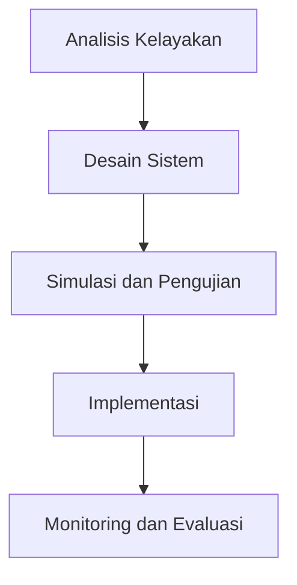

# 1084 — Desain Sistem CCUS Berbasis Teknologi Pompa Panas untuk Optimalisasi Emisi Karbon di Pabrik Semen

**Domain:** Teknik Industri & Rekayasa Sistem Industri  
**Topik Spesialis:** Desain Sistem CCUS Berbasis Teknologi Pompa Panas untuk Optimalisasi Emisi Karbon di Pabrik Semen  
**Standar & Referensi Utama:** Davis, L. (2026). 'Carbon Capture Systems in Cement Industry', International Journal of Production Research; ISO 14064-2022.

---

## 1. Pendahuluan dan Konteks Industri

Industri semen merupakan salah satu sektor yang berkontribusi signifikan terhadap emisi karbon dioksida (CO₂) global, dengan estimasi mencapai 8% dari total emisi karbon dunia. Proses produksi semen melibatkan pembakaran bahan baku pada suhu tinggi, yang menghasilkan CO₂ sebagai produk sampingan. Dalam konteks perubahan iklim yang semakin mendesak, pengurangan emisi karbon di sektor ini menjadi prioritas utama. Oleh karena itu, pengembangan teknologi Carbon Capture, Utilization, and Storage (CCUS) menjadi krusial untuk mencapai target pengurangan emisi yang ditetapkan oleh berbagai regulasi internasional, termasuk Protokol Kyoto dan Perjanjian Paris.

Teknologi pompa panas (heat pump) menawarkan solusi inovatif dalam desain sistem CCUS, dengan memanfaatkan energi termal dari proses produksi untuk meningkatkan efisiensi penangkapan karbon. Namun, implementasi sistem ini menghadapi tantangan teknis dan ekonomi, seperti kebutuhan investasi awal yang tinggi, kompleksitas integrasi dengan sistem yang ada, dan kebutuhan untuk memastikan keberlanjutan operasional. Penelitian ini bertujuan untuk mengeksplorasi desain sistem CCUS berbasis teknologi pompa panas yang dapat diimplementasikan di pabrik semen, serta memberikan analisis mendalam mengenai efisiensi dan dampak lingkungan dari sistem tersebut.

## 2. Landasan Teori & Formulasi Matematis

### 2.1. Teori Dasar CCUS

CCUS adalah proses yang terdiri dari tiga tahap utama: penangkapan karbon, pemanfaatan karbon, dan penyimpanan karbon. Penangkapan karbon dapat dilakukan melalui berbagai metode, termasuk post-combustion capture, pre-combustion capture, dan oxy-fuel combustion. Dalam konteks pabrik semen, metode post-combustion capture yang menggunakan teknologi pompa panas menjadi fokus utama.

### 2.2. Formulasi Matematis

Untuk menghitung efisiensi sistem CCUS, kita dapat menggunakan rumus berikut:

1. **Efisiensi Energi Sistem (η)**:
   $$ \eta = \frac{Q_{out}}{Q_{in}} $$
   di mana:
   - $Q_{out}$ = Energi yang dihasilkan (kJ)
   - $Q_{in}$ = Energi yang dimasukkan (kJ)

2. **Kalkulasi Emisi Karbon (E)**:
   $$ E = E_{total} - E_{captured} $$
   di mana:
   - $E_{total}$ = Emisi total CO₂ sebelum penangkapan (ton)
   - $E_{captured}$ = Emisi CO₂ yang berhasil ditangkap (ton)

3. **Kalkulasi Efisiensi Penangkapan Karbon (C_capture)**:
   $$ C_{capture} = \frac{E_{captured}}{E_{total}} \times 100\% $$

### 2.3. Definisi Variabel

- $Q_{out}$: Energi yang dihasilkan dari sistem pompa panas.
- $Q_{in}$: Energi yang digunakan untuk mengoperasikan sistem.
- $E_{total}$: Total emisi CO₂ yang dihasilkan oleh pabrik semen.
- $E_{captured}$: Jumlah emisi CO₂ yang berhasil ditangkap oleh sistem CCUS.

## 3. Metodologi Rekayasa & Standar Prosedur Operasional (SOP)

### 3.1. Langkah-langkah Implementasi

1. **Analisis Kelayakan**: Melakukan studi kelayakan untuk menilai potensi pengurangan emisi dan biaya investasi.
2. **Desain Sistem**: Mendesain sistem CCUS dengan integrasi teknologi pompa panas, termasuk pemilihan komponen dan layout sistem.
3. **Simulasi dan Pengujian**: Melakukan simulasi untuk menguji efisiensi sistem dan melakukan pengujian di laboratorium.
4. **Implementasi**: Mengintegrasikan sistem ke dalam proses produksi semen yang ada.
5. **Monitoring dan Evaluasi**: Memantau kinerja sistem secara berkala dan melakukan evaluasi untuk perbaikan berkelanjutan.

### 3.2. Diagram Alir Proses

## 4. Studi Kasus Kuantitatif Industri & Perhitungan Numerik

### 4.1. Contoh Perhitungan

Misalkan sebuah pabrik semen menghasilkan 100.000 ton CO₂ per tahun. Dengan teknologi pompa panas, pabrik ini dapat menangkap 30% dari total emisi.

1. **Input Parameter**:
   - $E_{total} = 100,000$ ton
   - $C_{capture} = 30\%$

2. **Perhitungan Emisi yang Ditangkap**:
   $$ E_{captured} = E_{total} \times \frac{C_{capture}}{100} $$
   $$ E_{captured} = 100,000 \times \frac{30}{100} = 30,000 \text{ ton} $$

3. **Emisi Setelah Penangkapan**:
   $$ E = E_{total} - E_{captured} $$
   $$ E = 100,000 - 30,000 = 70,000 \text{ ton} $$

### 4.2. Interpretasi Hasil

Dari perhitungan di atas, sistem CCUS berbasis teknologi pompa panas dapat mengurangi emisi CO₂ dari 100.000 ton menjadi 70.000 ton per tahun. Pengurangan emisi sebesar 30.000 ton ini tidak hanya membantu pabrik dalam memenuhi regulasi lingkungan, tetapi juga dapat meningkatkan citra perusahaan di mata publik dan pemangku kepentingan.

## 5. Evaluasi Kritis, Aplikasi Lintas Sektor & Standar Masa Depan

### 5.1. Hubungan dengan Disiplin Lain

Desain sistem CCUS tidak hanya berdampak pada industri semen, tetapi juga memiliki aplikasi luas di sektor energi, transportasi, dan manufaktur lainnya. Integrasi teknologi ini dapat berkontribusi pada pengurangan emisi global dan pencapaian tujuan Sustainable Development Goals (SDGs).

### 5.2. Batasan Metodologi

Meskipun teknologi CCUS menawarkan potensi besar, terdapat beberapa batasan, seperti biaya investasi yang tinggi, kompleksitas teknis, dan ketergantungan pada kebijakan pemerintah. Penelitian lebih lanjut diperlukan untuk mengatasi tantangan ini dan meningkatkan efisiensi sistem.

### 5.3. Arah Riset Masa Depan

Riset di masa depan harus fokus pada pengembangan teknologi yang lebih efisien dan ekonomis, serta eksplorasi metode baru untuk pemanfaatan karbon yang ditangkap. Selain itu, kolaborasi lintas disiplin antara teknik industri, ilmu lingkungan, dan kebijakan publik akan menjadi kunci untuk mencapai keberhasilan implementasi sistem CCUS.

---

Dokumen ini memberikan gambaran menyeluruh mengenai desain sistem CCUS berbasis teknologi pompa panas untuk optimalisasi emisi karbon di pabrik semen, dengan penekanan pada aspek teknis, ekonomis, dan lingkungan yang relevan dengan standar industri terkini.

## 5. Ringkasan & Catatan Praktis Implementasi
Implementasi metode ini memerlukan standarisasi prosedur operasi (SOP), kalibrasi instrumen berkala, serta integrasi pemantauan real-time untuk memastikan konsistensi performa dan efisiensi sistem secara berkelanjutan.
