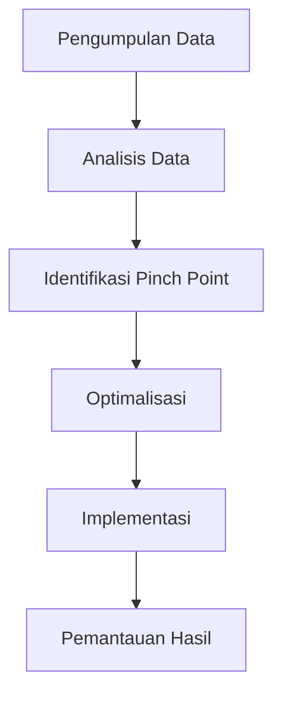

# 1085 — Implementasi Analisis Pinch Energi Termal Menggunakan Data Besar untuk Optimalisasi Proses Industri

**Domain:** Teknik Industri & Rekayasa Sistem Industri  
**Topik Spesialis:** Implementasi Analisis Pinch Energi Termal Menggunakan Data Besar untuk Optimalisasi Proses Industri  
**Standar & Referensi Utama:** Thompson, R. (2023). 'Big Data in Thermal Energy Analysis', CIRP Annals; IEEE Access 2022.

---

## 1. Pendahuluan dan Konteks Industri

Analisis Pinch Energi Termal (APET) merupakan metode yang telah terbukti efektif dalam mengidentifikasi dan mengoptimalkan penggunaan energi dalam proses industri. Dalam konteks industri modern, di mana efisiensi energi menjadi semakin penting, penerapan APET dengan dukungan data besar (big data) menawarkan peluang signifikan untuk meningkatkan kinerja operasional dan mengurangi biaya energi. Dengan meningkatnya kompleksitas proses manufaktur dan rantai pasok, tantangan dalam pengelolaan energi juga semakin meningkat. 

Perusahaan menghadapi tekanan untuk mengurangi jejak karbon mereka dan memenuhi regulasi lingkungan yang semakin ketat. Oleh karena itu, optimalisasi penggunaan energi tidak hanya menjadi kebutuhan ekonomi, tetapi juga tanggung jawab sosial. Tantangan ini diperparah oleh kebutuhan untuk mengintegrasikan berbagai sumber data dari sistem yang berbeda, seperti sensor IoT, sistem manajemen energi, dan perangkat lunak analitik. 

Dalam konteks ini, penggunaan data besar memungkinkan analisis yang lebih mendalam dan akurat, yang dapat mengungkap pola dan tren yang sebelumnya tidak terlihat. Dengan menggabungkan APET dengan teknik analisis data besar, perusahaan dapat mengidentifikasi peluang penghematan energi yang lebih baik, merancang sistem pemulihan energi yang lebih efisien, dan pada akhirnya meningkatkan profitabilitas serta keberlanjutan operasional mereka (Thompson, 2023).

## 2. Landasan Teori & Formulasi Matematis

Analisis Pinch Energi Termal berfokus pada pemisahan aliran panas dalam sistem untuk meminimalkan kebutuhan energi eksternal. Konsep dasar dari APET adalah “pinch point”, yaitu titik di mana aliran panas minimum terjadi. Untuk menganalisis sistem ini, kita menggunakan beberapa rumus matematis.

### 2.1. Definisi Variabel

- \( Q_h \): Aliran panas dari sumber panas (kW)
- \( Q_c \): Aliran panas ke sink panas (kW)
- \( T_h \): Suhu sumber panas (°C)
- \( T_c \): Suhu sink panas (°C)
- \( \Delta T \): Perbedaan suhu (°C)
- \( C_p \): Kapasitas panas spesifik (kJ/kg·°C)
- \( m \): Aliran massa (kg/s)

### 2.2. Rumus Dasar

1. **Kalkulasi Aliran Panas**:
   $$ Q = m \cdot C_p \cdot (T_{in} - T_{out}) $$

2. **Kalkulasi Efisiensi Energi**:
   $$ \eta = \frac{Q_{berguna}}{Q_{total}} $$

3. **Pinch Point**:
   Untuk menemukan pinch point, kita menghitung kebutuhan energi minimum dengan menggunakan grafik suhu vs. aliran panas. Titik di mana kurva kebutuhan panas dan kurva penyediaan panas bertemu adalah pinch point.

### 2.3. Pembuktian Matematis

Misalkan kita memiliki dua aliran panas, satu dari sumber panas dan satu dari sink panas. Pada titik pinch, kita memiliki:

$$ Q_h = Q_c $$

Sehingga, untuk sistem yang seimbang:

$$ m_h \cdot C_{p,h} \cdot (T_{h,in} - T_{h,out}) = m_c \cdot C_{p,c} \cdot (T_{c,out} - T_{c,in}) $$

Dari sini, kita dapat mengembangkan model matematis yang lebih kompleks dengan mempertimbangkan variabel tambahan seperti kehilangan panas dan efisiensi sistem.

## 3. Metodologi Rekayasa & Standar Prosedur Operasional (SOP)

Implementasi APET dengan data besar melibatkan beberapa langkah sistematis:

### 3.1. Pengumpulan Data

- **Identifikasi Sumber Data**: Sensor IoT, sistem SCADA, dan perangkat lunak ERP.
- **Pengolahan Data**: Menggunakan teknik ETL (Extract, Transform, Load) untuk membersihkan dan memformat data.

### 3.2. Analisis Data

- **Modeling Energi**: Menggunakan model matematis untuk menghitung aliran energi dan kebutuhan energi.
- **Identifikasi Pinch Point**: Menggunakan algoritma untuk menemukan titik pinch dalam data yang telah dianalisis.

### 3.3. Optimalisasi

- **Simulasi**: Menggunakan perangkat lunak simulasi untuk menguji berbagai skenario penghematan energi.
- **Implementasi**: Menerapkan solusi yang diusulkan dan memantau hasilnya.

### 3.4. Diagram Alir Proses

## 4. Studi Kasus Kuantitatif Industri & Perhitungan Numerik

### 4.1. Deskripsi Kasus

Misalkan kita menganalisis sebuah pabrik kimia yang memiliki dua aliran panas: satu dari reaktor dan satu dari sistem pendingin. Data yang dikumpulkan menunjukkan:

- Aliran panas dari reaktor: \( Q_h = 500 \, \text{kW} \)
- Aliran panas ke sistem pendingin: \( Q_c = 300 \, \text{kW} \)
- Suhu masuk reaktor: \( T_{h,in} = 150 \, °C \)
- Suhu keluar reaktor: \( T_{h,out} = 100 \, °C \)
- Suhu masuk sistem pendingin: \( T_{c,in} = 30 \, °C \)
- Suhu keluar sistem pendingin: \( T_{c,out} = 60 \, °C \)

### 4.2. Perhitungan

1. **Kalkulasi Aliran Massa**:
   Menggunakan rumus aliran panas:
   $$ Q_h = m_h \cdot C_{p,h} \cdot (T_{h,in} - T_{h,out}) $$
   Misalkan \( C_{p,h} = 4.18 \, \text{kJ/kg·°C} \):
   $$ 500 = m_h \cdot 4.18 \cdot (150 - 100) $$
   $$ m_h = \frac{500}{4.18 \cdot 50} = 2.39 \, \text{kg/s} $$

2. **Kalkulasi Efisiensi Energi**:
   $$ \eta = \frac{Q_{berguna}}{Q_{total}} = \frac{300}{500} = 0.6 \, (60\%) $$

### 4.3. Interpretasi Hasil

Dari hasil perhitungan, efisiensi energi pabrik adalah 60%. Ini menunjukkan bahwa ada potensi untuk meningkatkan efisiensi dengan mengoptimalkan penggunaan energi dari reaktor ke sistem pendingin. Dengan menerapkan APET, pabrik dapat mengurangi konsumsi energi dan biaya operasional.

## 5. Evaluasi Kritis, Aplikasi Lintas Sektor & Standar Masa Depan

Penerapan APET dengan data besar tidak hanya terbatas pada industri kimia, tetapi juga dapat diterapkan di berbagai sektor seperti energi, makanan dan minuman, serta manufaktur. Dalam konteks rantai pasok, analisis energi dapat membantu dalam mengidentifikasi dan mengurangi pemborosan energi di seluruh proses.

### 5.1. Hubungan dengan Disiplin Lain

- **Supply Chain**: Optimalisasi energi dapat mengurangi biaya transportasi dan penyimpanan.
- **Otomasi**: Integrasi sistem otomatis dapat meningkatkan akurasi pengukuran dan pengendalian energi.
- **Manajemen Biaya/Teknik**: Pengurangan biaya energi dapat meningkatkan profitabilitas.
- **K3/ESG**: Mematuhi regulasi lingkungan dan meningkatkan keberlanjutan operasional.

### 5.2. Batasan Metodologi

Meskipun APET dengan data besar menawarkan banyak keuntungan, ada beberapa batasan, seperti kebutuhan untuk data berkualitas tinggi dan kompleksitas dalam integrasi sistem yang berbeda. 

### 5.3. Arah Riset Masa Depan

Riset di masa depan dapat fokus pada pengembangan algoritma analitik yang lebih canggih, penggunaan kecerdasan buatan untuk prediksi kebutuhan energi, dan integrasi dengan teknologi energi terbarukan untuk mencapai efisiensi yang lebih tinggi.

Dengan demikian, implementasi Analisis Pinch Energi Termal menggunakan data besar menjadi langkah strategis yang dapat membawa manfaat signifikan bagi industri dalam menghadapi tantangan energi di era modern.

## 5. Ringkasan & Catatan Praktis Implementasi
Implementasi metode ini memerlukan standarisasi prosedur operasi (SOP), kalibrasi instrumen berkala, serta integrasi pemantauan real-time untuk memastikan konsistensi performa dan efisiensi sistem secara berkelanjutan.
