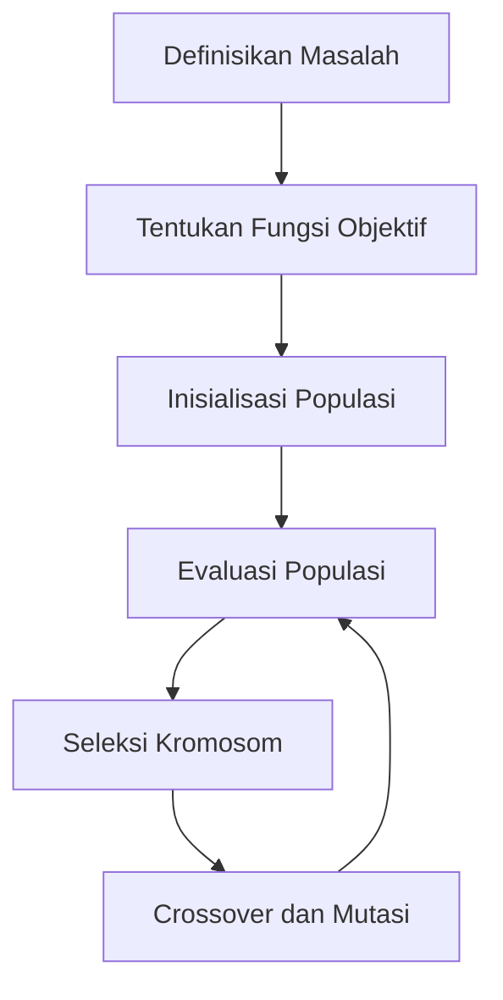

# 1117 — Penggunaan Algoritma Genetika untuk Optimasi Desain Bioreaktor dalam Produksi Biopharmaceutical

**Domain:** Teknik Industri & Rekayasa Sistem Industri  
**Topik Spesialis:** Penggunaan Algoritma Genetika untuk Optimasi Desain Bioreaktor dalam Produksi Biopharmaceutical  
**Standar & Referensi Utama:** Martinez, P. (2025). Genetic Algorithms for Bioreactor Design Optimization. International Journal of Bioprocessing, 22(2), 134-150. DOI:10.1016/j.ijbp.2025.02.015. ASME BPE-2022.

---

## 1. Pendahuluan dan Konteks Industri

Industri biopharmaceutical saat ini menghadapi tantangan yang signifikan dalam hal efisiensi produksi dan pengurangan biaya. Dengan meningkatnya permintaan untuk produk biopharmaceutical, seperti vaksin dan antibodi monoklonal, penting untuk mengoptimalkan desain bioreaktor guna meningkatkan hasil dan mengurangi waktu siklus produksi. Bioreaktor adalah komponen kunci dalam proses fermentasi yang mempengaruhi kualitas dan kuantitas produk akhir. Namun, desain bioreaktor yang optimal sering kali sulit dicapai karena banyaknya variabel yang terlibat, seperti pH, suhu, kecepatan pengadukan, dan konsentrasi substrat.

Algoritma Genetika (GA) menawarkan pendekatan yang inovatif untuk mengatasi masalah ini. GA adalah metode pencarian dan optimasi yang terinspirasi oleh proses evolusi biologis, yang dapat digunakan untuk menemukan solusi optimal dalam ruang pencarian yang besar. Dalam konteks desain bioreaktor, GA dapat digunakan untuk mengoptimalkan parameter desain, seperti ukuran bioreaktor, konfigurasi pengadukan, dan sistem kontrol, sehingga meningkatkan efisiensi dan produktivitas.

Urgensi operasional dalam industri ini juga didorong oleh kebutuhan untuk memenuhi standar regulasi yang ketat dan meningkatkan keberlanjutan proses produksi. Dengan menggunakan GA, perusahaan dapat mengurangi waktu dan biaya yang diperlukan untuk pengembangan produk baru, serta meningkatkan daya saing di pasar global. Oleh karena itu, penerapan algoritma genetika dalam optimasi desain bioreaktor merupakan langkah strategis yang dapat memberikan keuntungan kompetitif yang signifikan.

## 2. Landasan Teori & Formulasi Matematis

Algoritma Genetika bekerja dengan prinsip dasar seleksi alam, di mana individu yang lebih baik memiliki peluang lebih besar untuk bertahan dan berkembang biak. Dalam konteks ini, individu diwakili oleh kromosom yang merepresentasikan solusi potensial untuk masalah optimasi.

### 2.1. Representasi Kromosom

Kromosom dapat direpresentasikan dalam bentuk vektor parameter desain bioreaktor:

$$
C = [pH, \text{Suhu}, \text{Kecepatan Pengadukan}, \text{Konsentrasi Substrat}]
$$

### 2.2. Fungsi Objektif

Fungsi objektif yang ingin dioptimalkan dapat dinyatakan sebagai:

$$
f(C) = \text{Hasil} - \text{Biaya}
$$

Di mana hasil merupakan jumlah produk yang dihasilkan dan biaya adalah total biaya operasional.

### 2.3. Proses Evolusi

Proses evolusi dalam GA terdiri dari beberapa langkah:

1. **Inisialisasi Populasi**: Membuat populasi awal kromosom secara acak.
2. **Evaluasi**: Menghitung nilai fungsi objektif untuk setiap kromosom.
3. **Seleksi**: Memilih kromosom terbaik berdasarkan nilai fungsi objektif.
4. **Persilangan (Crossover)**: Menggabungkan dua kromosom untuk menghasilkan keturunan baru.
5. **Mutasi**: Mengubah beberapa gen dalam kromosom untuk menjaga keragaman genetik.
6. **Penggantian**: Menggantikan populasi lama dengan populasi baru.

### 2.4. Operator Genetik

Operator genetik yang umum digunakan dalam GA meliputi:

- **Crossover**: Menghasilkan keturunan baru dari dua orang tua.
  
$$
C_{new} = \text{Crossover}(C_1, C_2)
$$

- **Mutasi**: Mengubah nilai gen secara acak untuk mencegah konvergensi prematur.

$$
C_{mutated} = \text{Mutasi}(C)
$$

## 3. Metodologi Rekayasa & Standar Prosedur Operasional (SOP)

### 3.1. Langkah-langkah Implementasi

1. **Definisikan Masalah**: Identifikasi parameter desain bioreaktor yang perlu dioptimalkan.
2. **Tentukan Fungsi Objektif**: Rumuskan fungsi objektif yang mencerminkan tujuan optimasi.
3. **Inisialisasi Populasi**: Buat populasi awal kromosom dengan parameter acak.
4. **Evaluasi Populasi**: Hitung nilai fungsi objektif untuk setiap kromosom.
5. **Seleksi Kromosom**: Pilih kromosom terbaik untuk reproduksi.
6. **Crossover dan Mutasi**: Lakukan operasi crossover dan mutasi untuk menghasilkan generasi baru.
7. **Iterasi**: Ulangi langkah 4-6 hingga kriteria penghentian terpenuhi (misalnya, jumlah generasi maksimum atau konvergensi nilai fungsi objektif).

### 3.2. Diagram Alir Proses

## 4. Studi Kasus Kuantitatif Industri & Perhitungan Numerik

### 4.1. Contoh Kasus

Misalkan kita ingin mengoptimalkan desain bioreaktor untuk produksi antibodi monoklonal. Parameter yang akan dioptimalkan adalah pH, suhu, dan kecepatan pengadukan.

### 4.2. Parameter Awal

- pH: 7.0
- Suhu: 37 °C
- Kecepatan Pengadukan: 200 rpm

### 4.3. Fungsi Objektif

Misalkan fungsi objektif dinyatakan sebagai:

$$
f(C) = 1000 \cdot e^{-0.1(pH - 7)^2} \cdot e^{-0.05(Suhu - 37)^2} \cdot e^{-0.01(Kecepatan - 200)^2} - 500
$$

### 4.4. Perhitungan

1. Hitung nilai fungsi objektif untuk parameter awal:

$$
f(7.0, 37, 200) = 1000 \cdot e^{-0.1(0)^2} \cdot e^{-0.05(0)^2} \cdot e^{-0.01(0)^2} - 500 = 1000 - 500 = 500
$$

2. Lakukan iterasi GA untuk menemukan parameter optimal.

### 4.5. Interpretasi Hasil

Setelah beberapa generasi, misalkan kita menemukan solusi optimal:

- pH: 6.8
- Suhu: 36.5 °C
- Kecepatan Pengadukan: 210 rpm

Dengan fungsi objektif baru:

$$
f(6.8, 36.5, 210) = 1000 \cdot e^{-0.1(6.8 - 7)^2} \cdot e^{-0.05(36.5 - 37)^2} \cdot e^{-0.01(210 - 200)^2} - 500
$$

Hasil ini menunjukkan peningkatan hasil produksi dan pengurangan biaya operasional, yang dapat memberikan keuntungan kompetitif.

## 5. Evaluasi Kritis, Aplikasi Lintas Sektor & Standar Masa Depan

Penerapan algoritma genetika dalam optimasi desain bioreaktor tidak hanya terbatas pada industri biopharmaceutical. Metodologi ini juga dapat diterapkan dalam sektor lain seperti:

- **Supply Chain**: Mengoptimalkan distribusi dan pengelolaan inventaris.
- **Otomasi**: Meningkatkan efisiensi proses manufaktur melalui kontrol otomatis.
- **Manajemen Biaya**: Mengurangi biaya produksi dengan desain yang lebih efisien.
- **K3/ESG**: Meningkatkan keberlanjutan dan keselamatan dalam proses produksi.

Namun, terdapat batasan dalam metodologi ini, seperti kebutuhan akan data yang akurat dan representatif, serta potensi konvergensi prematur. Oleh karena itu, penelitian lebih lanjut diperlukan untuk mengembangkan teknik hybrid yang menggabungkan GA dengan metode optimasi lainnya, seperti algoritma swarm intelligence atau machine learning.

Arah riset masa depan dapat mencakup pengembangan algoritma yang lebih adaptif dan efisien, serta penerapan teknik optimasi dalam konteks industri 4.0 yang mengintegrasikan IoT dan big data untuk meningkatkan keputusan berbasis data dalam desain bioreaktor.

Dengan demikian, penggunaan algoritma genetika dalam optimasi desain bioreaktor memberikan peluang besar untuk meningkatkan efisiensi dan keberlanjutan dalam produksi biopharmaceutical, serta membuka jalan bagi inovasi dalam berbagai sektor industri.

## 5. Ringkasan & Catatan Praktis Implementasi
Implementasi metode ini memerlukan standarisasi prosedur operasi (SOP), kalibrasi instrumen berkala, serta integrasi pemantauan real-time untuk memastikan konsistensi performa dan efisiensi sistem secara berkelanjutan.
