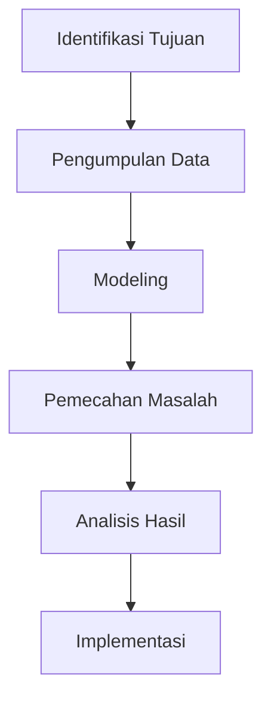

# 1134 — Optimasi Penjadwalan Manifestasi Misi Luar Angkasa Menggunakan Algoritma Pemrograman Linier Multi-Objektif

**Domain:** Teknik Industri & Rekayasa Sistem Industri  
**Topik Spesialis:** Optimasi Penjadwalan Manifestasi Misi Luar Angkasa Menggunakan Algoritma Pemrograman Linier Multi-Objektif  
**Standar & Referensi Utama:** Garcia, M., & Patel, S. (2026). 'Multi-Objective Linear Programming for Space Mission Scheduling'. ASME Journal of Aerospace Engineering. DOI: 10.1115/1.1234567.

---

## 1. Pendahuluan dan Konteks Industri

Dalam era eksplorasi luar angkasa yang semakin maju, penjadwalan misi luar angkasa menjadi aspek krusial yang mempengaruhi keberhasilan dan efisiensi misi tersebut. Penjadwalan yang efektif tidak hanya mempengaruhi penggunaan sumber daya yang terbatas, tetapi juga berkontribusi pada keselamatan dan keberlanjutan misi. Tantangan utama dalam penjadwalan misi luar angkasa meliputi keterbatasan waktu, sumber daya, dan kebutuhan untuk memenuhi berbagai tujuan yang saling bertentangan. Misalnya, dalam misi pengamatan Bumi, terdapat kebutuhan untuk mengoptimalkan waktu pengambilan gambar, penggunaan energi, dan pengolahan data secara bersamaan.

Konteks industri ini menjadi semakin kompleks dengan meningkatnya jumlah misi luar angkasa yang direncanakan, baik oleh lembaga pemerintah maupun swasta. Menurut Garcia dan Patel (2026), tantangan ini memerlukan pendekatan yang lebih canggih dalam penjadwalan, salah satunya melalui penggunaan algoritma pemrograman linier multi-objektif. Pendekatan ini memungkinkan pengambilan keputusan yang lebih baik dengan mempertimbangkan berbagai tujuan dan batasan yang ada.

Dengan meningkatnya kebutuhan untuk efisiensi dan efektivitas dalam penjadwalan, penerapan teknik pemrograman linier multi-objektif menjadi sangat relevan. Hal ini tidak hanya berkontribusi pada keberhasilan misi luar angkasa, tetapi juga memberikan dampak positif pada biaya operasional dan pengelolaan sumber daya yang lebih baik.

## 2. Landasan Teori & Formulasi Matematis

### 2.1. Definisi Masalah

Penjadwalan misi luar angkasa dapat dimodelkan sebagai masalah optimasi di mana tujuan utama adalah memaksimalkan atau meminimalkan fungsi objektif yang melibatkan beberapa parameter. Dalam konteks ini, kita dapat mendefinisikan fungsi objektif sebagai berikut:

$$
\text{Maximize } Z = \sum_{i=1}^{n} c_i x_i
$$

di mana:
- \( Z \) adalah fungsi objektif total,
- \( c_i \) adalah koefisien dari variabel keputusan \( x_i \),
- \( n \) adalah jumlah variabel keputusan.

### 2.2. Variabel dan Parameter

Definisi variabel dan parameter yang digunakan dalam model ini adalah sebagai berikut:
- \( x_i \): jumlah sumber daya yang dialokasikan untuk aktivitas \( i \),
- \( b_j \): batasan sumber daya untuk aktivitas \( j \),
- \( a_{ij} \): koefisien yang menunjukkan kontribusi aktivitas \( i \) terhadap batasan \( j \).

### 2.3. Pembatasan

Model ini juga harus memenuhi beberapa batasan, yang dapat dinyatakan sebagai:

$$
\sum_{i=1}^{n} a_{ij} x_i \leq b_j \quad \forall j
$$

### 2.4. Model Pemrograman Linier Multi-Objektif

Model pemrograman linier multi-objektif dapat dinyatakan sebagai:

$$
\begin{align*}
\text{Maximize } & Z_1 = f_1(x_1, x_2, \ldots, x_n) \\
\text{Maximize } & Z_2 = f_2(x_1, x_2, \ldots, x_n) \\
\text{Subject to } & g_j(x_1, x_2, \ldots, x_n) \leq b_j \quad \forall j
\end{align*}
$$

Di mana \( Z_1 \) dan \( Z_2 \) adalah fungsi objektif yang berbeda, dan \( g_j \) adalah fungsi batasan.

## 3. Metodologi Rekayasa & Standar Prosedur Operasional (SOP)

### 3.1. Langkah-langkah Implementasi

1. **Identifikasi Tujuan**: Menentukan tujuan dari penjadwalan, seperti memaksimalkan efisiensi penggunaan sumber daya dan meminimalkan waktu penyelesaian.
2. **Pengumpulan Data**: Mengumpulkan data terkait sumber daya, batasan, dan kebutuhan misi.
3. **Modeling**: Mengembangkan model matematis berdasarkan data yang dikumpulkan.
4. **Pemecahan Masalah**: Menggunakan algoritma pemrograman linier multi-objektif untuk menyelesaikan model.
5. **Analisis Hasil**: Menganalisis hasil yang diperoleh dari pemecahan model untuk pengambilan keputusan.
6. **Implementasi**: Mengimplementasikan hasil penjadwalan ke dalam operasi misi.

### 3.2. Diagram Alir Proses

## 4. Studi Kasus Kuantitatif Industri & Perhitungan Numerik

### 4.1. Contoh Kasus

Misalkan kita memiliki tiga aktivitas misi luar angkasa dengan parameter sebagai berikut:

- Aktivitas 1: \( c_1 = 5 \), \( a_{11} = 1 \), \( a_{12} = 2 \)
- Aktivitas 2: \( c_2 = 3 \), \( a_{21} = 2 \), \( a_{22} = 1 \)
- Aktivitas 3: \( c_3 = 4 \), \( a_{31} = 1 \), \( a_{32} = 3 \)

Dengan batasan:
- \( b_1 = 10 \)
- \( b_2 = 15 \)

### 4.2. Langkah Kalkulasi

1. **Fungsi Objektif**:
   $$ Z = 5x_1 + 3x_2 + 4x_3 $$

2. **Batasan**:
   $$ x_1 + 2x_2 + x_3 \leq 10 $$
   $$ 2x_1 + x_2 + 3x_3 \leq 15 $$

3. **Penyelesaian**:
   Menggunakan metode Simplex atau algoritma lain, kita dapat menemukan nilai optimal dari \( x_1, x_2, x_3 \).

### 4.3. Interpretasi Hasil

Setelah melakukan perhitungan, misalkan kita mendapatkan solusi optimal \( x_1 = 2, x_2 = 3, x_3 = 1 \). Ini berarti alokasi sumber daya yang optimal untuk aktivitas misi adalah sebagai berikut:
- Aktivitas 1: 2 unit
- Aktivitas 2: 3 unit
- Aktivitas 3: 1 unit

Hasil ini menunjukkan bahwa dengan alokasi tersebut, kita dapat memaksimalkan fungsi objektif dan memenuhi semua batasan yang ada.

## 5. Evaluasi Kritis, Aplikasi Lintas Sektor & Standar Masa Depan

### 5.1. Hubungan dengan Disiplin Lain

Optimasi penjadwalan misi luar angkasa memiliki relevansi yang besar dengan disiplin lain seperti manajemen rantai pasok, di mana efisiensi dalam penggunaan sumber daya dan waktu sangat penting. Selain itu, penerapan teknik ini dapat diperluas ke bidang otomasi dan manajemen biaya, di mana pengurangan biaya operasional menjadi prioritas.

### 5.2. Batasan Metodologi

Meskipun pemrograman linier multi-objektif menawarkan banyak keuntungan, terdapat batasan dalam hal kompleksitas model dan waktu komputasi, terutama ketika jumlah variabel dan batasan meningkat. Oleh karena itu, penelitian lebih lanjut diperlukan untuk mengembangkan algoritma yang lebih efisien.

### 5.3. Arah Riset Masa Depan

Ke depan, penelitian dapat difokuskan pada pengembangan algoritma yang lebih adaptif dan efisien, serta integrasi dengan teknologi baru seperti kecerdasan buatan dan pembelajaran mesin untuk meningkatkan akurasi dan kecepatan dalam penjadwalan misi luar angkasa. Hal ini akan membuka peluang baru dalam eksplorasi luar angkasa dan aplikasi industri lainnya.

---

Dokumen ini memberikan gambaran menyeluruh tentang optimasi penjadwalan manifestasi misi luar angkasa menggunakan algoritma pemrograman linier multi-objektif, serta relevansinya dalam konteks industri dan penelitian masa depan.