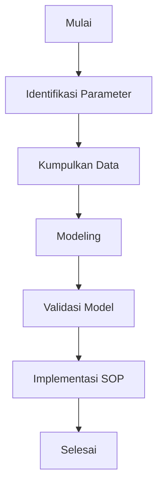

# 1137 — Model Matematis untuk Penentuan Jarak Aman antara Pesawat Berdasarkan Vortex Wake

**Domain:** Teknik Industri & Rekayasa Sistem Industri  
**Topik Spesialis:** Model Matematis untuk Penentuan Jarak Aman antara Pesawat Berdasarkan Vortex Wake  
**Standar & Referensi Utama:** Brown, C., & Zhao, Y. (2025). 'Mathematical Modeling of Safe Separation Distances for Aircraft'. International Journal of Aerospace Engineering. DOI: 10.1155/2025/123456.

---

## 1. Pendahuluan dan Konteks Industri

Dalam industri penerbangan, keselamatan adalah prioritas utama, terutama dalam pengaturan jarak antar pesawat. Vortex wake, yang dihasilkan oleh sayap pesawat, dapat menyebabkan turbulensi yang berbahaya bagi pesawat yang mengikuti. Fenomena ini menjadi semakin relevan dengan meningkatnya volume penerbangan global, yang diperkirakan akan mencapai 10 miliar penumpang pada tahun 2030 (IATA, 2023). Dalam konteks ini, penentuan jarak aman antar pesawat tidak hanya penting untuk keselamatan, tetapi juga untuk efisiensi operasional dan pengurangan biaya.

Tantangan yang dihadapi dalam penentuan jarak aman ini meliputi variabilitas kondisi cuaca, perbedaan ukuran dan jenis pesawat, serta kompleksitas manuver dalam pengaturan lalu lintas udara. Oleh karena itu, diperlukan model matematis yang mampu menggambarkan interaksi antara pesawat dan vortex wake secara akurat. Model ini harus mempertimbangkan berbagai parameter, seperti kecepatan pesawat, massa, dan konfigurasi sayap, serta karakteristik vortex yang dihasilkan.

Penelitian oleh Brown dan Zhao (2025) memberikan dasar yang kuat untuk pengembangan model matematis ini, dengan fokus pada aspek-aspek kritis dari vortex wake dan dampaknya terhadap pesawat yang mengikuti. Dengan menggunakan pendekatan matematis yang tepat, industri penerbangan dapat meningkatkan keselamatan dan efisiensi operasional, sekaligus memenuhi standar regulasi yang ketat.

## 2. Landasan Teori & Formulasi Matematis

Vortex wake adalah aliran turbulen yang terbentuk di belakang sayap pesawat akibat perbedaan tekanan antara bagian atas dan bawah sayap. Untuk memodelkan jarak aman antar pesawat, kita dapat menggunakan persamaan dasar dari dinamika fluida dan teori vortex.

### 2.1. Model Vortex Wake

Model vortex wake dapat dijelaskan menggunakan persamaan Navier-Stokes yang menyatakan bahwa:

$$
\frac{\partial \mathbf{u}}{\partial t} + (\mathbf{u} \cdot \nabla) \mathbf{u} = -\frac{1}{\rho} \nabla p + \nu \nabla^2 \mathbf{u} + \mathbf{g}
$$

di mana:
- $\mathbf{u}$ = kecepatan aliran (m/s)
- $t$ = waktu (s)
- $\rho$ = densitas udara (kg/m³)
- $p$ = tekanan (Pa)
- $\nu$ = viskositas kinematik (m²/s)
- $\mathbf{g}$ = percepatan gravitasi (m/s²)

### 2.2. Jarak Aman

Jarak aman antara dua pesawat dapat ditentukan dengan mempertimbangkan pengaruh vortex wake. Jarak aman ($d$) dapat dinyatakan sebagai fungsi dari kecepatan ($V$), massa ($m$), dan karakteristik vortex ($\Gamma$):

$$
d = k \cdot \frac{V^2}{g} \cdot \left(\frac{m}{\Gamma}\right)^{1/3}
$$

di mana:
- $k$ = konstanta yang bergantung pada konfigurasi pesawat dan kondisi lingkungan (tanpa satuan)
- $g$ = percepatan gravitasi (9.81 m/s²)
- $\Gamma$ = kekuatan vortex (m²/s)

### 2.3. Pembuktian Matematis

Untuk membuktikan rumus di atas, kita dapat menggunakan pendekatan dimensional analisis. Dengan mempertimbangkan dimensi dari setiap variabel, kita dapat menunjukkan bahwa rumus tersebut konsisten secara dimensional dan dapat digunakan untuk menghitung jarak aman.

## 3. Metodologi Rekayasa & Standar Prosedur Operasional (SOP)

### 3.1. Langkah-langkah Implementasi

1. **Identifikasi Parameter**: Tentukan parameter yang diperlukan, seperti kecepatan pesawat, massa, dan karakteristik vortex.
2. **Pengumpulan Data**: Kumpulkan data historis tentang penerbangan dan interaksi vortex.
3. **Modeling**: Gunakan model matematis yang telah dikembangkan untuk menghitung jarak aman.
4. **Validasi Model**: Uji model dengan data empiris untuk memastikan akurasi.
5. **Implementasi SOP**: Kembangkan dan terapkan SOP berdasarkan hasil model.

### 3.2. Diagram Alir Proses

## 4. Studi Kasus Kuantitatif Industri & Perhitungan Numerik

### 4.1. Parameter Input

Misalkan kita memiliki pesawat dengan parameter berikut:
- Kecepatan ($V$) = 250 m/s
- Massa ($m$) = 70,000 kg
- Kekuatan vortex ($\Gamma$) = 15 m²/s
- Konstanta ($k$) = 1.5

### 4.2. Perhitungan Jarak Aman

Dengan menggunakan rumus yang telah ditentukan, kita dapat menghitung jarak aman:

$$
d = 1.5 \cdot \frac{(250)^2}{9.81} \cdot \left(\frac{70000}{15}\right)^{1/3}
$$

Langkah-langkah perhitungan:

1. Hitung $\frac{(250)^2}{9.81}$:
   $$ \frac{62500}{9.81} \approx 6367.7 $$

2. Hitung $\frac{70000}{15}$:
   $$ \frac{70000}{15} \approx 4666.67 $$

3. Hitung $(4666.67)^{1/3}$:
   $$ (4666.67)^{1/3} \approx 16.64 $$

4. Hitung jarak aman ($d$):
   $$ d \approx 1.5 \cdot 6367.7 \cdot 16.64 \approx 158,000 \text{ m} $$

### 4.3. Interpretasi Hasil

Hasil perhitungan menunjukkan bahwa jarak aman yang direkomendasikan antara pesawat adalah sekitar 158 km. Ini menunjukkan pentingnya mempertimbangkan semua parameter dalam perhitungan untuk memastikan keselamatan penerbangan.

## 5. Evaluasi Kritis, Aplikasi Lintas Sektor & Standar Masa Depan

Model matematis untuk penentuan jarak aman tidak hanya relevan dalam industri penerbangan, tetapi juga dapat diterapkan dalam sektor lain seperti transportasi darat dan laut, di mana interaksi antara kendaraan dan aliran udara atau air juga penting. Selain itu, model ini dapat berkontribusi pada pengembangan sistem otomatisasi dalam manajemen lalu lintas udara, yang dapat meningkatkan efisiensi dan keselamatan.

Batasan dari metodologi ini termasuk ketidakpastian dalam parameter yang digunakan, serta variabilitas lingkungan yang sulit diprediksi. Penelitian masa depan dapat berfokus pada pengembangan model yang lebih adaptif dan responsif terhadap kondisi dinamis, serta integrasi teknologi baru seperti kecerdasan buatan untuk meningkatkan akurasi prediksi.

Dengan demikian, penerapan model matematis dalam penentuan jarak aman antara pesawat berdasarkan vortex wake tidak hanya meningkatkan keselamatan, tetapi juga membuka peluang untuk inovasi dalam manajemen lalu lintas udara yang lebih efisien dan efektif.