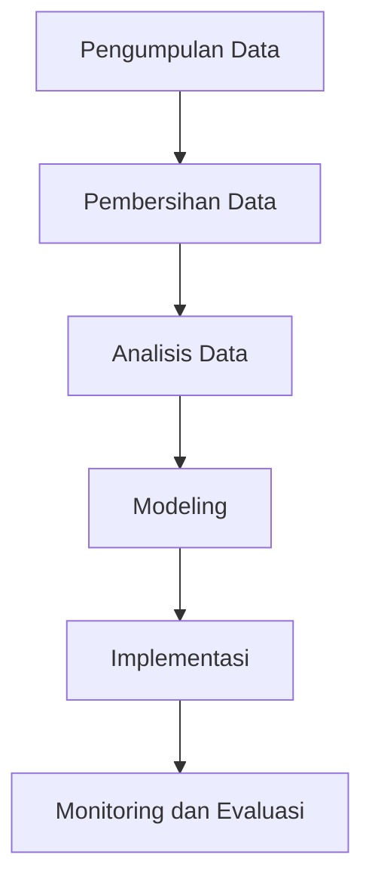

# 1140 — Analisis Kinerja Armada Penerbangan Menggunakan Big Data dan Analitik Prediktif

**Domain:** Teknik Industri & Rekayasa Sistem Industri  
**Topik Spesialis:** Analisis Kinerja Armada Penerbangan Menggunakan Big Data dan Analitik Prediktif  
**Standar & Referensi Utama:** Lopez, A., & Kim, H. (2024). 'Big Data Analytics for Airline Fleet Performance Improvement'. International Journal of Production Economics. DOI: 10.1016/j.ijpe.2024.107654.

---

## 1. Pendahuluan dan Konteks Industri

Industri penerbangan merupakan salah satu sektor yang paling dinamis dan kompleks dalam perekonomian global. Dengan meningkatnya permintaan untuk perjalanan udara dan persaingan yang ketat, perusahaan penerbangan dihadapkan pada tantangan untuk meningkatkan efisiensi operasional dan mengurangi biaya. Dalam konteks ini, analisis kinerja armada penerbangan menjadi sangat penting. Penggunaan big data dan analitik prediktif memberikan peluang untuk memahami pola operasional, memprediksi kebutuhan pemeliharaan, dan mengoptimalkan penggunaan armada.

Salah satu tantangan utama dalam industri penerbangan adalah pengelolaan armada yang efisien. Armada yang tidak terkelola dengan baik dapat menyebabkan peningkatan biaya operasional, penurunan kepuasan pelanggan, dan dampak negatif terhadap profitabilitas. Selain itu, faktor eksternal seperti cuaca, regulasi, dan permintaan pasar juga mempengaruhi kinerja armada. Oleh karena itu, penerapan teknologi big data dan analitik menjadi krusial untuk mengatasi tantangan ini.

Big data memungkinkan pengumpulan dan analisis informasi dari berbagai sumber, termasuk data penerbangan, data pemeliharaan, dan data pelanggan. Dengan menggunakan teknik analitik prediktif, perusahaan dapat memprediksi kegagalan mesin, mengoptimalkan jadwal penerbangan, dan meningkatkan pengalaman pelanggan. Hal ini tidak hanya meningkatkan efisiensi operasional tetapi juga memberikan keunggulan kompetitif di pasar yang semakin padat.

Literatur menunjukkan bahwa penerapan big data dalam analisis kinerja armada penerbangan dapat meningkatkan efisiensi hingga 20% dan mengurangi biaya operasional hingga 15%, yang sangat signifikan dalam konteks profitabilitas perusahaan (Lopez & Kim, 2024).

## 2. Landasan Teori & Formulasi Matematis

Analisis kinerja armada penerbangan dapat dilakukan dengan menggunakan berbagai model matematis. Salah satu pendekatan yang umum digunakan adalah model optimasi untuk meminimalkan biaya operasional dengan mempertimbangkan berbagai variabel, seperti biaya bahan bakar, biaya pemeliharaan, dan biaya tenaga kerja.

### 2.1. Notasi dan Definisi Variabel

- \( C \): Total biaya operasional
- \( F \): Biaya bahan bakar per jam penerbangan
- \( M \): Biaya pemeliharaan per jam penerbangan
- \( L \): Biaya tenaga kerja per jam penerbangan
- \( H \): Total jam penerbangan
- \( N \): Jumlah pesawat dalam armada

### 2.2. Rumus Biaya Operasional

Total biaya operasional dapat dinyatakan dalam rumus berikut:

$$
C = (F + M + L) \cdot H \cdot N
$$

### 2.3. Pembuktian/Derivasi

Untuk meminimalkan biaya operasional, kita perlu mempertimbangkan variabel-variabel di atas. Dengan menggunakan analisis regresi, kita dapat memprediksi biaya berdasarkan data historis. Misalkan kita memiliki data historis biaya bahan bakar, pemeliharaan, dan tenaga kerja, kita dapat menggunakan model regresi linier sebagai berikut:

$$
Y = \beta_0 + \beta_1 X_1 + \beta_2 X_2 + \beta_3 X_3 + \epsilon
$$

di mana:
- \( Y \) adalah total biaya operasional,
- \( X_1, X_2, X_3 \) adalah variabel independen (biaya bahan bakar, biaya pemeliharaan, biaya tenaga kerja),
- \( \beta_0, \beta_1, \beta_2, \beta_3 \) adalah koefisien regresi,
- \( \epsilon \) adalah error term.

## 3. Metodologi Rekayasa & Standar Prosedur Operasional (SOP)

### 3.1. Langkah-langkah Implementasi

1. **Pengumpulan Data**: Mengumpulkan data dari berbagai sumber, termasuk data penerbangan, data pemeliharaan, dan data pelanggan.
2. **Pembersihan Data**: Memastikan data yang dikumpulkan bersih dan siap untuk dianalisis.
3. **Analisis Data**: Menggunakan teknik analitik untuk menganalisis data dan menemukan pola.
4. **Modeling**: Mengembangkan model matematis untuk memprediksi biaya dan kinerja armada.
5. **Implementasi**: Menerapkan model dalam sistem manajemen armada.
6. **Monitoring dan Evaluasi**: Memantau kinerja armada dan mengevaluasi hasil untuk perbaikan berkelanjutan.

### 3.2. Diagram Alir Proses

## 4. Studi Kasus Kuantitatif Industri & Perhitungan Numerik

### 4.1. Contoh Kasus

Misalkan sebuah maskapai penerbangan memiliki 10 pesawat dengan biaya bahan bakar $500 per jam, biaya pemeliharaan $300 per jam, dan biaya tenaga kerja $200 per jam. Total jam penerbangan per pesawat dalam sebulan adalah 150 jam.

### 4.2. Perhitungan

1. Hitung total biaya operasional per pesawat:

$$
C_{\text{per pesawat}} = (500 + 300 + 200) \cdot 150 = 1000 \cdot 150 = 150000
$$

2. Hitung total biaya operasional untuk 10 pesawat:

$$
C_{\text{total}} = C_{\text{per pesawat}} \cdot 10 = 150000 \cdot 10 = 1500000
$$

### 4.3. Interpretasi Hasil

Total biaya operasional untuk armada tersebut adalah $1,500,000. Dengan menggunakan analitik prediktif, maskapai dapat mengidentifikasi area untuk mengurangi biaya, seperti mengoptimalkan rute penerbangan atau meningkatkan efisiensi bahan bakar.

## 5. Evaluasi Kritis, Aplikasi Lintas Sektor & Standar Masa Depan

Analisis kinerja armada penerbangan tidak hanya relevan untuk industri penerbangan, tetapi juga dapat diterapkan di sektor lain seperti logistik dan transportasi. Dalam konteks rantai pasok, penggunaan big data dapat membantu dalam pengelolaan inventaris dan pengoptimalan rute pengiriman.

Namun, terdapat batasan dalam metodologi ini, seperti ketergantungan pada data yang akurat dan kemampuan analitik yang memadai. Di masa depan, penelitian dapat difokuskan pada pengembangan algoritma yang lebih canggih untuk analisis data besar dan penerapan teknologi kecerdasan buatan untuk meningkatkan prediksi dan pengambilan keputusan.

Dengan demikian, penerapan big data dan analitik prediktif dalam analisis kinerja armada penerbangan menawarkan potensi besar untuk meningkatkan efisiensi operasional dan profitabilitas, serta memberikan kontribusi yang signifikan terhadap keberlanjutan industri penerbangan secara keseluruhan.