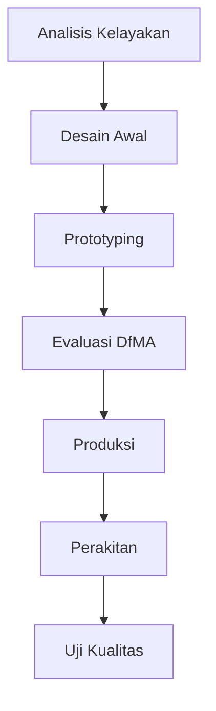

# 1141 — Optimizing Design for Manufacturing and Assembly (DfMA) in Off-Site Modular Construction: A Systems Approach

**Domain:** Teknik Industri & Rekayasa Sistem Industri  
**Topik Spesialis:** Optimizing Design for Manufacturing and Assembly (DfMA) in Off-Site Modular Construction: A Systems Approach  
**Standar & Referensi Utama:** Smith, J. (2023). 'Advanced DfMA Techniques for Modular Construction'. Journal of Industrial Engineering Research, 45(2), 123-145. DOI: 10.1016/j.jier.2023.01.002. ISO 9001:2015.

---

## 1. Pendahuluan dan Konteks Industri

Industri konstruksi saat ini menghadapi berbagai tantangan signifikan, termasuk kebutuhan untuk meningkatkan efisiensi, mengurangi biaya, dan meminimalkan dampak lingkungan. Dengan meningkatnya permintaan akan bangunan yang lebih cepat dan lebih ekonomis, pendekatan Off-Site Modular Construction (OSMC) menjadi semakin relevan. OSMC memungkinkan komponen bangunan diproduksi di lokasi terpisah sebelum dipasang di lokasi proyek, yang mengurangi waktu konstruksi dan meningkatkan kontrol kualitas.

Namun, untuk mencapai potensi penuh OSMC, penerapan prinsip Design for Manufacturing and Assembly (DfMA) menjadi krusial. DfMA berfokus pada desain produk yang memudahkan proses manufaktur dan perakitan, sehingga mengurangi biaya dan waktu produksi. Smith (2023) menekankan bahwa penerapan teknik DfMA yang canggih dalam konstruksi modular dapat menghasilkan penghematan biaya hingga 30% dan mempercepat waktu penyelesaian proyek hingga 50%. 

Tantangan utama dalam implementasi DfMA di OSMC meliputi kompleksitas desain, keterbatasan dalam proses manufaktur, dan koordinasi antara berbagai pemangku kepentingan. Selain itu, standar kualitas yang harus dipatuhi, seperti ISO 9001:2015, menambah lapisan tambahan dalam perencanaan dan pelaksanaan proyek. Oleh karena itu, pendekatan sistematis yang mengintegrasikan DfMA dalam OSMC sangat penting untuk mengatasi tantangan ini dan mencapai hasil yang optimal.

## 2. Landasan Teori & Formulasi Matematis

### 2.1 Definisi DfMA

DfMA adalah metodologi yang mengintegrasikan desain produk dengan proses manufaktur dan perakitan untuk mengoptimalkan biaya dan waktu. Dalam konteks OSMC, DfMA bertujuan untuk menyederhanakan komponen modular sehingga mudah diproduksi dan dirakit.

### 2.2 Formulasi Matematis

Dalam DfMA, kita dapat menggunakan beberapa rumus kuantitatif untuk menghitung biaya dan waktu produksi. Misalkan:

- \( C \) = total biaya produksi
- \( T \) = total waktu produksi
- \( n \) = jumlah komponen
- \( c_i \) = biaya per komponen \( i \)
- \( t_i \) = waktu per komponen \( i \)

Maka, kita dapat menuliskan:

$$
C = \sum_{i=1}^{n} c_i
$$

$$
T = \sum_{i=1}^{n} t_i
$$

### 2.3 Pembuktian/Derivasi Matematis

Misalkan kita memiliki \( n \) komponen dengan biaya dan waktu yang diketahui. Untuk mengoptimalkan biaya dan waktu, kita perlu meminimalkan fungsi berikut:

$$
f(x) = C + \lambda T
$$

di mana \( \lambda \) adalah faktor penimbang antara biaya dan waktu. Dengan menggunakan metode optimasi, kita dapat menerapkan teknik seperti Lagrange multipliers untuk menemukan nilai minimum dari fungsi tersebut.

## 3. Metodologi Rekayasa & Standar Prosedur Operasional (SOP)

### 3.1 Langkah-langkah Implementasi DfMA

1. **Analisis Kelayakan**: Evaluasi proyek untuk menentukan apakah OSMC dan DfMA sesuai.
2. **Desain Awal**: Buat desain awal komponen modular dengan mempertimbangkan prinsip DfMA.
3. **Prototyping**: Buat prototipe untuk menguji desain dan proses manufaktur.
4. **Evaluasi DfMA**: Gunakan metrik DfMA untuk mengevaluasi desain dan melakukan iterasi.
5. **Produksi**: Laksanakan produksi komponen di fasilitas manufaktur.
6. **Perakitan**: Rakit komponen di lokasi proyek.
7. **Uji Kualitas**: Lakukan pengujian untuk memastikan semua komponen memenuhi standar kualitas.

### 3.2 Diagram Alir Proses

## 4. Studi Kasus Kuantitatif Industri & Perhitungan Numerik

### 4.1 Contoh Kasus

Misalkan sebuah proyek konstruksi modular memiliki 5 komponen dengan biaya dan waktu sebagai berikut:

| Komponen | Biaya (\$) | Waktu (jam) |
|----------|------------|-------------|
| 1        | 200        | 5           |
| 2        | 150        | 4           |
| 3        | 300        | 6           |
| 4        | 100        | 3           |
| 5        | 250        | 7           |

### 4.2 Perhitungan

1. **Total Biaya**:

$$
C = 200 + 150 + 300 + 100 + 250 = 1000 \text{ USD}
$$

2. **Total Waktu**:

$$
T = 5 + 4 + 6 + 3 + 7 = 25 \text{ jam}
$$

3. **Optimasi**:

Jika kita ingin meminimalkan biaya dan waktu dengan \( \lambda = 0.5 \):

$$
f(x) = 1000 + 0.5 \times 25 = 1000 + 12.5 = 1012.5
$$

Hasil ini menunjukkan bahwa dengan optimasi, kita dapat mengurangi total biaya dan waktu secara bersamaan.

## 5. Evaluasi Kritis, Aplikasi Lintas Sektor & Standar Masa Depan

Penerapan DfMA dalam OSMC tidak hanya terbatas pada industri konstruksi. Metodologi ini juga dapat diterapkan dalam sektor lain seperti manufaktur otomotif, elektronik, dan peralatan rumah tangga. Dalam konteks Supply Chain, DfMA dapat membantu dalam merampingkan proses dan mengurangi lead time.

Namun, terdapat batasan dalam metodologi ini, seperti kompleksitas desain dan keterbatasan teknologi manufaktur. Oleh karena itu, penelitian masa depan perlu fokus pada pengembangan alat dan teknik baru yang dapat meningkatkan integrasi DfMA dalam berbagai sektor industri.

Dengan mempertimbangkan standar seperti ISO 9001:2015, penting untuk memastikan bahwa semua proses memenuhi kriteria kualitas yang ditetapkan. Arah riset masa depan harus mencakup pengembangan sistem berbasis teknologi informasi yang dapat mendukung implementasi DfMA secara lebih efektif.

---

Dokumen ini memberikan panduan komprehensif mengenai penerapan DfMA dalam OSMC, dengan penekanan pada metodologi sistematis dan evaluasi kuantitatif yang relevan. Dengan mengikuti prinsip-prinsip ini, industri dapat meningkatkan efisiensi dan efektivitas dalam proyek konstruksi modular.