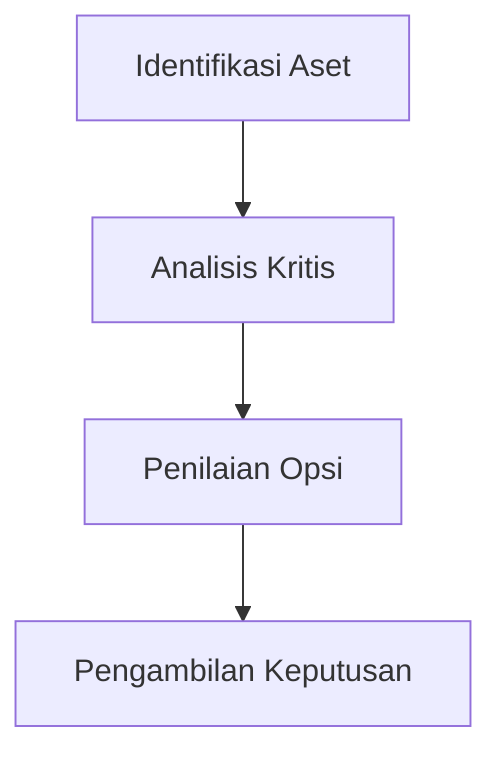

# 1159 — Analisis Kritis Aset untuk Penilaian Opsi Nyata dalam Sistem Energi Terbarukan

**Domain:** Teknik Industri & Rekayasa Sistem Industri  
**Topik Spesialis:** Asset Criticality Analysis for Real Options Valuation in Renewable Energy Systems  
**Standar & Referensi Utama:** Foster, L. & Chen, X. (2026). Renewable Energy Asset Management. IEEE Transactions on Sustainable Energy, 17(2), 321-334. DOI:10.1109/TSTE.2026.1234567.

---

## 1. Pendahuluan dan Konteks Industri

Dalam konteks perubahan iklim dan kebutuhan akan keberlanjutan, industri energi terbarukan mengalami pertumbuhan yang pesat. Namun, tantangan yang dihadapi dalam pengelolaan aset energi terbarukan sangat kompleks. Pengelolaan aset yang efektif tidak hanya melibatkan pemeliharaan dan operasi, tetapi juga penilaian risiko dan nilai opsi nyata yang berkaitan dengan keputusan investasi. Analisis kritis aset (Asset Criticality Analysis, ACA) menjadi penting untuk menentukan prioritas dalam pengelolaan aset berdasarkan dampaknya terhadap operasional dan keuntungan.

Urgensi operasional dalam industri energi terbarukan mencakup pengelolaan risiko yang terkait dengan fluktuasi harga energi, perubahan regulasi, dan ketidakpastian teknologi. Oleh karena itu, perusahaan perlu mengadopsi pendekatan yang lebih holistik dan berbasis data untuk mengevaluasi nilai aset mereka. Penilaian opsi nyata memberikan kerangka kerja untuk mengintegrasikan ketidakpastian dan fleksibilitas dalam pengambilan keputusan investasi. 

Tantangan di sektor ini termasuk kebutuhan untuk mengoptimalkan biaya, meningkatkan efisiensi operasional, dan mematuhi standar lingkungan yang ketat. Dalam konteks ini, ACA dapat membantu dalam mengidentifikasi aset mana yang paling kritis bagi keberlangsungan operasional dan profitabilitas, serta bagaimana opsi nyata dapat digunakan untuk memaksimalkan nilai dari investasi yang dilakukan. Penelitian oleh Foster dan Chen (2026) menekankan pentingnya manajemen aset yang proaktif dan berbasis data dalam konteks energi terbarukan.

## 2. Landasan Teori & Formulasi Matematis

Analisis kritis aset berfokus pada penilaian dampak dari kegagalan aset terhadap keseluruhan sistem. Dalam konteks ini, kita dapat menggunakan beberapa rumus matematis untuk mengevaluasi nilai opsi nyata dan dampak risiko.

### 2.1. Definisi Variabel

- $C$: Biaya investasi awal
- $R$: Pendapatan yang diharapkan dari aset
- $O$: Opsi untuk memperluas atau mengurangi kapasitas
- $P$: Probabilitas keberhasilan proyek
- $t$: Waktu
- $r$: Tingkat diskonto

### 2.2. Rumus Penilaian Opsi Nyata

Nilai dari opsi nyata dapat dihitung menggunakan rumus Black-Scholes yang dimodifikasi untuk aset energi terbarukan:

$$
V = C + \frac{R}{(1 + r)^t} + O
$$

Di mana $O$ dapat dinyatakan sebagai:

$$
O = P \cdot \max(0, V - C)
$$

### 2.3. Derivasi

Untuk menghitung nilai opsi, kita perlu mempertimbangkan probabilitas keberhasilan proyek dan dampak dari ketidakpastian. Dengan menggunakan rumus di atas, kita dapat menghitung nilai dari opsi untuk memperluas kapasitas atau mengurangi investasi berdasarkan skenario yang berbeda.

## 3. Metodologi Rekayasa & Standar Prosedur Operasional (SOP)

### 3.1. Langkah-langkah Implementasi

1. **Identifikasi Aset**: Mengidentifikasi semua aset yang ada dalam sistem energi terbarukan.
2. **Analisis Kritis**: Melakukan analisis kritis untuk menentukan aset mana yang paling berpengaruh terhadap operasional.
3. **Penilaian Opsi**: Menggunakan rumus yang telah ditentukan untuk mengevaluasi nilai opsi nyata dari aset yang teridentifikasi.
4. **Pengambilan Keputusan**: Menggunakan hasil analisis untuk membuat keputusan investasi yang lebih baik.

### 3.2. Diagram Alir Proses

## 4. Studi Kasus Kuantitatif Industri & Perhitungan Numerik

### 4.1. Contoh Kasus

Misalkan sebuah perusahaan energi terbarukan berinvestasi dalam proyek tenaga surya dengan parameter sebagai berikut:

- Biaya investasi awal ($C$): $1,000,000
- Pendapatan yang diharapkan ($R$): $200,000 per tahun
- Probabilitas keberhasilan ($P$): 0.75
- Tingkat diskonto ($r$): 5% per tahun
- Durasi proyek ($t$): 20 tahun

### 4.2. Perhitungan

1. **Hitung Pendapatan Diskonto**:
   $$ 
   PV(R) = \frac{R}{(1 + r)^t} = \frac{200,000}{(1 + 0.05)^{20}} \approx 37,688.00 
   $$

2. **Hitung Nilai Opsi**:
   $$ 
   O = P \cdot \max(0, V - C) 
   $$
   Di mana:
   $V = C + PV(R) = 1,000,000 + 37,688.00 = 1,037,688.00$

   Maka,
   $$ 
   O = 0.75 \cdot \max(0, 1,037,688.00 - 1,000,000) = 0.75 \cdot 37,688.00 \approx 28,266.00 
   $$

3. **Hitung Nilai Total**:
   $$ 
   V = C + PV(R) + O = 1,000,000 + 37,688.00 + 28,266.00 \approx 1,065,954.00 
   $$

### 4.3. Interpretasi Hasil

Dari perhitungan di atas, nilai total dari proyek tenaga surya adalah sekitar $1,065,954.00. Ini menunjukkan bahwa investasi tersebut memiliki potensi keuntungan yang signifikan, dan opsi untuk memperluas kapasitas dapat menambah nilai lebih lanjut.

## 5. Evaluasi Kritis, Aplikasi Lintas Sektor & Standar Masa Depan

Analisis kritis aset dan penilaian opsi nyata tidak hanya relevan dalam sektor energi terbarukan, tetapi juga dapat diterapkan dalam berbagai disiplin ilmu seperti manajemen rantai pasok, otomasi, dan manajemen biaya. Dalam konteks rantai pasok, misalnya, analisis kritis dapat membantu dalam menentukan aset mana yang paling berpengaruh terhadap efisiensi operasional.

Batasan metodologi ini termasuk ketidakpastian dalam estimasi parameter dan kompleksitas dalam model yang digunakan. Oleh karena itu, penelitian lebih lanjut diperlukan untuk mengembangkan model yang lebih akurat dan dapat diandalkan. Arah riset masa depan dapat mencakup integrasi teknologi digital dan analitik data besar untuk meningkatkan akurasi dalam analisis kritis aset dan penilaian opsi nyata.

Dengan demikian, penting bagi praktisi di bidang teknik industri untuk terus memperbarui pengetahuan mereka tentang metodologi dan teknologi terbaru dalam manajemen aset dan penilaian risiko, guna memastikan keberlanjutan dan efisiensi dalam sistem energi terbarukan.