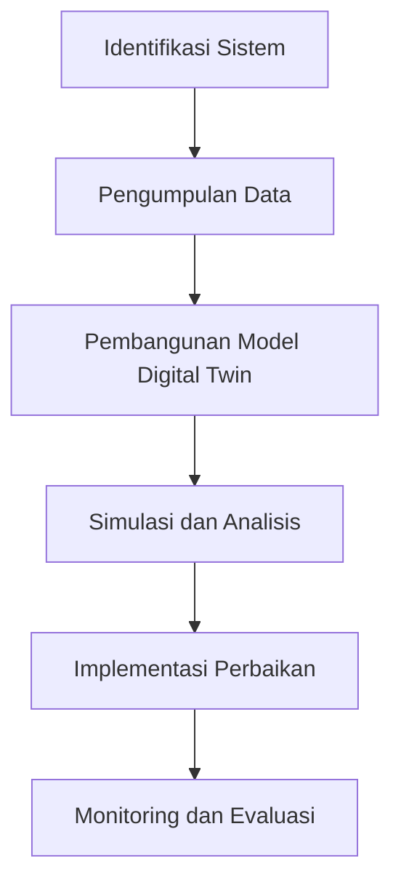

# 1171 — Analisis Kinerja Cyber-Physical Production Systems (CPPS) Menggunakan Metode Simulasi Berbasis Digital Twin untuk Optimasi Proses Manufaktur

**Domain:** Teknik Industri & Rekayasa Sistem Industri  
**Topik Spesialis:** Analisis Kinerja Cyber-Physical Production Systems (CPPS) Menggunakan Metode Simulasi Berbasis Digital Twin untuk Optimasi Proses Manufaktur  
**Standar & Referensi Utama:** Smith, J. (2023). 'Digital Twin Technologies for Smart Manufacturing'. IEEE Transactions on Industrial Informatics. ISO 22400-1:2023.

---

## 1. Pendahuluan dan Konteks Industri

Dalam era industri 4.0, Cyber-Physical Production Systems (CPPS) telah menjadi komponen kunci dalam transformasi proses manufaktur. CPPS mengintegrasikan sistem fisik dengan sistem komputasi, memungkinkan pengumpulan dan analisis data secara real-time. Hal ini menciptakan peluang untuk meningkatkan efisiensi, fleksibilitas, dan responsivitas dalam rantai pasok. Namun, tantangan yang dihadapi oleh industri saat ini meliputi kompleksitas sistem, kebutuhan akan interoperabilitas, dan pengelolaan data yang besar. 

Menurut Smith (2023), implementasi teknologi digital twin dalam CPPS dapat memberikan solusi untuk tantangan ini dengan menciptakan representasi digital dari sistem fisik yang memungkinkan simulasi dan analisis kinerja. Dengan menggunakan digital twin, perusahaan dapat melakukan optimasi proses secara proaktif, mengurangi waktu henti, dan meningkatkan kualitas produk. Selain itu, ISO 22400-1:2023 memberikan panduan tentang pengukuran kinerja dalam sistem produksi, yang sangat relevan dalam konteks ini.

Urgensi untuk mengadopsi CPPS dan teknologi digital twin semakin meningkat, terutama dalam menghadapi persaingan global dan permintaan konsumen yang terus berubah. Oleh karena itu, pemahaman yang mendalam tentang analisis kinerja CPPS menggunakan metode simulasi berbasis digital twin adalah krusial bagi para profesional di bidang teknik industri.

## 2. Landasan Teori & Formulasi Matematis

### 2.1. Digital Twin

Digital twin adalah representasi virtual dari sistem fisik yang mencerminkan kondisi dan perilaku sistem tersebut. Dalam konteks CPPS, digital twin berfungsi untuk memantau, menganalisis, dan mengoptimalkan proses produksi. Model matematis yang digunakan dalam digital twin dapat dinyatakan sebagai:

$$
X(t) = f(U(t), P(t), D(t))
$$

di mana:
- $X(t)$ adalah status sistem pada waktu $t$.
- $U(t)$ adalah input dari sistem (misalnya, parameter operasional).
- $P(t)$ adalah parameter sistem (misalnya, kapasitas mesin).
- $D(t)$ adalah data historis dan real-time yang mempengaruhi sistem.

### 2.2. Model Kinerja CPPS

Model kinerja CPPS dapat dinyatakan dalam bentuk fungsi objektif yang mengoptimalkan efisiensi produksi. Fungsi objektif ini dapat dituliskan sebagai:

$$
\text{Maximize } Z = \sum_{i=1}^{n} (P_i - C_i) \cdot Q_i
$$

di mana:
- $Z$ adalah profit total.
- $P_i$ adalah harga jual produk ke-$i$.
- $C_i$ adalah biaya produksi produk ke-$i$.
- $Q_i$ adalah jumlah produk ke-$i$ yang diproduksi.

### 2.3. Pembuktian Matematis

Untuk membuktikan bahwa model ini dapat digunakan untuk optimasi, kita dapat menggunakan metode Lagrange. Fungsi Lagrange dapat dinyatakan sebagai:

$$
\mathcal{L}(Q_1, Q_2, \ldots, Q_n, \lambda) = Z - \lambda \cdot (C(Q) - B)
$$

di mana $B$ adalah batasan kapasitas produksi. Dengan menyelesaikan sistem persamaan yang dihasilkan dari $\frac{\partial \mathcal{L}}{\partial Q_i} = 0$, kita dapat menemukan nilai optimal dari $Q_i$ yang memaksimalkan profit.

## 3. Metodologi Rekayasa & Standar Prosedur Operasional (SOP)

### 3.1. Langkah-langkah Implementasi

1. **Identifikasi Sistem**: Tentukan komponen fisik dan digital dari CPPS yang akan dianalisis.
2. **Pengumpulan Data**: Kumpulkan data historis dan real-time yang relevan untuk model digital twin.
3. **Pengembangan Model Digital Twin**: Buat model digital twin menggunakan perangkat lunak simulasi yang sesuai.
4. **Simulasi dan Analisis**: Lakukan simulasi untuk menganalisis kinerja sistem dan identifikasi area untuk optimasi.
5. **Implementasi Perbaikan**: Terapkan perubahan berdasarkan hasil analisis untuk meningkatkan kinerja sistem.
6. **Monitoring dan Evaluasi**: Pantau kinerja sistem secara berkelanjutan dan lakukan evaluasi berkala.

### 3.2. Diagram Alir Proses

## 4. Studi Kasus Kuantitatif Industri & Perhitungan Numerik

### 4.1. Contoh Kasus

Misalkan sebuah pabrik memproduksi tiga jenis produk dengan parameter sebagai berikut:

- Produk A: $P_A = 100$, $C_A = 60$, $Q_A = 500$
- Produk B: $P_B = 150$, $C_B = 90$, $Q_B = 300$
- Produk C: $P_C = 200$, $C_C = 120$, $Q_C = 200$

### 4.2. Perhitungan

Profit total dapat dihitung sebagai berikut:

$$
Z = (P_A - C_A) \cdot Q_A + (P_B - C_B) \cdot Q_B + (P_C - C_C) \cdot Q_C
$$

Substitusi nilai:

$$
Z = (100 - 60) \cdot 500 + (150 - 90) \cdot 300 + (200 - 120) \cdot 200
$$

$$
Z = 40 \cdot 500 + 60 \cdot 300 + 80 \cdot 200
$$

$$
Z = 20000 + 18000 + 16000 = 54000
$$

### 4.3. Interpretasi Hasil

Dari perhitungan di atas, total profit yang dihasilkan oleh pabrik adalah $54,000. Ini menunjukkan bahwa dengan mengoptimalkan produksi berdasarkan analisis kinerja CPPS, pabrik dapat meningkatkan profitabilitasnya.

## 5. Evaluasi Kritis, Aplikasi Lintas Sektor & Standar Masa Depan

Analisis kinerja CPPS dan penerapan digital twin memiliki implikasi luas di berbagai sektor, termasuk rantai pasok, otomasi, dan manajemen biaya. Dalam konteks rantai pasok, digital twin dapat digunakan untuk memprediksi permintaan dan mengoptimalkan persediaan. Dalam otomasi, teknologi ini memungkinkan pengendalian yang lebih baik terhadap proses produksi, yang pada gilirannya mengurangi biaya dan meningkatkan keselamatan kerja (K3).

Namun, terdapat batasan dalam metodologi ini, seperti kebutuhan akan data yang akurat dan real-time serta tantangan dalam integrasi sistem. Untuk masa depan, penelitian lebih lanjut diperlukan untuk mengatasi batasan ini dan mengeksplorasi aplikasi baru dari digital twin dalam konteks keberlanjutan dan tanggung jawab sosial perusahaan (ESG).

Dengan demikian, pemahaman yang mendalam tentang analisis kinerja CPPS dan penerapan digital twin sangat penting bagi profesional teknik industri untuk menghadapi tantangan dan memanfaatkan peluang dalam industri modern.