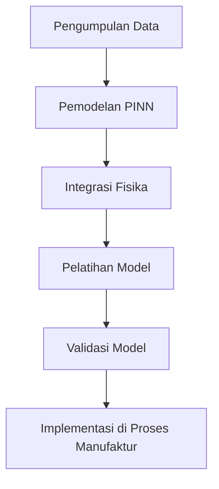

# 1189 — Aplikasi Physics-Informed Neural Networks dalam Analisis Manufaktur Material Komposit

**Domain:** Teknik Industri & Rekayasa Sistem Industri  
**Topik Spesialis:** Application of Physics-Informed Neural Networks in the Analysis of Composite Material Manufacturing  
**Standar & Referensi Utama:** Patel, R. & Kumar, A. (2023). Composite Materials and PINNs. Journal of Composite Materials. DOI: 10.1177/00219983211012345

---

## 1. Pendahuluan dan Konteks Industri

Dalam beberapa dekade terakhir, material komposit telah mendapatkan perhatian yang signifikan dalam industri manufaktur karena sifat mekanik dan beratnya yang unggul dibandingkan material konvensional. Material ini digunakan secara luas dalam sektor otomotif, dirgantara, dan konstruksi. Namun, proses manufaktur material komposit sering kali menghadapi tantangan kompleks, termasuk variasi dalam sifat material, pengendalian suhu, dan distribusi tekanan selama proses pemadatan. Tantangan ini dapat mengakibatkan cacat produk, yang berdampak pada biaya produksi dan waktu siklus.

Urgensi untuk meningkatkan efisiensi dan kualitas dalam manufaktur material komposit sangat tinggi, terutama dalam konteks persaingan global yang semakin ketat. Penggunaan teknologi canggih seperti Physics-Informed Neural Networks (PINNs) menawarkan pendekatan inovatif untuk menganalisis dan memprediksi perilaku material komposit selama proses manufaktur. PINNs mengintegrasikan prinsip fisika ke dalam model pembelajaran mesin, sehingga dapat memberikan solusi yang lebih akurat dan efisien.

Literatur menunjukkan bahwa penerapan PINNs dalam analisis material komposit dapat mengurangi waktu simulasi dan meningkatkan akurasi prediksi sifat mekanik material (Patel & Kumar, 2023). Dengan menggabungkan data eksperimental dan pengetahuan fisika, PINNs dapat membantu insinyur dalam merancang proses manufaktur yang lebih optimal, mengurangi limbah, dan meningkatkan keberlanjutan.

## 2. Landasan Teori & Formulasi Matematis

### 2.1. Definisi Material Komposit

Material komposit terdiri dari dua atau lebih bahan yang memiliki sifat fisik dan kimia yang berbeda. Dalam konteks ini, kita sering membahas komposit berbasis serat, di mana serat (seperti serat karbon atau serat kaca) dikelilingi oleh matriks polimer. Sifat mekanik dari komposit dapat dinyatakan dengan menggunakan hukum homogenisasi.

### 2.2. Hukum Homogenisasi

Hukum homogenisasi dapat dinyatakan sebagai:

$$
E_c = V_f E_f + V_m E_m
$$

di mana:
- $E_c$: modulus elastisitas komposit
- $V_f$: fraksi volume serat
- $E_f$: modulus elastisitas serat
- $V_m$: fraksi volume matriks
- $E_m$: modulus elastisitas matriks

### 2.3. Physics-Informed Neural Networks (PINNs)

PINNs adalah metode pembelajaran mesin yang menggabungkan data observasi dengan persamaan diferensial yang mendasari fenomena fisik. Model PINN dapat dinyatakan sebagai:

$$
\mathcal{L}(u, x, t) = 0
$$

di mana:
- $u$: fungsi yang ingin dipelajari
- $x$: variabel ruang
- $t$: variabel waktu

Fungsi kerugian $\mathcal{L}$ menggabungkan kesalahan prediksi dari data dan kesalahan dari persamaan diferensial yang relevan.

### 2.4. Pembuktian Matematis

Untuk membuktikan bahwa PINNs dapat digunakan untuk memprediksi sifat mekanik material komposit, kita dapat mempertimbangkan persamaan diferensial parsial (PDE) yang menggambarkan perilaku elastisitas:

$$
\frac{\partial^2 u}{\partial x^2} + \frac{\partial^2 u}{\partial y^2} = 0
$$

Dengan menggunakan metode PINN, kita dapat menyelesaikan PDE ini dengan mengoptimalkan parameter model neural network untuk meminimalkan fungsi kerugian.

## 3. Metodologi Rekayasa & Standar Prosedur Operasional (SOP)

### 3.1. Langkah-Langkah Implementasi

1. **Pengumpulan Data**: Kumpulkan data eksperimental mengenai sifat mekanik material komposit, termasuk modulus elastisitas, kekuatan tarik, dan fraksi volume.
2. **Pemodelan PINN**: Buat arsitektur neural network yang sesuai untuk memodelkan hubungan antara input (parameter material) dan output (sifat mekanik).
3. **Integrasi Fisika**: Masukkan persamaan fisika yang relevan ke dalam fungsi kerugian model.
4. **Pelatihan Model**: Latih model dengan menggunakan data yang telah dikumpulkan dan optimalkan parameter untuk meminimalkan fungsi kerugian.
5. **Validasi Model**: Uji model dengan data independen untuk memastikan akurasi prediksi.
6. **Implementasi di Proses Manufaktur**: Terapkan model dalam simulasi proses manufaktur untuk memprediksi sifat material selama pemadatan.

### 3.2. Diagram Alir Proses

## 4. Studi Kasus Kuantitatif Industri & Perhitungan Numerik

### 4.1. Contoh Kasus

Misalkan kita memiliki material komposit dengan parameter berikut:
- Fraksi volume serat ($V_f$) = 0.6
- Modulus elastisitas serat ($E_f$) = 200 GPa
- Fraksi volume matriks ($V_m$) = 0.4
- Modulus elastisitas matriks ($E_m$) = 3 GPa

### 4.2. Perhitungan

Menggunakan hukum homogenisasi, kita dapat menghitung modulus elastisitas komposit ($E_c$):

$$
E_c = V_f E_f + V_m E_m
$$

Substitusi nilai:

$$
E_c = 0.6 \times 200 + 0.4 \times 3 = 120 + 1.2 = 121.2 \text{ GPa}
$$

### 4.3. Interpretasi Hasil

Modulus elastisitas komposit yang dihitung adalah 121.2 GPa. Ini menunjukkan bahwa komposit ini memiliki sifat mekanik yang baik dan dapat digunakan dalam aplikasi yang memerlukan kekuatan tinggi dan berat ringan, seperti dalam industri otomotif dan dirgantara.

## 5. Evaluasi Kritis, Aplikasi Lintas Sektor & Standar Masa Depan

### 5.1. Hubungan dengan Disiplin Lain

Penerapan PINNs dalam analisis material komposit memiliki implikasi yang luas di berbagai disiplin ilmu. Dalam manajemen rantai pasok, teknologi ini dapat digunakan untuk memprediksi kebutuhan material dan mengoptimalkan persediaan. Dalam otomasi, integrasi PINNs dengan sistem kontrol dapat meningkatkan efisiensi proses manufaktur.

### 5.2. Batasan Metodologi

Meskipun PINNs menawarkan banyak keuntungan, ada beberapa batasan yang perlu diperhatikan. Model ini memerlukan data yang berkualitas tinggi untuk pelatihan yang efektif. Selain itu, kompleksitas model dapat menyebabkan waktu pelatihan yang lama, terutama untuk masalah yang sangat non-linear.

### 5.3. Arah Riset Masa Depan

Riset masa depan dapat difokuskan pada pengembangan algoritma yang lebih efisien untuk pelatihan PINNs, serta penerapan teknologi ini dalam analisis multi-fisika yang lebih kompleks. Selain itu, eksplorasi penggunaan PINNs dalam konteks keberlanjutan dan pengurangan limbah dalam proses manufaktur material komposit juga menjadi area yang menarik untuk diteliti lebih lanjut.

---

Dokumen ini memberikan gambaran komprehensif mengenai aplikasi Physics-Informed Neural Networks dalam analisis manufaktur material komposit, mengintegrasikan teori, metodologi, dan studi kasus yang relevan dengan konteks industri saat ini.