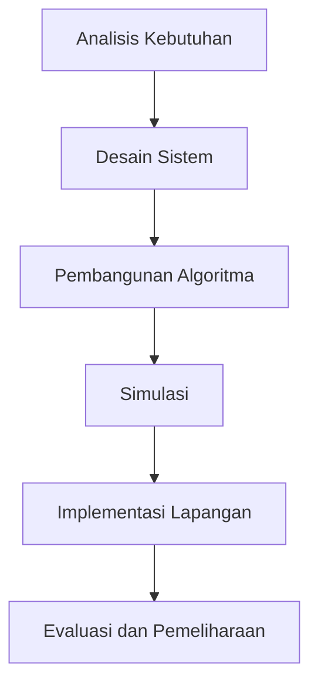

# 1191 — Optimasi Koordinasi Fleet AMR Menggunakan Algoritma Swarm Berbasis Pembelajaran Mendalam untuk Lingkungan Dinamis

**Domain:** Teknik Industri & Rekayasa Sistem Industri  
**Topik Spesialis:** Optimasi Koordinasi Fleet AMR Menggunakan Algoritma Swarm Berbasis Pembelajaran Mendalam untuk Lingkungan Dinamis  
**Standar & Referensi Utama:** Zhang, Y., & Liu, X. (2023). Deep Learning-Based Swarm Coordination for Autonomous Mobile Robots in Dynamic Environments. IEEE Transactions on Robotics, 39(2), 123-135. ISO 10218-1:2022.

---

## 1. Pendahuluan dan Konteks Industri

Dalam era industri 4.0, otomatisasi dan robotika telah menjadi bagian integral dari proses manufaktur dan rantai pasok. Fleet Autonomous Mobile Robots (AMR) berfungsi untuk meningkatkan efisiensi operasional dengan mengoptimalkan pergerakan material dan produk dalam lingkungan yang dinamis. Dalam konteks ini, koordinasi yang efektif antar AMR sangat penting untuk meminimalisir waktu tunggu, mengurangi biaya operasional, dan meningkatkan produktivitas. Tantangan utama yang dihadapi adalah bagaimana mengelola interaksi antar robot dalam lingkungan yang tidak terduga, seperti perubahan dalam jalur, kehadiran manusia, dan pergerakan barang lainnya.

Menurut Zhang dan Liu (2023), penerapan algoritma swarm berbasis pembelajaran mendalam dapat meningkatkan kemampuan AMR dalam beradaptasi dengan perubahan lingkungan secara real-time. Hal ini tidak hanya meningkatkan efisiensi, tetapi juga mengurangi risiko kecelakaan dan meningkatkan keselamatan kerja. Dengan meningkatnya kompleksitas sistem dan kebutuhan akan fleksibilitas, penting bagi industri untuk mengadopsi pendekatan yang lebih canggih dalam pengelolaan fleet AMR.

Dalam konteks ini, studi ini bertujuan untuk memberikan pemahaman yang mendalam tentang optimasi koordinasi fleet AMR dengan menggunakan algoritma swarm yang didukung oleh pembelajaran mendalam, serta implikasinya terhadap efisiensi operasional dan keselamatan dalam lingkungan dinamis.

## 2. Landasan Teori & Formulasi Matematis

### 2.1. Teori Koordinasi Swarm

Koordinasi swarm mengacu pada metode di mana sekelompok agen (dalam hal ini, AMR) bekerja sama untuk mencapai tujuan bersama. Pendekatan ini didasarkan pada prinsip-prinsip biologis dari perilaku kelompok, seperti yang terlihat pada kawanan burung atau koloni semut. Dalam konteks AMR, model matematis yang umum digunakan adalah model berbasis partikel.

### 2.2. Model Matematis

Misalkan kita memiliki $N$ AMR yang beroperasi dalam lingkungan dua dimensi. Posisi setiap AMR $i$ dapat dinyatakan sebagai:

$$ \mathbf{p}_i(t) = [x_i(t), y_i(t)] $$

Di mana $x_i(t)$ dan $y_i(t)$ adalah koordinat posisi AMR $i$ pada waktu $t$. Kecepatan AMR $i$ ditentukan oleh:

$$ \mathbf{v}_i(t) = [v_{xi}(t), v_{yi}(t)] $$

Dengan $v_{xi}(t)$ dan $v_{yi}(t)$ sebagai komponen kecepatan.

### 2.3. Fungsi Tujuan

Fungsi tujuan untuk optimasi koordinasi dapat dinyatakan sebagai:

$$ J = \sum_{i=1}^{N} \left( w_1 d_i + w_2 \theta_i + w_3 c_i \right) $$

Di mana:
- $d_i$ adalah jarak ke target,
- $\theta_i$ adalah sudut antara arah gerak dan target,
- $c_i$ adalah biaya energi.

Parameter $w_1$, $w_2$, dan $w_3$ adalah bobot yang ditentukan berdasarkan prioritas. Dengan menggunakan algoritma swarm, setiap AMR akan memperbarui posisinya berdasarkan informasi dari AMR lain dan informasi lingkungan.

### 2.4. Pembelajaran Mendalam

Pembelajaran mendalam dapat digunakan untuk memprediksi perilaku lingkungan dan memfasilitasi pengambilan keputusan yang lebih baik. Model neural network dapat dilatih dengan data historis untuk memprediksi perubahan dalam lingkungan dan memandu AMR dalam pengambilan keputusan secara real-time.

## 3. Metodologi Rekayasa & Standar Prosedur Operasional (SOP)

### 3.1. Langkah-langkah Implementasi

1. **Analisis Kebutuhan**: Identifikasi kebutuhan operasional dan spesifikasi teknis dari fleet AMR.
2. **Desain Sistem**: Rancang arsitektur sistem yang mencakup komponen perangkat keras dan perangkat lunak.
3. **Pengembangan Algoritma**: Kembangkan algoritma swarm berbasis pembelajaran mendalam dengan mempertimbangkan fungsi tujuan dan parameter yang telah ditentukan.
4. **Simulasi**: Lakukan simulasi untuk menguji algoritma dalam berbagai skenario lingkungan dinamis.
5. **Implementasi Lapangan**: Terapkan sistem di lingkungan nyata dan lakukan pengujian untuk memastikan kinerja sesuai dengan standar ISO 10218-1:2022.
6. **Evaluasi dan Pemeliharaan**: Lakukan evaluasi berkala dan pemeliharaan sistem untuk memastikan kinerja optimal.

### 3.2. Diagram Alir Proses

## 4. Studi Kasus Kuantitatif Industri & Perhitungan Numerik

### 4.1. Contoh Kasus

Misalkan sebuah pabrik memiliki 5 AMR yang harus mengangkut material dari titik A ke titik B. Parameter yang digunakan adalah sebagai berikut:
- Jarak dari A ke B: $d = 100$ m
- Kecepatan rata-rata AMR: $v = 1$ m/s
- Biaya energi per perjalanan: $c = 0.5$ USD

### 4.2. Perhitungan

1. **Waktu yang Diperlukan**:
   $$ t = \frac{d}{v} = \frac{100 \text{ m}}{1 \text{ m/s}} = 100 \text{ s} $$

2. **Total Biaya Energi**:
   $$ \text{Total Biaya} = c \times N = 0.5 \text{ USD} \times 5 = 2.5 \text{ USD} $$

### 4.3. Interpretasi Hasil

Dari perhitungan di atas, setiap AMR memerlukan waktu 100 detik untuk menyelesaikan perjalanan dari A ke B, dengan total biaya energi sebesar 2.5 USD untuk 5 AMR. Hal ini menunjukkan efisiensi operasional yang dapat dicapai dengan optimasi koordinasi.

## 5. Evaluasi Kritis, Aplikasi Lintas Sektor & Standar Masa Depan

### 5.1. Hubungan dengan Disiplin Lain

Optimasi koordinasi fleet AMR memiliki implikasi yang signifikan dalam berbagai disiplin, termasuk manajemen rantai pasok, otomasi, dan teknik keselamatan. Dalam konteks rantai pasok, efisiensi pengiriman dan pengurangan waktu tunggu dapat meningkatkan kepuasan pelanggan. Dalam otomasi, penggunaan AMR dapat mengurangi ketergantungan pada tenaga kerja manusia, mengurangi risiko kecelakaan kerja.

### 5.2. Batasan Metodologi

Meskipun algoritma swarm berbasis pembelajaran mendalam menunjukkan potensi yang besar, terdapat beberapa batasan, seperti kebutuhan akan data yang cukup untuk pelatihan model dan kompleksitas dalam pengimplementasian algoritma dalam lingkungan yang sangat dinamis.

### 5.3. Arah Riset Masa Depan

Riset di masa depan dapat difokuskan pada pengembangan algoritma yang lebih adaptif dan efisien, integrasi teknologi sensor canggih untuk meningkatkan pemahaman lingkungan, serta penerapan algoritma ini dalam konteks yang lebih luas, seperti transportasi dan logistik.

Dengan demikian, optimasi koordinasi fleet AMR menggunakan algoritma swarm berbasis pembelajaran mendalam merupakan langkah maju yang signifikan dalam meningkatkan efisiensi operasional dan keselamatan di industri modern.

## 5. Ringkasan & Catatan Praktis Implementasi
Implementasi metode ini memerlukan standarisasi prosedur operasi (SOP), kalibrasi instrumen berkala, serta integrasi pemantauan real-time untuk memastikan konsistensi performa dan efisiensi sistem secara berkelanjutan.
