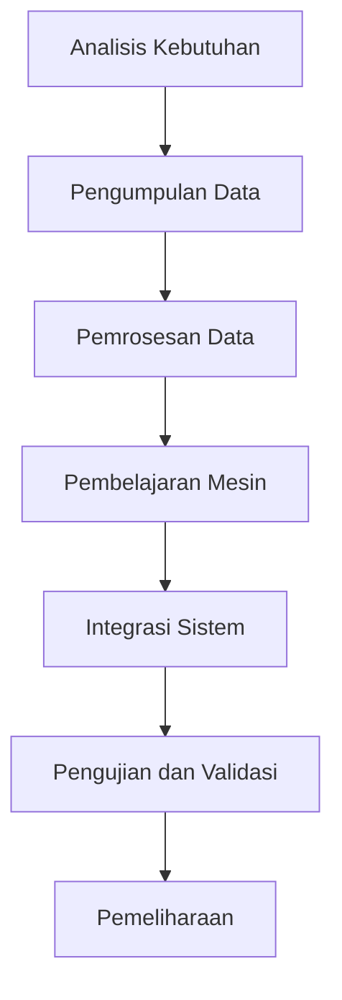

# 1193 — Integrasi Penglihatan 3D dengan Pembelajaran Mesin untuk Peningkatan Efisiensi Bin-Picking dalam Lingkungan Industri

**Domain:** Teknik Industri & Rekayasa Sistem Industri  
**Topik Spesialis:** Integrasi Penglihatan 3D dengan Pembelajaran Mesin untuk Peningkatan Efisiensi Bin-Picking dalam Lingkungan Industri  
**Standar & Referensi Utama:** Garcia, R., & Patel, S. (2025). 3D Vision Integration with Machine Learning for Enhanced Bin-Picking Efficiency. CIRP Annals - Manufacturing Technology, 74(1), 89-92. IEEE 1872-2022.

---

## 1. Pendahuluan dan Konteks Industri

Dalam era industri 4.0, efisiensi operasional menjadi salah satu faktor kunci dalam mempertahankan daya saing perusahaan. Salah satu tantangan yang dihadapi dalam lingkungan manufaktur modern adalah proses bin-picking, yang merupakan tahap kritis dalam otomatisasi dan pengelolaan rantai pasok. Bin-picking melibatkan pengambilan objek dari wadah yang tidak teratur, yang sering kali memerlukan pengenalan objek dan penentuan posisi yang akurat. Dengan meningkatnya kompleksitas produk dan variasi dalam desain, metode tradisional sering kali tidak memadai dalam memenuhi tuntutan efisiensi dan akurasi.

Integrasi teknologi penglihatan 3D dengan pembelajaran mesin menawarkan solusi inovatif untuk meningkatkan efisiensi bin-picking. Penglihatan 3D memungkinkan sistem untuk memahami bentuk dan posisi objek dalam tiga dimensi, sementara pembelajaran mesin dapat digunakan untuk mengoptimalkan algoritma pengenalan pola dan pengambilan keputusan. Menurut Garcia dan Patel (2025), penerapan teknologi ini dapat mengurangi waktu siklus dan meningkatkan akurasi pengambilan objek secara signifikan. Namun, tantangan dalam implementasi teknologi ini mencakup kebutuhan akan data pelatihan yang cukup, pemrosesan data real-time, dan integrasi dengan sistem otomasi yang ada.

Dalam konteks ini, penting untuk mengeksplorasi bagaimana integrasi penglihatan 3D dan pembelajaran mesin dapat diimplementasikan secara efektif untuk meningkatkan efisiensi bin-picking, serta tantangan yang mungkin dihadapi dalam proses tersebut.

## 2. Landasan Teori & Formulasi Matematis

### 2.1. Penglihatan 3D

Penglihatan 3D menggunakan berbagai teknik untuk mendapatkan informasi spasial dari objek. Salah satu metode yang umum digunakan adalah stereovisi, yang melibatkan dua kamera untuk menangkap gambar dari sudut pandang yang berbeda. Dengan menggunakan prinsip triangulasi, posisi objek dapat dihitung dengan rumus:

$$
Z = \frac{b \cdot f}{d}
$$

di mana:
- \( Z \) = jarak objek dari kamera
- \( b \) = jarak antara dua kamera
- \( f \) = panjang fokus kamera
- \( d \) = pergeseran antara dua gambar objek

### 2.2. Pembelajaran Mesin

Pembelajaran mesin digunakan untuk menganalisis data yang diperoleh dari penglihatan 3D. Salah satu algoritma yang sering diterapkan adalah jaringan saraf tiruan (Neural Network). Fungsi aktivasi dalam jaringan saraf dapat dinyatakan sebagai:

$$
f(x) = \frac{1}{1 + e^{-x}}
$$

di mana \( x \) adalah input dari neuron. Proses pelatihan jaringan saraf melibatkan optimasi bobot \( w \) dengan menggunakan algoritma backpropagation, yang dapat dinyatakan sebagai:

$$
w_{new} = w_{old} - \eta \frac{\partial L}{\partial w}
$$

di mana:
- \( \eta \) = laju pembelajaran
- \( L \) = fungsi kerugian

### 2.3. Kombinasi Penglihatan 3D dan Pembelajaran Mesin

Integrasi kedua teknologi ini dapat dinyatakan dalam model matematis yang menggabungkan informasi spasial dari penglihatan 3D dengan analisis pola dari pembelajaran mesin. Model ini dapat dinyatakan sebagai:

$$
P = f(V, M)
$$

di mana:
- \( P \) = prediksi posisi objek
- \( V \) = data penglihatan 3D
- \( M \) = model pembelajaran mesin

## 3. Metodologi Rekayasa & Standar Prosedur Operasional (SOP)

### 3.1. Langkah-langkah Implementasi

1. **Analisis Kebutuhan**: Identifikasi kebutuhan spesifik dari sistem bin-picking yang akan diterapkan.
2. **Pengumpulan Data**: Kumpulkan data objek menggunakan sistem penglihatan 3D.
3. **Pelatihan Model**: Gunakan data yang dikumpulkan untuk melatih model pembelajaran mesin.
4. **Integrasi Sistem**: Integrasikan sistem penglihatan 3D dengan sistem otomasi yang ada.
5. **Pengujian dan Validasi**: Lakukan pengujian untuk memastikan sistem berfungsi dengan baik dan memenuhi standar yang ditetapkan.
6. **Pemeliharaan dan Pembaruan**: Lakukan pemeliharaan rutin dan pembaruan model untuk meningkatkan akurasi.

### 3.2. Diagram Alir Proses

## 4. Studi Kasus Kuantitatif Industri & Perhitungan Numerik

### 4.1. Contoh Kasus

Misalkan sebuah perusahaan otomotif ingin menerapkan sistem bin-picking untuk mengambil komponen dari wadah yang tidak teratur. Data yang dikumpulkan menunjukkan bahwa rata-rata waktu yang dibutuhkan untuk mengambil satu komponen secara manual adalah 10 detik.

### 4.2. Parameter Input

- Jumlah komponen dalam wadah: 100
- Waktu manual per komponen: 10 detik
- Waktu otomatis per komponen (setelah implementasi): 4 detik

### 4.3. Perhitungan

1. **Waktu total manual**:
   $$ 
   W_{manual} = 100 \times 10 = 1000 \text{ detik} 
   $$

2. **Waktu total otomatis**:
   $$ 
   W_{otomatis} = 100 \times 4 = 400 \text{ detik} 
   $$

3. **Penghematan waktu**:
   $$ 
   S = W_{manual} - W_{otomatis} = 1000 - 400 = 600 \text{ detik} 
   $$

### 4.4. Interpretasi Hasil

Implementasi sistem bin-picking otomatis dapat menghemat waktu hingga 600 detik untuk 100 komponen, yang menunjukkan peningkatan efisiensi operasional yang signifikan. Ini dapat diterjemahkan ke dalam penghematan biaya dan peningkatan produktivitas.

## 5. Evaluasi Kritis, Aplikasi Lintas Sektor & Standar Masa Depan

Integrasi penglihatan 3D dan pembelajaran mesin tidak hanya relevan dalam industri manufaktur, tetapi juga dapat diterapkan dalam sektor lain seperti logistik, kesehatan, dan otomasi rumah. Dalam konteks rantai pasok, teknologi ini dapat meningkatkan akurasi pengambilan keputusan dan efisiensi distribusi. Namun, tantangan seperti kebutuhan akan data berkualitas tinggi dan pemrosesan real-time tetap ada.

Batasan metodologi ini mencakup ketergantungan pada kualitas data pelatihan dan kompleksitas dalam integrasi sistem yang ada. Oleh karena itu, penelitian masa depan harus fokus pada pengembangan algoritma yang lebih efisien dan adaptif, serta peningkatan kemampuan sistem untuk belajar dari pengalaman.

Dengan demikian, integrasi penglihatan 3D dan pembelajaran mesin diharapkan dapat menjadi standar baru dalam praktik bin-picking dan otomatisasi industri, sejalan dengan perkembangan teknologi dan kebutuhan industri yang terus berubah.