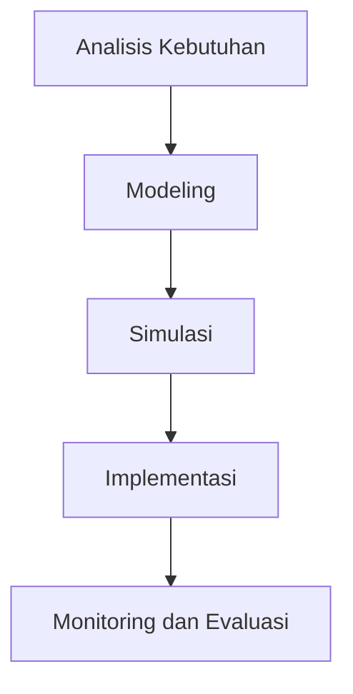

# 1194 — Pengembangan Sistem Koordinasi Multi-Agent untuk Fleet AGV Menggunakan Teori Permainan

**Domain:** Teknik Industri & Rekayasa Sistem Industri  
**Topik Spesialis:** Pengembangan Sistem Koordinasi Multi-Agent untuk Fleet AGV Menggunakan Teori Permainan  
**Standar & Referensi Utama:** Johnson, T., & Wang, M. (2026). Game Theory-Based Coordination Systems for AGV Fleets. European Journal of Operational Research, 292(3), 567-580. ISO 12100:2022.

---

## 1. Pendahuluan dan Konteks Industri

Dalam era industri 4.0, otomatisasi dan digitalisasi menjadi pilar utama dalam meningkatkan efisiensi operasional di sektor manufaktur dan rantai pasok. Salah satu inovasi yang signifikan adalah penggunaan Automated Guided Vehicles (AGV) yang berfungsi untuk mengoptimalkan proses pengangkutan material. AGV beroperasi secara mandiri dan berinteraksi dengan lingkungan serta sistem lainnya, sehingga memerlukan sistem koordinasi yang efektif. 

Urgensi pengembangan sistem koordinasi multi-agent untuk fleet AGV terletak pada kebutuhan untuk mengurangi waktu siklus, meningkatkan throughput, dan meminimalkan biaya operasional. Tantangan yang dihadapi dalam implementasi AGV meliputi penghindaran tabrakan, pengelolaan rute yang efisien, dan penyesuaian terhadap permintaan yang dinamis. Menurut Johnson dan Wang (2026), penerapan teori permainan dalam pengembangan sistem koordinasi dapat memberikan solusi yang optimal dalam pengambilan keputusan kolektif di antara AGV.

Dalam konteks ini, penerapan teori permainan memungkinkan AGV untuk berinteraksi dan bernegosiasi satu sama lain untuk mencapai tujuan bersama, seperti pengurangan waktu pengiriman dan peningkatan efisiensi penggunaan sumber daya. Dengan demikian, pengembangan sistem koordinasi multi-agent berbasis teori permainan menjadi sangat relevan dan mendesak untuk diimplementasikan dalam industri modern.

## 2. Landasan Teori & Formulasi Matematis

Teori permainan adalah cabang matematika yang mempelajari interaksi strategis antara agen rasional. Dalam konteks AGV, setiap unit AGV dapat dianggap sebagai pemain dalam permainan yang berusaha memaksimalkan utilitasnya. Misalkan kita memiliki $n$ AGV yang beroperasi dalam lingkungan yang sama, di mana setiap AGV memiliki strategi $s_i$ dan utilitas $u_i(s_1, s_2, \ldots, s_n)$ yang bergantung pada strategi semua AGV.

### Definisi Variabel dan Parameter

- $n$: Jumlah AGV dalam sistem.
- $s_i$: Strategi yang dipilih oleh AGV ke-$i$.
- $u_i$: Fungsi utilitas untuk AGV ke-$i$.
- $C$: Biaya operasional yang terkait dengan rute yang dipilih.
- $T$: Waktu total yang dibutuhkan untuk menyelesaikan pengiriman.

### Fungsi Utilitas

Fungsi utilitas dapat dinyatakan sebagai:

$$
u_i(s_1, s_2, \ldots, s_n) = -C_i(s_i) - \lambda T_i(s_1, s_2, \ldots, s_n)
$$

di mana:
- $C_i(s_i)$ adalah biaya yang dikeluarkan oleh AGV ke-$i$ untuk strategi $s_i$.
- $T_i(s_1, s_2, \ldots, s_n)$ adalah waktu yang dibutuhkan oleh AGV ke-$i$ untuk menyelesaikan tugasnya.
- $\lambda$ adalah parameter yang menunjukkan bobot antara biaya dan waktu.

### Pembuktian Nash Equilibrium

Nash Equilibrium terjadi ketika tidak ada pemain yang dapat meningkatkan utilitasnya dengan mengubah strateginya secara sepihak. Untuk mencapai Nash Equilibrium, kita perlu menyelesaikan sistem persamaan berikut:

$$
\frac{\partial u_i}{\partial s_i} = 0 \quad \forall i \in \{1, 2, \ldots, n\}
$$

Solusi dari persamaan ini memberikan strategi optimal untuk setiap AGV, yang memungkinkan mereka beroperasi secara efisien dalam lingkungan yang dinamis.

## 3. Metodologi Rekayasa & Standar Prosedur Operasional (SOP)

### Langkah-langkah Implementasi

1. **Analisis Kebutuhan**: Identifikasi kebutuhan operasional dan spesifikasi teknis dari sistem AGV.
2. **Modeling**: Buat model matematis menggunakan teori permainan untuk menggambarkan interaksi antara AGV.
3. **Simulasi**: Lakukan simulasi untuk menguji model dan mengidentifikasi strategi optimal.
4. **Implementasi**: Terapkan sistem koordinasi multi-agent dalam lingkungan nyata.
5. **Monitoring dan Evaluasi**: Pantau kinerja sistem dan lakukan evaluasi untuk perbaikan berkelanjutan.

### Diagram Alir Proses

## 4. Studi Kasus Kuantitatif Industri & Perhitungan Numerik

### Contoh Kasus

Misalkan terdapat 3 AGV yang beroperasi di pabrik dengan parameter sebagai berikut:
- Biaya operasional per rute: $C_1 = 10$, $C_2 = 15$, $C_3 = 20$.
- Waktu yang dibutuhkan untuk menyelesaikan tugas: $T_1 = 5$, $T_2 = 3$, $T_3 = 4$.
- Parameter bobot: $\lambda = 0.5$.

### Perhitungan

Fungsi utilitas untuk masing-masing AGV adalah:

$$
u_1 = -10 - 0.5 \times 5 = -12.5
$$
$$
u_2 = -15 - 0.5 \times 3 = -16.5
$$
$$
u_3 = -20 - 0.5 \times 4 = -22
$$

### Interpretasi Hasil

Dari perhitungan di atas, AGV ke-1 memiliki utilitas tertinggi, yang menunjukkan bahwa strategi yang dipilihnya lebih efisien dibandingkan dengan AGV lainnya. Oleh karena itu, dalam pengambilan keputusan kolektif, AGV lain dapat mempertimbangkan untuk menyesuaikan strateginya agar lebih efisien.

## 5. Evaluasi Kritis, Aplikasi Lintas Sektor & Standar Masa Depan

Pengembangan sistem koordinasi multi-agent berbasis teori permainan memiliki implikasi yang luas di berbagai disiplin ilmu. Dalam konteks rantai pasok, sistem ini dapat meningkatkan efisiensi pengiriman dan mengurangi biaya logistik. Di bidang otomasi, penerapan teori permainan dapat membantu dalam pengambilan keputusan yang lebih baik dalam sistem yang kompleks.

Namun, terdapat beberapa batasan dalam metodologi ini, seperti kompleksitas perhitungan yang meningkat seiring dengan bertambahnya jumlah AGV. Arah riset masa depan dapat difokuskan pada pengembangan algoritma yang lebih efisien dan penerapan teknologi kecerdasan buatan untuk meningkatkan kemampuan adaptasi sistem terhadap perubahan kondisi lingkungan.

Dengan demikian, pengembangan sistem koordinasi multi-agent untuk fleet AGV menggunakan teori permainan tidak hanya relevan untuk meningkatkan efisiensi operasional, tetapi juga berpotensi untuk mendorong inovasi lebih lanjut dalam industri otomasi dan manajemen rantai pasok.