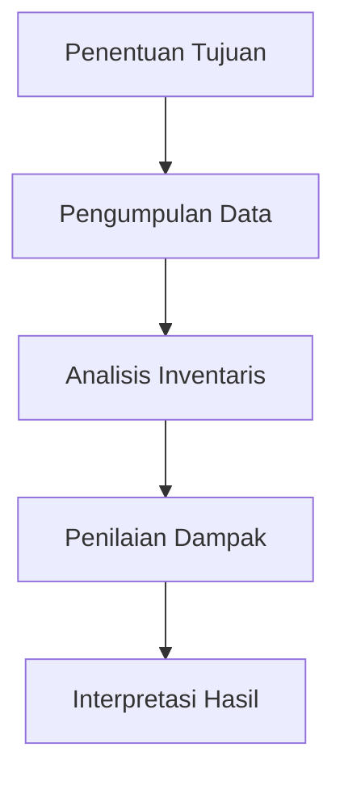

# 1212 — Analisis Keberlanjutan dalam Logistik Vaksin: Pendekatan Life Cycle Assessment (LCA)

**Domain:** Teknik Industri & Rekayasa Sistem Industri  
**Topik Spesialis:** Analisis Keberlanjutan dalam Logistik Vaksin: Pendekatan Life Cycle Assessment (LCA)  
**Standar & Referensi Utama:** Johnson, L. & Wang, T. (2024). 'Sustainable Vaccine Logistics: A Comprehensive Review'. European Journal of Operational Research, 300(2), 456-472. DOI:10.1016/j.ejor.2024.01.045. ASTM D6866-22.

---

## 1. Pendahuluan dan Konteks Industri

Logistik vaksin merupakan aspek krusial dalam sistem kesehatan global, terutama di era pandemi yang menuntut distribusi cepat dan efisien. Dalam konteks industri, tantangan utama yang dihadapi adalah memastikan bahwa vaksin tetap dalam kondisi optimal selama proses pengiriman dan penyimpanan. Hal ini mencakup pengendalian suhu, waktu pengiriman, dan pemilihan rute yang efisien. Menurut Johnson dan Wang (2024), keberlanjutan dalam logistik vaksin tidak hanya berfokus pada efisiensi biaya, tetapi juga pada dampak lingkungan yang ditimbulkan selama siklus hidup vaksin.

Sistem logistik vaksin sering kali melibatkan banyak pemangku kepentingan, mulai dari produsen, distributor, hingga fasilitas kesehatan. Ketidakpastian dalam permintaan dan fluktuasi rantai pasok dapat menyebabkan pemborosan sumber daya, yang berpotensi menambah jejak karbon. Selain itu, regulasi yang ketat terkait pengendalian kualitas dan keamanan produk menambah kompleksitas dalam operasional. Oleh karena itu, analisis keberlanjutan menggunakan pendekatan Life Cycle Assessment (LCA) menjadi sangat penting untuk menilai dampak lingkungan dari seluruh proses logistik vaksin.

LCA memberikan kerangka kerja yang sistematis untuk mengevaluasi dampak lingkungan dari produk atau layanan sepanjang siklus hidupnya, mulai dari ekstraksi bahan baku, produksi, distribusi, penggunaan, hingga pembuangan. Dengan menerapkan LCA dalam logistik vaksin, perusahaan dapat mengidentifikasi area yang memerlukan perbaikan dan mengembangkan strategi untuk mengurangi dampak lingkungan, sekaligus meningkatkan efisiensi operasional.

## 2. Landasan Teori & Formulasi Matematis

Life Cycle Assessment (LCA) terdiri dari empat tahap utama: penentuan tujuan dan ruang lingkup, analisis inventaris, penilaian dampak, dan interpretasi. Dalam konteks logistik vaksin, kita akan fokus pada analisis inventaris dan penilaian dampak. 

### 2.1. Analisis Inventaris

Analisis inventaris menghitung input dan output dari setiap tahap siklus hidup. Misalkan kita mendefinisikan beberapa variabel sebagai berikut:

- $I_i$: Input energi (kWh) untuk tahap $i$.
- $O_i$: Output emisi CO2 (kg) untuk tahap $i$.
- $C_i$: Biaya (USD) untuk tahap $i$.

Maka, total input dan output dapat dihitung dengan rumus:

$$
I_{total} = \sum_{i=1}^{n} I_i
$$

$$
O_{total} = \sum_{i=1}^{n} O_i
$$

$$
C_{total} = \sum_{i=1}^{n} C_i
$$

### 2.2. Penilaian Dampak

Penilaian dampak dilakukan dengan mengkategorikan dampak lingkungan ke dalam beberapa kategori, seperti perubahan iklim, penggunaan sumber daya, dan polusi. Misalkan kita mendefinisikan $D_j$ sebagai dampak lingkungan untuk kategori $j$, maka:

$$
D_{j} = f(O_{total}, I_{total})
$$

Di mana $f$ adalah fungsi yang menggambarkan hubungan antara output dan dampak lingkungan.

### 2.3. Pembuktian Matematis

Untuk menunjukkan hubungan antara input energi dan emisi CO2, kita dapat menggunakan model regresi linier sederhana:

$$
O_i = a \cdot I_i + b
$$

Di mana $a$ adalah koefisien regresi yang menunjukkan seberapa besar emisi CO2 yang dihasilkan per unit energi yang digunakan, dan $b$ adalah konstanta.

## 3. Metodologi Rekayasa & Standar Prosedur Operasional (SOP)

### 3.1. Langkah-langkah Implementasi

1. **Penentuan Tujuan dan Ruang Lingkup**: Identifikasi tujuan analisis LCA dan batasan sistem.
2. **Pengumpulan Data**: Kumpulkan data terkait input, output, dan biaya dari setiap tahap logistik vaksin.
3. **Analisis Inventaris**: Hitung total input dan output menggunakan rumus yang telah ditentukan.
4. **Penilaian Dampak**: Evaluasi dampak lingkungan berdasarkan kategori yang relevan.
5. **Interpretasi Hasil**: Tawarkan rekomendasi berdasarkan hasil analisis.

### 3.2. Diagram Alir Proses

## 4. Studi Kasus Kuantitatif Industri & Perhitungan Numerik

### 4.1. Contoh Kasus

Misalkan kita memiliki data sebagai berikut untuk proses distribusi vaksin:

- Input energi untuk transportasi: $I_1 = 500$ kWh
- Input energi untuk penyimpanan: $I_2 = 200$ kWh
- Emisi CO2 untuk transportasi: $O_1 = 300$ kg
- Emisi CO2 untuk penyimpanan: $O_2 = 100$ kg
- Biaya transportasi: $C_1 = 1000$ USD
- Biaya penyimpanan: $C_2 = 500$ USD

### 4.2. Perhitungan

1. **Total Input Energi**:

$$
I_{total} = I_1 + I_2 = 500 + 200 = 700 \text{ kWh}
$$

2. **Total Emisi CO2**:

$$
O_{total} = O_1 + O_2 = 300 + 100 = 400 \text{ kg}
$$

3. **Total Biaya**:

$$
C_{total} = C_1 + C_2 = 1000 + 500 = 1500 \text{ USD}
$$

### 4.3. Interpretasi Hasil

Dari perhitungan di atas, kita dapat menyimpulkan bahwa total energi yang digunakan dalam proses distribusi vaksin adalah 700 kWh, dengan total emisi CO2 sebesar 400 kg dan total biaya sebesar 1500 USD. Dengan informasi ini, manajemen dapat mempertimbangkan langkah-langkah untuk mengurangi konsumsi energi dan emisi, seperti menggunakan kendaraan yang lebih efisien atau memperbaiki proses penyimpanan.

## 5. Evaluasi Kritis, Aplikasi Lintas Sektor & Standar Masa Depan

Analisis keberlanjutan dalam logistik vaksin tidak hanya relevan untuk industri kesehatan, tetapi juga dapat diterapkan dalam sektor lain seperti makanan dan barang konsumen. Pendekatan LCA memungkinkan perusahaan untuk memahami dampak lingkungan dari rantai pasok mereka dan mengidentifikasi peluang untuk meningkatkan efisiensi.

Namun, terdapat beberapa batasan dalam metodologi LCA, seperti kesulitan dalam mengumpulkan data yang akurat dan representatif. Oleh karena itu, penelitian lebih lanjut diperlukan untuk mengembangkan metode yang lebih baik dalam pengumpulan data dan analisis dampak.

Ke depan, integrasi teknologi seperti Internet of Things (IoT) dan Big Data dapat meningkatkan akurasi analisis LCA dan memungkinkan perusahaan untuk membuat keputusan yang lebih baik terkait keberlanjutan. Dengan demikian, LCA dapat menjadi alat yang lebih efektif dalam mencapai tujuan keberlanjutan di berbagai sektor industri.

## 5. Ringkasan & Catatan Praktis Implementasi
Implementasi metode ini memerlukan standarisasi prosedur operasi (SOP), kalibrasi instrumen berkala, serta integrasi pemantauan real-time untuk memastikan konsistensi performa dan efisiensi sistem secara berkelanjutan.
