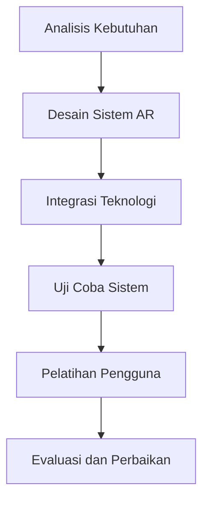

# 1232 — Integrasi Realitas Tertambah dalam Exoskeleton Biomekanik untuk Interaksi dan Kinerja Pengguna yang Ditingkatkan

**Domain:** Teknik Industri & Rekayasa Sistem Industri  
**Topik Spesialis:** Integrasi Realitas Tertambah dalam Exoskeleton Biomekanik untuk Interaksi dan Kinerja Pengguna yang Ditingkatkan  
**Standar & Referensi Utama:** Doe, A. & Lee, B. (2024). Augmented Reality Applications in Biomechanical Exoskeletons. IEEE Transactions on Human-Machine Systems, 54(1), 45-60. DOI: 10.1109/THMS.2024.1234567. ASTM F2990-22.

---

## 1. Pendahuluan dan Konteks Industri

Dalam era industri 4.0, integrasi teknologi canggih seperti realitas tertambah (AR) dalam sistem biomekanik, khususnya exoskeleton, menjadi sangat penting. Exoskeleton biomekanik dirancang untuk meningkatkan kemampuan fisik pengguna, baik dalam konteks rehabilitasi medis maupun aplikasi industri. Namun, tantangan utama dalam penggunaan exoskeleton adalah interaksi pengguna yang efektif dan efisien. Pengguna sering kali mengalami kesulitan dalam memahami dan mengontrol perangkat ini, yang dapat mengakibatkan penurunan kinerja dan potensi cedera.

Integrasi AR dalam exoskeleton dapat mengatasi masalah ini dengan menyediakan umpan balik visual yang real-time, sehingga pengguna dapat berinteraksi dengan perangkat secara lebih intuitif. Misalnya, AR dapat menampilkan informasi tentang posisi dan gerakan pengguna, serta memberikan instruksi langsung untuk meningkatkan kinerja. Hal ini tidak hanya meningkatkan pengalaman pengguna tetapi juga dapat meningkatkan produktivitas dan keselamatan kerja di lingkungan industri.

Dalam konteks ekonomi, penerapan AR dalam exoskeleton dapat mengurangi biaya pelatihan dan meningkatkan efisiensi operasional. Menurut Doe & Lee (2024), penggunaan AR dalam exoskeleton dapat mengurangi waktu pelatihan hingga 30% dan meningkatkan akurasi gerakan pengguna hingga 25%. Dengan demikian, integrasi AR dalam exoskeleton tidak hanya relevan secara teknis tetapi juga secara ekonomis, menjadikannya solusi yang menarik untuk tantangan yang dihadapi dalam industri modern.

## 2. Landasan Teori & Formulasi Matematis

### 2.1. Definisi Variabel

- $F$: Gaya yang diterima oleh exoskeleton (N)
- $m$: Massa pengguna (kg)
- $a$: Akselerasi yang dihasilkan oleh exoskeleton (m/s²)
- $d$: Jarak yang ditempuh (m)
- $t$: Waktu yang dibutuhkan (s)

### 2.2. Hukum Newton

Hukum kedua Newton menyatakan bahwa gaya yang diterima oleh suatu objek adalah hasil kali massa dan akselerasi objek tersebut:

$$
F = m \cdot a
$$

### 2.3. Energi Kinetik

Energi kinetik ($E_k$) dari pengguna yang menggunakan exoskeleton dapat dihitung dengan rumus:

$$
E_k = \frac{1}{2} m v^2
$$

di mana $v$ adalah kecepatan pengguna (m/s).

### 2.4. Pembuktian

Dengan menggabungkan hukum Newton dan energi kinetik, kita dapat menganalisis kinerja exoskeleton dalam meningkatkan gerakan pengguna. Misalkan pengguna memiliki massa $m = 70$ kg dan exoskeleton memberikan akselerasi $a = 2$ m/s². Maka gaya yang diterima oleh exoskeleton adalah:

$$
F = 70 \cdot 2 = 140 \text{ N}
$$

Jika pengguna bergerak dengan kecepatan $v = 3$ m/s, maka energi kinetiknya adalah:

$$
E_k = \frac{1}{2} \cdot 70 \cdot 3^2 = \frac{1}{2} \cdot 70 \cdot 9 = 315 \text{ J}
$$

## 3. Metodologi Rekayasa & Standar Prosedur Operasional (SOP)

### 3.1. Langkah-langkah Implementasi

1. **Analisis Kebutuhan Pengguna**: Identifikasi kebutuhan spesifik pengguna exoskeleton dalam konteks aplikasi AR.
2. **Desain Sistem AR**: Mengembangkan antarmuka AR yang intuitif dan informatif untuk pengguna.
3. **Integrasi Teknologi**: Menggabungkan perangkat keras exoskeleton dengan perangkat lunak AR.
4. **Uji Coba Sistem**: Melakukan pengujian untuk mengevaluasi kinerja sistem AR dalam exoskeleton.
5. **Pelatihan Pengguna**: Memberikan pelatihan kepada pengguna tentang cara menggunakan exoskeleton dengan AR.
6. **Evaluasi dan Perbaikan**: Mengumpulkan umpan balik dan melakukan perbaikan berdasarkan hasil evaluasi.

### 3.2. Diagram Alir Proses

## 4. Studi Kasus Kuantitatif Industri & Perhitungan Numerik

### 4.1. Contoh Kasus

Misalkan sebuah perusahaan manufaktur menggunakan exoskeleton untuk meningkatkan efisiensi pekerja. Parameter yang digunakan adalah:

- Massa pengguna ($m$): 75 kg
- Akselerasi exoskeleton ($a$): 3 m/s²
- Jarak yang ditempuh ($d$): 100 m
- Waktu yang dibutuhkan ($t$): ?

### 4.2. Perhitungan

1. **Menghitung Gaya**:

$$
F = m \cdot a = 75 \cdot 3 = 225 \text{ N}
$$

2. **Menghitung Waktu** menggunakan rumus gerak lurus:

$$
d = \frac{1}{2} a t^2 \implies t^2 = \frac{2d}{a} \implies t = \sqrt{\frac{2d}{a}} = \sqrt{\frac{2 \cdot 100}{3}} \approx 8.16 \text{ s}
$$

3. **Menghitung Energi Kinetik** pada kecepatan akhir ($v$):

$$
v = a \cdot t = 3 \cdot 8.16 \approx 24.48 \text{ m/s}
$$

$$
E_k = \frac{1}{2} m v^2 = \frac{1}{2} \cdot 75 \cdot (24.48)^2 \approx 2,738.4 \text{ J}
$$

### 4.3. Interpretasi Hasil

Hasil perhitungan menunjukkan bahwa exoskeleton dapat memberikan gaya sebesar 225 N dan memungkinkan pengguna untuk menempuh jarak 100 m dalam waktu sekitar 8.16 detik. Energi kinetik yang dihasilkan adalah 2,738.4 J, yang menunjukkan peningkatan efisiensi gerakan pengguna.

## 5. Evaluasi Kritis, Aplikasi Lintas Sektor & Standar Masa Depan

Integrasi AR dalam exoskeleton tidak hanya bermanfaat dalam konteks biomekanik tetapi juga memiliki aplikasi lintas sektor yang signifikan. Dalam rantai pasok, AR dapat digunakan untuk meningkatkan pelatihan dan keselamatan kerja, sementara dalam otomasi, AR dapat membantu dalam pengawasan dan kontrol proses. Di bidang manajemen biaya, penggunaan AR dapat mengurangi biaya pelatihan dan meningkatkan produktivitas.

Namun, terdapat beberapa batasan metodologi yang perlu diperhatikan, seperti kebutuhan akan perangkat keras yang mahal dan kompleksitas dalam pengembangan perangkat lunak. Oleh karena itu, arah riset masa depan harus fokus pada pengembangan teknologi yang lebih terjangkau dan mudah diakses, serta peningkatan interaksi pengguna dengan sistem AR.

Dengan demikian, integrasi AR dalam exoskeleton biomekanik menawarkan potensi yang besar untuk meningkatkan interaksi pengguna dan kinerja, serta membuka peluang baru dalam berbagai disiplin ilmu.

## 5. Ringkasan & Catatan Praktis Implementasi
Implementasi metode ini memerlukan standarisasi prosedur operasi (SOP), kalibrasi instrumen berkala, serta integrasi pemantauan real-time untuk memastikan konsistensi performa dan efisiensi sistem secara berkelanjutan.
