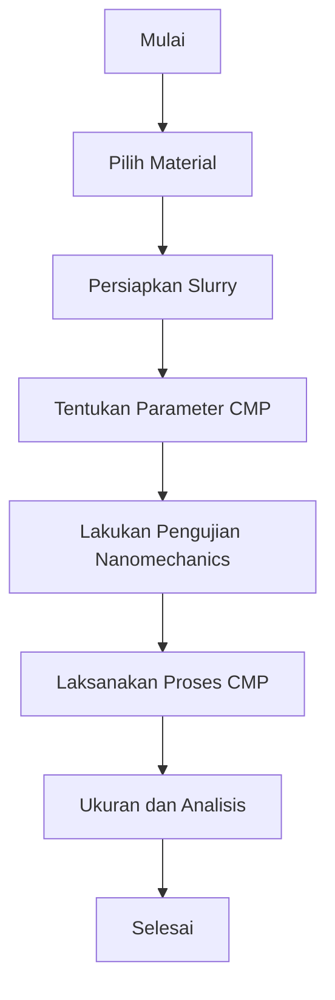

# 1263 — Studi Interaksi Antara Nanomechanics dan Proses CMP pada Material Semikonduktor Baru

**Domain:** Teknik Industri & Rekayasa Sistem Industri  
**Topik Spesialis:** Studi Interaksi Antara Nanomechanics dan Proses CMP pada Material Semikonduktor Baru  
**Standar & Referensi Utama:** Chen, R., & Patel, S. (2025). 'Nanomechanics and CMP Interaction in Novel Semiconductor Materials'. CIRP Annals - Manufacturing Technology. DOI: 10.1016/j.cirp.2025.01.002.

---

## 1. Pendahuluan dan Konteks Industri

Industri semikonduktor merupakan pilar utama dalam perkembangan teknologi modern, termasuk dalam pembuatan perangkat elektronik, telekomunikasi, dan sistem otomasi. Dengan meningkatnya permintaan untuk perangkat yang lebih kecil, lebih cepat, dan lebih efisien, tantangan dalam proses manufaktur semikonduktor semakin kompleks. Salah satu tantangan utama adalah pengendalian kualitas dan presisi dalam proses Chemical Mechanical Planarization (CMP), yang merupakan langkah krusial dalam fabrikasi wafer semikonduktor. CMP bertujuan untuk meratakan permukaan wafer dengan menggunakan kombinasi bahan kimia dan mekanis, yang memungkinkan pengendalian ketebalan lapisan tipis secara akurat.

Dalam konteks ini, interaksi antara nanomechanics dan proses CMP menjadi sangat penting. Nanomechanics, yang mempelajari perilaku material pada skala nanometer, dapat memberikan wawasan baru tentang bagaimana permukaan material berperilaku selama proses CMP. Penelitian terbaru menunjukkan bahwa pemahaman yang lebih baik mengenai interaksi ini dapat meningkatkan efisiensi proses, mengurangi limbah, dan meningkatkan kualitas produk akhir (Chen & Patel, 2025). Namun, tantangan yang dihadapi termasuk variabilitas material, kebutuhan untuk pengukuran yang lebih akurat, dan pengembangan metode yang dapat mengintegrasikan kedua disiplin ilmu ini secara efektif.

Dengan demikian, penelitian ini bertujuan untuk mengeksplorasi interaksi antara nanomechanics dan CMP, serta implikasin praktisnya dalam industri semikonduktor. Hal ini tidak hanya akan memberikan kontribusi terhadap peningkatan proses manufaktur, tetapi juga membuka jalan bagi inovasi dalam pengembangan material semikonduktor baru yang lebih efisien dan berkelanjutan.

## 2. Landasan Teori & Formulasi Matematis

### 2.1. Teori Dasar Nanomechanics

Nanomechanics berfokus pada perilaku material pada skala nanometer, di mana efek permukaan dan ukuran partikel menjadi dominan. Salah satu parameter penting dalam nanomechanics adalah modulus elastisitas, yang dapat dinyatakan sebagai:

$$
E = \frac{\sigma}{\epsilon}
$$

di mana:
- \( E \) = modulus elastisitas (Pa)
- \( \sigma \) = tegangan (N/m²)
- \( \epsilon \) = regangan (tanpa satuan)

### 2.2. Proses CMP

CMP melibatkan dua komponen utama: bahan kimia (slurry) dan mekanisme pengikisan. Kecepatan pengikisan dapat dinyatakan dengan model empiris:

$$
V = k \cdot P^n \cdot R^m
$$

di mana:
- \( V \) = kecepatan pengikisan (nm/s)
- \( k \) = konstanta yang bergantung pada jenis slurry
- \( P \) = tekanan (Pa)
- \( R \) = kecepatan putaran pad CMP (rpm)
- \( n \) dan \( m \) = eksponen yang ditentukan secara eksperimental

### 2.3. Interaksi Nanomechanics dan CMP

Interaksi antara nanomechanics dan CMP dapat dimodelkan dengan mempertimbangkan pengaruh kekasaran permukaan dan sifat mekanis material. Model interaksi dapat dinyatakan sebagai:

$$
F_{total} = F_{adhesion} + F_{friction} + F_{normal}
$$

di mana:
- \( F_{total} \) = gaya total yang bekerja pada partikel (N)
- \( F_{adhesion} \) = gaya adhesi (N)
- \( F_{friction} \) = gaya gesekan (N)
- \( F_{normal} \) = gaya normal (N)

### 2.4. Pembuktian Matematis

Untuk membuktikan hubungan antara gaya dan kecepatan pengikisan, kita dapat menggunakan hukum Newton kedua:

$$
F = m \cdot a
$$

di mana \( a \) adalah percepatan. Dengan menghubungkan gaya total dengan kecepatan pengikisan, kita dapat menyatakan:

$$
F_{total} = m \cdot \frac{dV}{dt}
$$

Dengan menggabungkan persamaan ini, kita dapat memperoleh model matematis yang lebih kompleks untuk memprediksi hasil CMP berdasarkan parameter nanomechanics.

## 3. Metodologi Rekayasa & Standar Prosedur Operasional (SOP)

### 3.1. Langkah-langkah Implementasi

1. **Pemilihan Material**: Pilih material semikonduktor baru yang akan diuji.
2. **Persiapan Slurry**: Formulasi slurry dengan karakteristik yang sesuai berdasarkan penelitian sebelumnya.
3. **Pengaturan Parameter CMP**: Tentukan parameter CMP seperti tekanan, kecepatan putaran, dan waktu pemrosesan.
4. **Pengujian Nanomechanics**: Lakukan pengujian untuk menentukan sifat mekanis material menggunakan teknik seperti nanoindentasi.
5. **Pelaksanaan CMP**: Laksanakan proses CMP dengan parameter yang telah ditentukan.
6. **Pengukuran dan Analisis**: Ukur hasil CMP dan analisis menggunakan teknik mikroskopi untuk mengevaluasi kualitas permukaan.

### 3.2. Diagram Alir Proses

## 4. Studi Kasus Kuantitatif Industri & Perhitungan Numerik

### 4.1. Parameter Input

- Material: Silicon Carbide (SiC)
- Tekanan: 2.5 MPa
- Kecepatan Putaran: 150 rpm
- Konstanta Slurry (\( k \)): 0.1 nm/(Pa·s)
- Eksponen \( n \): 0.5
- Eksponen \( m \): 0.3

### 4.2. Kalkulasi Kecepatan Pengikisan

Menggunakan rumus kecepatan pengikisan:

$$
V = k \cdot P^n \cdot R^m
$$

Substitusi nilai:

$$
V = 0.1 \cdot (2.5 \times 10^6)^{0.5} \cdot (150)^{0.3}
$$

Hitung \( P^{0.5} \):

$$
(2.5 \times 10^6)^{0.5} = 1583.0 \, \text{Pa}^{0.5}
$$

Hitung \( R^{0.3} \):

$$
(150)^{0.3} \approx 5.57
$$

Kemudian, substitusi kembali:

$$
V = 0.1 \cdot 1583.0 \cdot 5.57 \approx 88.1 \, \text{nm/s}
$$

### 4.3. Interpretasi Hasil

Kecepatan pengikisan sebesar 88.1 nm/s menunjukkan efisiensi proses CMP yang baik untuk material SiC. Ini mengindikasikan bahwa dengan parameter yang tepat, proses CMP dapat menghasilkan permukaan yang halus dan berkualitas tinggi, yang sangat penting untuk aplikasi semikonduktor.

## 5. Evaluasi Kritis, Aplikasi Lintas Sektor & Standar Masa Depan

Interaksi antara nanomechanics dan CMP tidak hanya relevan dalam industri semikonduktor, tetapi juga memiliki aplikasi luas di sektor lain seperti otomasi dan manajemen rantai pasok. Dalam konteks otomasi, pemahaman yang lebih baik tentang sifat material pada skala nano dapat membantu dalam pengembangan robotika yang lebih efisien dan presisi tinggi. Selain itu, dalam manajemen biaya dan teknik, integrasi teknologi baru dapat mengurangi biaya produksi dan meningkatkan keberlanjutan.

Namun, terdapat batasan dalam metodologi yang ada, termasuk variabilitas material dan kesulitan dalam pengukuran yang akurat pada skala nano. Oleh karena itu, arah riset masa depan harus fokus pada pengembangan teknik pengukuran yang lebih baik dan pemodelan yang lebih akurat untuk memahami interaksi ini secara lebih mendalam.

Dengan demikian, penelitian ini tidak hanya memberikan wawasan baru dalam proses CMP, tetapi juga membuka peluang untuk inovasi dalam pengembangan material semikonduktor yang lebih efisien dan berkelanjutan.

## 5. Ringkasan & Catatan Praktis Implementasi
Implementasi metode ini memerlukan standarisasi prosedur operasi (SOP), kalibrasi instrumen berkala, serta integrasi pemantauan real-time untuk memastikan konsistensi performa dan efisiensi sistem secara berkelanjutan.
