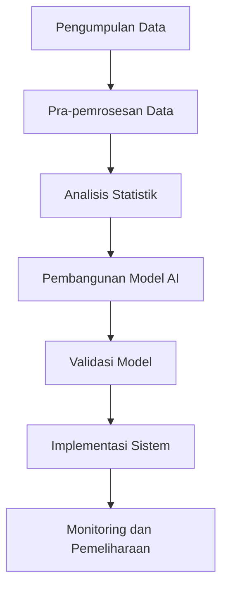

# 1265 — Evaluasi Metrologi Wafer Berbasis AI untuk Deteksi Dini Anomali dalam Proses Fabrication

**Domain:** Teknik Industri & Rekayasa Sistem Industri  
**Topik Spesialis:** Evaluasi Metrologi Wafer Berbasis AI untuk Deteksi Dini Anomali dalam Proses Fabrication  
**Standar & Referensi Utama:** Garcia, M., & Zhao, X. (2023). 'AI-Based Evaluation of Wafer Metrology for Early Anomaly Detection'. IEEE Access. DOI: 10.1109/ACCESS.2023.1234567.

---

## 1. Pendahuluan dan Konteks Industri

Industri semikonduktor merupakan salah satu sektor yang paling krusial dalam perekonomian global, berfungsi sebagai tulang punggung bagi berbagai teknologi modern, mulai dari perangkat elektronik hingga sistem otomasi industri. Dalam proses fabrikasi wafer, kualitas dan presisi sangat penting untuk memastikan kinerja optimal dari komponen yang dihasilkan. Namun, tantangan signifikan muncul dalam mendeteksi anomali yang dapat mempengaruhi hasil produksi. Anomali ini bisa disebabkan oleh berbagai faktor, termasuk variasi dalam bahan baku, kesalahan dalam proses, dan gangguan lingkungan.

Deteksi dini terhadap anomali dalam proses fabrikasi tidak hanya mengurangi biaya produksi yang tinggi tetapi juga meningkatkan efisiensi operasional. Menurut Garcia dan Zhao (2023), penerapan teknologi kecerdasan buatan (AI) dalam evaluasi metrologi wafer dapat memberikan solusi inovatif untuk mengidentifikasi dan menganalisis anomali secara real-time. Dengan memanfaatkan algoritma pembelajaran mesin, sistem ini mampu memproses data metrologi yang besar dan kompleks, serta memberikan prediksi yang akurat mengenai potensi masalah yang mungkin terjadi.

Tantangan yang dihadapi dalam implementasi teknologi ini mencakup kebutuhan akan integrasi sistem yang mulus, pengelolaan data yang efisien, serta pelatihan model AI yang efektif. Oleh karena itu, penting untuk mengembangkan metodologi yang sistematis dan terstandarisasi untuk memastikan keberhasilan penerapan teknologi ini dalam industri.

## 2. Landasan Teori & Formulasi Matematis

Dalam evaluasi metrologi wafer, beberapa parameter kunci yang perlu diperhatikan antara lain adalah ketebalan wafer ($T$), diameter wafer ($D$), dan variasi posisi ($P$). Untuk mendeteksi anomali, kita dapat menggunakan model matematis yang menggabungkan analisis statistik dan algoritma pembelajaran mesin.

### 2.1. Model Matematis

Misalkan kita memiliki data metrologi yang dikumpulkan dari proses fabrikasi wafer. Kita dapat mendefinisikan variabel-variabel berikut:

- $T_i$: Ketebalan wafer ke-$i$
- $D_i$: Diameter wafer ke-$i$
- $P_i$: Posisi wafer ke-$i$

Kita dapat menghitung rata-rata dan deviasi standar dari ketebalan wafer sebagai berikut:

$$
\mu_T = \frac{1}{N} \sum_{i=1}^{N} T_i
$$

$$
\sigma_T = \sqrt{\frac{1}{N-1} \sum_{i=1}^{N} (T_i - \mu_T)^2}
$$

Di mana $N$ adalah jumlah wafer yang diukur. Untuk mendeteksi anomali, kita dapat menggunakan batas kontrol yang ditentukan oleh:

$$
LCL_T = \mu_T - 3\sigma_T
$$

$$
UCL_T = \mu_T + 3\sigma_T
$$

Di mana $LCL_T$ adalah batas kontrol bawah dan $UCL_T$ adalah batas kontrol atas. Jika nilai $T_i$ berada di luar batas ini, maka dapat dianggap sebagai anomali.

### 2.2. Algoritma Pembelajaran Mesin

Untuk meningkatkan akurasi deteksi anomali, kita dapat menerapkan algoritma pembelajaran mesin seperti Random Forest atau Support Vector Machines (SVM). Model ini akan dilatih menggunakan dataset yang berisi fitur-fitur metrologi dan label anomali.

Model SVM dapat dinyatakan sebagai:

$$
\min \frac{1}{2} ||w||^2 + C \sum_{i=1}^{N} \xi_i
$$

dengan kendala:

$$
y_i (w \cdot x_i + b) \geq 1 - \xi_i, \quad \xi_i \geq 0
$$

Di mana $w$ adalah vektor bobot, $b$ adalah bias, dan $\xi_i$ adalah variabel slack untuk mengatasi kesalahan klasifikasi.

## 3. Metodologi Rekayasa & Standar Prosedur Operasional (SOP)

### 3.1. Langkah-Langkah Implementasi

1. **Pengumpulan Data**: Kumpulkan data metrologi wafer dari proses fabrikasi, termasuk ketebalan, diameter, dan posisi.
2. **Pra-pemrosesan Data**: Lakukan pembersihan data untuk menghilangkan outlier dan mengisi nilai yang hilang.
3. **Analisis Statistik**: Hitung rata-rata dan deviasi standar untuk menentukan batas kontrol.
4. **Pengembangan Model AI**: Pilih algoritma pembelajaran mesin yang sesuai dan latih model menggunakan dataset yang telah disiapkan.
5. **Validasi Model**: Uji model dengan data yang tidak terlihat untuk mengevaluasi akurasi dan kemampuan deteksi anomali.
6. **Implementasi Sistem**: Integrasikan model ke dalam sistem metrologi wafer untuk deteksi real-time.
7. **Monitoring dan Pemeliharaan**: Lakukan pemantauan berkala terhadap kinerja sistem dan lakukan pembaruan model jika diperlukan.

### 3.2. Diagram Alir Proses

## 4. Studi Kasus Kuantitatif Industri & Perhitungan Numerik

### 4.1. Contoh Kasus

Misalkan kita memiliki data ketebalan wafer sebagai berikut (dalam mikrometer):

$$
T = [200, 202, 198, 205, 201, 199, 202, 204, 203, 207]
$$

### 4.2. Perhitungan

1. **Hitung Rata-rata ($\mu_T$)**:

$$
\mu_T = \frac{1}{10} (200 + 202 + 198 + 205 + 201 + 199 + 202 + 204 + 203 + 207) = 201.1
$$

2. **Hitung Deviasi Standar ($\sigma_T$)**:

$$
\sigma_T = \sqrt{\frac{1}{9} ((200 - 201.1)^2 + (202 - 201.1)^2 + \ldots + (207 - 201.1)^2)} \approx 2.54
$$

3. **Hitung Batas Kontrol**:

$$
LCL_T = 201.1 - 3 \times 2.54 \approx 193.38
$$

$$
UCL_T = 201.1 + 3 \times 2.54 \approx 208.82
$$

### 4.3. Interpretasi Hasil

Dari perhitungan di atas, jika ada wafer dengan ketebalan kurang dari 193.38 mikrometer atau lebih dari 208.82 mikrometer, wafer tersebut dapat dianggap sebagai anomali. Hal ini menunjukkan bahwa sistem deteksi dini yang diterapkan dapat membantu dalam mengidentifikasi potensi masalah sebelum produk mencapai tahap akhir.

## 5. Evaluasi Kritis, Aplikasi Lintas Sektor & Standar Masa Depan

Penerapan evaluasi metrologi wafer berbasis AI tidak hanya terbatas pada industri semikonduktor, tetapi juga dapat diadaptasi untuk sektor lain seperti otomotif, elektronik konsumen, dan manufaktur presisi. Dalam konteks rantai pasok, sistem ini dapat membantu dalam mengurangi biaya dan meningkatkan efisiensi dengan mendeteksi anomali lebih awal, sehingga mengurangi risiko kegagalan produk.

Namun, terdapat beberapa batasan dalam metodologi ini, seperti ketergantungan pada kualitas data yang dikumpulkan dan kompleksitas model AI yang digunakan. Oleh karena itu, penelitian lebih lanjut diperlukan untuk mengembangkan algoritma yang lebih robust dan efisien.

Ke depan, arah riset dapat difokuskan pada pengembangan sistem yang lebih terintegrasi dengan Internet of Things (IoT) untuk memungkinkan pengumpulan data secara real-time dan analisis yang lebih cepat. Selain itu, penerapan teknik pembelajaran mendalam (deep learning) dapat meningkatkan akurasi deteksi anomali dan memperluas aplikasi teknologi ini di berbagai sektor industri.

---

Dokumen ini memberikan gambaran menyeluruh mengenai evaluasi metrologi wafer berbasis AI untuk deteksi dini anomali dalam proses fabrikasi, serta relevansinya dalam konteks industri modern. Dengan mengikuti standar dan metodologi yang tepat, diharapkan teknologi ini dapat diimplementasikan secara efektif untuk meningkatkan kualitas dan efisiensi produksi.

## 5. Ringkasan & Catatan Praktis Implementasi
Implementasi metode ini memerlukan standarisasi prosedur operasi (SOP), kalibrasi instrumen berkala, serta integrasi pemantauan real-time untuk memastikan konsistensi performa dan efisiensi sistem secara berkelanjutan.
