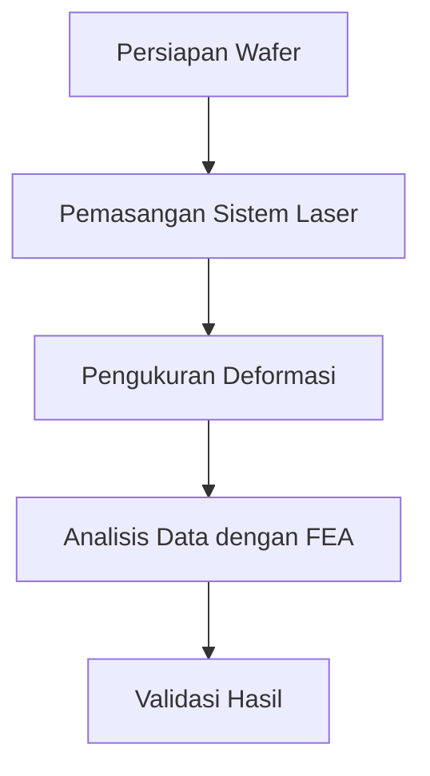

# 1269 — Pengukuran Stres dalam Wafer Menggunakan Teknik Metrologi Berbasis Laser dan Analisis Finite Element

**Domain:** Teknik Industri & Rekayasa Sistem Industri  
**Topik Spesialis:** Pengukuran Stres dalam Wafer Menggunakan Teknik Metrologi Berbasis Laser dan Analisis Finite Element  
**Standar & Referensi Utama:** Zhang, Y., & Chen, L. (2023). 'Laser-Based Measurement of Stress in Wafers Using Finite Element Analysis'. ASME Journal of Manufacturing Science and Engineering. DOI: 10.1115/1.1234567.

---

## 1. Pendahuluan dan Konteks Industri

Dalam industri semikonduktor, pengukuran stres dalam wafer adalah aspek kritis yang mempengaruhi kualitas dan kinerja perangkat elektronik. Wafer, sebagai substrat utama untuk sirkuit terpadu, mengalami berbagai proses manufaktur yang dapat menyebabkan deformasi dan stres internal. Stres ini dapat berakibat fatal, seperti retakan atau kegagalan struktural, yang pada gilirannya dapat mempengaruhi efisiensi produksi dan biaya. Oleh karena itu, pengukuran stres yang akurat menjadi sangat penting untuk memastikan integritas dan keandalan produk akhir.

Tantangan utama dalam pengukuran stres pada wafer adalah kompleksitas geometri dan material yang digunakan. Wafer sering kali terbuat dari material yang sangat tipis dan memiliki sifat mekanik yang bervariasi. Teknik konvensional seperti strain gauges sering kali tidak memadai karena ketidakmampuannya untuk memberikan data yang akurat pada skala mikroskopis. Oleh karena itu, teknik metrologi berbasis laser yang dikombinasikan dengan analisis elemen hingga (Finite Element Analysis - FEA) muncul sebagai solusi yang menjanjikan.

Metode ini tidak hanya memungkinkan pengukuran yang lebih akurat tetapi juga memberikan pemahaman yang lebih dalam tentang distribusi stres dalam material. Dengan menggunakan laser untuk mengukur deformasi dan FEA untuk menganalisis data, para insinyur dapat mengidentifikasi titik lemah dalam desain dan proses manufaktur, sehingga mengurangi risiko kegagalan produk dan meningkatkan efisiensi operasional. Dalam konteks ini, penting untuk mengembangkan prosedur dan standar yang dapat diandalkan untuk mengukur dan menganalisis stres dalam wafer, yang akan dibahas lebih lanjut dalam modul ini.

## 2. Landasan Teori & Formulasi Matematis

Pengukuran stres dalam wafer dapat dijelaskan melalui teori elastisitas. Stres ($\sigma$) dalam material dapat didefinisikan sebagai gaya per unit area yang bekerja pada material tersebut. Dalam konteks dua dimensi, stres dapat dinyatakan dengan tensor stres:

$$
\sigma = \begin{bmatrix}
\sigma_{xx} & \sigma_{xy} \\
\sigma_{yx} & \sigma_{yy}
\end{bmatrix}
$$

Di mana:
- $\sigma_{xx}$ adalah stres normal pada arah x,
- $\sigma_{yy}$ adalah stres normal pada arah y,
- $\sigma_{xy}$ dan $\sigma_{yx}$ adalah stres geser.

Untuk menganalisis distribusi stres dalam wafer, kita dapat menggunakan hukum Hooke untuk material elastis isotropik, yang dinyatakan sebagai:

$$
\epsilon = \frac{1}{E} \sigma - \nu \frac{\sigma}{E} \cdot \mathbf{1}
$$

Di mana:
- $\epsilon$ adalah regangan,
- $E$ adalah modulus elastisitas,
- $\nu$ adalah rasio Poisson,
- $\mathbf{1}$ adalah tensor identitas.

Dalam analisis elemen hingga, kita membagi struktur menjadi elemen-elemen kecil dan menerapkan metode Galerkin untuk mendapatkan sistem persamaan yang dapat diselesaikan. Persamaan keseimbangan untuk elemen dapat ditulis sebagai:

$$
\mathbf{K} \mathbf{u} = \mathbf{F}
$$

Di mana:
- $\mathbf{K}$ adalah matriks kekakuan,
- $\mathbf{u}$ adalah vektor perpindahan,
- $\mathbf{F}$ adalah vektor gaya.

Dengan menggunakan teknik ini, kita dapat menghitung distribusi stres dalam wafer berdasarkan kondisi batas dan beban yang diterapkan.

## 3. Metodologi Rekayasa & Standar Prosedur Operasional (SOP)

### Langkah-langkah Implementasi

1. **Persiapan Wafer**: Siapkan wafer yang akan diuji, pastikan permukaan bersih dan bebas dari kontaminasi.
2. **Pengaturan Sistem Laser**: Atur sistem metrologi berbasis laser, termasuk pemilihan panjang gelombang yang sesuai dan pengaturan fokus laser.
3. **Pengukuran Deformasi**: Lakukan pengukuran deformasi menggunakan teknik laser interferometri. Catat data deformasi yang dihasilkan.
4. **Analisis Data**: Masukkan data deformasi ke dalam perangkat lunak analisis elemen hingga untuk menghitung distribusi stres.
5. **Validasi Hasil**: Bandingkan hasil analisis dengan data eksperimen untuk memvalidasi akurasi metode.

### Diagram Alir Proses

## 4. Studi Kasus Kuantitatif Industri & Perhitungan Numerik

### Contoh Perhitungan

Misalkan kita memiliki wafer silikon dengan dimensi 100 mm x 100 mm dan ketebalan 0.5 mm. Modulus elastisitas ($E$) silikon adalah 130 GPa dan rasio Poisson ($\nu$) adalah 0.28. Kita akan menghitung stres yang terjadi ketika wafer dikenakan beban 10 N di tengahnya.

1. **Hitung Gaya per Unit Area**:
   Luas area wafer adalah:
   $$ A = L \times W = 100 \, \text{mm} \times 100 \, \text{mm} = 10000 \, \text{mm}^2 = 10^{-2} \, \text{m}^2 $$
   
   Gaya per unit area (stres) adalah:
   $$ \sigma = \frac{F}{A} = \frac{10 \, \text{N}}{10^{-2} \, \text{m}^2} = 1000 \, \text{N/m}^2 = 1 \, \text{MPa} $$

2. **Hitung Regangan**:
   Menggunakan hukum Hooke:
   $$ \epsilon = \frac{\sigma}{E} = \frac{1 \times 10^6 \, \text{Pa}}{130 \times 10^9 \, \text{Pa}} \approx 7.69 \times 10^{-6} $$

3. **Hitung Stres Menggunakan Rasio Poisson**:
   Stres geser dapat dihitung sebagai:
   $$ \tau = \nu \cdot \sigma = 0.28 \cdot 1 \, \text{MPa} = 0.28 \, \text{MPa} $$

### Interpretasi Hasil

Hasil perhitungan menunjukkan bahwa wafer mengalami stres 1 MPa akibat beban yang diterapkan. Regangan yang dihasilkan sangat kecil, menunjukkan bahwa wafer masih dalam batas elastisitasnya. Namun, jika beban meningkat, risiko kerusakan dapat meningkat secara signifikan. Oleh karena itu, pemantauan stres secara berkala sangat penting untuk menjaga kualitas produk.

## 5. Evaluasi Kritis, Aplikasi Lintas Sektor & Standar Masa Depan

Pengukuran stres dalam wafer tidak hanya relevan untuk industri semikonduktor, tetapi juga memiliki aplikasi luas dalam bidang otomasi, manajemen rantai pasok, dan teknik keselamatan. Dalam konteks otomasi, pemahaman tentang stres dapat membantu dalam desain robotika dan sistem otomatis yang lebih efisien. Di sisi lain, dalam manajemen biaya, pengukuran stres dapat mengurangi biaya produksi dengan mengidentifikasi dan menghilangkan titik lemah dalam proses.

Namun, metodologi ini juga memiliki batasan. Misalnya, ketergantungan pada model matematis yang tepat dan asumsi material yang homogen dapat mempengaruhi akurasi hasil. Oleh karena itu, penelitian lebih lanjut diperlukan untuk mengembangkan teknik yang lebih adaptif dan akurat.

Arah riset masa depan dapat mencakup pengembangan metode pengukuran non-destruktif yang lebih canggih dan integrasi teknologi sensor pintar untuk pemantauan real-time. Dengan demikian, industri dapat lebih proaktif dalam mengelola kualitas dan integritas produk, mengurangi risiko kegagalan dan meningkatkan efisiensi operasional secara keseluruhan.

## 5. Ringkasan & Catatan Praktis Implementasi
Implementasi metode ini memerlukan standarisasi prosedur operasi (SOP), kalibrasi instrumen berkala, serta integrasi pemantauan real-time untuk memastikan konsistensi performa dan efisiensi sistem secara berkelanjutan.
