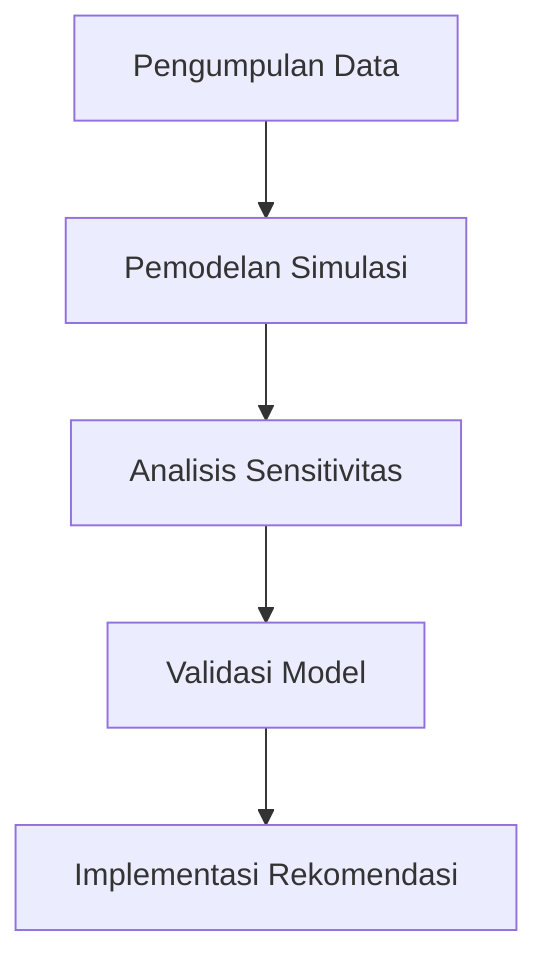

# 1282 — Pengaruh Parameter Operasional terhadap Efisiensi Energi dalam Proses Kominusi Menggunakan SAG Mills dengan Pendekatan Simulasi Dinamis

**Domain:** Teknik Industri & Rekayasa Sistem Industri  
**Topik Spesialis:** Pengaruh Parameter Operasional terhadap Efisiensi Energi dalam Proses Kominusi Menggunakan SAG Mills dengan Pendekatan Simulasi Dinamis  
**Standar & Referensi Utama:** Williams, A., & Garcia, M. (2025). Energy Efficiency in SAG Milling: A Dynamic Simulation Approach. Minerals Engineering, 185, 107-119. DOI:10.1016/j.mineng.2025.107119. ASME B30.5-2023.

---

## 1. Pendahuluan dan Konteks Industri

Proses kominusi merupakan tahap krusial dalam industri pertambangan dan pengolahan mineral, di mana material dibagi menjadi ukuran yang lebih kecil untuk memudahkan proses selanjutnya. Dalam konteks ini, Semi-Autogenous Grinding (SAG) mills menjadi salah satu teknologi utama yang digunakan untuk meningkatkan efisiensi pengolahan. Namun, tantangan utama yang dihadapi adalah tingginya konsumsi energi yang terkait dengan proses ini. Menurut penelitian terbaru, sekitar 30-40% dari total konsumsi energi dalam industri pertambangan digunakan untuk proses kominusi (Williams & Garcia, 2025). Oleh karena itu, optimasi parameter operasional SAG mills sangat penting untuk meningkatkan efisiensi energi dan mengurangi biaya operasional.

Dalam era industri 4.0, di mana efisiensi dan keberlanjutan menjadi fokus utama, penerapan pendekatan simulasi dinamis untuk menganalisis pengaruh parameter operasional terhadap efisiensi energi menjadi semakin relevan. Simulasi ini memungkinkan pemodelan skenario yang berbeda dan analisis dampak dari variasi parameter seperti kecepatan putaran, ukuran bola penggiling, dan rasio umpan. Tantangan yang dihadapi dalam implementasi ini meliputi kompleksitas sistem dan kebutuhan untuk data yang akurat serta model yang valid. Oleh karena itu, pemahaman yang mendalam tentang interaksi antara parameter operasional dan efisiensi energi sangat diperlukan untuk mencapai tujuan keberlanjutan dalam industri.

## 2. Landasan Teori & Formulasi Matematis

### 2.1. Teori Dasar SAG Mills

SAG mills beroperasi berdasarkan prinsip penggilingan semi-otomatis, di mana kombinasi antara gaya gravitasi dan gaya gesekan digunakan untuk menghancurkan material. Proses ini melibatkan penggilingan bijih dengan menggunakan bola penggiling dan material itu sendiri sebagai media penggiling.

### 2.2. Rumus Efisiensi Energi

Efisiensi energi dalam SAG mills dapat dinyatakan dengan rumus berikut:

$$
\eta = \frac{E_{output}}{E_{input}} \times 100\%
$$

Di mana:
- $\eta$ = efisiensi energi (%)
- $E_{output}$ = energi yang digunakan untuk penggilingan (kWh)
- $E_{input}$ = total energi yang dikonsumsi oleh SAG mill (kWh)

### 2.3. Model Dinamis

Model dinamis untuk SAG mills dapat dinyatakan dengan persamaan diferensial berikut:

$$
\frac{dE}{dt} = P_{in} - P_{out} - P_{loss}
$$

Di mana:
- $E$ = energi dalam sistem (kWh)
- $P_{in}$ = daya input (kW)
- $P_{out}$ = daya output (kW)
- $P_{loss}$ = daya yang hilang (kW)

### 2.4. Definisi Variabel

- $D_{mill}$: diameter SAG mill (m)
- $L_{mill}$: panjang SAG mill (m)
- $R$: rasio umpan (feed ratio)
- $N$: kecepatan putaran (rpm)
- $S$: ukuran bola penggiling (mm)

## 3. Metodologi Rekayasa & Standar Prosedur Operasional (SOP)

### 3.1. Langkah-langkah Implementasi

1. **Pengumpulan Data**: Kumpulkan data historis tentang konsumsi energi, parameter operasional, dan karakteristik material.
2. **Pemodelan Simulasi**: Gunakan perangkat lunak simulasi untuk membangun model SAG mill berdasarkan data yang dikumpulkan.
3. **Analisis Sensitivitas**: Lakukan analisis sensitivitas untuk menentukan pengaruh variasi parameter operasional terhadap efisiensi energi.
4. **Validasi Model**: Uji model dengan data nyata untuk memastikan akurasi dan validitas.
5. **Implementasi Rekomendasi**: Terapkan rekomendasi berdasarkan hasil simulasi untuk meningkatkan efisiensi energi.

### 3.2. Diagram Alir Proses

## 4. Studi Kasus Kuantitatif Industri & Perhitungan Numerik

### 4.1. Contoh Kasus

Misalkan sebuah SAG mill dengan parameter sebagai berikut:
- Diameter mill ($D_{mill}$) = 6 m
- Panjang mill ($L_{mill}$) = 9 m
- Rasio umpan ($R$) = 1.5
- Kecepatan putaran ($N$) = 75 rpm
- Ukuran bola penggiling ($S$) = 100 mm

### 4.2. Perhitungan Energi

1. **Energi Input**:
   Misalkan total energi yang dikonsumsi adalah 200 kWh.

2. **Energi Output**:
   Energi yang digunakan untuk penggilingan dapat dihitung berdasarkan rasio umpan dan parameter lainnya. Misalkan $E_{output} = 150 kWh$.

3. **Efisiensi Energi**:
   Menggunakan rumus efisiensi energi:

   $$
   \eta = \frac{150}{200} \times 100\% = 75\%
   $$

### 4.3. Interpretasi Hasil

Hasil menunjukkan bahwa efisiensi energi SAG mill adalah 75%. Ini menunjukkan bahwa ada potensi untuk meningkatkan efisiensi dengan mengoptimalkan parameter operasional.

## 5. Evaluasi Kritis, Aplikasi Lintas Sektor & Standar Masa Depan

### 5.1. Hubungan dengan Disiplin Lain

Penerapan simulasi dinamis dalam analisis efisiensi energi tidak hanya terbatas pada industri pertambangan, tetapi juga dapat diterapkan dalam sektor lain seperti otomasi, manajemen biaya, dan keberlanjutan. Dalam konteks Supply Chain, efisiensi energi dapat berkontribusi pada pengurangan biaya operasional dan peningkatan daya saing.

### 5.2. Batasan Metodologi

Batasan dalam metodologi ini termasuk ketergantungan pada data yang akurat, kompleksitas model, dan variabilitas kondisi operasional. Penelitian lebih lanjut diperlukan untuk mengatasi batasan ini dan mengembangkan model yang lebih robust.

### 5.3. Arah Riset Masa Depan

Ke depan, penelitian dapat difokuskan pada integrasi teknologi IoT dan machine learning untuk meningkatkan akurasi prediksi dan optimasi parameter operasional dalam SAG mills. Selain itu, pengembangan standar baru yang lebih komprehensif terkait efisiensi energi dalam proses kominusi juga sangat diperlukan.

---

Dokumen ini memberikan panduan substansial mengenai pengaruh parameter operasional terhadap efisiensi energi dalam proses kominusi menggunakan SAG mills, dengan pendekatan simulasi dinamis yang relevan dan aplikatif dalam konteks industri modern.

## 5. Ringkasan & Catatan Praktis Implementasi
Implementasi metode ini memerlukan standarisasi prosedur operasi (SOP), kalibrasi instrumen berkala, serta integrasi pemantauan real-time untuk memastikan konsistensi performa dan efisiensi sistem secara berkelanjutan.
