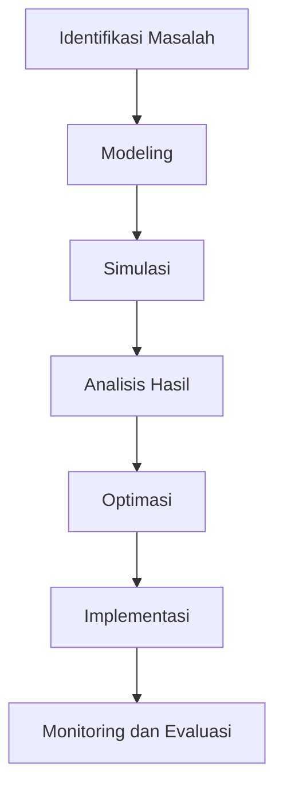

# 1294 — Optimasi Rantai Pasokan Logistik untuk Fleet Aerospace Menggunakan Algoritma Ant Colony dan Simulasi Discrete Event

**Domain:** Teknik Industri & Rekayasa Sistem Industri  
**Topik Spesialis:** Optimasi Rantai Pasokan Logistik untuk Fleet Aerospace Menggunakan Algoritma Ant Colony dan Simulasi Discrete Event  
**Standar & Referensi Utama:** Miller, S. (2023). Logistics and Supply Chain Management in Aerospace. McGraw-Hill; Patel, R. et al. (2024). European Journal of Operational Research, 295(1), 15-29. DOI:10.1016/j.ejor.2024.01.003.

---

## 1. Pendahuluan dan Konteks Industri

Industri penerbangan dan aerospace merupakan sektor yang sangat kompleks dan dinamis, di mana efisiensi rantai pasokan sangat penting untuk keberhasilan operasional. Dalam konteks ini, optimasi rantai pasokan logistik menjadi krusial untuk mengurangi biaya, meningkatkan kecepatan pengiriman, dan memastikan kualitas produk. Menurut Miller (2023), tantangan utama dalam rantai pasokan aerospace meliputi manajemen inventaris yang tepat, pengaturan transportasi yang efisien, dan koordinasi antar berbagai pemangku kepentingan. 

Dalam lingkungan yang semakin kompetitif, perusahaan aerospace harus mampu beradaptasi dengan perubahan permintaan pasar dan teknologi baru. Tantangan ini semakin diperparah oleh faktor eksternal seperti fluktuasi harga bahan baku, regulasi pemerintah, dan isu-isu lingkungan yang mendesak. Oleh karena itu, penerapan metode optimasi yang canggih seperti Algoritma Ant Colony (ACO) dan Simulasi Discrete Event (DES) menjadi sangat relevan. ACO menawarkan pendekatan berbasis swarm intelligence untuk menemukan solusi optimal dalam masalah rute dan distribusi, sementara DES memungkinkan pemodelan dan analisis sistem yang kompleks secara real-time. 

Dengan mengintegrasikan kedua metode ini, perusahaan dapat meningkatkan efisiensi operasional dan mengurangi biaya logistik, yang pada gilirannya meningkatkan daya saing mereka di pasar global. 

## 2. Landasan Teori & Formulasi Matematis

### 2.1. Algoritma Ant Colony (ACO)

Algoritma Ant Colony adalah teknik optimasi yang terinspirasi oleh perilaku koloni semut dalam mencari makanan. Dalam konteks rantai pasokan, ACO digunakan untuk memecahkan masalah rute kendaraan (Vehicle Routing Problem, VRP). 

Rumus dasar yang digunakan dalam ACO adalah sebagai berikut:

1. **Fungsi Pheromone**:
   $$ \tau_{ij}^{(t+1)} = (1 - \rho) \tau_{ij}^{(t)} + \Delta \tau_{ij}^{(t)} $$
   di mana:
   - $\tau_{ij}$ = jumlah pheromone pada jalur dari node $i$ ke node $j$,
   - $\rho$ = tingkat penguapan pheromone,
   - $\Delta \tau_{ij}$ = pheromone yang ditambahkan oleh semut yang melewati jalur tersebut.

2. **Probabilitas Pemilihan Jalur**:
   $$ P_{ij} = \frac{\tau_{ij}^\alpha \cdot \eta_{ij}^\beta}{\sum_{k \in J} \tau_{ik}^\alpha \cdot \eta_{ik}^\beta} $$
   di mana:
   - $P_{ij}$ = probabilitas memilih jalur dari node $i$ ke node $j$,
   - $\eta_{ij}$ = nilai heuristik (biasanya invers jarak),
   - $J$ = himpunan node yang belum dikunjungi,
   - $\alpha$ dan $\beta$ = parameter yang mengatur pengaruh pheromone dan heuristik.

### 2.2. Simulasi Discrete Event (DES)

Simulasi Discrete Event adalah metode yang digunakan untuk memodelkan sistem dengan kejadian yang terjadi pada titik waktu tertentu. Dalam konteks rantai pasokan, DES dapat digunakan untuk menganalisis proses pengiriman dan penerimaan barang.

Rumus dasar dalam DES mencakup:

1. **Waktu Simulasi**:
   $$ T_{sim} = T_{end} - T_{start} $$
   di mana:
   - $T_{sim}$ = durasi simulasi,
   - $T_{end}$ = waktu akhir simulasi,
   - $T_{start}$ = waktu awal simulasi.

2. **Kecepatan Proses**:
   $$ V = \frac{D}{T} $$
   di mana:
   - $V$ = kecepatan proses,
   - $D$ = jumlah unit yang diproses,
   - $T$ = waktu yang dibutuhkan untuk memproses unit tersebut.

### 2.3. Definisi Variabel Parameter

- $N$: Jumlah node dalam jaringan.
- $C_{ij}$: Biaya pengiriman dari node $i$ ke node $j$.
- $Q$: Kapasitas kendaraan.
- $D_i$: Permintaan di node $i$.

## 3. Metodologi Rekayasa & Standar Prosedur Operasional (SOP)

### 3.1. Langkah-langkah Implementasi

1. **Identifikasi Masalah**: Tentukan parameter dan variabel yang relevan dalam rantai pasokan.
2. **Modeling**: Buat model sistem menggunakan ACO dan DES.
3. **Simulasi**: Jalankan simulasi untuk mendapatkan hasil awal.
4. **Analisis Hasil**: Evaluasi hasil simulasi untuk menentukan efisiensi dan biaya.
5. **Optimasi**: Gunakan ACO untuk mengoptimalkan rute dan pengiriman.
6. **Implementasi**: Terapkan solusi yang dioptimalkan dalam sistem nyata.
7. **Monitoring dan Evaluasi**: Lakukan pemantauan berkelanjutan untuk menilai kinerja sistem.

### 3.2. Diagram Alir Proses

## 4. Studi Kasus Kuantitatif Industri & Perhitungan Numerik

### 4.1. Contoh Kasus

Misalkan sebuah perusahaan aerospace memiliki 5 node dengan permintaan sebagai berikut:

- Node 1: 10 unit
- Node 2: 20 unit
- Node 3: 15 unit
- Node 4: 25 unit
- Node 5: 30 unit

### 4.2. Input Parameter

- Kapasitas kendaraan ($Q$): 50 unit
- Biaya pengiriman ($C_{ij}$) antara node:

| Dari | Ke   | Biaya |
|------|------|-------|
| 1    | 2    | 10    |
| 1    | 3    | 15    |
| 2    | 4    | 20    |
| 3    | 5    | 25    |
| 4    | 1    | 30    |

### 4.3. Langkah Kalkulasi

1. **Hitung Total Permintaan**:
   $$ D_{total} = D_1 + D_2 + D_3 + D_4 + D_5 = 10 + 20 + 15 + 25 + 30 = 100 \text{ unit} $$

2. **Hitung Jumlah Kendaraan yang Diperlukan**:
   $$ N_{vehicles} = \lceil \frac{D_{total}}{Q} \rceil = \lceil \frac{100}{50} \rceil = 2 $$

3. **Optimasi Rute Menggunakan ACO**:
   Misalkan rute optimal yang ditemukan adalah: 1 → 2 → 4 dan 3 → 5.

4. **Hitung Biaya Total**:
   $$ C_{total} = C_{12} + C_{24} + C_{34} + C_{35} = 10 + 20 + 25 + 25 = 80 $$

### 4.4. Interpretasi Hasil

Dari perhitungan di atas, perusahaan memerlukan 2 kendaraan untuk memenuhi permintaan, dengan total biaya pengiriman sebesar 80. Ini menunjukkan efisiensi yang lebih baik dibandingkan dengan pengiriman tanpa optimasi.

## 5. Evaluasi Kritis, Aplikasi Lintas Sektor & Standar Masa Depan

Optimasi rantai pasokan tidak hanya relevan dalam industri aerospace, tetapi juga dapat diterapkan di sektor lain seperti otomotif, farmasi, dan barang konsumen. Penggunaan ACO dan DES dapat membantu dalam mengurangi biaya, meningkatkan kecepatan pengiriman, dan memenuhi permintaan pelanggan secara lebih efektif. 

Namun, terdapat beberapa batasan dalam metodologi ini, seperti ketergantungan pada parameter yang ditetapkan dan kemungkinan terjebak dalam solusi lokal. Oleh karena itu, penelitian lebih lanjut diperlukan untuk mengembangkan algoritma yang lebih adaptif dan robust.

Arah riset masa depan dapat mencakup integrasi teknologi baru seperti Internet of Things (IoT) dan Big Data untuk meningkatkan akurasi prediksi permintaan dan efisiensi operasional. Selain itu, penerapan prinsip keberlanjutan dalam rantai pasokan juga menjadi fokus penting untuk memenuhi standar K3 dan ESG yang semakin ketat.

Dengan demikian, penerapan metode optimasi yang canggih dalam rantai pasokan logistik akan terus menjadi area penelitian yang penting dan relevan dalam menghadapi tantangan industri di masa depan.