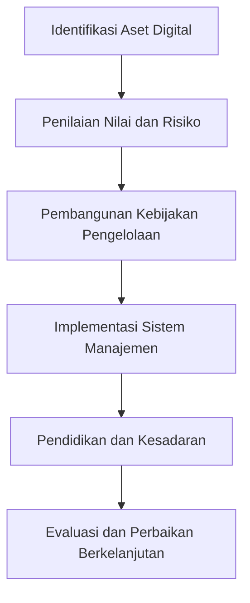

# 1315 — Strategi Pengelolaan Aset Digital Berbasis ISO 55001 dalam Era Industri 4.0

**Domain:** Teknik Industri & Rekayasa Sistem Industri  
**Topik Spesialis:** Strategi Pengelolaan Aset Digital Berbasis ISO 55001 dalam Era Industri 4.0  
**Standar & Referensi Utama:** Chen, T. (2024). Digital Asset Management in Industry 4.0. Journal of Industrial Information Integration. | ISO 55001 Standards, 2024.

---

## 1. Pendahuluan dan Konteks Industri

Dalam era Industri 4.0, pengelolaan aset digital menjadi semakin penting seiring dengan meningkatnya kompleksitas dan ketergantungan pada teknologi informasi dalam proses produksi dan rantai pasok. Aset digital, yang mencakup data, perangkat lunak, dan sistem informasi, berperan krusial dalam mendukung keputusan strategis dan operasional. Menurut Chen (2024), efektivitas pengelolaan aset digital dapat meningkatkan efisiensi operasional, mengurangi biaya, dan meningkatkan daya saing perusahaan.

Tantangan utama dalam pengelolaan aset digital di sektor manufaktur dan rantai pasok modern meliputi: (1) integrasi data dari berbagai sumber dan sistem yang berbeda, (2) perlindungan terhadap keamanan siber, dan (3) pemeliharaan kualitas data yang tinggi. Selain itu, perusahaan harus mampu beradaptasi dengan cepat terhadap perubahan teknologi dan pasar. Dengan mengadopsi standar ISO 55001, organisasi dapat mengembangkan kerangka kerja yang sistematis untuk mengelola aset digital mereka, memastikan bahwa semua aset dikelola secara efisien dan efektif.

Implementasi ISO 55001 tidak hanya membantu dalam pengelolaan aset fisik, tetapi juga memberikan panduan dalam pengelolaan aset digital. Hal ini penting karena aset digital sering kali memiliki nilai yang signifikan, tetapi juga dapat menjadi sumber risiko jika tidak dikelola dengan baik. Dengan demikian, pengelolaan aset digital yang efektif menjadi kunci untuk mencapai tujuan strategis perusahaan dalam konteks industri yang semakin terhubung dan otomatis.

## 2. Landasan Teori & Formulasi Matematis

ISO 55001 adalah standar internasional yang memberikan panduan tentang pengelolaan aset, termasuk aset digital. Pengelolaan aset yang baik melibatkan pemahaman tentang nilai, risiko, dan kinerja aset. Dalam konteks ini, kita dapat menggunakan beberapa rumus matematis untuk menganalisis dan mengoptimalkan pengelolaan aset digital.

### 2.1. Definisi Variabel

- $A$: Nilai total aset digital
- $C$: Biaya pemeliharaan aset digital
- $R$: Risiko terkait aset digital
- $P$: Kinerja aset digital
- $T$: Waktu pemeliharaan aset digital

### 2.2. Rumus Pengelolaan Aset

Pengelolaan aset digital dapat dievaluasi dengan rumus berikut:

$$
E = \frac{A - C - R}{T}
$$

Di mana:
- $E$: Efisiensi pengelolaan aset digital

Rumus ini menunjukkan bahwa efisiensi pengelolaan aset digital ($E$) meningkat ketika nilai aset ($A$) lebih tinggi, biaya pemeliharaan ($C$) dan risiko ($R$) lebih rendah, serta waktu pemeliharaan ($T$) lebih sedikit.

### 2.3. Pembuktian Matematis

Untuk membuktikan bahwa efisiensi ($E$) meningkat dengan pengurangan biaya dan risiko, kita dapat melakukan derivasi sebagai berikut:

1. Jika $C$ dan $R$ menurun, maka:
   $$ E' = \frac{A - (C - \Delta C) - (R - \Delta R)}{T} $$
   di mana $\Delta C$ dan $\Delta R$ adalah penurunan biaya dan risiko.

2. Maka, kita dapat menyatakan:
   $$ E' > E $$

Ini menunjukkan bahwa pengurangan biaya dan risiko akan meningkatkan efisiensi pengelolaan aset digital.

## 3. Metodologi Rekayasa & Standar Prosedur Operasional (SOP)

### 3.1. Langkah-langkah Implementasi

1. **Identifikasi Aset Digital**: Mengidentifikasi semua aset digital yang dimiliki perusahaan, termasuk perangkat lunak, data, dan sistem informasi.
   
2. **Penilaian Nilai dan Risiko**: Melakukan penilaian untuk menentukan nilai dan risiko yang terkait dengan setiap aset digital.

3. **Pengembangan Kebijakan Pengelolaan**: Mengembangkan kebijakan dan prosedur untuk mengelola aset digital sesuai dengan standar ISO 55001.

4. **Implementasi Sistem Manajemen**: Menerapkan sistem manajemen aset digital yang mencakup pengukuran kinerja dan pemantauan risiko.

5. **Pelatihan dan Kesadaran**: Memberikan pelatihan kepada karyawan mengenai pentingnya pengelolaan aset digital dan kebijakan yang telah ditetapkan.

6. **Evaluasi dan Perbaikan Berkelanjutan**: Melakukan evaluasi berkala terhadap pengelolaan aset digital dan melakukan perbaikan yang diperlukan.

### 3.2. Diagram Alir Proses

## 4. Studi Kasus Kuantitatif Industri & Perhitungan Numerik

### 4.1. Contoh Kasus

Misalkan sebuah perusahaan manufaktur memiliki beberapa aset digital dengan parameter sebagai berikut:

- Nilai total aset digital ($A$): $1,000,000
- Biaya pemeliharaan aset digital ($C$): $150,000
- Risiko terkait aset digital ($R$): $50,000
- Waktu pemeliharaan aset digital ($T$): 12 bulan

### 4.2. Perhitungan

Menggunakan rumus efisiensi pengelolaan aset digital:

$$
E = \frac{A - C - R}{T}
$$

Substitusi nilai:

$$
E = \frac{1,000,000 - 150,000 - 50,000}{12}
$$

$$
E = \frac{800,000}{12} = 66,666.67
$$

### 4.3. Interpretasi Hasil

Nilai efisiensi pengelolaan aset digital sebesar $66,666.67 menunjukkan bahwa perusahaan mampu menghasilkan nilai yang signifikan dari setiap bulan pemeliharaan aset digital. Ini menunjukkan bahwa pengelolaan aset digital yang efektif dapat memberikan kontribusi positif terhadap kinerja perusahaan.

## 5. Evaluasi Kritis, Aplikasi Lintas Sektor & Standar Masa Depan

Pengelolaan aset digital tidak hanya relevan dalam sektor manufaktur, tetapi juga memiliki aplikasi luas dalam berbagai disiplin ilmu seperti rantai pasok, otomasi, dan manajemen biaya. Dalam konteks rantai pasok, pengelolaan aset digital dapat meningkatkan visibilitas dan transparansi, yang penting untuk pengambilan keputusan yang cepat dan tepat.

Namun, terdapat beberapa batasan dalam metodologi ini, termasuk ketergantungan pada teknologi dan potensi risiko keamanan siber. Oleh karena itu, penelitian masa depan harus fokus pada pengembangan solusi yang lebih aman dan efisien dalam pengelolaan aset digital.

Dengan demikian, pengelolaan aset digital berbasis ISO 55001 dalam era Industri 4.0 bukan hanya sebuah kebutuhan, tetapi juga merupakan langkah strategis untuk memastikan keberlanjutan dan daya saing perusahaan di pasar global yang semakin kompetitif.