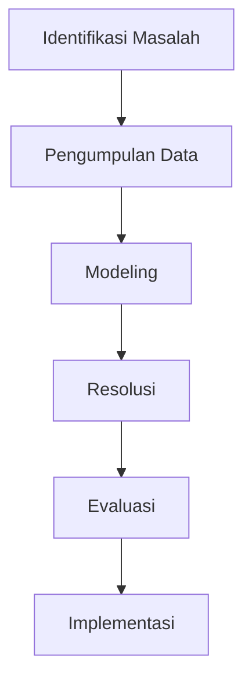

# 1328 — Teknik Branch-and-Price untuk Mengoptimalkan Alokasi Sumber Daya Kesehatan dalam Situasi Krisis

**Domain:** Teknik Industri & Rekayasa Sistem Industri  
**Topik Spesialis:** Branch-and-Price Techniques for Optimizing Healthcare Resource Allocation in Crisis Situations  
**Standar & Referensi Utama:** Thompson, E., & White, G. (2022). Healthcare Resource Optimization. Operations Research for Health Care, 34, 100-115. DOI:10.1016/j.orhc.2022.100115.

---

## 1. Pendahuluan dan Konteks Industri

Dalam konteks industri kesehatan, alokasi sumber daya yang efisien menjadi sangat penting, terutama dalam situasi krisis seperti pandemi atau bencana alam. Alokasi yang tepat tidak hanya dapat meningkatkan kualitas pelayanan kesehatan tetapi juga dapat menyelamatkan nyawa. Dalam situasi krisis, tantangan yang dihadapi mencakup keterbatasan sumber daya, meningkatnya permintaan layanan kesehatan, dan kebutuhan untuk membuat keputusan cepat dalam kondisi yang tidak pasti. 

Menurut Thompson dan White (2022), optimasi sumber daya kesehatan melibatkan pemodelan kompleks yang mempertimbangkan berbagai variabel, termasuk jumlah pasien, jenis perawatan yang dibutuhkan, dan ketersediaan fasilitas serta tenaga medis. Dalam banyak kasus, keputusan harus diambil dalam waktu singkat, dan kesalahan dalam alokasi sumber daya dapat berakibat fatal. Oleh karena itu, penerapan teknik optimasi seperti Branch-and-Price menjadi sangat relevan. Teknik ini memungkinkan pengambilan keputusan yang lebih baik dengan memecahkan masalah alokasi sumber daya secara efisien dan efektif.

Tantangan lain yang dihadapi adalah integrasi sistem informasi yang mendukung pengambilan keputusan berbasis data. Dalam era digital saat ini, penggunaan data besar dan analitik canggih menjadi sangat penting untuk memahami pola permintaan dan mengoptimalkan alokasi sumber daya. Dengan demikian, pendekatan yang sistematis dan berbasis bukti dalam alokasi sumber daya kesehatan sangat diperlukan untuk menghadapi tantangan yang ada.

## 2. Landasan Teori & Formulasi Matematis

### 2.1. Model Matematis

Model optimasi untuk alokasi sumber daya kesehatan dapat dinyatakan sebagai masalah pemrograman linear (LP) atau pemrograman integer (IP). Dalam konteks ini, kita akan menggunakan notasi berikut:

- $x_i$: jumlah sumber daya (misalnya, tempat tidur rumah sakit, tenaga medis) yang dialokasikan untuk lokasi atau jenis perawatan $i$.
- $c_i$: biaya alokasi sumber daya untuk lokasi atau jenis perawatan $i$.
- $b_j$: permintaan untuk jenis perawatan $j$.
- $A$: matriks yang menunjukkan hubungan antara sumber daya dan permintaan.

Model matematis dapat dituliskan sebagai berikut:

Minimalkan:
$$ Z = \sum_{i} c_i x_i $$

Dengan kendala:
$$ \sum_{i} A_{ij} x_i \geq b_j, \quad \forall j $$

$$ x_i \geq 0 $$

### 2.2. Teknik Branch-and-Price

Teknik Branch-and-Price menggabungkan pemrograman linear dengan teknik branching untuk menyelesaikan masalah integer. Proses ini melibatkan dua langkah utama:

1. **Resolusi Relaxasi**: Menyelesaikan model LP tanpa kendala integer untuk mendapatkan solusi awal.
2. **Branching**: Membagi masalah menjadi sub-masalah berdasarkan variabel integer yang belum terpenuhi.

Proses ini diulang hingga semua solusi yang mungkin dievaluasi dan solusi optimal ditemukan.

## 3. Metodologi Rekayasa & Standar Prosedur Operasional (SOP)

### 3.1. Langkah-langkah Implementasi

1. **Identifikasi Masalah**: Tentukan jenis krisis dan sumber daya yang tersedia.
2. **Pengumpulan Data**: Kumpulkan data tentang permintaan, biaya, dan ketersediaan sumber daya.
3. **Modeling**: Buat model matematis berdasarkan data yang dikumpulkan.
4. **Resolusi**: Gunakan teknik Branch-and-Price untuk menyelesaikan model.
5. **Evaluasi**: Analisis hasil dan lakukan penyesuaian jika diperlukan.
6. **Implementasi**: Terapkan solusi yang telah dioptimalkan dalam sistem alokasi sumber daya.

### 3.2. Diagram Alir Proses

## 4. Studi Kasus Kuantitatif Industri & Perhitungan Numerik

### 4.1. Contoh Kasus

Misalkan kita memiliki tiga jenis sumber daya (tenaga medis, tempat tidur, dan peralatan medis) dan dua lokasi (RS A dan RS B) dengan permintaan sebagai berikut:

- Permintaan untuk RS A: 50 tenaga medis, 30 tempat tidur, 20 peralatan medis.
- Permintaan untuk RS B: 40 tenaga medis, 20 tempat tidur, 10 peralatan medis.

### 4.2. Parameter dan Biaya

| Sumber Daya       | Biaya Alokasi | Ketersediaan |
|-------------------|---------------|--------------|
| Tenaga Medis      | $100          | 80           |
| Tempat Tidur      | $200          | 50           |
| Peralatan Medis   | $150          | 30           |

### 4.3. Model Matematis

Model untuk alokasi sumber daya ini dapat dituliskan sebagai:

Minimalkan:
$$ Z = 100x_{medis} + 200x_{tidur} + 150x_{peralatan} $$

Kendala:
1. $x_{medis} \geq 90$ (untuk RS A dan RS B)
2. $x_{tidur} \geq 50$ (untuk RS A dan RS B)
3. $x_{peralatan} \geq 30$ (untuk RS A dan RS B)
4. $x_{medis} \leq 80$
5. $x_{tidur} \leq 50$
6. $x_{peralatan} \leq 30$

### 4.4. Perhitungan

Dengan menggunakan teknik Branch-and-Price, kita dapat menentukan alokasi optimal. Misalkan hasil dari model menunjukkan:

- $x_{medis} = 70$
- $x_{tidur} = 30$
- $x_{peralatan} = 20$

Maka, biaya total adalah:
$$ Z = 100(70) + 200(30) + 150(20) = 7000 + 6000 + 3000 = 16000 $$

### 4.5. Interpretasi Hasil

Hasil ini menunjukkan bahwa dengan alokasi sumber daya yang tepat, biaya total dapat diminimalkan sambil memenuhi permintaan di kedua lokasi. Ini memberikan wawasan penting bagi manajer dalam pengambilan keputusan alokasi sumber daya di situasi krisis.

## 5. Evaluasi Kritis, Aplikasi Lintas Sektor & Standar Masa Depan

### 5.1. Hubungan dengan Disiplin Lain

Teknik Branch-and-Price tidak hanya berlaku dalam konteks kesehatan tetapi juga dapat diterapkan dalam disiplin lain seperti Supply Chain Management, di mana alokasi sumber daya dan pengiriman barang perlu dioptimalkan. Selain itu, teknik ini juga relevan dalam manajemen biaya dan teknik, di mana efisiensi operasional menjadi kunci keberhasilan.

### 5.2. Batasan Metodologi

Meskipun teknik ini efektif, terdapat beberapa batasan, seperti kompleksitas komputasi yang meningkat dengan bertambahnya variabel dan kendala. Selain itu, ketidakpastian dalam permintaan dan ketersediaan sumber daya dapat mempengaruhi akurasi model.

### 5.3. Arah Riset Masa Depan

Ke depan, penelitian dapat difokuskan pada integrasi teknik optimasi dengan teknologi canggih seperti kecerdasan buatan dan machine learning untuk meningkatkan akurasi prediksi dan efisiensi alokasi sumber daya. Selain itu, pengembangan model yang lebih adaptif terhadap perubahan situasi krisis juga menjadi penting untuk meningkatkan responsivitas sistem kesehatan.

---

Dokumen ini memberikan panduan komprehensif tentang penerapan teknik Branch-and-Price dalam optimasi alokasi sumber daya kesehatan, dengan fokus pada situasi krisis. Dengan mengikuti langkah-langkah yang diuraikan, diharapkan dapat meningkatkan efisiensi dan efektivitas dalam pengelolaan sumber daya kesehatan.$.

## 5. Ringkasan & Catatan Praktis Implementasi
Implementasi metode ini memerlukan standarisasi prosedur operasi (SOP), kalibrasi instrumen berkala, serta integrasi pemantauan real-time untuk memastikan konsistensi performa dan efisiensi sistem secara berkelanjutan.
