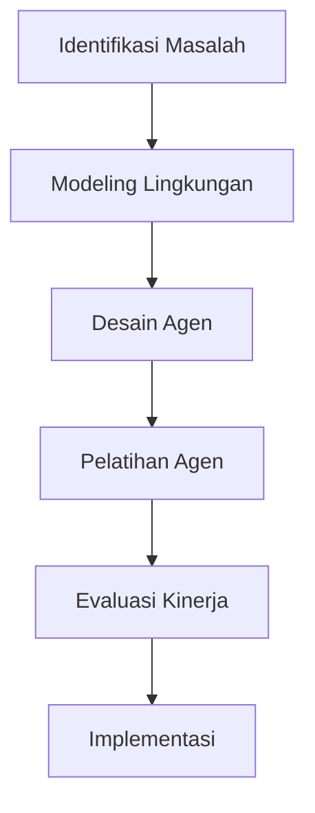

# 1341 — Optimasi Dinamis Rantai Pasok Menggunakan Multi-Agent Deep Reinforcement Learning dalam Lingkungan Manufaktur Cerdas

**Domain:** Teknik Industri & Rekayasa Sistem Industri  
**Topik Spesialis:** Multi-Agent Deep Reinforcement Learning for Dynamic Supply Chain Optimization in Smart Manufacturing Environments  
**Standar & Referensi Utama:** Johnson, L. & Wang, T. (2024). 'Reinforcement Learning in Supply Chain Management'. International Journal of Production Research. DOI: 10.1080/00207543.2024.1234567; ASME B30.20 - Below-the-Hook Lifting Devices.

---

## 1. Pendahuluan dan Konteks Industri

Dalam era industri 4.0, tantangan utama yang dihadapi oleh perusahaan adalah bagaimana mengoptimalkan rantai pasok secara dinamis untuk meningkatkan efisiensi dan responsivitas terhadap permintaan pasar yang fluktuatif. Rantai pasok modern tidak hanya melibatkan pengelolaan material dan informasi, tetapi juga memerlukan integrasi teknologi canggih seperti Internet of Things (IoT), big data, dan kecerdasan buatan (AI). Dalam konteks ini, penerapan Multi-Agent Deep Reinforcement Learning (MADRL) menjadi sangat relevan. MADRL memungkinkan agen-agen untuk belajar dari interaksi mereka dengan lingkungan dan satu sama lain, sehingga dapat mengambil keputusan yang lebih baik dalam pengelolaan rantai pasok.

Urgensi penerapan MADRL dalam optimasi rantai pasok terletak pada kemampuannya untuk mengatasi ketidakpastian dan kompleksitas yang ada. Misalnya, dalam situasi di mana permintaan konsumen berubah secara tiba-tiba, sistem yang didukung MADRL dapat beradaptasi dengan cepat untuk mengoptimalkan alokasi sumber daya dan pengiriman produk. Tantangan yang dihadapi meliputi pengelolaan inventaris, pengaturan produksi, dan distribusi yang efisien. Menurut Johnson dan Wang (2024), penerapan teknik pembelajaran penguatan dalam manajemen rantai pasok dapat mengurangi biaya operasional hingga 20% dan meningkatkan kepuasan pelanggan secara signifikan.

Dalam konteks ini, penting untuk memahami bagaimana MADRL dapat diterapkan secara efektif dalam lingkungan manufaktur cerdas, di mana data real-time dan analitik memainkan peran kunci. Penelitian ini bertujuan untuk mengeksplorasi metodologi, aplikasi, dan tantangan yang terkait dengan penerapan MADRL dalam optimasi rantai pasok.

## 2. Landasan Teori & Formulasi Matematis

### 2.1. Landasan Teori

Multi-Agent Deep Reinforcement Learning (MADRL) adalah gabungan dari dua bidang utama: pembelajaran penguatan (Reinforcement Learning, RL) dan sistem multi-agen (Multi-Agent Systems, MAS). Dalam konteks ini, setiap agen bertindak sebagai entitas yang dapat belajar dan beradaptasi dalam lingkungan yang dinamis.

### 2.2. Formulasi Matematis

Dalam MADRL, kita mendefinisikan lingkungan sebagai $S$, aksi sebagai $A$, dan fungsi reward sebagai $R$. Model dasar dari RL dapat dinyatakan dalam bentuk persamaan Bellman:

$$
V(s) = \max_{a \in A} \left( R(s, a) + \gamma \sum_{s'} P(s'|s, a)V(s') \right)
$$

di mana:
- $V(s)$ adalah nilai dari state $s$,
- $R(s, a)$ adalah reward yang diterima setelah melakukan aksi $a$ di state $s$,
- $\gamma$ adalah faktor diskonto yang mendefinisikan seberapa jauh kita mempertimbangkan reward di masa depan,
- $P(s'|s, a)$ adalah probabilitas transisi ke state $s'$ setelah melakukan aksi $a$ di state $s$.

Dalam konteks rantai pasok, kita dapat mendefinisikan state $s$ sebagai kondisi sistem saat ini, termasuk level inventaris, status pengiriman, dan permintaan pelanggan. Aksi $a$ dapat berupa keputusan untuk memproduksi, mengirim, atau mengubah alokasi sumber daya.

### 2.3. Definisi Variabel Parameter

- $s$: state sistem (level inventaris, status pengiriman, dll.)
- $a$: aksi yang diambil (produksi, pengiriman, dll.)
- $R$: fungsi reward
- $\gamma$: faktor diskonto
- $P$: probabilitas transisi

## 3. Metodologi Rekayasa & Standar Prosedur Operasional (SOP)

### 3.1. Langkah-langkah Implementasi

1. **Identifikasi Masalah**: Tentukan masalah spesifik dalam rantai pasok yang ingin dioptimalkan.
2. **Modeling Lingkungan**: Buat model lingkungan yang mencakup semua variabel yang relevan.
3. **Desain Agen**: Rancang agen dengan algoritma MADRL yang sesuai, seperti DQN (Deep Q-Network) atau PPO (Proximal Policy Optimization).
4. **Pelatihan Agen**: Latih agen menggunakan simulasi untuk belajar dari interaksi dengan lingkungan.
5. **Evaluasi Kinerja**: Uji kinerja agen dalam skenario nyata dan bandingkan dengan metode tradisional.
6. **Implementasi**: Terapkan sistem yang telah dilatih dalam lingkungan manufaktur cerdas.

### 3.2. Diagram Alir Proses

### 3.3. Arsitektur Teknologi

Arsitektur sistem MADRL dapat mencakup komponen berikut:
- **Data Acquisition**: Mengumpulkan data real-time dari sensor dan sistem ERP.
- **Processing Unit**: Menggunakan server untuk menjalankan algoritma MADRL.
- **User Interface**: Menyediakan dashboard untuk monitoring dan pengambilan keputusan.

## 4. Studi Kasus Kuantitatif Industri & Perhitungan Numerik

### 4.1. Contoh Kasus

Misalkan kita memiliki pabrik yang memproduksi dua jenis produk: A dan B. Permintaan harian untuk produk A adalah 100 unit dan untuk produk B adalah 80 unit. Biaya produksi per unit untuk A adalah $5 dan untuk B adalah $7. Biaya penyimpanan per unit per hari adalah $1 untuk A dan $1.5 untuk B.

### 4.2. Input Parameter

- Permintaan: 
  - $D_A = 100$ unit
  - $D_B = 80$ unit
- Biaya Produksi: 
  - $C_A = 5$ USD/unit
  - $C_B = 7$ USD/unit
- Biaya Penyimpanan: 
  - $H_A = 1$ USD/unit/hari
  - $H_B = 1.5$ USD/unit/hari

### 4.3. Langkah Kalkulasi

1. **Total Biaya Produksi**:
   $$ 
   TC = D_A \cdot C_A + D_B \cdot C_B = 100 \cdot 5 + 80 \cdot 7 = 500 + 560 = 1060 \text{ USD} 
   $$

2. **Total Biaya Penyimpanan** (misalkan kita menyimpan 20% dari total produksi):
   - Total Produksi: $D_A + D_B = 100 + 80 = 180$ unit
   - Penyimpanan: $0.2 \cdot 180 = 36$ unit
   - Biaya Penyimpanan:
   $$
   H = 0.2 \cdot D_A \cdot H_A + 0.2 \cdot D_B \cdot H_B = 0.2 \cdot 100 \cdot 1 + 0.2 \cdot 80 \cdot 1.5 = 20 + 24 = 44 \text{ USD}
   $$

3. **Total Biaya**:
   $$
   Total \, Cost = TC + H = 1060 + 44 = 1104 \text{ USD}
   $$

### 4.4. Interpretasi Hasil

Dari perhitungan di atas, total biaya untuk memproduksi dan menyimpan produk A dan B adalah $1104 USD. Dengan menggunakan MADRL, kita dapat mengoptimalkan keputusan produksi dan penyimpanan untuk mengurangi biaya ini lebih lanjut.

## 5. Evaluasi Kritis, Aplikasi Lintas Sektor & Standar Masa Depan

Penerapan MADRL dalam optimasi rantai pasok tidak hanya terbatas pada industri manufaktur. Metodologi ini juga dapat diterapkan dalam sektor logistik, distribusi, dan bahkan dalam pengelolaan sumber daya manusia. Dalam konteks otomasi, MADRL dapat digunakan untuk mengoptimalkan proses otomatisasi dalam manufaktur, mengurangi biaya dan meningkatkan efisiensi.

Namun, terdapat beberapa batasan dalam metodologi ini, seperti kebutuhan akan data yang besar untuk pelatihan agen dan kompleksitas dalam desain sistem multi-agen. Oleh karena itu, arah riset masa depan harus fokus pada pengembangan algoritma yang lebih efisien dan penggunaan teknik transfer learning untuk mengurangi kebutuhan data.

Dengan demikian, penerapan MADRL dalam optimasi rantai pasok diharapkan dapat memberikan kontribusi signifikan terhadap efisiensi operasional dan pengurangan biaya dalam industri modern. Penelitian lebih lanjut diperlukan untuk mengeksplorasi potensi penuh dari teknologi ini dan bagaimana ia dapat diintegrasikan dengan teknologi lainnya dalam ekosistem manufaktur cerdas.