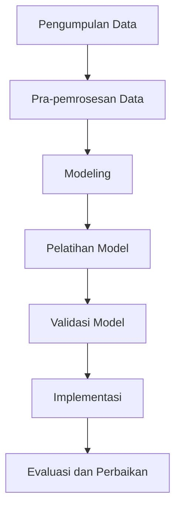

# 1344 — Big Data Analytics dan Physics-Informed Neural Networks untuk Peningkatan Kontrol Kualitas dalam Proses Manufaktur

**Domain:** Teknik Industri & Rekayasa Sistem Industri  
**Topik Spesialis:** Big Data Analytics and Physics-Informed Neural Networks for Enhanced Quality Control in Manufacturing Processes  
**Standar & Referensi Utama:** Chen, Y. (2024). 'Big Data in Manufacturing: A Review'. Journal of Intelligent Manufacturing. DOI: 10.1007/s10845-024-01999-9; IEEE 1547 - Standard for Interconnecting Distributed Resources with Electric Power Systems.

---

## 1. Pendahuluan dan Konteks Industri

Dalam era industri 4.0, penggunaan teknologi canggih seperti Big Data Analytics dan Physics-Informed Neural Networks (PINNs) menjadi sangat penting dalam meningkatkan kontrol kualitas di sektor manufaktur. Dengan meningkatnya kompleksitas proses produksi dan tuntutan konsumen akan produk berkualitas tinggi, perusahaan harus mampu mengelola dan menganalisis data dalam jumlah besar untuk mengidentifikasi pola dan anomali yang dapat mempengaruhi kualitas produk. Menurut Chen (2024), penerapan Big Data dalam manufaktur tidak hanya meningkatkan efisiensi operasional tetapi juga memberikan wawasan yang lebih mendalam tentang proses produksi.

Tantangan yang dihadapi dalam industri manufaktur modern meliputi variabilitas proses, kesalahan manusia, dan kegagalan peralatan. Variabilitas ini dapat menyebabkan cacat produk dan meningkatkan biaya produksi. Oleh karena itu, diperlukan pendekatan yang lebih canggih untuk memprediksi dan mengontrol kualitas produk. Di sinilah peran PINNs menjadi krusial, karena mereka dapat memanfaatkan data historis dan model fisik untuk meningkatkan akurasi prediksi kualitas produk.

Implementasi Big Data Analytics dan PINNs dalam kontrol kualitas tidak hanya memberikan keuntungan kompetitif tetapi juga berkontribusi pada keberlanjutan dan efisiensi sumber daya. Dengan memanfaatkan data secara efektif, perusahaan dapat mengurangi limbah, meningkatkan produktivitas, dan memenuhi standar kualitas yang lebih tinggi. Oleh karena itu, pemahaman yang mendalam tentang metodologi dan aplikasi kedua teknologi ini sangat penting bagi para profesional di bidang teknik industri.

## 2. Landasan Teori & Formulasi Matematis

### 2.1 Big Data Analytics

Big Data Analytics merujuk pada proses analisis data besar yang tidak terstruktur dan terstruktur untuk menemukan pola, tren, dan hubungan yang berguna. Dalam konteks manufaktur, analisis ini dapat dilakukan dengan menggunakan berbagai metode statistik dan algoritma pembelajaran mesin.

### 2.2 Physics-Informed Neural Networks (PINNs)

PINNs adalah jenis jaringan saraf yang mengintegrasikan informasi fisik ke dalam proses pembelajaran. Mereka digunakan untuk menyelesaikan masalah yang melibatkan persamaan diferensial, yang sering muncul dalam model fisik.

### 2.3 Formulasi Matematis

Misalkan kita memiliki fungsi kualitas produk $Q(x,t)$ yang tergantung pada variabel ruang $x$ dan waktu $t$. Kita dapat memodelkan perubahan kualitas produk dengan persamaan diferensial parsial (PDE):

$$
\frac{\partial Q}{\partial t} + \nabla \cdot \mathbf{F}(Q) = S(Q)
$$

di mana $\mathbf{F}(Q)$ adalah fluks kualitas dan $S(Q)$ adalah sumber kualitas. Model ini dapat diintegrasikan dengan data historis menggunakan metode pembelajaran mesin untuk meningkatkan prediksi.

### 2.4 Definisi Variabel

- $Q(x,t)$: Kualitas produk pada posisi $x$ dan waktu $t$.
- $\mathbf{F}(Q)$: Fluks kualitas yang menggambarkan aliran kualitas produk.
- $S(Q)$: Sumber kualitas yang menunjukkan faktor-faktor yang mempengaruhi kualitas.

## 3. Metodologi Rekayasa & Standar Prosedur Operasional (SOP)

### 3.1 Langkah-langkah Implementasi

1. **Pengumpulan Data**: Mengumpulkan data dari berbagai sumber, termasuk sensor produksi, laporan kualitas, dan data historis.
2. **Pra-pemrosesan Data**: Membersihkan dan menyiapkan data untuk analisis, termasuk normalisasi dan penghilangan outlier.
3. **Modeling**: Mengembangkan model PINNs yang mengintegrasikan data dan informasi fisik.
4. **Pelatihan Model**: Melatih model menggunakan data yang telah diproses untuk memprediksi kualitas produk.
5. **Validasi Model**: Menguji akurasi model dengan data uji dan melakukan penyesuaian jika diperlukan.
6. **Implementasi**: Menerapkan model dalam proses produksi untuk pemantauan kualitas secara real-time.
7. **Evaluasi dan Perbaikan**: Mengumpulkan umpan balik dan melakukan perbaikan berkelanjutan pada model.

### 3.2 Diagram Alir Proses

## 4. Studi Kasus Kuantitatif Industri & Perhitungan Numerik

### 4.1 Contoh Kasus

Misalkan sebuah pabrik otomotif ingin meningkatkan kualitas cat pada mobil. Data historis menunjukkan bahwa 5% dari produk mengalami cacat. Parameter yang digunakan adalah:

- Jumlah produksi per hari: $N = 1000$ unit
- Tingkat cacat historis: $D = 0.05$
- Target cacat yang diinginkan: $D_{target} = 0.01$

### 4.2 Perhitungan

1. **Jumlah cacat yang diharapkan saat ini**:
   $$
   C_{current} = N \times D = 1000 \times 0.05 = 50 \text{ unit}
   $$

2. **Jumlah cacat yang diharapkan dengan target**:
   $$
   C_{target} = N \times D_{target} = 1000 \times 0.01 = 10 \text{ unit}
   $$

3. **Pengurangan cacat yang diperlukan**:
   $$
   \Delta C = C_{current} - C_{target} = 50 - 10 = 40 \text{ unit}
   $$

### 4.3 Interpretasi Hasil

Pengurangan cacat yang diperlukan sebesar 40 unit menunjukkan bahwa dengan penerapan Big Data Analytics dan PINNs, pabrik dapat meningkatkan kontrol kualitas secara signifikan. Ini tidak hanya akan mengurangi biaya produksi tetapi juga meningkatkan kepuasan pelanggan.

## 5. Evaluasi Kritis, Aplikasi Lintas Sektor & Standar Masa Depan

Penerapan Big Data Analytics dan PINNs tidak terbatas pada sektor manufaktur saja. Metodologi ini dapat diterapkan dalam berbagai disiplin ilmu, termasuk rantai pasok, otomasi, dan manajemen biaya. Dalam konteks rantai pasok, analisis data dapat membantu dalam pengambilan keputusan yang lebih baik terkait pengadaan dan distribusi.

Namun, terdapat beberapa batasan dalam metodologi ini, seperti kebutuhan akan data berkualitas tinggi dan tantangan dalam integrasi sistem. Oleh karena itu, arah riset masa depan harus fokus pada pengembangan algoritma yang lebih efisien dan teknik pengolahan data yang lebih baik.

Dengan mengikuti standar yang ditetapkan oleh IEEE 1547, perusahaan dapat memastikan bahwa sistem yang diimplementasikan tidak hanya efisien tetapi juga aman dan dapat diandalkan. Keberlanjutan dan efisiensi sumber daya akan menjadi fokus utama dalam pengembangan teknologi di masa depan, sehingga menciptakan ekosistem industri yang lebih baik.

--- 

Dokumen ini memberikan panduan komprehensif tentang penerapan Big Data Analytics dan Physics-Informed Neural Networks dalam kontrol kualitas di sektor manufaktur, dengan penekanan pada metodologi, studi kasus, dan arah riset masa depan.

## 5. Ringkasan & Catatan Praktis Implementasi
Implementasi metode ini memerlukan standarisasi prosedur operasi (SOP), kalibrasi instrumen berkala, serta integrasi pemantauan real-time untuk memastikan konsistensi performa dan efisiensi sistem secara berkelanjutan.
