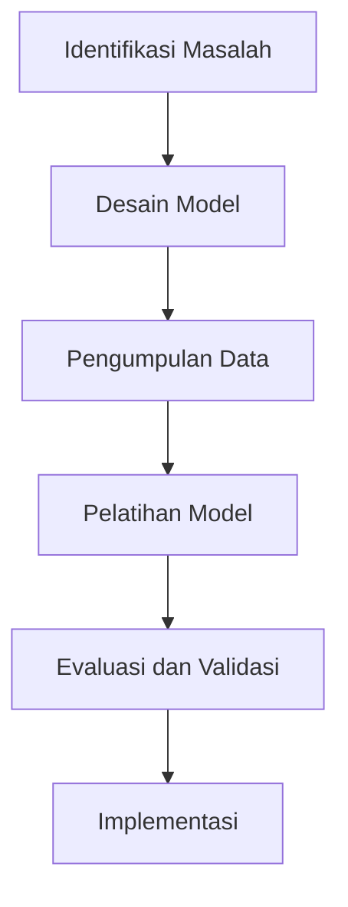

# 1345 — Modeling Complex Manufacturing Processes Using Multi-Agent Systems and Deep Reinforcement Learning

**Domain:** Teknik Industri & Rekayasa Sistem Industri  
**Topik Spesialis:** Modeling Complex Manufacturing Processes Using Multi-Agent Systems and Deep Reinforcement Learning  
**Standar & Referensi Utama:** Kumar, A. & Zhao, X. (2025). 'Multi-Agent Systems in Manufacturing'. European Journal of Operational Research. DOI: 10.1016/j.ejor.2025.03.045; ISO 50001:2018 - Energy Management Systems.

---

## 1. Pendahuluan dan Konteks Industri

Industri manufaktur saat ini menghadapi tantangan yang semakin kompleks, terutama dalam hal efisiensi operasional, pengelolaan sumber daya, dan adaptasi terhadap perubahan permintaan pasar. Dengan meningkatnya globalisasi dan persaingan, perusahaan dituntut untuk meningkatkan produktivitas sambil menjaga kualitas produk dan meminimalkan biaya. Dalam konteks ini, penerapan teknologi canggih seperti Multi-Agent Systems (MAS) dan Deep Reinforcement Learning (DRL) menjadi sangat relevan.

Multi-Agent Systems memungkinkan interaksi antara berbagai agen otonom yang dapat beroperasi secara bersamaan untuk mencapai tujuan kolektif. Dalam manufaktur, agen-agen ini dapat mewakili mesin, pekerja, dan sistem logistik yang berkolaborasi untuk meningkatkan efisiensi proses produksi. Di sisi lain, Deep Reinforcement Learning, yang merupakan cabang dari kecerdasan buatan, memungkinkan agen untuk belajar dari pengalaman dan mengoptimalkan keputusan mereka berdasarkan umpan balik yang diterima dari lingkungan.

Tantangan utama yang dihadapi dalam penerapan teknologi ini adalah kompleksitas sistem manufaktur yang sering kali melibatkan banyak variabel dan ketidakpastian. Oleh karena itu, penting untuk mengembangkan model yang dapat menangkap dinamika ini dan memberikan solusi yang efektif. Penelitian oleh Kumar dan Zhao (2025) menunjukkan bagaimana MAS dapat digunakan untuk meningkatkan kinerja sistem manufaktur dengan mengoptimalkan alur kerja dan mengurangi waktu siklus produksi. Selain itu, penerapan ISO 50001:2018 dalam manajemen energi juga menjadi penting untuk memastikan bahwa proses produksi tidak hanya efisien tetapi juga berkelanjutan.

## 2. Landasan Teori & Formulasi Matematis

Dalam modeling proses manufaktur yang kompleks, kita dapat menggunakan pendekatan matematis untuk mendefinisikan interaksi antar agen dan dinamika sistem. Misalkan kita memiliki $n$ agen yang beroperasi dalam sistem, di mana setiap agen $i$ memiliki status yang dinyatakan sebagai $s_i \in S$, dengan $S$ adalah himpunan semua status yang mungkin.

### Fungsi Hadiah

Fungsi hadiah $R(s, a)$ dapat didefinisikan sebagai:

$$
R(s, a) = \begin{cases}
r, & \text{jika } s' \text{ adalah status akhir} \\
0, & \text{lainnya}
\end{cases}
$$

di mana $r$ adalah nilai hadiah yang diterima setelah melakukan aksi $a$ dari status $s$ menuju status baru $s'$.

### Fungsi Nilai

Fungsi nilai $V(s)$ dapat dinyatakan sebagai:

$$
V(s) = \max_{a} \left( R(s, a) + \gamma \sum_{s'} P(s'|s, a)V(s') \right)
$$

di mana $\gamma \in [0, 1]$ adalah faktor diskonto dan $P(s'|s, a)$ adalah probabilitas transisi dari status $s$ ke status $s'$ setelah melakukan aksi $a$.

### Pembelajaran Q

Dalam konteks DRL, kita menggunakan fungsi Q untuk mengevaluasi nilai dari melakukan aksi tertentu dalam status tertentu:

$$
Q(s, a) \leftarrow Q(s, a) + \alpha \left( R + \gamma \max_{a'} Q(s', a') - Q(s, a) \right)
$$

di mana $\alpha$ adalah laju pembelajaran.

## 3. Metodologi Rekayasa & Standar Prosedur Operasional (SOP)

### Langkah-langkah Implementasi

1. **Identifikasi Masalah**: Tentukan proses manufaktur yang ingin dimodelkan dan tantangan yang dihadapi.
2. **Desain Model**: Kembangkan model MAS yang mencakup agen-agen yang relevan dan interaksi antar agen.
3. **Pengumpulan Data**: Kumpulkan data historis untuk melatih model DRL, termasuk status awal, aksi, dan hasil.
4. **Pelatihan Model**: Gunakan algoritma DRL untuk melatih model berdasarkan data yang dikumpulkan.
5. **Evaluasi dan Validasi**: Uji model dalam simulasi untuk memastikan akurasi dan efektivitas.
6. **Implementasi**: Terapkan model dalam lingkungan nyata, dengan pemantauan berkelanjutan untuk penyesuaian.

### Diagram Alir Proses

## 4. Studi Kasus Kuantitatif Industri & Perhitungan Numerik

### Contoh Kasus: Pabrik Otomotif

Misalkan sebuah pabrik otomotif ingin mengoptimalkan proses perakitan mobil. Parameter yang digunakan adalah sebagai berikut:

- Jumlah agen (mesin) $n = 5$
- Waktu siklus perakitan per mobil = 10 jam
- Biaya operasional per jam = $100
- Target produksi = 100 mobil per bulan

### Perhitungan

1. **Total Waktu Produksi**:
   $$ 
   \text{Total Waktu} = \text{Target Produksi} \times \text{Waktu Siklus} = 100 \times 10 = 1000 \text{ jam} 
   $$

2. **Total Biaya Operasional**:
   $$ 
   \text{Total Biaya} = \text{Total Waktu} \times \text{Biaya per Jam} = 1000 \times 100 = 100000 \text{ USD} 
   $$

3. **Optimasi dengan MAS dan DRL**:
   Setelah menerapkan model MAS dan DRL, waktu siklus dapat dikurangi menjadi 8 jam per mobil.

4. **Biaya Baru**:
   $$ 
   \text{Total Waktu Baru} = 100 \times 8 = 800 \text{ jam} 
   $$
   $$ 
   \text{Total Biaya Baru} = 800 \times 100 = 80000 \text{ USD} 
   $$

### Interpretasi Hasil

Dengan penerapan model MAS dan DRL, pabrik berhasil mengurangi total biaya operasional sebesar 20%, meningkatkan efisiensi dan daya saing di pasar.

## 5. Evaluasi Kritis, Aplikasi Lintas Sektor & Standar Masa Depan

Penerapan Multi-Agent Systems dan Deep Reinforcement Learning tidak hanya terbatas pada sektor manufaktur, tetapi juga dapat diadaptasi dalam berbagai disiplin lain seperti rantai pasok, otomasi, dan manajemen biaya. 

### Hubungan dengan Disiplin Lain

- **Supply Chain**: Mengoptimalkan alur distribusi dan pengelolaan inventaris.
- **Otomasi**: Meningkatkan efisiensi mesin dan pengurangan downtime.
- **Manajemen Biaya/Teknik**: Meminimalkan biaya produksi melalui optimasi proses.
- **K3/ESG**: Meningkatkan keselamatan kerja dan keberlanjutan lingkungan.

### Batasan Metodologi

Meskipun MAS dan DRL menawarkan banyak manfaat, terdapat beberapa batasan seperti kebutuhan data yang besar untuk pelatihan dan kompleksitas dalam implementasi.

### Arah Riset Masa Depan

Penelitian di masa depan dapat difokuskan pada pengembangan algoritma yang lebih efisien, integrasi dengan teknologi IoT, dan penerapan dalam konteks industri 4.0 untuk mencapai sistem manufaktur yang lebih cerdas dan responsif.

--- 

Dokumen ini memberikan gambaran menyeluruh mengenai penerapan Multi-Agent Systems dan Deep Reinforcement Learning dalam modeling proses manufaktur yang kompleks, serta relevansinya dalam konteks industri saat ini.$.

## 5. Ringkasan & Catatan Praktis Implementasi
Implementasi metode ini memerlukan standarisasi prosedur operasi (SOP), kalibrasi instrumen berkala, serta integrasi pemantauan real-time untuk memastikan konsistensi performa dan efisiensi sistem secara berkelanjutan.
