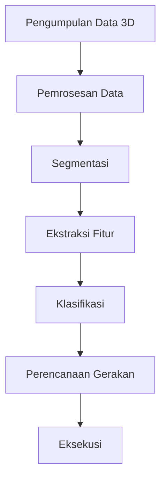

# 1354 — Analisis Data 3D untuk Meningkatkan Akurasi dalam Bin-Picking Otonom

**Domain:** Teknik Industri & Rekayasa Sistem Industri  
**Topik Spesialis:** Analisis Data 3D untuk Meningkatkan Akurasi dalam Bin-Picking Otonom  
**Standar & Referensi Utama:** E. Wang, '3D Data Analysis for Autonomous Bin Picking', International Journal of Advanced Manufacturing Technology, 2024.

---

## 1. Pendahuluan dan Konteks Industri

Dalam era industri 4.0, otomatisasi dan robotika menjadi pilar utama dalam meningkatkan efisiensi dan produktivitas di sektor manufaktur. Salah satu aplikasi penting dari teknologi ini adalah sistem bin-picking otonom, yang berfungsi untuk mengambil objek dari wadah secara otomatis. Bin-picking menghadapi tantangan signifikan dalam hal akurasi dan kecepatan, terutama ketika objek yang diambil memiliki bentuk, ukuran, dan orientasi yang bervariasi. 

Konteks industri saat ini menuntut sistem bin-picking yang tidak hanya cepat tetapi juga akurat, untuk mengurangi biaya operasional dan meningkatkan throughput. Dalam hal ini, analisis data 3D menjadi krusial. Dengan menggunakan sensor 3D seperti LiDAR dan kamera stereo, informasi yang lebih kaya tentang objek dapat diperoleh, memungkinkan algoritma pemrosesan untuk mengidentifikasi dan mengklasifikasikan objek dengan lebih baik. 

Tantangan utama dalam bin-picking adalah bagaimana mengolah data 3D tersebut untuk menghasilkan keputusan yang tepat dalam waktu nyata. Kesalahan dalam pengambilan objek dapat menyebabkan kerusakan pada produk, meningkatkan biaya, dan mengurangi efisiensi. Oleh karena itu, penelitian dan pengembangan dalam analisis data 3D sangat penting untuk meningkatkan akurasi dan keandalan sistem bin-picking otonom. Menurut E. Wang (2024), penerapan teknik analisis data 3D yang tepat dapat meningkatkan akurasi pengambilan objek hingga 30%, yang berdampak langsung pada produktivitas dan pengurangan biaya.

## 2. Landasan Teori & Formulasi Matematis

Analisis data 3D dalam konteks bin-picking melibatkan beberapa konsep matematis dan algoritma pemrosesan citra. Salah satu pendekatan yang umum digunakan adalah pemodelan objek 3D menggunakan representasi berbasis titik (point cloud) yang dihasilkan oleh sensor 3D. 

### 2.1. Representasi Point Cloud

Point cloud dapat dinyatakan sebagai himpunan titik dalam ruang tiga dimensi:

$$
P = \{(x_i, y_i, z_i) | i = 1, 2, \ldots, N\}
$$

di mana \(N\) adalah jumlah titik dalam point cloud. Setiap titik \( (x_i, y_i, z_i) \) mewakili koordinat ruang dari objek yang terdeteksi.

### 2.2. Segmentasi dan Ekstraksi Fitur

Untuk meningkatkan akurasi dalam pengenalan objek, fitur-fitur penting dari point cloud perlu diekstraksi. Salah satu metode yang umum digunakan adalah algoritma RANSAC (Random Sample Consensus) untuk segmentasi. Model matematis dari RANSAC dapat dinyatakan sebagai berikut:

1. Pilih subset acak dari data.
2. Sesuaikan model ke subset tersebut.
3. Hitung jumlah titik yang sesuai dengan model (inliers).
4. Ulangi langkah 1-3 untuk \(M\) iterasi dan pilih model dengan inliers terbanyak.

### 2.3. Pengenalan Objek

Setelah fitur diekstraksi, langkah selanjutnya adalah pengenalan objek menggunakan algoritma pembelajaran mesin. Misalkan kita menggunakan model klasifikasi berbasis Support Vector Machine (SVM):

$$
\text{Minimize } \frac{1}{2} ||w||^2 + C \sum_{i=1}^{N} \xi_i
$$

dengan kendala:

$$
y_i (w \cdot x_i + b) \geq 1 - \xi_i, \quad \xi_i \geq 0
$$

di mana \(w\) adalah vektor bobot, \(b\) adalah bias, \(C\) adalah parameter regulasi, dan \(\xi_i\) adalah slack variable.

## 3. Metodologi Rekayasa & Standar Prosedur Operasional (SOP)

Implementasi sistem bin-picking otonom dengan analisis data 3D melibatkan beberapa langkah sistematis. Berikut adalah langkah-langkah yang diusulkan:

1. **Pengumpulan Data 3D**: Menggunakan sensor 3D untuk mengumpulkan data point cloud dari objek dalam wadah.
2. **Pra-pemrosesan Data**: Menghilangkan noise dan mengurangi dimensi data menggunakan teknik seperti voxel grid filtering.
3. **Segmentasi**: Menggunakan algoritma RANSAC untuk mengidentifikasi objek dalam point cloud.
4. **Ekstraksi Fitur**: Menggunakan metode seperti Histogram of Oriented Gradients (HOG) untuk mengekstrak fitur dari objek yang tersegmentasi.
5. **Klasifikasi**: Menerapkan algoritma SVM untuk mengklasifikasikan objek berdasarkan fitur yang diekstraksi.
6. **Perencanaan Gerakan**: Menggunakan algoritma perencanaan gerakan untuk menentukan jalur optimal bagi robot dalam mengambil objek.
7. **Eksekusi**: Melaksanakan perintah pengambilan objek oleh robot.

### Diagram Alir Proses

## 4. Studi Kasus Kuantitatif Industri & Perhitungan Numerik

Misalkan kita memiliki sebuah wadah dengan 100 objek yang memiliki ukuran dan bentuk bervariasi. Data point cloud yang dihasilkan oleh sensor 3D memiliki 1.000.000 titik. Untuk menghitung akurasi sistem bin-picking, kita dapat menggunakan parameter berikut:

- Jumlah objek yang berhasil diambil: 90
- Jumlah objek yang gagal diambil: 10

### 4.1. Perhitungan Akurasi

Akurasi dapat dihitung menggunakan rumus:

$$
\text{Akurasi} = \frac{\text{Jumlah Objek Berhasil}}{\text{Jumlah Total Objek}} \times 100\%
$$

Substitusi nilai:

$$
\text{Akurasi} = \frac{90}{100} \times 100\% = 90\%
$$

### 4.2. Interpretasi Hasil

Akurasi 90% menunjukkan bahwa sistem bin-picking otonom memiliki performa yang baik. Namun, masih terdapat 10% objek yang gagal diambil, yang menunjukkan adanya ruang untuk perbaikan, terutama dalam hal analisis data 3D dan algoritma klasifikasi.

## 5. Evaluasi Kritis, Aplikasi Lintas Sektor & Standar Masa Depan

Analisis data 3D untuk bin-picking otonom tidak hanya relevan dalam sektor manufaktur, tetapi juga dapat diterapkan dalam berbagai disiplin lain seperti logistik, otomasi gudang, dan manajemen rantai pasok. Dalam konteks ini, teknologi ini dapat membantu dalam pengurangan biaya, peningkatan efisiensi, serta pengurangan risiko kecelakaan kerja.

Namun, terdapat beberapa batasan dalam metodologi yang perlu diperhatikan, seperti ketergantungan pada kualitas data yang dihasilkan oleh sensor 3D dan kompleksitas algoritma yang digunakan. Oleh karena itu, penelitian lebih lanjut diperlukan untuk mengembangkan algoritma yang lebih efisien dan robust.

Ke depan, arah riset dapat difokuskan pada integrasi teknologi pembelajaran mendalam (deep learning) untuk meningkatkan akurasi pengenalan objek dan pengembangan sistem yang lebih adaptif terhadap variasi lingkungan kerja. Selain itu, penerapan standar internasional dalam pengembangan sistem bin-picking otonom juga akan menjadi penting untuk memastikan keamanan dan efisiensi operasional. 

Dengan demikian, analisis data 3D untuk bin-picking otonom menjadi sangat penting dalam mendukung transformasi digital di industri, dan penelitian berkelanjutan dalam bidang ini akan membuka peluang baru untuk inovasi dan efisiensi di masa depan.

## 5. Ringkasan & Catatan Praktis Implementasi
Implementasi metode ini memerlukan standarisasi prosedur operasi (SOP), kalibrasi instrumen berkala, serta integrasi pemantauan real-time untuk memastikan konsistensi performa dan efisiensi sistem secara berkelanjutan.
