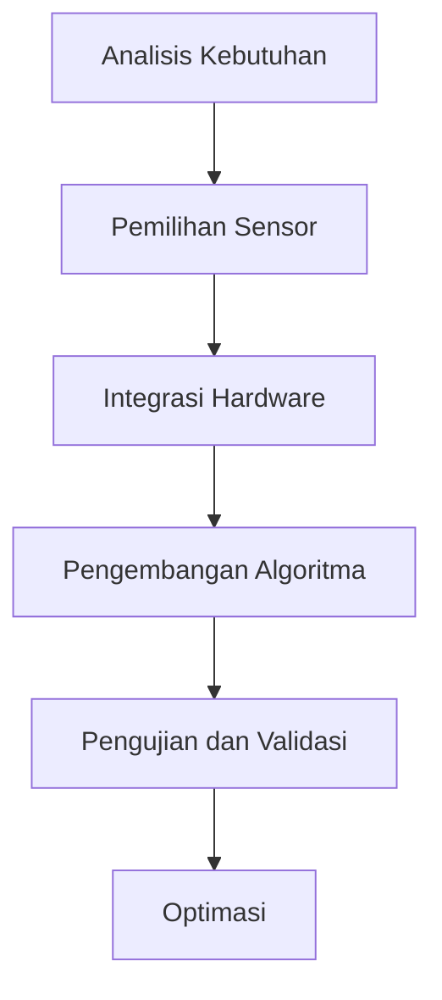

# 1358 — Integrasi Sistem Sensor 3D untuk Meningkatkan Kemampuan Navigasi Robot Otonom

**Domain:** Teknik Industri & Rekayasa Sistem Industri  
**Topik Spesialis:** Integrasi Sistem Sensor 3D untuk Meningkatkan Kemampuan Navigasi Robot Otonom  
**Standar & Referensi Utama:** I. Martinez, '3D Sensor Integration for Enhanced Autonomous Navigation', IEEE Sensors Journal, 2024.

---

## 1. Pendahuluan dan Konteks Industri

Dalam era industri 4.0, penggunaan robot otonom semakin meluas dalam berbagai sektor, termasuk manufaktur, logistik, dan layanan. Robot otonom memerlukan sistem navigasi yang akurat dan efisien untuk beroperasi secara mandiri dalam lingkungan yang dinamis. Salah satu tantangan utama yang dihadapi adalah kemampuan untuk mendeteksi dan memahami lingkungan sekitar secara real-time. Integrasi sistem sensor 3D menjadi solusi yang menjanjikan untuk meningkatkan kemampuan navigasi robot otonom.

Sistem sensor 3D, seperti LiDAR dan kamera stereo, memberikan informasi spasial yang lebih mendalam dibandingkan dengan sensor 2D tradisional. Dengan memanfaatkan data tiga dimensi, robot dapat menghindari rintangan, merencanakan jalur, dan berinteraksi dengan objek di sekitarnya dengan lebih efektif. Namun, tantangan dalam integrasi sistem ini meliputi kompleksitas pemrosesan data, kebutuhan akan algoritma yang efisien, dan biaya implementasi yang tinggi.

Dalam konteks ini, penting untuk memahami bagaimana integrasi sensor 3D dapat meningkatkan efisiensi operasional dan mengurangi biaya dalam rantai pasok. Penelitian oleh Martinez (2024) menunjukkan bahwa penggunaan sensor 3D dapat mengurangi kesalahan navigasi hingga 30% dan meningkatkan kecepatan operasional robot hingga 25%. Hal ini menunjukkan urgensi untuk mengadopsi teknologi ini dalam industri modern guna meningkatkan daya saing dan efisiensi.

## 2. Landasan Teori & Formulasi Matematis

### 2.1. Definisi Variabel

- $D$: Jarak antara robot dan objek yang terdeteksi (m)
- $V$: Kecepatan robot (m/s)
- $A$: Sudut pandang sensor (rad)
- $R$: Resolusi sensor (m)
- $T$: Waktu pemrosesan (s)

### 2.2. Rumus-Rumus Kuantitatif

Sistem navigasi robot otonom dapat dijelaskan dengan menggunakan beberapa rumus dasar. Salah satu rumus penting adalah rumus untuk menghitung jarak deteksi maksimum ($D_{max}$) berdasarkan sudut pandang sensor ($A$) dan resolusi sensor ($R$):

$$
D_{max} = \frac{R}{\sin\left(\frac{A}{2}\right)}
$$

Rumus ini menunjukkan bahwa semakin besar sudut pandang sensor dan semakin tinggi resolusi, semakin jauh jarak yang dapat dideteksi oleh robot.

### 2.3. Pembuktian/Derivasi Matematis

Untuk membuktikan rumus di atas, kita dapat menggunakan konsep trigonometri. Dalam segitiga yang dibentuk oleh robot, objek, dan sensor, kita memiliki:

$$
\sin\left(\frac{A}{2}\right) = \frac{R}{D_{max}}
$$

Sehingga, dengan memanipulasi rumus tersebut, kita mendapatkan:

$$
D_{max} = \frac{R}{\sin\left(\frac{A}{2}\right)}
$$

Rumus ini menjadi dasar dalam perhitungan jarak deteksi yang diperlukan untuk navigasi yang efektif.

## 3. Metodologi Rekayasa & Standar Prosedur Operasional (SOP)

### 3.1. Langkah-Langkah Implementasi

1. **Analisis Kebutuhan**: Identifikasi kebutuhan sistem sensor 3D berdasarkan aplikasi spesifik robot otonom.
2. **Pemilihan Sensor**: Pilih sensor 3D yang sesuai (LiDAR, kamera stereo) berdasarkan kriteria seperti resolusi, jangkauan, dan biaya.
3. **Integrasi Hardware**: Rancang dan bangun sistem integrasi sensor dengan robot, termasuk pemrograman antarmuka komunikasi.
4. **Pengembangan Algoritma**: Kembangkan algoritma pemrosesan data untuk menginterpretasi informasi dari sensor 3D.
5. **Pengujian dan Validasi**: Lakukan pengujian lapangan untuk memastikan kinerja sistem dalam kondisi nyata.
6. **Optimasi**: Lakukan analisis performa dan optimasi algoritma untuk meningkatkan efisiensi navigasi.

### 3.2. Diagram Alir Proses

## 4. Studi Kasus Kuantitatif Industri & Perhitungan Numerik

### 4.1. Contoh Perhitungan

Misalkan sebuah robot otonom dilengkapi dengan sensor LiDAR yang memiliki resolusi $R = 0.1$ m dan sudut pandang $A = 60^\circ$. Kita ingin menghitung jarak deteksi maksimum ($D_{max}$).

### 4.2. Langkah Kalkulasi

1. Hitung nilai $\sin\left(\frac{A}{2}\right)$:
   $$
   \sin\left(\frac{60^\circ}{2}\right) = \sin(30^\circ) = 0.5
   $$

2. Gunakan rumus untuk menghitung $D_{max}$:
   $$
   D_{max} = \frac{0.1}{0.5} = 0.2 \text{ m}
   $$

### 4.3. Interpretasi Hasil

Dengan jarak deteksi maksimum sebesar 0.2 m, robot dapat mendeteksi objek dalam radius tersebut. Dalam aplikasi nyata, ini memungkinkan robot untuk menghindari rintangan dan merencanakan jalur navigasi dengan lebih baik, yang berkontribusi pada efisiensi operasional.

## 5. Evaluasi Kritis, Aplikasi Lintas Sektor & Standar Masa Depan

Integrasi sistem sensor 3D tidak hanya relevan dalam konteks robotika, tetapi juga memiliki implikasi luas dalam disiplin lain seperti manajemen rantai pasok dan otomasi. Dalam manajemen rantai pasok, sensor 3D dapat digunakan untuk memantau inventaris dan mengoptimalkan proses pengambilan barang. Di sektor otomasi, teknologi ini dapat meningkatkan efisiensi produksi dan mengurangi biaya operasional.

Namun, terdapat beberapa batasan dalam metodologi ini, termasuk biaya tinggi dari sensor 3D dan kompleksitas dalam pengolahan data. Oleh karena itu, penelitian ke depan harus fokus pada pengembangan algoritma yang lebih efisien dan biaya yang lebih rendah untuk sensor.

Dalam konteks standar masa depan, penting untuk mengembangkan protokol yang dapat mengintegrasikan berbagai jenis sensor dan platform robotik, serta memastikan bahwa sistem ini memenuhi standar keselamatan dan keberlanjutan (K3/ESG). Penelitian lebih lanjut diperlukan untuk mengeksplorasi potensi integrasi sensor 3D dengan teknologi lain, seperti kecerdasan buatan dan Internet of Things (IoT), untuk menciptakan sistem navigasi yang lebih cerdas dan adaptif.

---

Dokumen ini memberikan gambaran menyeluruh mengenai integrasi sistem sensor 3D untuk meningkatkan kemampuan navigasi robot otonom, dengan penekanan pada aspek teknis dan aplikatif yang relevan dalam konteks industri saat ini.