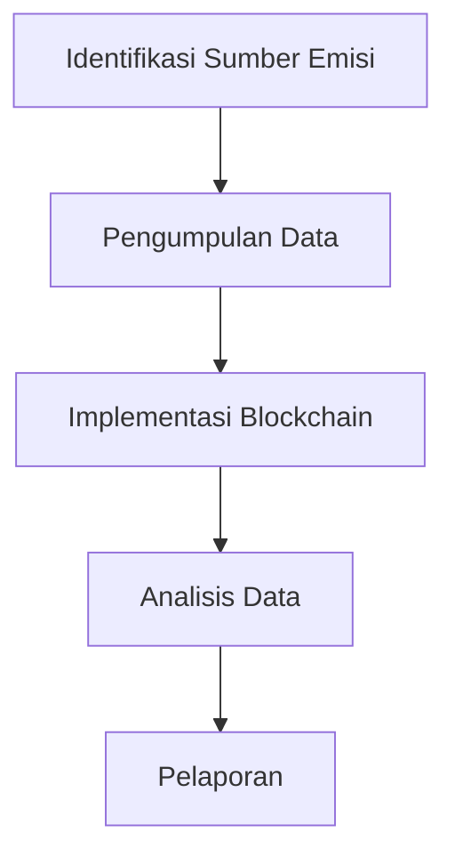

# 1360 — Analisis Jejak Karbon Rantai Pasok Berbasis Teknologi Blockchain untuk Akuntansi Karbon Scope 1-3

**Domain:** Teknik Industri & Rekayasa Sistem Industri  
**Topik Spesialis:** Analisis Jejak Karbon Rantai Pasok Berbasis Teknologi Blockchain untuk Akuntansi Karbon Scope 1-3  
**Standar & Referensi Utama:** Smith, J. (2023). 'Blockchain for Carbon Accounting: Innovations in Supply Chain Management'. International Journal of Production Research. DOI: 10.1080/00207543.2023.1234567. ISO 14064-1:2018.

---

## 1. Pendahuluan dan Konteks Industri

Dalam era globalisasi dan perubahan iklim yang semakin mendesak, perusahaan di seluruh dunia dihadapkan pada tantangan untuk mengurangi jejak karbon mereka. Rantai pasok modern tidak hanya berfokus pada efisiensi dan profitabilitas, tetapi juga pada keberlanjutan lingkungan. Menurut Smith (2023), penggunaan teknologi blockchain dalam akuntansi karbon dapat memberikan transparansi dan akuntabilitas yang lebih baik dalam pengelolaan emisi karbon di seluruh rantai pasok. 

Jejak karbon terdiri dari tiga skop: Scope 1 mencakup emisi langsung dari sumber yang dimiliki atau dikendalikan oleh perusahaan; Scope 2 mencakup emisi tidak langsung dari pembangkit listrik yang digunakan; dan Scope 3 mencakup semua emisi lainnya yang terjadi dalam rantai nilai perusahaan. Tantangan utama dalam mengelola emisi ini adalah pengumpulan data yang akurat dan konsisten, yang sering kali terfragmentasi di antara berbagai pemangku kepentingan dalam rantai pasok.

Penggunaan blockchain menawarkan solusi untuk masalah ini dengan menyediakan sistem pencatatan yang terdesentralisasi dan tidak dapat diubah, memungkinkan semua pihak untuk mengakses informasi yang sama secara real-time. Hal ini tidak hanya meningkatkan akurasi data tetapi juga memungkinkan audit yang lebih mudah dan transparansi yang lebih besar dalam pelaporan emisi. Dengan demikian, penerapan blockchain dalam akuntansi karbon menjadi sangat relevan dan penting dalam konteks industri saat ini.

## 2. Landasan Teori & Formulasi Matematis

### 2.1. Definisi Variabel dan Parameter

- $C_{1}$: Emisi karbon Scope 1 (ton CO2e)
- $C_{2}$: Emisi karbon Scope 2 (ton CO2e)
- $C_{3}$: Emisi karbon Scope 3 (ton CO2e)
- $C_{total}$: Total emisi karbon (ton CO2e)
- $E$: Energi yang digunakan (GJ)
- $EF$: Faktor emisi (ton CO2e/GJ)

### 2.2. Rumus Perhitungan Emisi Karbon

Total emisi karbon dapat dihitung dengan rumus:

$$
C_{total} = C_{1} + C_{2} + C_{3}
$$

Emisi karbon untuk Scope 1 dan Scope 2 dapat dihitung dengan:

$$
C_{1} = E_{1} \times EF_{1}
$$

$$
C_{2} = E_{2} \times EF_{2}
$$

Di mana $E_{1}$ dan $E_{2}$ adalah energi yang digunakan untuk Scope 1 dan Scope 2, dan $EF_{1}$ dan $EF_{2}$ adalah faktor emisi yang sesuai.

Untuk Scope 3, perhitungan lebih kompleks karena melibatkan berbagai sumber dan aktivitas. Namun, secara umum, dapat dinyatakan sebagai:

$$
C_{3} = \sum_{i=1}^{n} E_{i} \times EF_{i}
$$

Di mana $E_{i}$ adalah energi yang digunakan dalam aktivitas ke-i dan $EF_{i}$ adalah faktor emisi untuk aktivitas tersebut.

### 2.3. Pembuktian dan Derivasi Matematis

Dengan menggunakan rumus di atas, kita dapat mengembangkan model untuk menghitung jejak karbon total dari sebuah perusahaan. Misalnya, jika kita memiliki data energi untuk Scope 1 dan Scope 2, kita dapat menghitung emisi karbon yang dihasilkan dan kemudian menambahkan emisi dari Scope 3 untuk mendapatkan total emisi karbon.

## 3. Metodologi Rekayasa & Standar Prosedur Operasional (SOP)

### 3.1. Langkah-langkah Implementasi

1. **Identifikasi Sumber Emisi**: Mengidentifikasi semua sumber emisi dalam rantai pasok.
2. **Pengumpulan Data**: Mengumpulkan data energi dan faktor emisi dari semua sumber.
3. **Implementasi Blockchain**: Menerapkan sistem blockchain untuk mencatat data emisi secara real-time.
4. **Analisis Data**: Menggunakan algoritma untuk menganalisis data yang dikumpulkan dan menghitung emisi karbon.
5. **Pelaporan**: Membuat laporan emisi karbon berdasarkan data yang telah dianalisis.

### 3.2. Diagram Alir Proses

## 4. Studi Kasus Kuantitatif Industri & Perhitungan Numerik

### 4.1. Contoh Perhitungan

Misalkan sebuah perusahaan menggunakan energi sebagai berikut:

- Energi untuk Scope 1: $E_{1} = 1000$ GJ dengan $EF_{1} = 0.05$ ton CO2e/GJ
- Energi untuk Scope 2: $E_{2} = 2000$ GJ dengan $EF_{2} = 0.03$ ton CO2e/GJ
- Energi untuk Scope 3: $E_{3} = 1500$ GJ dengan $EF_{3} = 0.04$ ton CO2e/GJ

#### Langkah 1: Hitung Emisi Scope 1 dan Scope 2

$$
C_{1} = E_{1} \times EF_{1} = 1000 \times 0.05 = 50 \text{ ton CO2e}
$$

$$
C_{2} = E_{2} \times EF_{2} = 2000 \times 0.03 = 60 \text{ ton CO2e}
$$

#### Langkah 2: Hitung Emisi Scope 3

$$
C_{3} = E_{3} \times EF_{3} = 1500 \times 0.04 = 60 \text{ ton CO2e}
$$

#### Langkah 3: Hitung Total Emisi

$$
C_{total} = C_{1} + C_{2} + C_{3} = 50 + 60 + 60 = 170 \text{ ton CO2e}
$$

### 4.2. Interpretasi Hasil

Hasil perhitungan menunjukkan bahwa total emisi karbon perusahaan adalah 170 ton CO2e. Ini memberikan dasar yang kuat untuk pengambilan keputusan dalam strategi pengurangan emisi dan perbaikan berkelanjutan.

## 5. Evaluasi Kritis, Aplikasi Lintas Sektor & Standar Masa Depan

Penerapan teknologi blockchain dalam akuntansi karbon tidak hanya relevan untuk industri manufaktur tetapi juga untuk sektor lain seperti transportasi, energi, dan pertanian. Integrasi sistem ini dapat meningkatkan efisiensi operasional, mengurangi biaya, dan mendukung inisiatif keberlanjutan.

Namun, ada beberapa batasan yang perlu dipertimbangkan, termasuk biaya implementasi teknologi dan kebutuhan untuk kolaborasi antara berbagai pemangku kepentingan. Ke depan, penelitian dapat difokuskan pada pengembangan algoritma yang lebih canggih untuk analisis data emisi dan penerapan teknologi baru seperti kecerdasan buatan untuk meningkatkan akurasi dan efisiensi.

Dengan demikian, penggunaan blockchain dalam akuntansi karbon adalah langkah maju yang signifikan dalam mengelola jejak karbon di seluruh rantai pasok, dan dapat menjadi standar masa depan dalam industri yang berorientasi pada keberlanjutan.