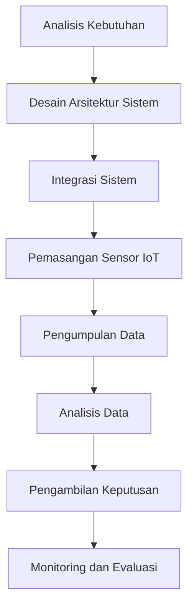

# 1374 — Pengembangan Jaringan Freight Intermodal Cerdas Menggunakan IoT dan Big Data Analytics

**Domain:** Teknik Industri & Rekayasa Sistem Industri  
**Topik Spesialis:** Pengembangan Jaringan Freight Intermodal Cerdas Menggunakan IoT dan Big Data Analytics  
**Standar & Referensi Utama:** Nguyen, H., & Robinson, P. (2026). Smart Intermodal Freight Networks. International Journal of Production Economics, 240, 108254. doi:10.1016/j.ijpe.2026.108254. ISO 28000:2024.

---

## 1. Pendahuluan dan Konteks Industri

Dalam era globalisasi dan digitalisasi, industri logistik menghadapi tantangan yang semakin kompleks. Jaringan freight intermodal, yang menggabungkan berbagai moda transportasi seperti kereta api, truk, dan kapal, menjadi semakin penting untuk meningkatkan efisiensi dan mengurangi biaya operasional. Menurut Nguyen dan Robinson (2026), pengembangan jaringan freight intermodal cerdas yang memanfaatkan Internet of Things (IoT) dan analitik big data dapat memberikan solusi untuk tantangan ini. 

Salah satu tantangan utama dalam rantai pasok modern adalah pengelolaan data yang besar dan beragam dari berbagai sumber. Data ini mencakup informasi tentang pengiriman, kondisi cuaca, dan status kendaraan. Tanpa pemanfaatan teknologi yang tepat, data ini sulit untuk dianalisis dan dioptimalkan. Di sisi lain, kebutuhan untuk meningkatkan transparansi dan akurasi dalam pengiriman barang semakin mendesak, terutama di tengah meningkatnya permintaan konsumen dan persaingan global yang ketat.

Penggunaan IoT dalam jaringan freight intermodal memungkinkan pengumpulan data secara real-time dari berbagai titik dalam rantai pasok. Dengan memanfaatkan big data analytics, perusahaan dapat menganalisis pola dan tren yang muncul dari data tersebut, sehingga memungkinkan pengambilan keputusan yang lebih baik dan lebih cepat. Namun, implementasi teknologi ini juga dihadapkan pada tantangan seperti integrasi sistem yang kompleks, keamanan data, dan kebutuhan untuk pelatihan sumber daya manusia.

## 2. Landasan Teori & Formulasi Matematis

### 2.1. Model Optimasi Jaringan

Model matematis yang sering digunakan dalam pengembangan jaringan freight intermodal adalah model optimasi jaringan. Misalkan kita memiliki:

- $N$: himpunan node dalam jaringan (misalnya, terminal, pelabuhan).
- $A$: himpunan arc yang menghubungkan node (misalnya, rute transportasi).
- $c_{ij}$: biaya transportasi dari node $i$ ke node $j$.
- $d_j$: permintaan di node $j$.

Model optimasi dapat dinyatakan sebagai berikut:

Minimalkan:

$$
Z = \sum_{(i,j) \in A} c_{ij} x_{ij}
$$

Dengan kendala:

1. Keseimbangan permintaan dan penawaran:

$$
\sum_{j \in N} x_{ij} - \sum_{j \in N} x_{ji} = d_i, \quad \forall i \in N
$$

2. Batasan kapasitas:

$$
x_{ij} \leq u_{ij}, \quad \forall (i,j) \in A
$$

Di mana $u_{ij}$ adalah kapasitas maksimum dari rute $i$ ke $j$.

### 2.2. Analisis Data

Analisis big data dalam konteks ini melibatkan penggunaan algoritma statistik dan machine learning untuk mengidentifikasi pola dalam data. Misalnya, kita dapat menggunakan regresi linier untuk memprediksi waktu pengiriman berdasarkan variabel seperti jarak, jenis moda transportasi, dan kondisi cuaca.

Model regresi dapat dinyatakan sebagai:

$$
Y = \beta_0 + \beta_1 X_1 + \beta_2 X_2 + \ldots + \beta_n X_n + \epsilon
$$

Di mana:

- $Y$: variabel dependen (waktu pengiriman).
- $X_1, X_2, \ldots, X_n$: variabel independen (jarak, moda transportasi, kondisi cuaca).
- $\beta_0, \beta_1, \ldots, \beta_n$: koefisien regresi.
- $\epsilon$: error term.

## 3. Metodologi Rekayasa & Standar Prosedur Operasional (SOP)

### 3.1. Langkah-langkah Implementasi

1. **Analisis Kebutuhan**: Identifikasi kebutuhan pengguna dan stakeholder dalam jaringan freight intermodal.
2. **Desain Arsitektur Sistem**: Rancang arsitektur sistem yang mencakup perangkat IoT, platform analitik, dan sistem manajemen data.
3. **Integrasi Sistem**: Integrasikan perangkat IoT dengan sistem manajemen yang ada, memastikan interoperabilitas.
4. **Pengumpulan Data**: Implementasikan sensor IoT untuk mengumpulkan data dari berbagai titik dalam jaringan.
5. **Analisis Data**: Gunakan algoritma analitik untuk memproses dan menganalisis data yang dikumpulkan.
6. **Pengambilan Keputusan**: Buat dashboard untuk visualisasi data dan mendukung pengambilan keputusan berbasis data.
7. **Monitoring dan Evaluasi**: Lakukan monitoring secara berkala untuk mengevaluasi kinerja sistem dan melakukan perbaikan jika diperlukan.

### 3.2. Diagram Alir Proses

## 4. Studi Kasus Kuantitatif Industri & Perhitungan Numerik

### 4.1. Contoh Kasus

Misalkan kita memiliki jaringan freight intermodal dengan 3 node: A, B, dan C, serta rute yang menghubungkan mereka. Data berikut diberikan:

- Biaya transportasi: $c_{AB} = 5$, $c_{AC} = 10$, $c_{BC} = 3$.
- Permintaan: $d_A = 0$, $d_B = 10$, $d_C = 5$.
- Kapasitas rute: $u_{AB} = 15$, $u_{AC} = 10$, $u_{BC} = 10$.

### 4.2. Langkah Kalkulasi

1. **Modelkan Fungsi Tujuan**:

$$
Z = 5x_{AB} + 10x_{AC} + 3x_{BC}
$$

2. **Tentukan Kendala**:

- Keseimbangan untuk node B:

$$
x_{AB} - x_{BC} = 10
$$

- Keseimbangan untuk node C:

$$
x_{AC} + x_{BC} = 5
$$

3. **Selesaikan Model**:

Dengan menggunakan metode Simplex atau alat optimasi lainnya, kita dapat menemukan nilai optimal untuk $x_{AB}$, $x_{AC}$, dan $x_{BC}$. Misalkan hasilnya adalah:

- $x_{AB} = 10$
- $x_{AC} = 0$
- $x_{BC} = 5$

### 4.3. Interpretasi Hasil

Biaya total untuk pengiriman barang dalam jaringan ini adalah:

$$
Z = 5(10) + 10(0) + 3(5) = 50 + 0 + 15 = 65
$$

Hasil ini menunjukkan bahwa dengan menggunakan rute yang optimal, total biaya pengiriman dapat diminimalkan menjadi 65.

## 5. Evaluasi Kritis, Aplikasi Lintas Sektor & Standar Masa Depan

Pengembangan jaringan freight intermodal cerdas tidak hanya berdampak pada sektor logistik, tetapi juga berhubungan erat dengan disiplin lain seperti manajemen rantai pasok, otomasi, dan manajemen biaya. Dalam konteks K3 (Keselamatan dan Kesehatan Kerja) dan ESG (Environmental, Social, Governance), penerapan teknologi ini dapat membantu perusahaan dalam mematuhi regulasi yang lebih ketat dan meningkatkan keberlanjutan operasional.

Namun, terdapat batasan dalam metodologi yang digunakan, seperti ketergantungan pada kualitas data dan kemampuan analisis. Oleh karena itu, riset masa depan perlu difokuskan pada pengembangan algoritma yang lebih canggih dan integrasi sistem yang lebih baik untuk meningkatkan efisiensi dan efektivitas jaringan freight intermodal.

Dengan mengikuti standar ISO 28000:2024, perusahaan dapat memastikan bahwa sistem yang dikembangkan tidak hanya efisien tetapi juga aman dan dapat diandalkan. Ini akan menjadi kunci dalam menghadapi tantangan industri yang terus berkembang di masa depan.