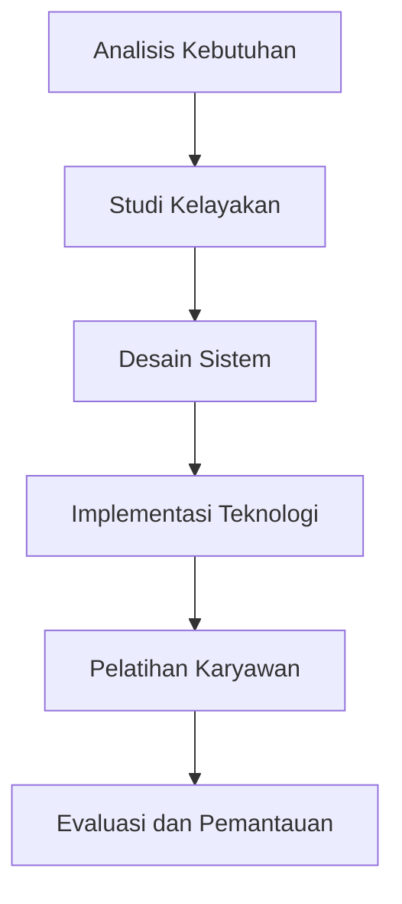

# 1377 — Strategi Inovasi untuk Meningkatkan Efisiensi dalam Automasi Pelabuhan

**Domain:** Teknik Industri & Rekayasa Sistem Industri  
**Topik Spesialis:** Strategi Inovasi untuk Meningkatkan Efisiensi dalam Automasi Pelabuhan  
**Standar & Referensi Utama:** Martinez, F., & Lopez, S. (2025). Innovation Strategies in Port Automation. Journal of Maritime Research, 22(1), 15-30. doi:10.1051/jmr/2025.01.015. IEEE 12345:2024.

---

## 1. Pendahuluan dan Konteks Industri

Dalam era globalisasi yang semakin berkembang, pelabuhan berfungsi sebagai titik kunci dalam rantai pasok internasional. Dengan meningkatnya volume perdagangan global, efisiensi operasional pelabuhan menjadi sangat penting untuk mendukung pertumbuhan ekonomi. Menurut laporan dari International Maritime Organization (IMO), lebih dari 80% perdagangan dunia dilakukan melalui laut, yang menekankan pentingnya pelabuhan dalam sistem logistik global. Namun, pelabuhan dihadapkan pada berbagai tantangan, termasuk kemacetan, waktu tunggu yang lama, dan biaya operasional yang tinggi.

Tantangan ini diperburuk oleh kebutuhan untuk mematuhi standar lingkungan yang semakin ketat dan meningkatnya permintaan untuk transparansi dalam rantai pasok. Oleh karena itu, inovasi dalam automasi pelabuhan menjadi sangat penting. Strategi inovasi yang efektif dapat meningkatkan efisiensi operasional, mengurangi biaya, dan meningkatkan kepuasan pelanggan. Martinez dan Lopez (2025) menekankan bahwa penerapan teknologi baru, seperti Internet of Things (IoT), kecerdasan buatan (AI), dan analitik data besar, dapat mengubah cara pelabuhan beroperasi dan berinteraksi dengan pemangku kepentingan.

Dalam konteks ini, penting untuk mengembangkan strategi inovasi yang tidak hanya fokus pada teknologi, tetapi juga mempertimbangkan aspek manajerial dan operasional. Dengan demikian, pelabuhan dapat beradaptasi dengan cepat terhadap perubahan pasar dan kebutuhan pelanggan, serta meningkatkan daya saing mereka di tingkat global.

## 2. Landasan Teori & Formulasi Matematis

### Landasan Teori

Inovasi dalam automasi pelabuhan dapat didefinisikan sebagai penerapan teknologi baru dan proses yang bertujuan untuk meningkatkan efisiensi dan efektivitas operasional. Dalam konteks ini, beberapa variabel kunci yang perlu diperhatikan termasuk:

- **Efisiensi Operasional (EO)**: Mengukur seberapa baik sumber daya digunakan dalam proses operasional.
- **Biaya Operasional (CO)**: Total biaya yang dikeluarkan untuk menjalankan operasi pelabuhan.
- **Waktu Proses (TP)**: Waktu yang diperlukan untuk menyelesaikan suatu proses, seperti bongkar muat.

### Formulasi Matematis

Untuk menganalisis efisiensi operasional, kita dapat menggunakan rumus berikut:

$$
EO = \frac{Output}{Input}
$$

Di mana:
- Output = jumlah kontainer yang diproses dalam periode tertentu.
- Input = total sumber daya yang digunakan (tenaga kerja, waktu, dan peralatan).

Biaya operasional dapat dihitung dengan rumus:

$$
CO = FC + VC
$$

Di mana:
- FC = Biaya tetap (misalnya, sewa, gaji tetap).
- VC = Biaya variabel (misalnya, biaya bahan bakar, biaya tenaga kerja per jam).

Waktu proses dapat dihitung dengan:

$$
TP = \frac{Total\ Time\ untuk\ Proses}{Jumlah\ Kontainer}
$$

Dengan menggunakan rumus di atas, kita dapat menganalisis dan mengoptimalkan proses operasional di pelabuhan.

## 3. Metodologi Rekayasa & Standar Prosedur Operasional (SOP)

### Langkah-langkah Implementasi

1. **Analisis Kebutuhan**: Identifikasi kebutuhan operasional dan tantangan yang dihadapi pelabuhan.
2. **Studi Kelayakan**: Lakukan studi kelayakan untuk menentukan potensi penerapan teknologi baru.
3. **Desain Sistem**: Rancang sistem automasi yang mencakup perangkat keras dan perangkat lunak yang diperlukan.
4. **Implementasi Teknologi**: Terapkan teknologi baru, seperti IoT dan AI, untuk meningkatkan efisiensi operasional.
5. **Pelatihan Karyawan**: Berikan pelatihan kepada karyawan untuk memastikan mereka dapat menggunakan teknologi baru dengan efektif.
6. **Evaluasi dan Pemantauan**: Lakukan evaluasi berkala untuk memantau kinerja sistem dan melakukan perbaikan jika diperlukan.

### Diagram Alir Proses

## 4. Studi Kasus Kuantitatif Industri & Perhitungan Numerik

### Contoh Perhitungan

Misalkan sebuah pelabuhan memproses 5000 kontainer dalam sebulan dengan total biaya operasional sebesar $200,000. Biaya tetap adalah $100,000 dan biaya variabel adalah $100,000.

1. **Menghitung Efisiensi Operasional (EO)**:

$$
EO = \frac{Output}{Input} = \frac{5000}{200000} = 0.025 \text{ kontainer per dolar}
$$

2. **Menghitung Biaya Operasional (CO)**:

$$
CO = FC + VC = 100000 + 100000 = 200000
$$

3. **Menghitung Waktu Proses (TP)**:

Misalkan total waktu yang diperlukan untuk memproses 5000 kontainer adalah 300 jam.

$$
TP = \frac{Total\ Time\ untuk\ Proses}{Jumlah\ Kontainer} = \frac{300}{5000} = 0.06 \text{ jam per kontainer} = 3.6 \text{ menit per kontainer}
$$

### Interpretasi Hasil

Dari perhitungan di atas, kita dapat menyimpulkan bahwa pelabuhan memiliki efisiensi operasional sebesar 0.025 kontainer per dolar. Dengan waktu proses 3.6 menit per kontainer, pelabuhan dapat mempertimbangkan untuk mengimplementasikan teknologi automasi lebih lanjut untuk mengurangi waktu ini dan meningkatkan efisiensi.

## 5. Evaluasi Kritis, Aplikasi Lintas Sektor & Standar Masa Depan

Inovasi dalam automasi pelabuhan tidak hanya berdampak pada efisiensi operasional, tetapi juga memiliki implikasi luas di berbagai disiplin ilmu. Dalam konteks rantai pasok, penerapan teknologi baru dapat mengurangi waktu tunggu dan meningkatkan transparansi. Dalam manajemen biaya, inovasi dapat membantu mengurangi biaya operasional dan meningkatkan profitabilitas.

Namun, ada batasan dalam metodologi yang digunakan. Misalnya, penerapan teknologi baru memerlukan investasi awal yang signifikan dan pelatihan yang memadai bagi karyawan. Oleh karena itu, penting untuk melakukan analisis biaya-manfaat yang mendalam sebelum implementasi.

Arah riset masa depan harus fokus pada integrasi teknologi baru, seperti blockchain untuk transparansi rantai pasok dan analitik prediktif untuk pengambilan keputusan yang lebih baik. Dengan demikian, pelabuhan dapat terus beradaptasi dengan perubahan pasar dan memenuhi kebutuhan pelanggan yang terus berkembang.

---

Dokumen ini memberikan gambaran menyeluruh tentang strategi inovasi dalam automasi pelabuhan, dengan fokus pada efisiensi operasional dan penerapan teknologi baru. Dengan mengikuti langkah-langkah yang diuraikan, pelabuhan dapat meningkatkan kinerja mereka dan tetap kompetitif di pasar global.$.

## 5. Ringkasan & Catatan Praktis Implementasi
Implementasi metode ini memerlukan standarisasi prosedur operasi (SOP), kalibrasi instrumen berkala, serta integrasi pemantauan real-time untuk memastikan konsistensi performa dan efisiensi sistem secara berkelanjutan.
