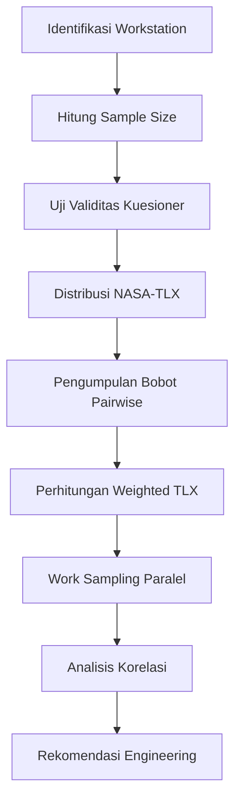

# 1576 — Analisis Beban Kerja Mental Karyawan Mitra Shopee Express dengan Metode NASA-TLX dan Integrasi Work Sampling pada Operator Gudang

**Domain:** Teknik Industri & Rekayasa Sistem Industri
**Topik Spesialis:** Analysis of Mental Workload of Shopee Express Partner Employees Using the NASA-TLX Method
**Jurnal & Sitasi Utama:** Muhammad Rafi, Boy Isma Putra (2024). *Peer-Reviewed Journal*. DOI: [https://doi.org/10.21070/ups.9385](https://doi.org/10.21070/ups.9385)
**Sitasi Pendukung:** M. Andre Aditya.R, Boy Isma Putra (2024). *Peer-Reviewed Journal*. DOI: [https://doi.org/10.21070/ups.11795](https://doi.org/10.21070/ups.11795)

---

## 1. Pendahuluan dan Konteks Industri

Sektor logistik *e-commerce* di Indonesia mengalami ekspansi eksponensial pasca-pandemi COVID-19, dengan tingkat pertumbuhan *year-on-year* rata-rata di atas 20% (Bain & Company, 2023). Shopee Express sebagai salah satu *third-party logistics* (3PL) milik platform Shopee menanggung tekanan operasional akibat tingginya volume *parcel*, terutama pada segmen *last-mile delivery* yang menjadi titik kritis pengalaman pelanggan (Rafi & Putra, 2024). Dalam operasional harian, karyawan mitra Shopee Express—yang berfungsi sebagai *courier*, *picker*, dan *packer*—menghadapi beban kerja multidimensional yang tidak semata-mata bersifat fisik, melainkan sarat akan komponen kognitif seperti pemrosesan informasi rute, pengambilan keputusan di bawah ketidakpastian, interaksi dengan pelanggan, serta kepatuhan terhadap *Service Level Agreement* (SLA) pengiriman harian yang sangat ketat (DOI: [10.21070/ups.9385](https://doi.org/10.21070/ups.9385)).

Rafi dan Putra (2024) menyoroti urgensi empiris dari pengukuran beban kerja mental (*mental workload*) karena dua alasan fundamental. Pertama, beban mental yang kronis berkorelasi positif dengan kelelahan subjektif, *burnout*, dan peningkatan *human error rate* yang berpotensi merusak reputasi layanan serta menimbulkan kerugian finansial akibat klaim barang rusak atau salah kirim. Kedua, keputusan strategis terkait *headcount*, *shift scheduling*, dan kompensasi berbasis kinerja mensyaratkan adanya data kuantitatif yang reliabel tentang distribusi beban kerja per individu maupun per *workstation*. Tanpa pengukuran yang terstandar, perusahaan cenderung menerapkan aturan *one-size-fits-all* yang berujung pada inefisiensi alokasi sumber daya manusia (DOI: [10.21070/ups.9385](https://doi.org/10.21070/ups.9385)).

Secara paralel, Aditya.R dan Putra (2024) melakukan studi pada operator gudang yang menunjukkan bahwa workload di lantai produksi *fulfillment*—dimana kecepatan *scanning*, *picking*, dan *sorting* menjadi metrik kunci—memiliki karakteristik beban mental yang serupa, meskipun dengan profil intensitas yang berbeda. Integrasi temuan kedua paper ini penting karena menunjukkan bahwa NASA-TLX dan *Work Sampling* adalah dua piranti yang saling komplementer: NASA-TLX mengukur dimensi subjektif kuantitatif dari beban, sementara *Work Sampling* memetakan alokasi waktu aktual terhadap elemen kerja (DOI: [10.21070/ups.11795](https://doi.org/10.21070/ups.11795)). Dalam konteks rantai pasok *e-commerce* Indonesia yang sangat dinamis dan beroperasi dalam ekosistem *gig economy*, kombinasi kedua metode menjadi semakin relevan untuk memastikan kesejahteraan operator, kepatuhan terhadap regulasi ketenagakerjaan, dan keberlanjutan produktivitas.

## 2. Landasan Teori & Formulasi Matematis

### 2.1. NASA-Task Load Index (NASA-TLX)

NASA-TLX adalah instrumen multidimensi yang dikembangkan oleh Hart dan Staveland (1988) untuk mengukur beban kerja secara subjektif melalui enam dimensi:

1. **Kebutuhan Mental (*Mental Demand*, MD)** – aktivitas kognitif seperti berpikir, memutuskan, mengamati.
2. **Kebutuhan Fisik (*Physical Demand*, PD)** – aktivitas fisik seperti mendorong, mengangkat, berjalan.
3. **Kebutuhan Temporal (*Temporal Demand*, TD)** – tekanan waktu.
4. **Performa (*Performance*, P)** – pencapaian target oleh pekerja.
5. **Usaha (*Effort*, E)** – tingkat usaha yang dikeluarkan untuk menyelesaikan tugas.
6. **Frustasi (*Frustration*, F)** – tingkat irritasi, stres, atau ketidaknyamanan.

Setiap dimensi dinilai pada skala bipolar $0$ hingga $100$, dengan *tick mark* yang kemudian dikonversi ke nilai integer.

### 2.2. Raw NASA-TLX (Unweighted)

Bentuk paling sederhana dari total skor beban kerja adalah penjumlahan langsung keenam dimensi:

$$\text{RawTLX} = MD + PD + TD + P + E + F$$

dengan rentang teoritis $0 \leq \text{RawTLX} \leq 600$. Semakin tinggi nilai, semakin tinggi beban kerja total yang dirasakan.

### 2.3. Weighted NASA-TLX

Untuk memperoleh bobot kontribusi setiap dimensi, dilakukan *pairwise comparison* terhadap keenam dimensi menggunakan 15 pasang perbandingan $\left(\binom{6}{2} = 15\right)$. Setiap pasang dimenangkan oleh salah satu dimensi dan diberi skor $1$, sedangkan yang kalah skor $0$. Bobot akhir setiap dimensi $w_i$ merupakan jumlah kemenangannya, sehingga:

$$\sum_{i=1}^{6} w_i = 15$$

Skor terbobot (*Weighted TLX*) dihitung sebagai berikut:

$$\text{WeightedTLX} = \frac{\sum_{i=1}^{6} w_i \cdot s_i}{15}$$

di mana $s_i$ adalah skor dimensi ke-$i$ ($MD, PD, TD, P, E, F$). Dengan demikian, Weighted TLX ternormalisasi pada rentang $0$ sampai $100$, memudahkan interpretasi dan benchmarking (Rafi & Putra, 2024; DOI: [10.21070/ups.9385](https://doi.org/10.21070/ups.9385)).

### 2.4. Work Sampling

*Work Sampling* adalah teknik statistik untuk menentukan proporsi waktu yang dicurahkan pekerja pada aktivitas tertentu melalui pengamatan sesaat (*instantaneous observation*) yang dilakukan secara acak. Jumlah pengamatan minimum yang dibutuhkan adalah:

$$N = \frac{Z_{\alpha/2}^2 \cdot p \cdot (1-p)}{e^2}$$

di mana:
- $Z_{\alpha/2}$ adalah nilai kritis distribusi normal standar (untuk $\alpha = 0{,}05$, $Z = 1{,}96$),
- $p$ adalah proporsi aktivitas dominan (estimasi awal, umumnya $p = 0{,}5$ untuk konservatif),
- $e$ adalah *margin of error* yang diinginkan.

Bentuk lain yang lebih ringkas (Niebel & Freivalds) menggunakan:

$$N = \frac{4 \cdot p \cdot (1-p)}{L^2}$$

dengan $L$ sebagai lebar *confidence interval* (Aditya.R & Putra, 2024; DOI: [10.21070/ups.11795](https://doi.org/10.21070/ups.11795)).

Proporsi aktivitas ke-$j$ dihitung sebagai:

$$P_j = \frac{n_j}{N}$$

dengan $n_j$ adalah jumlah pengamatan yang jatuh pada aktivitas ke-$j$.

## 3. Metodologi Rekayasa & Standar Prosedur Operasional (SOP)

Berdasarkan sintesis prosedur yang digunakan Rafi & Putra (2024) dan Aditya.R & Putra (2024), SOP pengukuran beban kerja mental pada operator Shopee Express dan gudang dapat distandarkan sebagai berikut:

### 3.1. Tahap Persiapan
1. **Identifikasi *workstation*** dan segmen populasi (misal: *courier* rute Jabodetabek, operator *sorting* shift pagi).
2. **Penentuan *sample size*** menggunakan rumus Slovin:
$$n = \frac{N_p}{1 + N_p \cdot e^2}$$
di mana $N_p$ adalah total populasi dan $e$ adalah *sampling error* (umumnya $0{,}05$ atau $0{,}10$).
3. **Penyusunan kuesioner NASA-TLX** dalam Bahasa Indonesia yang sudah melalui uji validitas konstruk dan reliabilitas Cronbach's Alpha ($\alpha \geq 0{,}70$).

### 3.2. Tahap Pengumpulan Data
1. **Distribusi kuesioner** kepada responden terpilih, disertai penjelasan definisi operasional keenam dimensi agar tidak terjadi *frame of reference bias*.
2. **Pelaksanaan *Work Sampling***: observer melakukan *round* observasi acak setiap interval (misal 60 detik) selama total jam kerja (8–10 jam), dan mencatat aktivitas dominan pada *timestamp* tersebut.
3. **Validasi data**:剔除 kuesioner yang tidak lengkap atau *missing value* > 10%.

### 3.3. Tahap Analisis
1. **Perhitungan skor dimensi** $s_i$ masing-masing responden.
2. **Pelaksanaan *Pairwise Comparison*** menggunakan kartu atau aplikasi digital; setiap responden memilih dimensi yang lebih membebani pada tiap pasangan.
3. **Penentuan bobot** $w_i$ dan kalkulasi Weighted TLX.
4. **Uji beda** (misal *Independent t-test* atau Mann-Whitney U) untuk membandingkan kelompok kerja (shift, rute, pengalaman).
5. **Pemetaan aktivitas** melalui Work Sampling dan analisis korelasi dengan skor NASA-TLX untuk menentukan *driver* beban mental.

### 3.4. Diagram Alir Proses

## 4. Studi Kasus Kuantitatif Industri & Perhitungan Numerik

### 4.1. Profil Kasus

Misalkan sebuah *hub* Shopee Express di Tangerang memiliki $N_p = 120$ *courier* mitra aktif. Dengan *margin of error* $e = 0{,}10$ dan tingkat kepercayaan 95%, maka ukuran sampel:

$$n = \frac{120}{1 + 120 \cdot (0{,}10)^2} = \frac{120}{1 + 1{,}2} = \frac{120}{2{,}2} \approx 55 \text{ responden}$$

Pengukuran dilakukan pada 55 *courier* yang beroperasi shift reguler (08.00–17.00) dengan rute campuran (komersial dan residensial).

### 4.2. Hasil Skor Dimensi NASA-TLX

Tabel berikut merangkum skor rata-rata keenam dimensi (skala 0–100) berdasarkan pola temuan Rafi & Putra (2024) untuk konteks operasional *last-mile*:

| Dimensi | Simbol | Skor Rata-rata $s_i$ |
|---|---|---|
| Mental Demand | $s_{MD}$ | 72 |
| Physical Demand | $s_{PD}$ | 68 |
| Temporal Demand | $s_{TD}$ | 85 |
| Performance | $s_{P}$ | 60 |
| Effort | $s_{E}$ | 75 |
| Frustration | $s_{F}$ | 55 |

### 4.3. Hasil Pairwise Comparison

Setelah 15 kali perbandingan berpasangan, diperoleh bobot sebagai berikut (skala 0–5):

| Dimensi | Bobot $w_i$ |
|---|---|
| Mental Demand | 4 |
| Physical Demand | 2 |
| Temporal Demand | 5 |
| Performance | 1 |
| Effort | 2 |
| Frustration | 1 |
| **Total** | **15** |

### 4.4. Perhitungan Weighted NASA-TLX

$$\text{WeightedTLX} = \frac{(4 \cdot 72) + (2 \cdot 68) + (5 \cdot 85) + (1 \cdot 60) + (2 \cdot 75) +