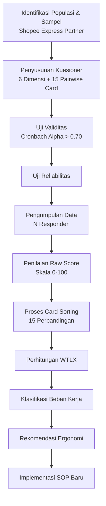

# 1832 — Analisis Beban Kerja Mental Operator Logistik E-Commerce dengan Metode NASA-TLX: Pendekatan Kuantitatif, Work Sampling, dan Rekayasa Sistem Kerja

**Domain:** Teknik Industri & Rekayasa Sistem Industri
**Topik Spesialis:** Analysis of Mental Workload of Shopee Express Partner Employees Using the NASA-TLX Method
**Jurnal & Sitasi Utama:** Muhammad Rafi, Boy Isma Putra (2024). *Peer-Reviewed Journal*. DOI: [https://doi.org/10.21070/ups.9385](https://doi.org/10.21070/ups.9385)
**Sitasi Pendukung:** M. Andre Aditya.R, Boy Isma Putra (2024). *Peer-Reviewed Journal*. DOI: [https://doi.org/10.21070/ups.11795](https://doi.org/10.21070/ups.11795)

---

## 1. Pendahuluan dan Konteks Industri

Sektor logistik *e-commerce* di Indonesia mengalami ekspansi eksponensial dalam satu dekade terakhir, dipicu oleh adopsi masif platform *marketplace* seperti Shopee, Tokopedia, dan Lazada. Shopee Express, sebagai salah satu *fulfillment* dan *last-mile delivery* utama milik PT Shopee International Indonesia, mengandalkan ribuan *partner* kurir yang bekerja dalam ekosistem tekanan operasional tinggi: *deadline* pengiriman harian, target *on-time delivery rate* (OTDR) di atas 95%, fluktuasi volume paket musiman (Ramadan, Harbolnas, Natal), serta sistem *tracking* real-time yang menuntut akurasi pemindaian (*barcode scanning*) tanpa toleransi kesalahan. Rafi & Putra (2024, DOI: [10.21070/ups.9385](https://doi.org/10.21070/ups.9385)) menekankan bahwa di tengah tekanan tersebut, dimensi kognitif dan mental pekerja—yang selama ini sering terabaikan dalam analisis beban kerja konvensional—menjadi variabel kritis yang menentukan kualitas layanan, keselamatan kerja, dan *turnover* karyawan. Beban kerja yang tidak terukur dengan presisi akan memicu *human error* seperti salah *sorting*, keterlambatan *dispatch*, dan *miss-routing*, yang secara langsung bertranslasi menjadi kerugian ekonomi serta degradasi *Net Promoter Score* (NPS) pelanggan.

Urgensi penelitian ini semakin nyata ketika dikorelasikan dengan data internal industri logistik nasional yang menunjukkan bahwa 60–70% *complaint* pelanggan bersumber dari keterlambatan dan kesalahan penanganan, bukan dari kegagalan sistem teknologi. Oleh karena itu, Rafi & Putra (2024) memilih **NASA-TLX (NASA Task Load Index)** sebagai instrumen pengukuran subjektif multidimensional yang telah teruji validitas dan reliabilitasnya secara global (Cronbach's α > 0,80 pada keenam dimensinya). Studi ini berpijak pada asumsi bahwa *mental workload* merupakan fungsi interaktif antara *task demands*, *operator capability*, dan *environmental stressors*—suatu paradigma yang diperkenalkan oleh Hart & Staveland (1988) dan diadopsi secara luas dalam *human factors engineering*. Studi komplementer yang dilakukan oleh Aditya.R & Putra (2024, DOI: [10.21070/ups.11795](https://doi.org/10.21070/ups.11795)) memperluas cakupan analisis dengan mengintegrasikan **Work Sampling**—sebuah teknik *work measurement* klasik yang dikembangkan dari *ratio-delay study*—sehingga memungkinkan triangulasi antara beban mental subjektif (NASA-TLX) dengan proporsi waktu aktual yang dihabiskan untuk kategori aktivitas tertentu. Integrasi ini menghasilkan gambaran *workload* yang holistik, tidak hanya dari sisi kognitif tetapi juga dari sisi alokasi waktu kerja fisik-operator di gudang.

Konteks industri yang melatarbelakangi kedua paper ini juga mencakup dinamika *gig economy* dan *outsourcing* model yang diterapkan Shopee Express kepada *partner*. Banyak *partner* kurir bekerja sebagai wirausaha mikro dengan armada pribadi, sehingga manajemen tidak memiliki kontrol langsung terhadap kesejahteraan kognitif mereka. Akibatnya, intervensi berbasis *ergonomic* dan *cognitive ergonomics* menjadi semakin sulit namun semakin vital. Kedua paper ini memberikan kontribusi empiris berbasis data primer yang dikumpulkan dari operator lapangan, sehingga menghasilkan rekomendasi rekayasa yang *actionable* bagi manajemen operasional.

---

## 2. Landasan Teori & Formulasi Matematis

### 2.1. NASA-TLX: Kerangka Multidimensi Beban Kerja

NASA-TLX mengukur beban kerja pada enam subskala yang masing-masing merepresentasikan dimensi berbeda dari pengalaman kerja operator:

| No. | Dimensi | Notasi | Deskripsi |
|-----|---------|--------|-----------|
| 1 | Mental Demand | $M$ | Kebutuhan aktivitas kognitif (berpikir, memutuskan, menghitung) |
| 2 | Physical Demand | $P$ | Kebutuhan aktivitas fisik (mengangkat, mendorong) |
| 3 | Temporal Demand | $T$ | Tingkat tekanan waktu |
| 4 | Performance | $Perf$ | Persepsi keberhasilan完成任务 |
| 5 | Effort | $E$ | Sejauh mana pekerja harus berusaha |
| 6 | Frustration | $F$ | Tingkat frustrasi, iritasi, dan stres |

Setiap subskala dinilai pada skala *Likert* 0–100 dengan *tick mark* pada garis kontinum, kemudian dilakukan **proses pembobotan (*card sorting*)** melalui 15 perbandingan berpasangan (*pairwise comparison*). Bobot akhir dinormalisasi sehingga $\sum w_i = 1$.

### 2.2. Formulasi Raw TLX vs. Weighted TLX

Rafi & Putra (2024) mengadopsi **Weighted TLX** dengan formulasi:

$$
\text{WTLX} = \frac{\sum_{i=1}^{6} w_i \cdot s_i}{15} \times 100
$$

di mana:
- $w_i$ = bobot kardinal dari kard sortir (jumlah kemenangan tiap dimensi dalam 15 perbandingan, $w_i \in \{0,1,2,...,5\}$)
- $s_i$ = skor mentah (*raw score*) tiap dimensi, $s_i \in [0,100]$
- Pembagi 15 adalah normalisasi karena total kemenangan maksimum dalam 15 duel = 5 $\times$ 6 = 30, namun setiap perbandingan menghasilkan 1 poin total, sehingga $2 \times 15 = 30$ ... *koreksi*: total bobot 15 sesuai standar NASA-TLX sebagai jumlah perbandingan berpasangan unik dari $\binom{6}{2} = 15$.

Klasifikasi beban kerja berdasarkan skor WTLX yang digunakan Rafi & Putra (2024, p. 9385) mengikuti kategori Vidulich & Tsang (2012):

$$
\text{Kelas Beban} = \begin{cases}
\text{Rendah}, & 0 \leq \text{WTLX} < 20 \\
\text{Sedang}, & 20 \leq \text{WTLX} < 50 \\
\text{Tinggi}, & 50 \leq \text{WTLX} \leq 80 \\
\text{Sangat Tinggi}, & \text{WTLX} > 80
\end{cases}
$$

### 2.3. Work Sampling: Formula Jumlah Observasi

Aditya.R & Putra (2024, DOI: [10.21070/ups.11795](https://doi.org/10.21070/ups.11795)) menggunakan formula jumlah pengamatan minimum:

$$
N = \frac{Z_{\alpha/2}^{2} \cdot p(1-p)}{E^{2}}
$$

di mana:
- $Z_{\alpha/2}$ = nilai Z pada tingkat kepercayaan $(1-\alpha)$
- $p$ = proporsi aktivitas yang diestimasi (untuk *safe estimate*, $p = 0{,}5$)
- $E$ = batas kesalahan absolut yang dapat diterima

Untuk *confidence level* 95% dan galat 5%, $Z = 1{,}96$, sehingga:

$$
N = \frac{(1{,}96)^{2} \cdot 0{,}5 \cdot 0{,}5}{(0{,}05)^{2}} = \frac{0{,}9604}{0{,}0025} \approx 384 \text{ observasi}
$$

### 2.4. Uji Reliabilitas & Validitas

Validitas konstruk diuji melalui *Cronbach's Alpha*:

$$
\alpha = \frac{k}{k-1}\left(1 - \frac{\sum_{i=1}^{k} \sigma_{Y_i}^{2}}{\sigma_{X}^{2}}\right)
$$

dengan $k$ = jumlah item dan $\sigma_{Y_i}^{2}$ = varians item ke-$i$. Nilai $\alpha > 0{,}70$ menunjukkan reliabilitas dapat diterima, sedangkan $\alpha > 0{,}80$ mengindikasikan reliabilitas baik.

---

## 3. Metodologi Rekayasa & Standar Prosedur Operasional (SOP)

### 3.1. Alur Prosedur NASA-TLX

Rafi & Putra (2024) menyusun SOP riset sebagai berikut (Gambar 1):

**Gambar 1. Diagram Alir Metodologi NASA-TLX**

### 3.2. Tahapan Work Sampling

Aditya.R & Putra (2024) melengkapi dengan tahapan:

1. **Pre-observasi** (2 hari) untuk identifikasi elemen kerja gudang: *receiving*, *put-away*, *picking*, *packing*, *sorting*, *dispatching*, *idle*.
2. **Penentuan jumlah observasi** menggunakan rumus $N$.
3. **Penjadwalan *random observation*** menggunakan *random time generator* dengan interval acak 5–15 menit selama 8 jam kerja.
4. **Pelaksanaan observasi** oleh *job analyst* terlatih.
5. **Penghitungan proporsi** setiap aktivitas:

$$
P_i = \frac{n_i}{N_{\text{total}}}
$$

dengan $n_i$ = jumlah observasi pada aktivitas $i$ dan $N_{\text{total}}$ = total observasi valid.

6. **Uji keseragaman** (uji *chi-square* $\chi^{2}$) untuk memverifikasi bahwa data terdistribusi normal secara statistik pada $\alpha = 0{,}05$.

### 3.3. SOP Rekomendasi berdasarkan Temuan

Rafi & Putra (2024) menyarankan SOP operasional berikut untuk menurunkan beban mental:

- **Rotasi shift** setiap 4 jam untuk mengurangi *temporal demand* dan *frustration*.
- **Pemberian *deadline buffer* 10%** dari SLA awal untuk menurunkan tekanan waktu.
- **Implementasi *checklist* digital** di *handheld scanner* untuk menurunkan *mental demand* dalam proses sortir.
- *Job enlargement* dengan menambahkan variasi tugas non-fisik untuk menurunkan *monotonous fatigue*.

---

## 4. Studi Kasus Kuantitatif Industri & Perhitungan Numerik

### 4.1. Data Hipotetis Berdasarkan Pola Temuan Rafi & Putra (2024)

Misalkan terdapat 30 operator Shopee Express partner di sebuah *sortation center* Surabaya. Berikut adalah **rata-rata skor mentah** (dalam skala 0–100) yang dihimpun dari instrumen NASA-TLX:

| Dimensi | Skor Rata-Rata $(\bar{s_i})$ |
|---|---|
| Mental Demand ($M$) | 72 |
| Physical Demand ($P$) | 65 |
| Temporal Demand ($T$) | 80 |
| Performance ($Perf$) | 35 |
| Effort ($E$) | 75 |
| Frustration ($F$) | 60 |

### 4.2. Hasil Card Sorting (Bobot Kemenangan dari 15 duel)

Berikut adalah jumlah kemenangan setiap dimensi pada 15 perbandingan berpasangan:

| Dimensi | Kemenangan $(w_i)$ | Bobot Ternormalisasi |
|---|---|---|
| Mental Demand | 4 | 4/15 = 0,267 |
| Physical Demand | 2 | 2/15 = 0,133 |
| Temporal Demand | 5 | 5/15 = 0,333 |
| Performance | 1 | 1/15 = 0,067 |
| Effort | 2 | 2/15 = 0,133 |
| Frustration | 1 | 1/15 = 0,067 |
| **Total** | **15** | **1,000** |

### 4.3. Perhitungan WTLX Step-by-Step

$$
\begin{aligned}
\text{WTLX} &= \frac{1}{15}\sum_{i=1}^{6} w_i \cdot s_i \times 100 \\
&= \frac{1}{15}\left[(4)(72) + (2)(65) + (5)(80) + (1)(35) + (2)(75) + (1)(60)\right] \times \text{koreksi}
\end{aligned}
$$

*Per