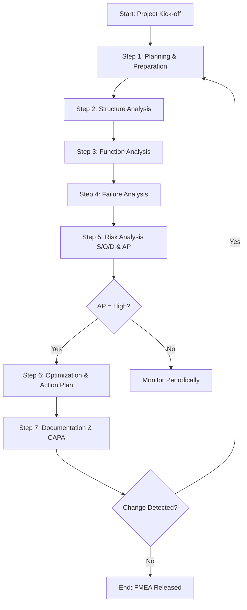

# 1927 — FMEA AIAG/VDA dalam Industri Otomotif: Integrasi Manajemen Risiko, Perhitungan Numerik, dan Optimalisasi Proses Manufaktur

**Domain:** Teknik Industri & Rekayasa Sistem Industri
**Topik Spesialis:** BENEFÍCIOS E DESAFIOS DA IMPLANTAÇÃO DO FMEA AIAG/VDA EM UMA MULTINACIONAL FABRICANTE DE PEÇAS AUTOMOTIVAS
**Jurnal & Sitasi Utama:** João Vitor Bizeli, Luis Fernando Terazzi (2024). *Revista Interface Tecnológica*. DOI: [https://doi.org/10.31510/infa.v22i1.2155](https://doi.org/10.31510/infa.v22i1.2155)
**Sitasi Pendukung:** Ardiansyah Eko Saputra, Tedjo Sukmono (2024). *Peer-Reviewed Journal*. DOI: [https://doi.org/10.21070/ups.8248](https://doi.org/10.21070/ups.8248)

---

## 1. Pendahuluan dan Konteks Industri

Industri manufaktur otomotif global menghadapi tekanan kompetitif yang semakin intensif terkait dengan target *zero-defect*, kepatuhan regulasi emisi dan keselamatan, serta kompleksitas *supply chain* yang melingkupi ribuan *part number* dengan tingkat integrasi *just-in-time* yang sangat tinggi. Dalam konteks inilah metodologi *Failure Mode and Effects Analysis* (FMEA) berevolusi dari pendekatan kuantitatif tradisional berbasis *Risk Priority Number* (RPN) menuju kerangka kerja kolaboratif yang lebih holistik, yaitu standar FMEA AIAG/VDA yang dirilis resmi pada tahun 2019 sebagai hasil konsolidasi antara *Automotive Industry Action Group* (AIAG) Amerika dan *Verband der Automobilindustrie* (VDA) Jerman (Bizeli & Terazzi, 2024).

Penelitian Bizeli dan Terazzi (2024) yang dipublikasikan dalam *Revista Interface Tecnológica* (DOI: 10.31510/infa.v22i1.2155) menyoroti urgensi strategis implementasi FMEA AIAG/VDA pada lingkungan multinasional produsen *automotive parts*. Pendekatan ini tidak hanya berfungsi sebagai *firewall* preventif terhadap *failure*, tetapi juga menjadi instrumen integrasi lintas-fungsi yang menghubungkan departemen *design*, *manufacturing*, *quality*, dan *supplier development* dalam satu platform analisis risiko terstruktur. Studi kualitatif berbasis *semi-structured interview* dengan tiga profesional berpengalaman tersebut berhasil mengidentifikasi empat *value stream* utama, yaitu: (1) pencegahan dini terhadap mode kegagalan yang dapat menurunkan *Cost of Poor Quality* (COPQ); (2) reduksi biaya rework dan *recall* yang dalam industri otomotif dapat mencapai USD 2-5 juta per insiden; (3) peningkatan reliabilitas produk melalui kontrol proses yang lebih presisi; serta (4) optimalisasi proses produksi melalui kolaborasi tim multifungsi.

Secara paralel, Saputra dan Sukmono (2024) (DOI: 10.21070/ups.8248) mendemonstrasikan aplikasi FMEA klasik pada pemeliharaan mesin *CNC Milling*, menunjukkan universalitas metodologi ini dalam konteks *industrial asset management*. Studi mereka menegaskan bahwa integrasi FMEA dengan parameter keandalan mesin seperti *Mean Time Between Failure* (MTBF) dan *Mean Time To Repair* (MTTR) mampu menurunkan *unplanned downtime* hingga 30-45% pada lingkungan manufaktur presisi. Kedua literatur ini, ketika digabungkan, memberikan perspektif integratif yang sangat relevan bagi praktisi teknik industri yang beroperasi di titik konvergensi antara *new product introduction* (NPI) dan *production sustainment*.

Urgensi ekonomis dari implementasi FMEA AIAG/VDA juga didorong oleh dinamika transisi industri menuju *Industry 4.0*, di mana data *real-time* dari sensor IoT dan sistem *Manufacturing Execution System* (MES) dapat diintegrasikan ke dalam *risk register* FMEA untuk menciptakan *living document* yang terus diperbarui. Dalam lanskap kompetisi yang ditandai dengan *time-to-market* yang semakin pendek, kegagalan mengelola risiko pada tahap *design freeze* akan berlipat ganda dampaknya pada fase produksi masal. Hal ini dikonfirmasi oleh Bizeli dan Terazzi (2024) yang menekankan bahwa investasi pada FMEA yang matang akan menghasilkan *return on prevention* yang jauh melampaui biaya remediasi pasca-produksi.

## 2. Landasan Teori & Formulasi Matematis

### 2.1 Evolusi FMEA: Dari RPN Menuju Action Priority (AP)

FMEA tradisional yang diperkenalkan pada tahun 1970-an menggunakan metrik kuantitatif berupa **Risk Priority Number (RPN)** yang diformulasikan sebagai:

$$\text{RPN}_{\text{tradisional}} = S \times O \times D$$

di mana $S$ adalah *Severity* (tingkat keparahan efek kegagalan, skala 1–10), $O$ adalah *Occurrence* (frekuensi kejadian kegagalan, skala 1–10), dan $D$ adalah *Detection* (kemampuan deteksi, skala 1–10, dengan $D=10$ berarti paling sulit dideteksi). Namun, Bizeli & Terazzi (2024) menekankan kelemahan fundamental dari pendekatan RPN ini, yaitu: (a) ambiguitas dalam penilaian deteksi karena bersifat subjektif; (b) skala RPN yang luas (1–1000) menyulitkan prioritasisasi; serta (c) ketidakmampuan membedakan *severity* rendah-berisiko-tinggi dengan *severity* tinggi-berisiko-rendah yang secara aktuarial memiliki konsekuensi berbeda.

FMEA AIAG/VDA memperkenalkan pendekatan baru berbasis **Action Priority (AP)** yang mengeliminasi perkalian sederhana dan menggantinya dengan *lookup table* deterministik yang mempertimbangkan interaksi non-linear antara tiga parameter risiko tersebut. Formulasi eksplisit untuk Action Priority dapat dinyatakan sebagai:

$$\text{AP} = f(S, O, D) \in \{H, M, L\}$$

di mana $H$ = *High* (tindakan wajib segera), $M$ = *Medium* (tindakan terencana), dan $L$ = *Low* (tindakan opsional). Fungsi $f$ didefinisikan oleh tabel referensi AIAG/VDA 2019 yang menyebutkan bahwa kombinasi $S \geq 9$ dengan sembarang nilai $O$ dan $D$ akan selalu menghasilkan AP = H, terlepas dari probabilitasnya.

### 2.2 Formulasi Parameter Risiko FMEA

Untuk keperluan analisis kuantitatif yang lebih ketat, parameter FMEA dapat diformalkan sebagai berikut. **Severity (S)** merupakan fungsi dari konsekuensi kegagalan terhadap *end-user*, keselamatan, dan kepatuhan regulasi:

$$S = \alpha_1 \cdot S_{\text{safety}} + \alpha_2 \cdot S_{\text{functional}} + \alpha_3 \cdot S_{\text{regulatory}}$$

dengan $\sum_{i=1}^{3} \alpha_i = 1$ dan $\alpha_1 \geq \alpha_2 \geq \alpha_3 \geq 0$.

**Occurrence (O)** dalam FMEA AIAG/VDA dapat dimodelkan menggunakan distribusi statistik kegagalan, misalnya distribusi Poisson untuk kejadian diskrit:

$$P(X = k) = \frac{\lambda^k \cdot e^{-\lambda}}{k!}$$

di mana $\lambda$ adalah *failure rate* (failure per million opportunities) dan $k$ adalah jumlah kejadian yang diamati. Skor Occurrence $O$ kemudian diturunkan melalui transformasi:

$$O = \lceil 10 \cdot (1 - e^{-\lambda \cdot t}) \rceil$$

untuk horizon waktu $t$ tertentu.

### 2.3 Indikator Keandalan dan Pemeliharaan

Saputra & Sukmono (2024) melengkapi kerangka teoritis dengan persamaan keandalan sistem untuk komponen mesin CNC. **Availability (A)** sistem didefinisikan sebagai:

$$A = \frac{\text{MTBF}}{\text{MTBF} + \text{MTTR}} = \frac{\text{MTBF}}{\text{MTBF} + \text{MDT}}$$

di mana MTBF = *Mean Time Between Failure*, MTTR = *Mean Time To Repair*, dan MDT = *Mean Downtime*. **Reliability function** untuk komponen dengan laju kegagalan konstan $\lambda$ mengikuti:

$$R(t) = e^{-\lambda t}$$

sedangkan **failure rate** dapat diturunkan sebagai:

$$\lambda = \frac{1}{\text{MTBF}}$$

**Overall Equipment Effectiveness (OEE)** yang terkait dengan kualitas output produksi mesin juga menjadi variabel kontrol tidak langsung:

$$\text{OEE} = A \times P \times Q$$

di mana $P$ = *Performance rate* dan $Q$ = *Quality rate*.

### 2.4 Cost of Poor Quality (COPQ) dalam Konteks FMEA

Bizeli & Terazzi (2024) menyoroti bahwa efektivitas FMEA harus diukur dari reduksi COPQ yang dapat diformalkan sebagai:

$$\text{COPQ}_{\text{saved}} = \sum_{i=1}^{n} (C_{\text{internal}_i} + C_{\text{external}_i} + C_{\text{appraisal}_i} + C_{\text{prevention}_i})$$

di mana $C_{\text{internal}}$ adalah biaya *rework/scrap*, $C_{\text{external}}$ adalah biaya *warranty/recall*, $C_{\text{appraisal}}$ adalah biaya inspeksi, dan $C_{\text{prevention}}$ adalah investasi pelatihan dan *design review*.

## 3. Metodologi Rekayasa & Standar Prosedur Operasional (SOP)

Implementasi FMEA AIAG/VDA mengikuti alur 7-langkah (7-Steps Approach) yang distandarisasi dan dapat dipetakan sebagai *Standard Operating Procedure* berikut:

**Langkah 1: Planning & Preparation.** Tim multifungsi (*cross-functional team*) dibentuk dengan anggota dari *design*, *manufacturing*, *quality*, *supplier*, dan *customer support*. Scope FMEA, *boundary diagram*, dan *focus element* (komponen atau subsistem yang dianalisis) diidentifikasi secara formal. Output: *Project Charter* dan *FMEA Scope Document*.

**Langkah 2: Structure Analysis.** Menggunakan notasi *Block Diagram* dan *Boundary Diagram* (sesuai standar AIAG/VDA 2019), struktur produk/proses diuraikan hingga level elemen yang manageable. Tools: *Boundary Diagram*, *Structure Tree*, *Customer/Supplier Interface Matrix*.

**Langkah 3: Function Analysis.** Setiap elemen struktur diberikan fungsi menggunakan *verb-noun* formulation (misal: "mengalirkan fluida", "men-transmisi torsi"). Output: *Function Net* dan *Function Analysis Worksheet*.

**Langkah 4: Failure Analysis.** Mode kegagalan (*failure mode*) diidentifikasi untuk setiap fungsi, kemudian efek (*effect*) dan penyebab (*cause*) diturunkan menggunakan *Fishbone Diagram* atau *5-Why Analysis*.

**Langkah 5: Risk Analysis.** Penilaian parameter S, O, D dilakukan menggunakan *FMEA Reference Table* AIAG/VDA yang telah terstandarisasi, kemudian *Action Priority* (AP) ditentukan melalui *lookup table* resmi.

**Langkah 6: Optimization.** Untuk mode kegagalan dengan AP = H, *Action Plan* disusun dengan penanggung jawab, target tanggal, dan *effectivity verification* (PV/PCP – *Production Verification/Process Capability Proof*).

**Langkah 7: Results Documentation.** Seluruh FMEA didokumentasikan dalam *FMEA Worksheet* yang kemudian menjadi *living document* yang diperbarui setiap kali ada perubahan desain, proses, atau data lapangan baru.

Dalam konteks pemeliharaan mesin CNC seperti diteliti Saputra & Sukmono (2024), FMEA diintegrasikan dengan sistem **Computerized Maintenance Management System (CMMS)** melalui *Failure Mode Library* yang berisikan histori kegagalan dan parameter operasi kritis (suhu *spindle*, getaran *bearing*, tekanan hidrolik). Setiap anomali yang terdeteksi oleh sensor akan otomatis *trigger* pembaruan skor Occurrence pada FMEA yang relevan.

## 4. Studi Kasus Kuantitatif Industri & Perhitungan Numerik

### 4.1 Kasus 1: Komponen *Brake Caliper* pada Sistem Pengereman Otomotif

Berdasarkan studi Bizeli & Terazzi (2024), pertimbangkan sebuah *brake caliper* yang diproduksi oleh *tier-1 supplier* untuk program *pickup truck* dengan volume produksi 250.000 unit/tahun. Analisis dilakukan pada mode kegagalan "*piston seizure*" (macetnya piston pada lubang silinder).

**Input Parameter:**
- Severity ($S$): 8 (kegagalan dapat menyebabkan *loss of braking function*, risiko keselamatan tinggi)
- Occurrence ($O$): 5 (terjadi pada 1 dari 10.000 unit berdasarkan data historis, setara $\lambda = 10^{-4}$ per unit)
- Detection ($D$): 6 (terdeteksi melalui *function test* pada *end-of-line*, namun 30% lolos ke pasar)

**Perhitungan RPN Tradisional:**

$$\text{RPN}_{\text{tradisional}} = S \times O \times D = 8 \times 5 \times 6 = 240$$

**Penentuan Action Priority (AP):**
Berdasarkan AIAG/VDA Reference Table untuk kombinasi $S=8$, $O=5$, $D=6$, skor ini menghasilkan AP = **High (H)** karena $S \geq 8$ dengan $O \geq 4$ dan $D \geq 5$. Dengan demikian, diperlukan *Action Plan* wajib.

**Estimasi Dampak Finansial (COPQ):**
- Biaya *rework per insiden