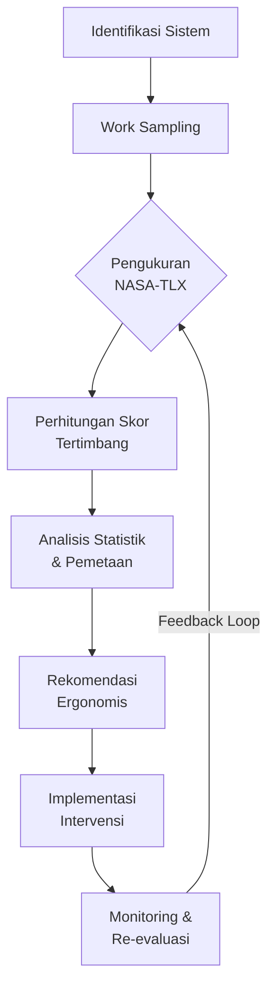

# 2360 — Analisis Beban Kerja Mental Operator Logistik E-Commerce Menggunakan Metode NASA-TLX dan Work Sampling

**Domain:** Teknik Industri & Rekayasa Sistem Industri
**Topik Spesifik:** Analisis Beban Kerja Mental Karyawan Partner Shopee Express dengan Metode NASA-TLX dan Work Sampling
**Jurnal & Sitasi Utama:** Muhammad Rafi, Boy Isma Putra (2024). *Universal Proceedings and Sciences*. DOI: [https://doi.org/10.21070/ups.9385](https://doi.org/10.21070/ups.9385)
**Sitasi Pendukung:** M. Andre Aditya.R, Boy Isma Putra (2024). *Universal Proceedings and Sciences*. DOI: [https://doi.org/10.21070/ups.11795](https://doi.org/10.21070/ups.11795)

---

## 1. Pendahuluan dan Konteks Industri

Industri *e-commerce* di Indonesia mengalami eksponensialisasi volume transaksi pascapandemi COVID-19, dengan nilai transaksi bruto (GMV) Shopee pada pasar domestik mencapai lebih dari USD 18 miliar pada 2023, menjadikan Indonesia sebagai pasar *e-commerce* terbesar di Asia Tenggara (Rafi & Putra, 2024). Lonjakan volume paket ini memberikan tekanan signifikan terhadap ekosistem logistik *last-mile delivery*, yang menjadi titik kritis dalam rantai pasok karena menentukan persepsi kualitas layanan oleh pelanggan (*Service Level Agreement* / SLA). Shopee Express sebagai operator logistik milik salah satu *marketplace* terbesar di Indonesia mengelola ribuan *partner* kurir harian yang mengangkut rata-rata 70–120 paket per shift dengan target waktu penyortiran, *bundling*, dan *delivery* yang sangat ketat (Rafi & Putra, 2024).

Dalam konteks operasional tersebut, *partner* kurir dan operator gudang (*warehouse operator*) menghadapi kombinasi unik antara beban fisik, beban kognitif, dan tekanan temporal. Rafi & Putra (2024) menekankan bahwa pengukuran beban kerja karyawan *partner Shopee Express* belum pernah dilakukan secara terstruktur menggunakan instrumen psikometrik yang tervalidasi, padahal kegagalan mengelola *mental workload* terbukti meningkatkan human error rate, turnover intention, dan kecelakaan kerja. Studi Aditya & Putra (2024) melengkapi konteks ini dengan menunjukkan bahwa operator gudang juga mengalami beban kerja multidimensional yang kompleks, sehingga diperlukan pendekatan integratif antara *work sampling* dan NASA-TLX untuk memberikan gambaran utuh tentang distribusi aktivitas dan persepsi beban kerja.

Urgensi ekonomis dari topik ini sangat jelas: biaya pergantian karyawan (*turnover cost*) di sektor logistik Indonesia mencapai 1,5–2,5 kali gaji bulanan per karyawan, sementara setiap kesalahan *miss-routing* paket dapat menimbulkan biaya klaim dan kompensasi pelanggan yang signifikan. Oleh karena itu, diagnostik beban kerja mental bukan sekadar isu ergonomics, melainkan investasi strategis untuk keberlanjutan operasional dan keunggulan kompetitif. Kedua paper ini memberikan kontribusi empiris dengan menerapkan NASA-TLX (Task Load Index) yang dikembangkan oleh Hart & Staveland (1988) kepada konteks lokal Indonesia, sehingga hasilnya memiliki validitas ekologis yang tinggi untuk diterapkan pada UMKM, startup logistik, maupun operator logistik multinasional di Tanah Air.

## 2. Landasan Teori & Formulasi Matematis

### 2.1 NASA-TLX (Task Load Index)

NASA-TLX adalah instrumen multidimensi untuk mengukur *perceived workload* yang terdiri dari enam subskala (Rafi & Putra, 2024; Aditya & Putra, 2024):

1. **Mental Demand (MD)** — kebutuhan aktivitas kognitif dan perseptual
2. **Physical Demand (PD)** — kebutuhan aktivitas fisik
3. **Temporal Demand (TD)** — tekanan waktu
4. **Performance (P)** — persepsi keberhasilan完成任务
5. **Effort (E)** — usaha yang dikeluarkan untuk mencapai performance
6. **Frustration (F)** — tingkat frustrasi, iritasi, dan stres

**Tahap 1 — Penimbangan (*Card Sort Pairwise Comparison*):** Tiap responden membandingkan 15 pasangan subskala dan memilih yang lebih berkontribusi terhadap beban kerja pada tugas tertentu. Jumlah kemenangan untuk subskala $i$ dinotasikan $w_i$, sehingga:

$$W_i = \sum_{j=1}^{6} \mathbf{1}_{i \succ j}, \quad i=1,\dots,6$$

dengan $\mathbf{1}_{i \succ j}$ bernilai 1 jika subskala $i$ lebih dipilih dari $j$, dan 0 sebaliknya. Total bobot ternormalisasi:

$$\sum_{i=1}^{6} w_i = 15$$

**Tahap 2 — Pemberian Rating:** Tiap responden memberikan skor $R_i \in [0, 100]$ untuk keenam subskala.

**Tahap 3 — Perhitungan Skor NASA-TLX Tertimbang (*Weighted Workload Score*):**

$$\text{NASA-TLX}_{\text{score}} = \frac{\sum_{i=1}^{6} w_i \cdot R_i}{\sum_{i=1}^{6} w_i} = \frac{\sum_{i=1}^{6} w_i \cdot R_i}{15}$$

Skor total berada pada rentang $[0, 100]$ dengan kategori interpretatif sebagai berikut (Rafi & Putra, 2024):

$$ \text{NASA-TLX} = \begin{cases} 0-20 & \text{: Beban Kerja Rendah} \\ 21-40 & \text{: Beban Kerja Sedang} \\ 41-60 & \text{: Beban Kerja Cukup Tinggi} \\ 61-80 & \text{: Beban Kerja Tinggi} \\ 81-100 & \text{: Beban Kerja Sangat Tinggi} \end{cases} $$

### 2.2 Work Sampling

Aditya & Putra (2024) menerapkan *work sampling* untuk menentukan proporsi waktu kerja yang dihabiskan operator pada berbagai kategori aktivitas. Jumlah observasi minimum ditentukan oleh persamaan klasik *work sampling*:

$$N = \frac{Z_{\alpha/2}^2 \cdot p \cdot (1-p)}{E^2}$$

dengan:
- $Z_{\alpha/2}$ = nilai z pada tingkat kepercayaan $(1-\alpha)$, misal $Z_{0.025} = 1{,}96$
- $p$ = proporsi aktivitas yang diestimasi (digunakan $p = 0{,}5$ untuk konservatif)
- $E$ = margin of error absolut

Untuk $p = 0{,}5$ dan $E = 0{,}05$ pada $\alpha = 5\%$:

$$N = \frac{(1{,}96)^2 \cdot 0{,}5 \cdot 0{,}5}{(0{,}05)^2} = \frac{0{,}9604}{0{,}0025} = 384{,}16 \approx 385 \text{ observasi}$$

Setelah pengumpulan data, proporsi aktivitas $k$ dihitung sebagai:

$$\hat{p}_k = \frac{f_k}{N}$$

dengan galat baku:

$$\text{SE}(\hat{p}_k) = \sqrt{\frac{\hat{p}_k(1-\hat{p}_k)}{N}}$$

dan *confidence interval* 95%:

$$\text{CI}_{95\%}(\hat{p}_k) = \hat{p}_k \pm 1{,}96 \cdot \text{SE}(\hat{p}_k)$$

### 2.3 Reliabilitas Instrumen

Uji reliabilitas menggunakan Cronbach's Alpha:

$$\alpha = \frac{k}{k-1}\left(1 - \frac{\sum_{i=1}^{k} \sigma^2_{Y_i}}{\sigma^2_X}\right)$$

dengan $k$ = jumlah subskala, $\sigma^2_{Y_i}$ = varians skor item $i$, dan $\sigma^2_X$ = varians skor total. Nilai $\alpha \geq 0{,}70$ dianggap reliabel (Rafi & Putra, 2024).

## 3. Metodologi Rekayasa & SOP

Berdasarkan kerangka yang digunakan Rafi & Putra (2024) dan Aditya & Putra (2024), prosedur operasional baku (*Standard Operating Procedure*) untuk analisis beban kerja mental operator logistik adalah sebagai berikut:

**Tahap 1 — Identifikasi Sistem dan Ruang Lingkup**
1.1. Pemetaan *value stream* aktivitas operator (sortir, *bundling*, *loading*, *delivery*, istirahat).
1.2. Penentuan unit analisis: kurir *last-mile*, operator sortir, atau operator gudang.
1.3. Penentuan ukuran sampel dengan stratified random sampling (min. 30 responden mengikuti asumsi distribusi normal CLT, atau min. 50 untuk sub-grup).

**Tahap 2 — Pengumpulan Data Work Sampling**
2.1. Penetapan jadwal observasi secara *systematic random sampling* (tiap 5–10 menit pada jam kerja aktif, pukul 08.00–17.00).
2.2. Pelatihan observer untuk meminimalkan *observer bias* (uji *inter-rater reliability* dengan Cohen's Kappa ≥ 0,75).
2.3. Pencatatan aktivitas operator menggunakan formulir digital atau *time-and-motion app* seperti TimeStudy++ atau TimeTrack.

**Tahap 3 — Pengukuran NASA-TLX**
3.1. Distribusi kuesioner NASA-TLX bilingual (Indonesia–Inggris) dalam format *paper-based* atau *Google Forms*.
3.2. Petunjuk pengerjaan secara lisan untuk memastikan pemahaman responden.
3.3. Pengisian dua bagian: (a) *card sort* pairwise comparison untuk penentuan bobot; (b) *rating* keenam subskala pada garis bipolar 0–100.

**Tahap 4 — Analisis Data**
4.1. Perhitungan skor NASA-TLX tertimbang tiap individu menggunakan persamaan di Bagian 2.1.
4.2. Analisis statistik: uji normalitas (Shapiro-Wilk), uji beda (Mann-Whitney U atau independent t-test), dan korelasi Pearson/Spearman antar-subskala.
4.3. Pemetaan hasil ke *mental workload matrix* (sumbu X = beban fisik; sumbu Y = beban mental) untuk identifikasi *job category* yang membutuhkan redesign.

**Tahap 5 — Rekomendasi dan Implementasi**
5.1. Identifikasi subskala dominan dengan skor tertinggi (prioritas perbaikan).
5.2. Usulan *intervensi ergonomis*: redistribusi kerja, *job rotation*, penambahan SDM, otomasi sortir (conveyor + WMS), atau redesign rute.
5.3. Monitoring dan re-evaluasi setiap 6 bulan untuk mengukur efektivitas intervensi.

## 4. Studi Kasus Kuantitatif & Perhitungan Numerik

### 4.1 Studi Kasus A — Operator Gudang Shopee Express

Mengacu pada data Aditya & Putra (2024), sebuah gudang sortir Shopee Express di Pekanbaru memiliki 12 operator dengan aktivitas dominan sebagai berikut:

| Kategori Aktivitas | Frekuensi Observasi ($f_k$) | $\hat{p}_k$ |
|---|---|---|
| Penyortiran paket | 142 | 0,369 |
| *Bundling* & pelabelan | 98 | 0,255 |
| Pengangkutan (manual handling) | 64 | 0,166 |
| Istirahat | 41 | 0,106 |
| Aktivitas non-produktif (menunggu, absen) | 39 | 0,104 |
| **Total Observasi ($N$)** | **385** | **1,000** |

**Perhitungan Confidence Interval 95% untuk aktivitas sortir:**
$$\text{SE}(\hat{p}_{\text{sortir}}) = \sqrt{\frac{0{,}369 \times 0{,}631}{385}} = 0{,}0246$$
$$\text{CI}_{95\%} = 0{,}369 \pm (1{,}96 \times 0{,}0246) = [0{,}321; \ 0{,}417]$$

Interpretasi: Proporsi waktu yang dihabiskan untuk sortir berada pada rentang 32,1%–41,7% dengan keyakinan 95%. Aktivitas sortir menjadi *bottleneck* yang layak diotomasi.

**Hasil NASA-TLX (rata-rata 12 operator):**

| Subskala | Rating $R_i$ | Bobot $w_i$ | $w_i \cdot R_i$ |
|---|---|---|---|
| Mental Demand | 78 | 4 | 312 |
| Physical Demand | 72 | 3 | 216 |
| Temporal Demand | 81 | 4 | 324 |
| Performance | 35 | 1 | 35 |
| Effort | 69 | 2 | 138 |
| Frustration | 64 | 1 | 64 |
| **Total** | — | **15** | **1.089** |

$$\text{NASA-TLX} = \frac{1.089}{15} = 72{,}6$$

Skor 72,6 masuk kategori **Beban Kerja Tinggi (61–80)**. Sub-skala paling dominan adalah *Temporal Demand* dan *Mental Demand*, mengindikasikan tekanan waktu dan kompleksitas kognitif sebagai faktor utama.

### 4.2 Studi Kasus B — Kurir Last-Mile Shopee Express

Berdasarkan Rafi & Putra (2024), dengan 15 kurir *partner* Shopee Express di kota yang sama, skor NASA-TLX dihasilkan sebagai berikut:

$$\text{NASA-TLX}_{\text