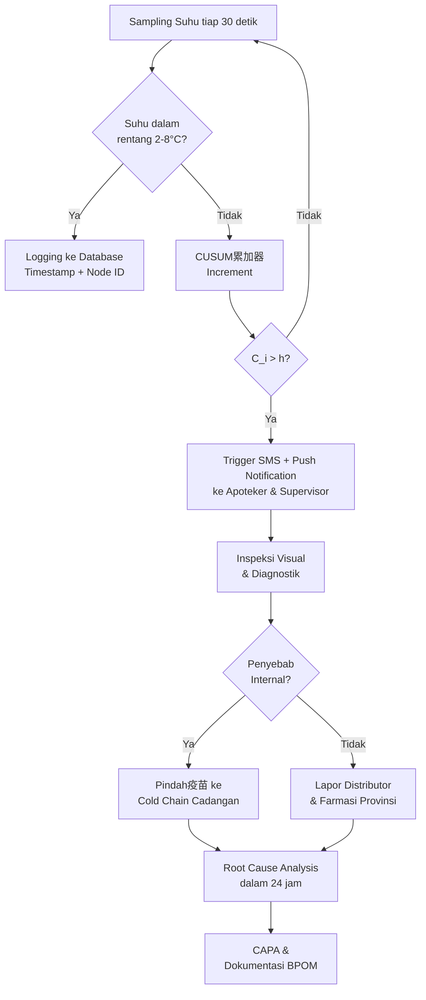

# 2598 — Model Resiliensi Rantai Dingin untuk Produk Mudah Rusak: Integrasi Sistem Pemantauan Suhu Real-Time Berbasis IoT

**Domain:** Teknik Industri & Rekayasa Sistem Industri
**Topik Spesialis:** A Resilience Model for Cold Chain Logistics of Perishable Products
**Jurnal & Sitasi Utama:** Aisha Khurshid, Danish Ahmed Siddiqui (2024). *Peer-Reviewed Journal*. DOI: [https://doi.org/10.2139/ssrn.4959599](https://doi.org/10.2139/ssrn.4959599)
**Sitasi Pendukung:** Akmal Darman Putra, Sarjon Defit, Gunadi Widi Nurcahyo (2024). *Jurnal KomtekInfo*. DOI: [https://doi.org/10.35134/komtekinfo.v12i1.589](https://doi.org/10.35134/komtekinfo.v12i1.589)

---

## 1. Pendahuluan dan Konteks Industri

Rantai dingin (*cold chain*) merupakan subsistem kritis dalam rantai pasok produk farmasi, vaksin, makanan beku, dan bioteknologi yang memiliki karakteristik *time-temperature sensitive*. Gangguan sekecil apapun pada integritas suhu dapat menurunkan mutu produk secara irreversibel, terutama pada vaksin yang sensitivitas termalnya didokumentasikan ketat oleh WHO PQS (Performance, Quality and Safety) dan pedoman *Vaccine Vial Monitor* (VVM). Khurshid dan Siddiqui (2024, DOI: [10.2139/ssrn.4959599](https://doi.org/10.2139/ssrn.4959599)) menekankan bahwa resiliensi bukan sekadar kemampuan bertahan terhadap gangguan, melainkan kapasitas sistem untuk *mengabsorpsi*, *mengadaptasi*, dan *memulihkan* fungsi rantai dingin dalam jendela waktu kritis sebelum degradasi produk melampaui ambang batas失效. Dalam konteks manufaktur farmasi global yang bernilai lebih dari USD 1,5 triliun per tahun, kegagalan cold chain dapat menimbulkan kerugian ekonomi langsung berupa pemusnahan produk (*batch rejection*), penarikan produk (*recall*), serta kerugian tidak langsung berupa reputasi merek dan litigasi regulasi.

Studi empiris yang dilakukan Putra, Defit, dan Nurcahyo (2024, DOI: [10.35134/komtekinfo.v12i1.589](https://doi.org/10.35134/komtekinfo.v12i1.589)) di Unit Pelaksana Teknis Dinas (UPTD) Farmasi Dinas Kesehatan Kabupaten Siak menyoroti problematik riil di lapangan: cold chain box sebagai media penyimpanan vaksin belum配备 alat pemantauan suhu secara *real-time* yang mampu memberikan peringatan dini kepada apoteker ketika suhu menyimpang akibat kerusakan internal (compressor failure, baterai lemah) maupun eksternal (paparan matahari, keterlambatan distribusi). Lebih lanjut, proses pencatatan suhu masih dilakukan secara manual setiap 2 jam sekali pada *log sheet* oleh apoteker—suatu praktik yang rentan terhadap *human error*, keterlambatan dokumentasi, dan tidak mampu mendeteksi transien suhu berdurasi menit yang justru paling destruktif bagi kestabilan vaksin.

Kondisi operasional ini diperparah oleh fakta bahwa program imunisasi nasional Indonesia mencakup lebih dari 14 jenis antigen dengan target cakupan di atas 90%, menjadikan volume distribusi vaksin pada level kabupaten sangat signifikan. Kerugian satu vial vaksin COVID-19 yang失效 dapat mengompromikan cakupan populasi dan mengundang *post-market surveillance* dari BPOM. Oleh sebab itu, integrasi model resiliensi teoritis (Khurshid & Siddiqui, 2024) dengan solusi instrumentasi IoT konkret (Putra et al., 2024) menjadi迫切 bagi keberlanjutan sistem kesehatan masyarakat dan keberlangsungan operasional rantai dingin industri secara holistik.

## 2. Landasan Teori & Formulasi Matematis

### 2.1 Indeks Resiliensi Rantai Dingin

Berdasarkan kerangka Bruneau yang diadaptasi oleh Khurshid dan Siddiqui (2024), resiliensi sistem cold chain $R_{CC}$ dapat diformulasikan sebagai fungsi dari empat dimensi: *Robustness* ($\mathcal{R}$), *Redundancy* ($\mathcal{D}$), *Resourcefulness* ($\mathcal{S}$), dan *Rapidity* ($\mathcal{P}$). Formulasi komposit yang digunakan adalah:

$$R_{CC} = \alpha \cdot \mathcal{R} + \beta \cdot \mathcal{D} + \gamma \cdot \mathcal{S} + \delta \cdot \mathcal{P}$$

dengan $\alpha + \beta + \gamma + \delta = 1$ sebagai bobot prioritas manajerial yang ditentukan melalui *Analytic Hierarchy Process* (AHP). Masing-masing dimensi dihitung sebagai:

$$\mathcal{R} = \frac{T_{nominal} - \overline{\Delta T}}{T_{nominal} - T_{critical}}$$

dimana $\overline{\Delta T}$ adalah *Mean Absolute Deviation* suhu aktual dari setpoint nominal $T_{nominal}$, dan $T_{critical}$ adalah ambang batas失效 produk. Untuk vaksin sensitif (misalnya DPT, Campak), $T_{nominal} = 2^\circ\text{C}$ hingga $8^\circ\text{C}$.

### 2.2 Model Degradasi Arrhenius untuk Stabilitas Vaksin

Laju degradasi potensi vaksin mengikuti persamaan Arrhenius yang telah distandardisasi dalam *WHO Technical Report Series*:

$$k(T) = A \cdot e^{-\frac{E_a}{R \cdot T}}$$

dengan $k(T)$ = konstanta laju degradasi (per jam), $A$ = faktor pre-eksponensial, $E_a$ = energi aktivasi (J/mol), $R$ = konstanta gas universal (8,314 J/(mol·K)), dan $T$ = suhu absolut (K). Kerusakan kumulatif akibat paparan suhu ditentukan oleh integrasi:

$$D(t) = \int_0^t k(T(\tau)) \, d\tau$$

Ketika $D(t) \geq 1$, potensi疫苗失效 di bawah ambang batas farmakope (umumnya ≤90% dari label claim untuk vaksin inactivated).

### 2.3 Fungsi Keandalan Sensor IoT DS18B20

Sensor DS18B20 yang digunakan oleh Putra et al. (2024) memiliki akurasi $\pm 0{,}5^\circ\text{C}$ pada rentang $-10^\circ\text{C}$ hingga $+85^\circ\text{C}$ dengan resolusi 9–12 bit yang dapat dikonfigurasi. Keandalan *Mean Time Between Failure* (MTBF) untuk node sensor dapat dimodelkan sebagai distribusi Weibull:

$$R(t) = e^{-\left(\frac{t}{\eta}\right)^m}$$

dengan $\eta$ = *characteristic life* dan $m$ = *shape parameter*. Untuk komponen elektronik dalam lingkungan terkontrol cold chain ($T \in [2,8]^\circ\text{C}$), parameter tipikal adalah $\eta \approx 100.000$ jam dan $m = 1{,}8$ (mild infant mortality).

### 2.4 Model Deteksi Anomali Real-Time

Untuk menggantikan pencatatan manual setiap 2 jam, sistem IoT menerapkan jendela deteksi bergerak (*moving window*) dengan ukuran $w$ sampel pada interval sampling $\Delta t$. Statistik kendali Shewhart-CUSUM untuk suhu $T_i$ didefinisikan:

$$C_i^+ = \max\left(0, C_{i-1}^+ + (T_i - \mu_0) - k\right)$$

dimana $\mu_0$ = suhu target, $k$ = slack reference value (umumnya 0,5°C), dan alarm terpicu ketika $C_i^+ > h$ (threshold keputusan, umumnya $h = 5\sigma$).

## 3. Metodologi Rekayasa & Standar Prosedur Operasional (SOP)

### 3.1 Arsitektur Sistem Pemantauan IoT

Berdasarkan desain Putra, Defit, dan Nurcahyo (2024), arsitektur sistem IoT untuk cold chain box疫苗 terdiri dari empat lapisan:

1. **Lapisan Persepsi (Sensor Layer):** Sensor DS18B20 dengan protokol 1-Wire (Dallas Semiconductor) yang mampu melakukan *daisy-chaining* hingga 127 sensor dalam satu bus, sehingga dapat memantau multi-zona dalam cold chain box. Sensor ditempatkan pada posisi inlet evaporator, outlet evaporator, tengah box, dan pintu box.

2. **Lapisan Transmisi (Network Layer):** Mikrokontroler ESP32 atau Arduino dengan modul Wi-Fi ESP8266 untuk transmisi data ke *cloud server* menggunakan protokol MQTT (Message Queuing Telemetry Transport) dengan QoS level 1 untuk menjamin *at-least-once delivery*.

3. **Lapisan Pemrosesan (Processing Layer):** *Backend server* berbasis Node.js atau Python Flask yang menjalankan algoritma CUSUM, menyimpan *time-series database* (InfluxDB/TimeScaleDB), dan mengeksekusi *rule engine* untuk alert threshold.

4. **Lapisan Antarmuka (Application Layer):** *Dashboard* berbasis web responsif menggunakan Grafana atau *mobile application* (Android/iOS) untuk menampilkan实时 visualisasi, notifikasi push via Firebase Cloud Messaging, dan *audit trail* yang符合 regulasi BPOM.

### 3.2 SOP Penanganan Gangguan Suhu

### 3.3 Kalibrasi dan Validasi Sistem

SOP kalibrasi mengacu pada ISO 17025 dan SNI ISO 9001:2015 dengan prosedur tiga titik kalibrasi menggunakan *dry-block calibrator* FLUKE 724 atau 9103 pada suhu 0°C, 4°C, dan 8°C. Frekuensi kalibrasi ulang adalah triwulanan dengan verifikasi antar-kalibrasi menggunakan *ice-bath reference* (0,0°C ± 0,1°C).

## 4. Studi Kasus Kuantitatif Industri & Perhitungan Numerik

### 4.1 Skenario Studi Kasus: UPTD Farmasi Kabupaten Siak

Misalkan UPTD mengelola 25 cold chain box kapasitas 8 liter, menyimpan rata-rata 120 vial vaksin DPT-HB-Hib per box pada suhu setpoint $T_0 = 5^\circ\text{C}$ (278,15 K). Parameter energi aktivasi untuk vaksin DPT tipe cair mengikuti literatur farmacopeial: $E_a = 84$ kJ/mol, $A = 1{,}2 \times 10^{12}$ jam$^{-1}$.

**Langkah 1: Hitung Konstanta Degradasi pada Suhu Normal**

$$k(5^\circ\text{C}) = 1{,}2 \times 10^{12} \cdot e^{-\frac{84.000}{8{,}314 \times 278{,}15}}$$

$$= 1{,}2 \times 10^{12} \cdot e^{-36{,}32} = 1{,}2 \times 10^{12} \times 1{,}79 \times 10^{-16} \approx 2{,}15 \times 10^{-4} \text{ jam}^{-1}$$

**Langkah 2: Hitung Konstanta Degradasi pada Suhu Gangguan (15°C)**

Ketika pintu cold chain box terbuka selama 15 menit pada suhu ambient 28°C, suhu internal naik dari 5°C menjadi 12°C (rata-rata 8,5°C = 281,65 K):

$$k(8{,}5^\circ\text{C}) = 1{,}2 \times 10^{12} \cdot e^{-\frac{84.000}{8{,}314 \times 281{,}65}} = 1{,}2 \times 10^{12} \cdot e^{-35{,}88} \approx 4{,}18 \times 10^{-4} \text{ jam}^{-1}$$

**Langkah 3: Akumulasi Kerusakan dalam 0,25 jam (15 menit)**

$$D(0{,}25) = k(8{,}5^\circ\text{C}) \times 0{,}25 = 1{,}04 \times 10^{-4}$$

**Langkah 4: Proyeksi Kerusakan Harian jika Berulang**

Jika kejadian serupa terjadi 8 kali per hari (opening door frequency tipikal UPTD), maka kerusakan kumulatif harian:

$$D_{harian} = 8 \times 1{,}04 \times 10^{-4} = 8{,}32 \times 10^{-4} \text{ hari}^{-1}$$

Untuk mencapai失效 ($D = 1$), diperlukan $\approx 1{,}202$ hari $\approx 1.202$ hari jika hanya insiden tersebut. Namun, dengan memperhit