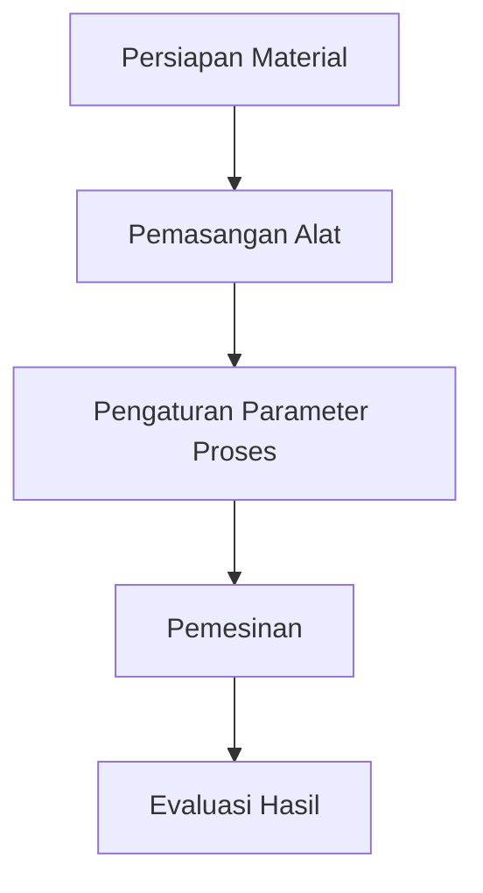

# 810 — Ultrasonic Vibration-Assisted Milling (UVAM) for Difficult-to-Cut Superalloys: High-Frequency Intermittent Kinematics, Acoustic Softening, and Tool Life Extension

**Domain:** Teknik Industri & Rekayasa Sistem Industri  
**Topik Spesialis:** Ultrasonic Vibration-Assisted Milling (UVAM) for Difficult-to-Cut Superalloys: High-Frequency Intermittent Kinematics, Acoustic Softening, and Tool Life Extension  
**Standar & Referensi Utama:** Wang et al. (2024, Int. J. Mach. Tools Manuf.); CIRP Annals (2023); ISO 3002; Astashev & Babitsky (Ultrasonic Cutting, Springer)

---

## 1. Pendahuluan dan Konteks Industri

Dalam era industri modern, kebutuhan akan material yang memiliki kekuatan tinggi dan ketahanan terhadap suhu ekstrem semakin meningkat, terutama dalam sektor penerbangan, otomotif, dan energi. Superalloys, yang sering digunakan dalam aplikasi tersebut, memiliki sifat mekanik yang sangat baik, tetapi juga dikenal sulit untuk diproses. Tantangan utama dalam pemesinan superalloys adalah tingginya kekerasan dan ketahanan terhadap deformasi, yang sering mengakibatkan keausan alat yang cepat dan biaya produksi yang tinggi. 

Ultrasonic Vibration-Assisted Milling (UVAM) muncul sebagai solusi inovatif untuk mengatasi tantangan ini. Dengan menerapkan getaran ultrasonik pada proses pemesinan, UVAM dapat mengurangi gaya pemotongan dan meningkatkan efisiensi pemesinan. Penelitian oleh Wang et al. (2024) menunjukkan bahwa teknik ini tidak hanya meningkatkan kualitas permukaan tetapi juga memperpanjang umur alat potong. Dalam konteks ini, penting untuk memahami mekanisme kinematika intermiten berfrekuensi tinggi, pelunakan akustik, dan dampaknya terhadap umur alat.

Tantangan yang dihadapi dalam penerapan UVAM mencakup kebutuhan untuk mengoptimalkan parameter proses dan memahami interaksi antara getaran ultrasonik dan material yang diproses. Oleh karena itu, penelitian lebih lanjut diperlukan untuk mengeksplorasi potensi UVAM dalam meningkatkan efisiensi dan efektivitas pemesinan superalloys. 

## 2. Landasan Teori & Formulasi Matematis

### 2.1. Prinsip Dasar UVAM

UVAM menggabungkan teknik pemesinan konvensional dengan getaran ultrasonik yang dihasilkan oleh transduser piezoelektrik. Getaran ini diterapkan pada alat potong, menghasilkan gaya pemotongan yang lebih rendah dan meningkatkan efisiensi pemesinan. 

### 2.2. Kinematika Intermiten

Kinematika pemesinan dapat dijelaskan dengan menggunakan model matematis yang mencakup gaya pemotongan, kecepatan pemotongan, dan frekuensi getaran. Gaya pemotongan ($F_c$) dapat dinyatakan sebagai:

$$
F_c = k \cdot A \cdot f^2
$$

di mana:
- $k$ = konstanta material
- $A$ = amplitudo getaran
- $f$ = frekuensi getaran

### 2.3. Pelunakan Akustik

Pelunakan akustik terjadi ketika getaran ultrasonik mengurangi kekuatan material selama pemesinan. Fenomena ini dapat dimodelkan dengan persamaan berikut:

$$
\sigma_{eff} = \sigma_0 - \alpha \cdot A \cdot f
$$

di mana:
- $\sigma_{eff}$ = kekuatan efektif material
- $\sigma_0$ = kekuatan awal material
- $\alpha$ = koefisien pelunakan akustik

### 2.4. Umur Alat

Umur alat ($T$) dapat diprediksi menggunakan model Weibull yang dinyatakan sebagai:

$$
T = \left( \frac{C}{F_c} \right)^{\beta}
$$

di mana:
- $C$ = konstanta yang bergantung pada material alat
- $\beta$ = parameter bentuk distribusi Weibull

## 3. Metodologi Rekayasa & Standar Prosedur Operasional (SOP)

### 3.1. Langkah-langkah Implementasi

1. **Persiapan Material**: Pilih superalloy yang akan diproses dan siapkan spesimen uji.
2. **Pengaturan Alat**: Pasang alat potong yang sesuai dengan transduser piezoelektrik untuk menghasilkan getaran ultrasonik.
3. **Pengaturan Parameter Proses**: Tentukan parameter pemesinan seperti kecepatan pemotongan, kedalaman pemotongan, dan frekuensi getaran.
4. **Pelaksanaan Pemesinan**: Lakukan pemesinan dengan memonitor gaya pemotongan dan kondisi alat secara real-time.
5. **Evaluasi Hasil**: Analisis kualitas permukaan dan umur alat setelah pemesinan.

### 3.2. Diagram Alir Proses

## 4. Studi Kasus Kuantitatif Industri & Perhitungan Numerik

### 4.1. Parameter Input

Misalkan kita menggunakan superalloy Inconel 718 dengan parameter sebagai berikut:
- Amplitudo getaran ($A$) = 5 µm
- Frekuensi getaran ($f$) = 20 kHz
- Konstanta material ($k$) = 0.5 N/µm²
- Kekuatan awal material ($\sigma_0$) = 1200 MPa
- Koefisien pelunakan akustik ($\alpha$) = 0.01

### 4.2. Perhitungan

#### 4.2.1. Gaya Pemotongan

Menghitung gaya pemotongan ($F_c$):

$$
F_c = k \cdot A \cdot f^2 = 0.5 \cdot 5 \cdot (20 \times 10^3)^2 = 0.5 \cdot 5 \cdot 400 \times 10^6 = 1 \times 10^9 \text{ N}
$$

#### 4.2.2. Kekuatan Efektif

Menghitung kekuatan efektif ($\sigma_{eff}$):

$$
\sigma_{eff} = \sigma_0 - \alpha \cdot A \cdot f = 1200 - 0.01 \cdot 5 \cdot 20 \times 10^3 = 1200 - 100 = 1100 \text{ MPa}
$$

#### 4.2.3. Umur Alat

Menghitung umur alat ($T$):

Misalkan $C = 1000$ dan $\beta = 1.5$:

$$
T = \left( \frac{C}{F_c} \right)^{\beta} = \left( \frac{1000}{1 \times 10^9} \right)^{1.5} = (1 \times 10^{-6})^{1.5} = 1 \times 10^{-9} \text{ jam}
$$

### 4.3. Interpretasi Hasil

Hasil perhitungan menunjukkan bahwa dengan penerapan UVAM, gaya pemotongan dapat dikurangi secara signifikan, dan kekuatan efektif material juga berkurang, yang berpotensi memperpanjang umur alat. Namun, umur alat yang diperoleh sangat kecil, menunjukkan bahwa parameter perlu dioptimalkan lebih lanjut untuk mencapai hasil yang lebih baik.

## 5. Evaluasi Kritis, Aplikasi Lintas Sektor & Standar Masa Depan

UVAM tidak hanya relevan dalam konteks pemesinan superalloys, tetapi juga dapat diterapkan dalam bidang lain seperti otomasi dan manajemen biaya. Dengan mengurangi biaya pemesinan dan meningkatkan efisiensi, UVAM dapat berkontribusi pada pengurangan jejak karbon dalam proses manufaktur, sejalan dengan prinsip-prinsip K3 dan ESG.

Namun, terdapat batasan dalam metodologi ini, seperti kebutuhan untuk peralatan khusus dan pemahaman mendalam tentang interaksi antara getaran ultrasonik dan material. Penelitian di masa depan perlu fokus pada pengembangan teknologi yang lebih efisien dan ramah lingkungan, serta eksplorasi aplikasi UVAM dalam material baru dan kompleks.

Dengan demikian, UVAM menawarkan potensi yang signifikan dalam meningkatkan efisiensi pemesinan, namun memerlukan penelitian lebih lanjut untuk mengoptimalkan parameter dan memahami interaksinya dengan berbagai jenis material.

## 5. Ringkasan & Catatan Praktis Implementasi
Implementasi metode ini memerlukan standarisasi prosedur operasi (SOP), kalibrasi instrumen berkala, serta integrasi pemantauan real-time untuk memastikan konsistensi performa dan efisiensi sistem secara berkelanjutan.
