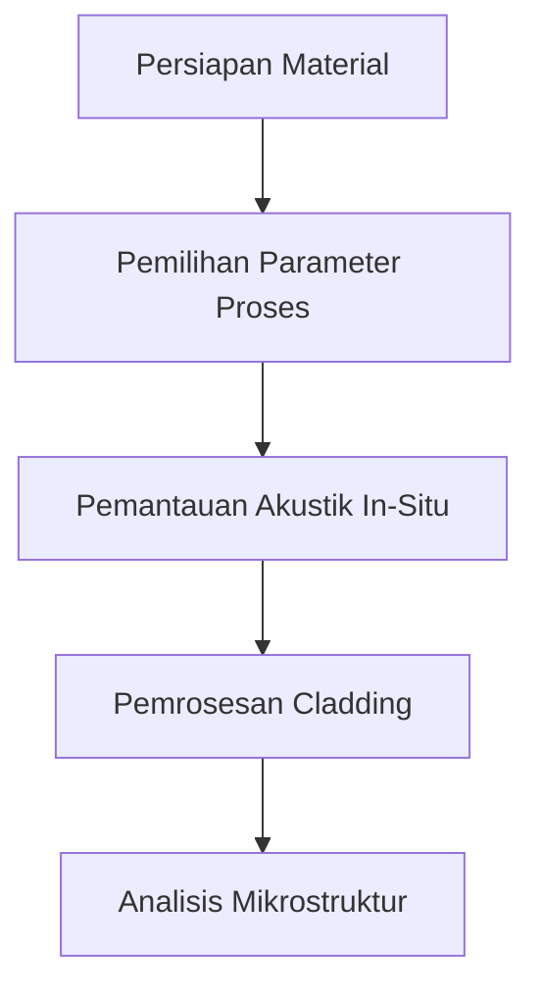

# 813 — Coaxial Laser Cladding Direct Energy Deposition (DED) for Heavy Industrial Shaft Remanufacturing: In-Situ Acoustic Monitoring, Clad Dilution Control, and Interface Microstructure

**Domain:** Teknik Industri & Rekayasa Sistem Industri  
**Topik Spesialis:** Coaxial Laser Cladding Direct Energy Deposition (DED) for Heavy Industrial Shaft Remanufacturing: In-Situ Acoustic Monitoring, Clad Dilution Control, and Interface Microstructure  
**Standar & Referensi Utama:** Liu et al. (2023, Mater. Des.); ASTM F3187; ISO/ASTM 52900; Steen & Mazumder (Laser Material Processing, Springer)

---

## 1. Pendahuluan dan Konteks Industri

Dalam industri berat, komponen seperti poros sering mengalami keausan yang signifikan akibat beban mekanis yang tinggi dan kondisi operasional yang ekstrem. Proses remanufaktur menjadi krusial untuk memperpanjang umur komponen dan mengurangi biaya penggantian. Coaxial Laser Cladding menggunakan teknologi Direct Energy Deposition (DED) menawarkan solusi inovatif untuk perbaikan dan penguatan permukaan komponen ini. Proses ini memungkinkan penambahan material baru pada permukaan komponen yang aus, meningkatkan ketahanan terhadap keausan dan korosi.

Namun, tantangan utama dalam aplikasi DED adalah pengendalian pencampuran material (clad dilution) dan pemantauan mikrostruktur antarmuka antara material asli dan material yang dilapisi. Pencampuran yang tidak terkontrol dapat menyebabkan penurunan sifat mekanik dari lapisan yang diterapkan, yang pada gilirannya dapat mempengaruhi kinerja komponen secara keseluruhan. Oleh karena itu, pengembangan metode pemantauan akustik in-situ untuk mendeteksi perubahan selama proses cladding menjadi sangat penting. 

Menurut Liu et al. (2023), penerapan teknik pemantauan akustik dapat memberikan informasi real-time mengenai kondisi proses, memungkinkan penyesuaian parameter untuk mengoptimalkan kualitas lapisan. Dengan demikian, pemahaman yang mendalam tentang interaksi antara parameter proses, mikrostruktur, dan sifat mekanik sangat penting untuk mencapai hasil yang diinginkan dalam remanufaktur poros industri berat.

## 2. Landasan Teori & Formulasi Matematis

### 2.1. Prinsip Dasar Coaxial Laser Cladding

Coaxial Laser Cladding adalah metode di mana laser digunakan untuk melelehkan material serbuk yang disuplai melalui nozzle coaxial. Energi laser yang terfokus menciptakan kolam cair yang memungkinkan material serbuk untuk menyatu dengan substrat. Proses ini dapat dinyatakan dengan persamaan energi berikut:

$$
Q = \eta \cdot P \cdot t
$$

di mana:
- \( Q \) = Energi yang diserap (Joule)
- \( \eta \) = Efisiensi penyerapan energi
- \( P \) = Daya laser (Watt)
- \( t \) = Waktu pemaparan (detik)

### 2.2. Pengendalian Pencampuran Material (Clad Dilution)

Pencampuran material dapat dianalisis dengan menggunakan rasio antara volume material baru dan volume material substrat. Rasio ini dapat dinyatakan sebagai:

$$
D = \frac{V_{clad}}{V_{clad} + V_{substrat}}
$$

di mana:
- \( D \) = Dilusi (Clad Dilution)
- \( V_{clad} \) = Volume material yang dilapisi
- \( V_{substrat} \) = Volume material substrat

### 2.3. Mikrostruktur Antarmuka

Mikrostruktur antarmuka dapat dianalisis dengan menggunakan hukum Fick tentang difusi, yang menyatakan bahwa laju difusi (\( J \)) dapat dinyatakan sebagai:

$$
J = -D \frac{dC}{dx}
$$

di mana:
- \( D \) = Koefisien difusi
- \( C \) = Konsentrasi material
- \( x \) = Posisi dalam material

## 3. Metodologi Rekayasa & Standar Prosedur Operasional (SOP)

### 3.1. Langkah-langkah Implementasi

1. **Persiapan Material**: Pemilihan material serbuk yang sesuai berdasarkan sifat mekanik yang diinginkan.
2. **Pengaturan Parameter Proses**: Menentukan daya laser, kecepatan pemindahan, dan laju aliran serbuk.
3. **Pemantauan Akustik In-Situ**: Menggunakan sensor akustik untuk memantau suara yang dihasilkan selama proses cladding.
4. **Pelaksanaan Proses Cladding**: Melakukan proses cladding dengan pengaturan parameter yang telah ditentukan.
5. **Analisis Mikrostruktur**: Menggunakan mikroskop elektron untuk menganalisis mikrostruktur antarmuka setelah proses selesai.

### 3.2. Diagram Alir Proses

## 4. Studi Kasus Kuantitatif Industri & Perhitungan Numerik

### 4.1. Contoh Kasus

Misalkan kita ingin melakukan cladding pada poros dengan diameter 50 mm dan panjang 200 mm. Material substrat adalah baja karbon, dan material serbuk yang digunakan adalah stainless steel.

### 4.2. Parameter Proses

- Daya laser (\( P \)) = 2000 Watt
- Waktu pemaparan (\( t \)) = 10 detik
- Efisiensi penyerapan energi (\( \eta \)) = 0.8
- Volume material yang dilapisi (\( V_{clad} \)) = 10 cm³
- Volume material substrat (\( V_{substrat} \)) = 100 cm³

### 4.3. Perhitungan Energi yang Diserap

$$
Q = 0.8 \cdot 2000 \cdot 10 = 16000 \text{ Joule}
$$

### 4.4. Perhitungan Clad Dilution

$$
D = \frac{10}{10 + 100} = \frac{10}{110} \approx 0.0909 \text{ atau } 9.09\%
$$

### 4.5. Interpretasi Hasil

Hasil perhitungan menunjukkan bahwa energi yang diserap selama proses cladding cukup tinggi, yang dapat menghasilkan lapisan yang baik jika parameter lainnya juga diatur dengan tepat. Dilusi sebesar 9.09% menunjukkan bahwa ada proporsi material substrat yang cukup besar dalam lapisan yang dihasilkan, yang perlu diperhatikan untuk menjaga sifat mekanik yang diinginkan.

## 5. Evaluasi Kritis, Aplikasi Lintas Sektor & Standar Masa Depan

Penerapan teknologi Coaxial Laser Cladding tidak hanya terbatas pada industri berat, tetapi juga dapat diadaptasi dalam sektor lain seperti otomotif, aerospace, dan energi terbarukan. Dalam konteks rantai pasok, teknologi ini dapat mengurangi waktu dan biaya penggantian komponen, serta meningkatkan efisiensi operasional.

Namun, terdapat batasan dalam metodologi ini, seperti kebutuhan untuk pemantauan yang lebih akurat dan pengendalian proses yang lebih baik untuk menghindari pencampuran yang tidak diinginkan. Penelitian masa depan dapat difokuskan pada pengembangan algoritma pemantauan berbasis kecerdasan buatan untuk meningkatkan akurasi dan efisiensi proses cladding.

Dengan demikian, Coaxial Laser Cladding DED memiliki potensi besar untuk meningkatkan proses remanufaktur di berbagai sektor industri, dengan fokus pada pengendalian kualitas dan pemantauan yang lebih baik.

--- 

Dokumen ini memberikan gambaran menyeluruh tentang Coaxial Laser Cladding DED, dengan penekanan pada aspek teknis dan aplikatif yang relevan dengan kebutuhan industri saat ini.

## 5. Ringkasan & Catatan Praktis Implementasi
Implementasi metode ini memerlukan standarisasi prosedur operasi (SOP), kalibrasi instrumen berkala, serta integrasi pemantauan real-time untuk memastikan konsistensi performa dan efisiensi sistem secara berkelanjutan.
