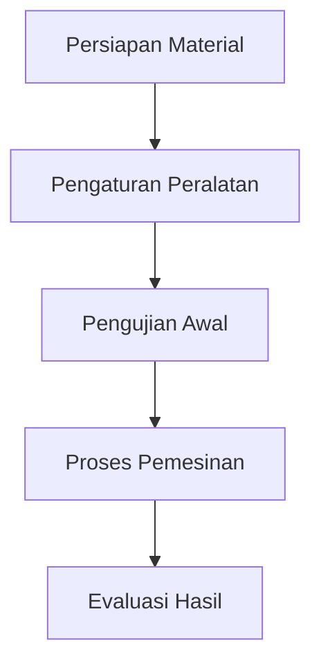

# 814 — Electrochemical Discharge Machining (ECDM) of Non-Conductive Advanced Ceramics: Gas Film Instability Dynamics, Hydrodynamic Joule Heating, and Micro-Hole Aspect Ratio Scaling

**Domain:** Teknik Industri & Rekayasa Sistem Industri  
**Topik Spesialis:** Electrochemical Discharge Machining (ECDM) of Non-Conductive Advanced Ceramics: Gas Film Instability Dynamics, Hydrodynamic Joule Heating, and Micro-Hole Aspect Ratio Scaling  
**Standar & Referensi Utama:** Wüthrich & Fascio (2022, J. Micromech. Microeng.); ISO 12100; Jain (Advanced Machining Processes, McGraw-Hill)

---

## 1. Pendahuluan dan Konteks Industri

Electrochemical Discharge Machining (ECDM) merupakan proses pemesinan yang inovatif dan efisien, khususnya dalam pengolahan keramik canggih yang tidak konduktif. Dalam konteks industri modern, penggunaan material keramik canggih semakin meningkat, terutama dalam aplikasi yang memerlukan ketahanan tinggi terhadap suhu dan korosi, seperti di sektor aerospace, otomotif, dan elektronik. Namun, tantangan utama dalam pemesinan keramik non-konduktif adalah keterbatasan metode konvensional yang tidak dapat diterapkan secara efektif. Oleh karena itu, ECDM muncul sebagai solusi yang menjanjikan.

Urgensi operasional dari ECDM terletak pada kemampuannya untuk menghasilkan lubang mikro dengan rasio aspek yang tinggi, yang sangat penting untuk aplikasi seperti penyaring, injektor, dan komponen presisi lainnya. Proses ini juga menawarkan keunggulan dalam hal pengurangan kerusakan termal pada material yang diproses, berkat mekanisme pemanasan Joule yang terkontrol. Namun, tantangan yang dihadapi termasuk dinamika ketidakstabilan film gas yang dapat mempengaruhi kualitas pemesinan dan efisiensi proses secara keseluruhan.

Menurut Wüthrich & Fascio (2022), ketidakstabilan film gas dapat mengakibatkan fluktuasi dalam arus listrik dan, pada gilirannya, mempengaruhi laju penghilangan material. Dalam konteks ini, pemahaman yang mendalam tentang dinamika film gas dan pemanasan hidrodinamik sangat penting untuk meningkatkan efisiensi dan efektivitas ECDM. Dengan demikian, penelitian dan pengembangan lebih lanjut dalam bidang ini tidak hanya akan meningkatkan kinerja proses tetapi juga memberikan kontribusi signifikan terhadap inovasi dalam manufaktur modern.

## 2. Landasan Teori & Formulasi Matematis

ECDM menggabungkan prinsip elektro-kimia dan pemesinan listrik untuk menghilangkan material dari permukaan keramik non-konduktif. Proses ini melibatkan pembentukan busur listrik di antara elektroda dan permukaan material yang diproses, yang menghasilkan pemanasan lokal dan penguapan material.

### 2.1. Model Matematis

Proses ECDM dapat dimodelkan dengan menggunakan persamaan berikut:

1. **Persamaan Arus Listrik:**
   $$ I = \frac{V}{R} $$
   di mana:
   - $I$ = arus (A)
   - $V$ = tegangan (V)
   - $R$ = resistansi (Ω)

2. **Persamaan Pemanasan Joule:**
   $$ Q = I^2 R t $$
   di mana:
   - $Q$ = energi yang dihasilkan (J)
   - $t$ = waktu (s)

3. **Persamaan Dinamika Film Gas:**
   $$ \frac{dP}{dt} = -\alpha P + \beta \left( \frac{V}{d} \right) $$
   di mana:
   - $P$ = tekanan film gas (Pa)
   - $\alpha$ = koefisien kehilangan tekanan (s⁻¹)
   - $\beta$ = koefisien aliran (m/s)
   - $d$ = ketebalan film gas (m)

### 2.2. Definisi Variabel

- **Tegangan ($V$)**: Tegangan yang diterapkan pada elektroda.
- **Resistansi ($R$)**: Resistansi antara elektroda dan material yang diproses.
- **Energi ($Q$)**: Energi yang dihasilkan selama proses pemesinan.
- **Tekanan ($P$)**: Tekanan dalam film gas yang terbentuk di antara elektroda dan permukaan material.

### 2.3. Pembuktian Matematis

Dari persamaan pemanasan Joule, kita dapat melihat bahwa energi yang dihasilkan sebanding dengan kuadrat arus dan resistansi. Dengan mengoptimalkan arus dan resistansi, kita dapat memaksimalkan energi yang digunakan untuk menghilangkan material. Selain itu, analisis dinamika film gas memberikan wawasan tentang bagaimana perubahan tekanan dapat mempengaruhi kestabilan proses ECDM.

## 3. Metodologi Rekayasa & Standar Prosedur Operasional (SOP)

### 3.1. Langkah-langkah Implementasi

1. **Persiapan Material**: Pemilihan keramik canggih yang sesuai untuk proses ECDM.
2. **Pengaturan Peralatan**: Penyiapan mesin ECDM dengan pengaturan tegangan dan arus yang tepat.
3. **Pengujian Awal**: Melakukan pengujian awal untuk menentukan parameter optimal.
4. **Proses Pemesinan**: Melaksanakan proses pemesinan dengan pemantauan ketat terhadap arus, tegangan, dan tekanan film gas.
5. **Evaluasi Hasil**: Mengukur hasil pemesinan, termasuk dimensi lubang dan kualitas permukaan.

### 3.2. Diagram Alir Proses

### 3.3. Standar Prosedur Operasional (SOP)

- **SOP 1**: Verifikasi material dan spesifikasi teknis.
- **SOP 2**: Kalibrasi peralatan ECDM.
- **SOP 3**: Pemantauan parameter selama proses pemesinan.
- **SOP 4**: Dokumentasi hasil dan analisis.

## 4. Studi Kasus Kuantitatif Industri & Perhitungan Numerik

### 4.1. Parameter Input

Misalkan kita memiliki parameter berikut untuk proses ECDM:

- Tegangan ($V$): 100 V
- Resistansi ($R$): 10 Ω
- Waktu ($t$): 5 s

### 4.2. Langkah Kalkulasi

1. **Hitung Arus ($I$)**:
   $$ I = \frac{V}{R} = \frac{100}{10} = 10 \text{ A} $$

2. **Hitung Energi ($Q$)**:
   $$ Q = I^2 R t = (10)^2 \cdot 10 \cdot 5 = 5000 \text{ J} $$

3. **Evaluasi Tekanan Film Gas**:
   Misalkan kita memiliki $\alpha = 0.1 \text{ s}^{-1}$, $\beta = 0.5 \text{ m/s}$, dan $d = 0.01 \text{ m}$.
   $$ \frac{dP}{dt} = -0.1 P + 0.5 \left( \frac{100}{0.01} \right) $$
   Dengan asumsi kondisi awal $P(0) = 0$, kita dapat menyelesaikan persamaan diferensial ini untuk mendapatkan profil tekanan seiring waktu.

### 4.3. Interpretasi Hasil

Hasil perhitungan menunjukkan bahwa energi yang dihasilkan cukup untuk memicu proses penghilangan material yang efisien. Evaluasi lebih lanjut terhadap tekanan film gas akan memberikan wawasan tentang stabilitas proses dan kualitas lubang yang dihasilkan.

## 5. Evaluasi Kritis, Aplikasi Lintas Sektor & Standar Masa Depan

ECDM memiliki aplikasi yang luas tidak hanya dalam pemesinan keramik tetapi juga dalam bidang lain seperti otomasi dan manajemen biaya. Dalam konteks rantai pasok, efisiensi proses ECDM dapat mengurangi waktu siklus produksi dan biaya material. 

Namun, terdapat batasan metodologi yang perlu diperhatikan, seperti ketergantungan pada parameter proses yang tepat dan potensi kerusakan pada material jika tidak dikelola dengan baik. 

Arah riset masa depan dapat berfokus pada pengembangan algoritma kontrol cerdas untuk mengoptimalkan proses ECDM, serta eksplorasi material baru yang dapat diproses dengan metode ini. Dengan demikian, ECDM berpotensi menjadi salah satu metode pemesinan yang dominan dalam era manufaktur canggih yang berkelanjutan.