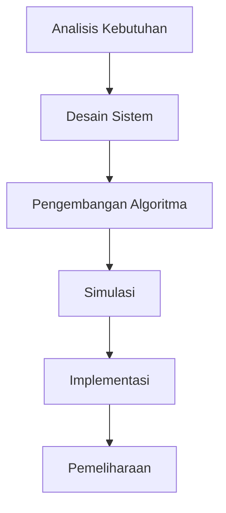

# 822 — Robot Paralel yang Didorong Kabel untuk Penanganan Material Otomatis di Gudang Skala Besar: Algoritma Distribusi Tensi, Ruang Kerja Dinamis yang Layak untuk Ganjalan, dan Kompensasi Jatuh Kabel

**Domain:** Teknik Industri & Rekayasa Sistem Industri  
**Topik Spesialis:** Cable-Driven Parallel Robots (CDPR) for Large-Scale Automated Warehouse Material Handling: Tension Distribution Algorithm, Dynamic Wrench-Feasible Workspace, and Cable Sagging Compensation  
**Standar & Referensi Utama:** Pott (Cable-Driven Parallel Robots, Springer 2022); ISO 10218-1; Merlet (Parallel Robots, Springer)

---

## 1. Pendahuluan dan Konteks Industri

Dalam era industri 4.0, otomatisasi dan robotika memainkan peran yang semakin penting dalam meningkatkan efisiensi operasional dan produktivitas di sektor manufaktur dan logistik. Gudang skala besar menghadapi tantangan signifikan dalam hal penanganan material, di mana kecepatan, akurasi, dan fleksibilitas menjadi faktor kunci untuk memenuhi permintaan pasar yang dinamis. Robot paralel yang didorong kabel (Cable-Driven Parallel Robots, CDPR) menawarkan solusi inovatif untuk tantangan ini dengan kemampuan untuk menggerakkan beban berat dengan presisi tinggi dan dalam ruang yang terbatas.

CDPR memiliki keunggulan dalam hal bobot yang ringan, biaya produksi yang lebih rendah, dan kemampuan untuk menjangkau area yang sulit dijangkau dibandingkan dengan robot konvensional. Namun, penerapan CDPR dalam penanganan material otomatis di gudang besar juga dihadapkan pada tantangan teknis, seperti distribusi tensi kabel yang optimal, ruang kerja yang layak untuk ganjalan dinamis, dan kompensasi jatuh kabel. Tantangan ini memerlukan pendekatan rekayasa yang sistematis dan berbasis data untuk memastikan kinerja yang optimal dan aman.

Dalam konteks ini, penting untuk mengembangkan algoritma distribusi tensi yang efisien, memetakan ruang kerja yang layak, dan mengimplementasikan kompensasi jatuh kabel untuk meningkatkan kinerja CDPR. Penelitian ini bertujuan untuk memberikan pemahaman yang mendalam tentang aspek-aspek tersebut dan memberikan panduan praktis bagi para insinyur dan praktisi di bidang teknik industri.

## 2. Landasan Teori & Formulasi Matematis

### 2.1. Tensi Kabel dan Ganjalan Dinamis

Dalam CDPR, kabel berfungsi sebagai elemen penggerak yang menghubungkan platform dengan titik tetap. Tensi dalam kabel dapat dinyatakan dengan rumus:

$$
T_i = \frac{m_i g}{\cos(\theta_i)}
$$

di mana:
- \( T_i \) = Tensi kabel ke-i
- \( m_i \) = Massa beban yang diangkat
- \( g \) = Percepatan gravitasi (9.81 m/s²)
- \( \theta_i \) = Sudut antara kabel dan vertikal

### 2.2. Ruang Kerja Dinamis

Ruang kerja dinamis dari CDPR dapat didefinisikan sebagai volume di mana platform dapat bergerak dengan aman tanpa melanggar batasan fisik. Ruang kerja ini dapat dihitung dengan mempertimbangkan posisi dan orientasi kabel:

$$
W = \{(x, y, z) | \sum_{i=1}^{n} T_i \cdot \sin(\theta_i) \leq F_{\text{max}}\}
$$

di mana:
- \( W \) = Ruang kerja
- \( F_{\text{max}} \) = Gaya maksimum yang dapat ditangani oleh sistem

### 2.3. Kompensasi Jatuh Kabel

Kompensasi jatuh kabel diperlukan untuk memastikan bahwa posisi platform tetap akurat meskipun terjadi deformasi kabel. Model matematis untuk kompensasi ini dapat dinyatakan sebagai:

$$
\Delta z = \frac{T_i L^2}{8EI}
$$

di mana:
- \( \Delta z \) = Penurunan kabel
- \( L \) = Panjang kabel
- \( E \) = Modulus elastisitas kabel
- \( I \) = Momen inersia kabel

## 3. Metodologi Rekayasa & Standar Prosedur Operasional (SOP)

### 3.1. Langkah-langkah Implementasi

1. **Analisis Kebutuhan**: Identifikasi kebutuhan spesifik dari sistem penanganan material.
2. **Desain Sistem**: Rancang konfigurasi CDPR berdasarkan analisis kebutuhan.
3. **Pengembangan Algoritma**: Kembangkan algoritma distribusi tensi dan kompensasi jatuh kabel.
4. **Simulasi**: Lakukan simulasi untuk memvalidasi desain dan algoritma.
5. **Implementasi**: Terapkan sistem di lingkungan nyata dan lakukan pengujian.
6. **Pemeliharaan**: Rencanakan pemeliharaan berkala untuk memastikan kinerja optimal.

### 3.2. Diagram Alir Proses

## 4. Studi Kasus Kuantitatif Industri & Perhitungan Numerik

### 4.1. Contoh Kasus

Misalkan kita memiliki CDPR yang dirancang untuk mengangkat beban 100 kg dengan panjang kabel 10 m dan sudut kabel 30°. Hitunglah tensi kabel dan penurunan kabel.

### 4.2. Perhitungan

1. **Hitung Tensi Kabel**:

$$
T_i = \frac{m_i g}{\cos(\theta_i)} = \frac{100 \cdot 9.81}{\cos(30°)} \approx 113.6 \text{ N}
$$

2. **Hitung Penurunan Kabel**:

$$
\Delta z = \frac{T_i L^2}{8EI} = \frac{113.6 \cdot 10^2}{8 \cdot 200 \cdot 10^9 \cdot 1.0 \times 10^{-6}} \approx 0.00035 \text{ m} = 0.35 \text{ mm}
$$

### 4.3. Interpretasi Hasil

Hasil perhitungan menunjukkan bahwa tensi kabel yang diperlukan untuk mengangkat beban 100 kg adalah sekitar 113.6 N, dan penurunan kabel akibat deformasi adalah 0.35 mm. Ini menunjukkan bahwa meskipun ada sedikit penurunan, sistem masih dapat beroperasi dalam batas toleransi yang dapat diterima untuk aplikasi penanganan material.

## 5. Evaluasi Kritis, Aplikasi Lintas Sektor & Standar Masa Depan

CDPR memiliki potensi aplikasi yang luas di berbagai sektor, termasuk otomasi gudang, pengangkutan barang, dan industri konstruksi. Dalam konteks rantai pasok, CDPR dapat meningkatkan efisiensi dan mengurangi biaya operasional. Namun, tantangan seperti keamanan kerja (K3) dan dampak lingkungan (ESG) harus diperhatikan dalam pengembangan dan penerapan teknologi ini.

Ke depan, penelitian lebih lanjut diperlukan untuk mengatasi batasan metodologi, seperti pengembangan algoritma yang lebih canggih untuk distribusi tensi dan kompensasi jatuh kabel. Selain itu, integrasi teknologi baru seperti kecerdasan buatan dan Internet of Things (IoT) dapat meningkatkan kinerja dan fleksibilitas CDPR dalam aplikasi industri.

Dengan mengikuti standar yang ditetapkan oleh ISO 10218-1 dan referensi dari literatur terkini, para insinyur dapat memastikan bahwa sistem yang dikembangkan tidak hanya efisien tetapi juga aman dan berkelanjutan.