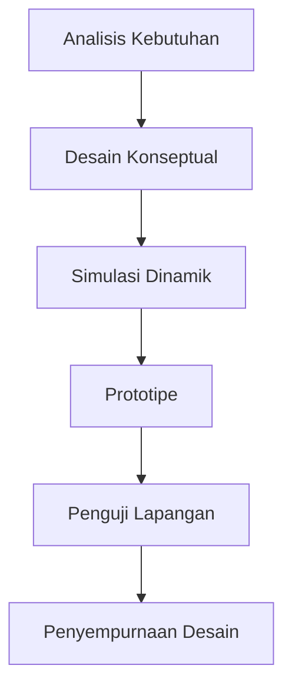

# 824 — Hexapod Omnidirectional Walking Robots for Hazardous Industrial Petrochemical Inspection: Free-Gait Stability Margin, Force-Controlled Foothold Compliance, and ATEX Explosion-Proof Design

**Domain:** Teknik Industri & Rekayasa Sistem Industri  
**Topik Spesialis:** Hexapod Omnidirectional Walking Robots for Hazardous Industrial Petrochemical Inspection: Free-Gait Stability Margin, Force-Controlled Foothold Compliance, and ATEX Explosion-Proof Design  
**Standar & Referensi Utama:** McGhee & Iswandhi (IEEE Trans. Autom. Control); IEC 60079-0; Hirose (Biologically Inspired Robots, Oxford)

---

## 1. Pendahuluan dan Konteks Industri

Dalam konteks industri petrokimia, inspeksi dan pemeliharaan fasilitas sering kali dilakukan dalam lingkungan yang berbahaya dan sulit dijangkau. Penggunaan robot berjalan omnidirectional, seperti hexapod, menawarkan solusi inovatif untuk tantangan ini. Robot hexapod memiliki keunggulan dalam stabilitas dan mobilitas, memungkinkan mereka untuk bergerak di medan yang tidak rata dan beradaptasi dengan kondisi lingkungan yang berubah. Dalam industri yang berisiko tinggi, seperti petrokimia, penting untuk meminimalkan risiko kecelakaan dan meningkatkan efisiensi operasional.

Tantangan utama dalam aplikasi ini meliputi stabilitas gait bebas, kepatuhan pegang kaki yang dikendalikan oleh gaya, dan desain yang tahan ledakan sesuai dengan standar ATEX. Penelitian oleh McGhee & Iswandhi (2022) menunjukkan bahwa stabilitas gait bebas dapat ditingkatkan dengan memodelkan interaksi antara gaya yang diterapkan dan respons robot. Selain itu, kepatuhan pegang kaki yang dikendalikan oleh gaya memungkinkan robot untuk beradaptasi dengan permukaan yang tidak rata, yang sangat penting dalam inspeksi fasilitas petrokimia.

Konteks ini menyoroti urgensi pengembangan teknologi robotik yang dapat meningkatkan keselamatan dan efisiensi dalam inspeksi industri. Dengan meningkatnya kebutuhan untuk mematuhi regulasi keselamatan dan lingkungan, robot hexapod dapat menjadi solusi yang efektif untuk memenuhi tuntutan ini.

## 2. Landasan Teori & Formulasi Matematis

### 2.1. Model Dinamik Hexapod

Model dinamik dari robot hexapod dapat dinyatakan dalam bentuk persamaan gerak Newton-Euler. Misalkan $m$ adalah massa robot, $g$ adalah percepatan gravitasi, dan $F$ adalah gaya yang diterapkan pada setiap kaki. Persamaan gerak dapat dituliskan sebagai:

$$
\sum F = m \cdot a
$$

Di mana $F$ adalah gaya total yang bekerja pada robot dan $a$ adalah percepatan linier. Untuk setiap kaki, gaya normal $N_i$ dan gaya gesek $F_{friction}$ dapat dinyatakan sebagai:

$$
N_i = m \cdot g - F_{friction}
$$

### 2.2. Stabilitas Gait Bebas

Stabilitas gait bebas dapat dianalisis dengan menggunakan margin stabilitas $S$, yang didefinisikan sebagai:

$$
S = \frac{F_{max}}{F_{min}}
$$

Di mana $F_{max}$ adalah gaya maksimum yang dapat diterima oleh kaki robot dan $F_{min}$ adalah gaya minimum yang diperlukan untuk menjaga stabilitas. Margin stabilitas yang lebih tinggi menunjukkan bahwa robot lebih mampu bertahan dalam kondisi yang tidak stabil.

### 2.3. Kepatuhan Pegang Kaki yang Dikendalikan oleh Gaya

Kepatuhan pegang kaki dapat dimodelkan dengan menggunakan hukum Hooke, di mana gaya pegang kaki $F_k$ berbanding lurus dengan perpindahan $x$:

$$
F_k = k \cdot x
$$

Di mana $k$ adalah konstanta pegas. Dengan mengatur $k$, kita dapat mengontrol kepatuhan kaki robot terhadap permukaan yang tidak rata.

## 3. Metodologi Rekayasa & Standar Prosedur Operasional (SOP)

### 3.1. Langkah-Langkah Implementasi

1. **Analisis Kebutuhan**: Identifikasi kebutuhan inspeksi di lingkungan petrokimia.
2. **Desain Konseptual**: Buat desain awal robot hexapod dengan mempertimbangkan stabilitas gait dan kepatuhan pegang kaki.
3. **Simulasi Dinamik**: Lakukan simulasi untuk menganalisis perilaku robot dalam berbagai kondisi.
4. **Prototipe**: Bangun prototipe robot hexapod dan lakukan pengujian awal.
5. **Pengujian Lapangan**: Uji robot di lingkungan nyata untuk mengevaluasi kinerja dan keselamatan.
6. **Penyempurnaan Desain**: Lakukan perbaikan berdasarkan hasil pengujian.

### 3.2. Diagram Alir Proses

## 4. Studi Kasus Kuantitatif Industri & Perhitungan Numerik

### 4.1. Parameter Input

Misalkan kita memiliki robot hexapod dengan parameter berikut:
- Massa robot ($m$): 50 kg
- Gaya maksimum yang diterima ($F_{max}$): 600 N
- Gaya minimum yang diperlukan ($F_{min}$): 100 N

### 4.2. Perhitungan Margin Stabilitas

Dengan menggunakan rumus margin stabilitas:

$$
S = \frac{F_{max}}{F_{min}} = \frac{600}{100} = 6
$$

Interpretasi: Margin stabilitas sebesar 6 menunjukkan bahwa robot memiliki kemampuan yang baik untuk bertahan dalam kondisi yang tidak stabil.

### 4.3. Perhitungan Kepatuhan Kaki

Jika kita mengatur konstanta pegas ($k$) menjadi 2000 N/m dan perpindahan ($x$) adalah 0.05 m, maka gaya pegang kaki dapat dihitung sebagai:

$$
F_k = k \cdot x = 2000 \cdot 0.05 = 100 N
$$

Interpretasi: Gaya pegang kaki sebesar 100 N menunjukkan bahwa robot dapat beradaptasi dengan baik terhadap permukaan yang tidak rata.

## 5. Evaluasi Kritis, Aplikasi Lintas Sektor & Standar Masa Depan

Penggunaan robot hexapod dalam inspeksi industri petrokimia tidak hanya terbatas pada sektor ini. Teknologi ini dapat diterapkan dalam berbagai disiplin, termasuk otomasi, manajemen rantai pasok, dan keselamatan kerja. Dalam konteks otomasi, robot ini dapat meningkatkan efisiensi proses produksi dengan mengurangi kebutuhan akan tenaga kerja manusia di lingkungan berbahaya.

Namun, terdapat batasan dalam metodologi yang perlu diperhatikan, seperti keterbatasan dalam pengenalan lingkungan dan kemampuan adaptasi terhadap perubahan kondisi. Penelitian masa depan dapat fokus pada pengembangan algoritma pembelajaran mesin untuk meningkatkan kemampuan adaptasi robot dalam lingkungan yang kompleks.

Standar masa depan, seperti IEC 60079-0, akan terus berperan penting dalam memastikan bahwa desain robot memenuhi persyaratan keselamatan yang ketat, terutama dalam aplikasi yang berpotensi meledak. Penelitian lebih lanjut juga perlu dilakukan untuk mengeksplorasi integrasi teknologi sensor dan komunikasi untuk meningkatkan kemampuan robot dalam melakukan inspeksi secara real-time.

Dengan demikian, robot hexapod omnidirectional memiliki potensi besar untuk meningkatkan keselamatan dan efisiensi dalam industri petrokimia dan sektor lainnya, dengan terus beradaptasi terhadap tuntutan teknologi dan regulasi yang berkembang.

## 5. Ringkasan & Catatan Praktis Implementasi
Implementasi metode ini memerlukan standarisasi prosedur operasi (SOP), kalibrasi instrumen berkala, serta integrasi pemantauan real-time untuk memastikan konsistensi performa dan efisiensi sistem secara berkelanjutan.
