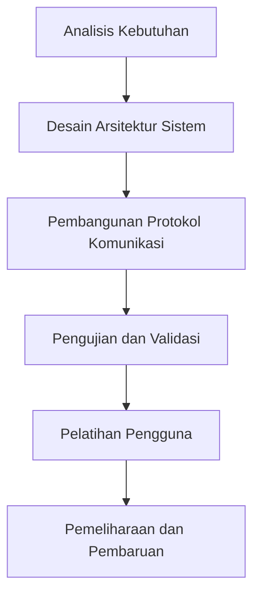

# 825 — Implementasi Protokol VDA 5050 dalam Armada AGV/AMR Heterogen: Telemetri JSON MQTT, Tindakan Instan, Parsing Factsheet Pesanan, dan Arbiter Persimpangan Lalu Lintas Terpusat

**Domain:** Teknik Industri & Rekayasa Sistem Industri  
**Topik Spesialis:** VDA 5050 Protocol Implementation in Heterogeneous AGV/AMR Fleets: JSON MQTT Telemetry, Instant Actions, Order Factsheet Parsing, and Centralized Traffic Junction Arbiter  
**Standar & Referensi Utama:** VDMA Standard 5050:2024; ISO 3691-4; Balyakov et al. (2024, IEEE Trans. Autom. Sci. Eng.)

---

## 1. Pendahuluan dan Konteks Industri

Dalam era industri 4.0, otomatisasi dan digitalisasi telah menjadi pilar penting dalam meningkatkan efisiensi operasional di sektor manufaktur dan rantai pasok. Armada kendaraan otomatis (AGV) dan robot otonom mobile (AMR) memainkan peran sentral dalam mempercepat proses logistik dan distribusi. Protokol VDA 5050, yang diadopsi oleh VDMA, memberikan kerangka kerja untuk interoperabilitas antara berbagai jenis AGV dan AMR, memungkinkan integrasi yang lebih baik dalam lingkungan heterogen. 

Urgensi operasional dari implementasi protokol ini terletak pada kebutuhan untuk mengurangi waktu siklus, meningkatkan fleksibilitas, dan meminimalkan biaya operasional. Dalam konteks ini, tantangan utama yang dihadapi adalah pengelolaan lalu lintas yang efisien di persimpangan, pengolahan data telemetri secara real-time, dan respon cepat terhadap perubahan permintaan. Penelitian oleh Balyakov et al. (2024) menunjukkan bahwa tanpa sistem yang terintegrasi, efisiensi armada dapat menurun hingga 30% akibat konflik lalu lintas dan pengambilan keputusan yang lambat.

Dengan demikian, implementasi VDA 5050 tidak hanya menjadi pilihan strategis, tetapi juga kebutuhan mendesak untuk memastikan daya saing di pasar global. Penelitian ini bertujuan untuk memberikan panduan komprehensif tentang penerapan protokol VDA 5050, termasuk aspek teknis dan metodologis yang diperlukan untuk mencapai hasil optimal dalam pengoperasian armada AGV/AMR.

## 2. Landasan Teori & Formulasi Matematis

Protokol VDA 5050 mengatur komunikasi antara AGV/AMR dan sistem pengendalian pusat menggunakan format data JSON dan protokol MQTT. Dalam konteks ini, kita perlu mendefinisikan beberapa variabel kunci:

- $N$: jumlah AGV/AMR dalam armada
- $T$: waktu siklus pengoperasian (dalam detik)
- $D$: jarak rata-rata yang ditempuh oleh AGV/AMR (dalam meter)
- $V$: kecepatan rata-rata AGV/AMR (dalam meter/detik)
- $R$: tingkat keberhasilan pengiriman (persentase)

Rumus dasar untuk menghitung waktu yang dibutuhkan untuk menyelesaikan pengiriman dapat dinyatakan sebagai:

$$
T_{total} = \frac{D}{V} + T_{waiting}
$$

Di mana $T_{waiting}$ adalah waktu tunggu yang diakibatkan oleh konflik lalu lintas di persimpangan. Untuk menghitung $T_{waiting}$, kita dapat menggunakan model antrian M/M/1, di mana:

$$
T_{waiting} = \frac{\lambda}{\mu(\mu - \lambda)}
$$

Di mana:
- $\lambda$: tingkat kedatangan AGV/AMR (rata-rata per detik)
- $\mu$: tingkat pelayanan (rata-rata AGV/AMR yang dapat dilayani per detik)

Dengan menggunakan rumus di atas, kita dapat menganalisis kinerja armada dan mengidentifikasi potensi bottleneck dalam sistem.

## 3. Metodologi Rekayasa & Standar Prosedur Operasional (SOP)

Implementasi VDA 5050 dalam armada AGV/AMR melibatkan beberapa langkah sistematis sebagai berikut:

1. **Analisis Kebutuhan**: Identifikasi kebutuhan spesifik dari sistem yang akan diimplementasikan.
2. **Desain Arsitektur Sistem**: Mengembangkan arsitektur sistem yang mencakup komponen perangkat keras dan perangkat lunak, termasuk server MQTT dan modul telemetri.
3. **Pengembangan Protokol Komunikasi**: Mengimplementasikan komunikasi berbasis JSON dan MQTT untuk pertukaran data antara AGV/AMR dan sistem pusat.
4. **Pengujian dan Validasi**: Melakukan pengujian untuk memastikan bahwa sistem berfungsi sesuai dengan spesifikasi yang ditetapkan.
5. **Pelatihan Pengguna**: Memberikan pelatihan kepada operator dan staf terkait untuk memastikan pemahaman yang baik tentang sistem yang baru diimplementasikan.
6. **Pemeliharaan dan Pembaruan**: Menetapkan prosedur pemeliharaan untuk memastikan sistem tetap berfungsi dengan baik dan melakukan pembaruan sesuai kebutuhan.

Diagram alir proses implementasi dapat digambarkan sebagai berikut:

## 4. Studi Kasus Kuantitatif Industri & Perhitungan Numerik

Untuk memberikan gambaran yang lebih jelas tentang penerapan VDA 5050, mari kita lihat studi kasus pada sebuah pabrik otomotif yang menggunakan 10 AGV untuk pengangkutan material. Misalkan:

- Jarak rata-rata yang ditempuh ($D$) = 100 meter
- Kecepatan rata-rata ($V$) = 1 meter/detik
- Tingkat kedatangan ($\lambda$) = 2 AGV per detik
- Tingkat pelayanan ($\mu$) = 3 AGV per detik

### Langkah 1: Hitung waktu siklus pengoperasian

Pertama, kita menghitung waktu yang dibutuhkan untuk menyelesaikan pengiriman:

$$
T_{total} = \frac{D}{V} + T_{waiting}
$$

### Langkah 2: Hitung waktu tunggu

Untuk menghitung $T_{waiting}$, kita gunakan rumus antrian:

$$
T_{waiting} = \frac{\lambda}{\mu(\mu - \lambda)} = \frac{2}{3(3 - 2)} = \frac{2}{3} \text{ detik}
$$

### Langkah 3: Hitung waktu total

Sekarang kita substitusi nilai ke dalam rumus waktu total:

$$
T_{total} = \frac{100}{1} + \frac{2}{3} = 100 + 0.67 = 100.67 \text{ detik}
$$

### Interpretasi Hasil

Hasil ini menunjukkan bahwa setiap AGV memerlukan rata-rata 100.67 detik untuk menyelesaikan pengiriman. Dengan 10 AGV yang beroperasi secara bersamaan, pabrik dapat meningkatkan throughput dan mengurangi waktu siklus secara signifikan.

## 5. Evaluasi Kritis, Aplikasi Lintas Sektor & Standar Masa Depan

Implementasi VDA 5050 tidak hanya terbatas pada sektor manufaktur, tetapi juga dapat diterapkan dalam berbagai disiplin lain seperti rantai pasok, otomasi, dan manajemen biaya. Dalam konteks rantai pasok, sistem ini dapat meningkatkan efisiensi pengiriman dan mengurangi biaya logistik. Selain itu, penerapan teknologi ini juga sejalan dengan prinsip K3 dan ESG, di mana pengurangan emisi dan peningkatan keselamatan kerja menjadi fokus utama.

Namun, terdapat beberapa batasan dalam metodologi ini, seperti kebutuhan untuk infrastruktur yang memadai dan tantangan dalam integrasi sistem yang sudah ada. Oleh karena itu, arah riset masa depan harus berfokus pada pengembangan algoritma yang lebih canggih untuk pengelolaan lalu lintas dan pengoptimalan armada, serta peningkatan interoperabilitas antara berbagai sistem.

Dengan demikian, penerapan VDA 5050 dalam armada AGV/AMR merupakan langkah strategis yang dapat membawa manfaat signifikan bagi industri, meningkatkan efisiensi operasional, dan mendukung keberlanjutan dalam proses manufaktur dan logistik.