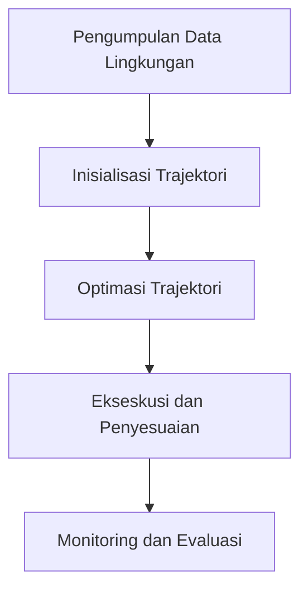

# 826 — Optimasi Trajektori Lokal 2D/3D Menggunakan Time-Elastic Band (TEB) untuk AMR Industri di Lorong Dinamis yang Padat: Kendala Kinematik Non-Holonomik dan Penghindaran Tabrakan Real-Time

**Domain:** Teknik Industri & Rekayasa Sistem Industri  
**Topik Spesialis:** Time-Elastic Band (TEB) 2D/3D Local Trajectory Optimization for Industrial AMR in Dynamic Congested Aisles: Non-Holonomic Kinematic Constraints and Real-Time Collision Avoidance  
**Standar & Referensi Utama:** Rösmann et al. (2022, Rob. Auton. Syst.); ISO 12100; Siegwart et al. (Introduction to Autonomous Mobile Robots, MIT Press)

---

## 1. Pendahuluan dan Konteks Industri

Dalam era industri 4.0, penggunaan Autonomous Mobile Robots (AMR) semakin meningkat dalam lingkungan manufaktur dan rantai pasok. AMR berfungsi untuk meningkatkan efisiensi operasional dengan mengurangi waktu dan biaya transportasi material. Namun, tantangan utama yang dihadapi AMR adalah navigasi di lorong-lorong yang padat dan dinamis, di mana interaksi dengan manusia dan objek lain sangat mungkin terjadi. Dalam konteks ini, optimasi trajektori menjadi sangat penting untuk memastikan AMR dapat bergerak dengan aman dan efisien.

Kondisi lingkungan yang dinamis, seperti perubahan posisi objek dan manusia, memerlukan algoritma yang mampu melakukan perhitungan secara real-time. Salah satu pendekatan yang menjanjikan adalah penggunaan Time-Elastic Band (TEB), yang memungkinkan AMR untuk merencanakan dan menyesuaikan trajektori secara fleksibel. TEB mengintegrasikan kendala kinematik non-holonomik yang khas pada AMR, sehingga memungkinkan pergerakan yang lebih realistis dan aman.

Urgensi dari penelitian ini terletak pada kebutuhan untuk meningkatkan produktivitas dan keselamatan di lingkungan industri. Dengan mengoptimalkan trajektori AMR, perusahaan dapat mengurangi waktu siklus dan meningkatkan throughput, yang pada gilirannya berdampak positif pada biaya operasional dan kepuasan pelanggan. Oleh karena itu, pemahaman yang mendalam tentang TEB dan penerapannya dalam konteks AMR di lorong-lorong yang padat sangat penting untuk keberhasilan implementasi teknologi ini.

## 2. Landasan Teori & Formulasi Matematis

Time-Elastic Band (TEB) adalah metode yang digunakan untuk merencanakan trajektori dengan mempertimbangkan kendala kinematik dan penghindaran tabrakan. Dalam konteks ini, kita akan membahas formulasi matematis yang mendasari TEB.

### 2.1. Model Kinematik Non-Holonomik

Model kinematik AMR dapat dinyatakan dalam bentuk persamaan diferensial berikut:

$$
\begin{align*}
\dot{x} &= v \cos(\theta) \\
\dot{y} &= v \sin(\theta) \\
\dot{\theta} &= \omega
\end{align*}
$$

di mana:
- \( x, y \) adalah posisi AMR dalam koordinat kartesian,
- \( \theta \) adalah sudut orientasi AMR,
- \( v \) adalah kecepatan linear,
- \( \omega \) adalah kecepatan sudut.

### 2.2. Fungsi Energi TEB

Fungsi energi dalam TEB didefinisikan untuk meminimalkan deviasi trajektori dari jalur yang diinginkan dan menghindari tabrakan. Fungsi energi total \( E \) dapat dinyatakan sebagai:

$$
E = E_{\text{smooth}} + E_{\text{goal}} + E_{\text{collision}}
$$

di mana:
- \( E_{\text{smooth}} \) adalah energi yang berkaitan dengan kelancaran trajektori,
- \( E_{\text{goal}} \) adalah energi yang berkaitan dengan pencapaian tujuan,
- \( E_{\text{collision}} \) adalah energi yang berkaitan dengan penghindaran tabrakan.

### 2.3. Pembuktian Energi Halus

Energi halus dapat dinyatakan sebagai:

$$
E_{\text{smooth}} = \sum_{i=1}^{N-1} \left( \frac{(p_{i+1} - p_i)^2}{\Delta t^2} + \lambda \cdot \frac{(v_{i+1} - v_i)^2}{\Delta t^2} \right)
$$

di mana:
- \( p_i \) adalah posisi pada langkah ke-i,
- \( \Delta t \) adalah interval waktu,
- \( \lambda \) adalah bobot untuk kecepatan.

Dengan meminimalkan \( E \) menggunakan metode optimasi seperti Gradient Descent, kita dapat menemukan trajektori optimal yang memenuhi kendala kinematik dan penghindaran tabrakan.

## 3. Metodologi Rekayasa & Standar Prosedur Operasional (SOP)

### 3.1. Langkah-langkah Implementasi

1. **Pengumpulan Data Lingkungan**: Menggunakan sensor untuk memetakan lingkungan dan mendeteksi posisi objek serta manusia.
2. **Inisialisasi Trajektori**: Menentukan jalur awal berdasarkan peta lingkungan.
3. **Optimasi Trajektori**: Menggunakan algoritma TEB untuk menghitung trajektori optimal dengan mempertimbangkan kendala kinematik dan penghindaran tabrakan.
4. **Eksekusi dan Penyesuaian**: Mengimplementasikan trajektori yang telah dioptimalkan dan melakukan penyesuaian secara real-time berdasarkan perubahan lingkungan.
5. **Monitoring dan Evaluasi**: Memantau kinerja AMR dan mengevaluasi efektivitas trajektori yang dihasilkan.

### 3.2. Diagram Alir Proses

## 4. Studi Kasus Kuantitatif Industri & Perhitungan Numerik

### 4.1. Parameter Input

Misalkan kita memiliki AMR dengan parameter sebagai berikut:
- Kecepatan maksimum \( v_{\text{max}} = 1.5 \, \text{m/s} \)
- Kecepatan sudut maksimum \( \omega_{\text{max}} = 1.0 \, \text{rad/s} \)
- Jarak minimum untuk penghindaran tabrakan \( d_{\text{min}} = 0.5 \, \text{m} \)

### 4.2. Langkah Kalkulasi

1. **Inisialisasi Posisi**: \( p_0 = (0, 0) \), \( \theta_0 = 0 \)
2. **Hitung Trajektori Awal**: Misalkan kita ingin bergerak ke titik \( p_g = (5, 5) \).
3. **Optimasi Menggunakan TEB**:
   - Hitung energi total \( E \) berdasarkan fungsi energi yang telah didefinisikan.
   - Lakukan iterasi untuk meminimalkan \( E \).

### 4.3. Contoh Perhitungan Energi

Misalkan kita memiliki dua titik pada trajektori:
- Titik 1: \( p_1 = (1, 1) \)
- Titik 2: \( p_2 = (2, 2) \)

Hitung \( E_{\text{smooth}} \):

$$
E_{\text{smooth}} = \frac{(p_2 - p_1)^2}{\Delta t^2} = \frac{((2, 2) - (1, 1))^2}{(1)^2} = \frac{(1, 1)^2}{1} = 2
$$

### 4.4. Interpretasi Hasil

Setelah optimasi, jika \( E \) berhasil diminimalkan, kita dapat menyimpulkan bahwa trajektori yang dihasilkan aman dan efisien untuk AMR beroperasi di lingkungan yang dinamis.

## 5. Evaluasi Kritis, Aplikasi Lintas Sektor & Standar Masa Depan

Penerapan TEB dalam optimasi trajektori AMR tidak hanya terbatas pada industri manufaktur, tetapi juga dapat diterapkan dalam sektor lain seperti logistik, kesehatan, dan pertanian. Dalam konteks rantai pasok, AMR yang dapat beradaptasi dengan cepat terhadap perubahan permintaan dan kondisi lingkungan akan meningkatkan efisiensi dan mengurangi biaya.

Namun, terdapat batasan dalam metodologi ini, seperti kompleksitas perhitungan dan kebutuhan akan perangkat keras yang kuat untuk pemrosesan real-time. Oleh karena itu, penelitian lebih lanjut diperlukan untuk mengembangkan algoritma yang lebih efisien dan adaptif.

Ke depan, integrasi teknologi AI dan machine learning dalam TEB dapat membuka peluang baru untuk pengembangan AMR yang lebih cerdas dan responsif terhadap lingkungan, serta mendukung prinsip-prinsip K3 dan ESG dalam operasi industri.

--- 

Dokumen ini memberikan gambaran menyeluruh mengenai optimasi trajektori AMR menggunakan TEB, dengan fokus pada aplikasi praktis dan relevansi industri. Penelitian dan pengembangan lebih lanjut dalam bidang ini diharapkan dapat menghasilkan solusi yang lebih inovatif dan efisien untuk tantangan yang dihadapi dalam lingkungan industri modern.

## 5. Ringkasan & Catatan Praktis Implementasi
Implementasi metode ini memerlukan standarisasi prosedur operasi (SOP), kalibrasi instrumen berkala, serta integrasi pemantauan real-time untuk memastikan konsistensi performa dan efisiensi sistem secara berkelanjutan.
