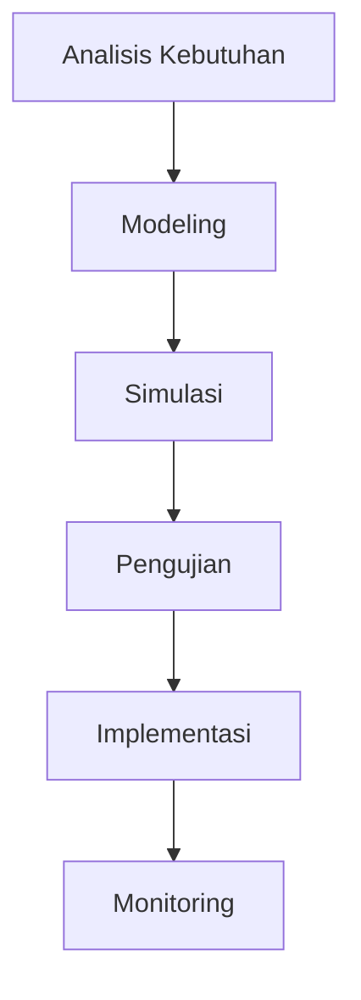

# 830 — Optimasi Robot Delta Paralel Berkecepatan Tinggi untuk Pick-and-Place: Dinamika Invers melalui Prinsip Kerja Virtual, Minimasi Jerk untuk Kelancaran Trajektori, dan Pelacakan Konveyor Berbasis Visi

**Domain:** Teknik Industri & Rekayasa Sistem Industri  
**Topik Spesialis:** High-Speed Parallel Delta Robot Pick-and-Place Optimization: Inverse Dynamics via Principle of Virtual Work, Trajectory Smoothness Jerk Minimization, and Vision Conveyor Tracking  
**Standar & Referensi Utama:** Clavel (Delta Parallel Robot Patent); ISO 9283; Bonev (The True Origins of Parallel Robots)

---

## 1. Pendahuluan dan Konteks Industri

Dalam era industri 4.0, otomatisasi dan robotika memainkan peran penting dalam meningkatkan efisiensi dan produktivitas di sektor manufaktur. Robot delta paralel, yang dikenal karena kecepatan dan akurasi tinggi dalam aplikasi pick-and-place, menjadi solusi yang semakin populer. Namun, tantangan yang dihadapi dalam implementasi robot ini mencakup dinamika invers, kelancaran trajektori, dan pelacakan konveyor yang efektif. 

Dari perspektif operasional, robot delta paralel menawarkan keunggulan dalam pengurangan waktu siklus dan peningkatan throughput. Namun, untuk mencapai performa optimal, perlu dilakukan optimasi yang melibatkan prinsip kerja virtual dan minimasi jerk. Jerk, yang didefinisikan sebagai perubahan percepatan, dapat mempengaruhi kualitas gerakan dan stabilitas sistem. Oleh karena itu, minimisasi jerk menjadi krusial untuk memastikan kelancaran gerakan robot, yang pada gilirannya meningkatkan efisiensi proses produksi.

Dalam konteks ekonomi, investasi dalam teknologi robotika dapat memberikan pengembalian yang signifikan melalui pengurangan biaya tenaga kerja dan peningkatan produktivitas. Namun, tantangan dalam integrasi sistem robot dengan lini produksi yang ada dan pelacakan objek bergerak di konveyor menuntut pendekatan yang sistematis dan berbasis data. Oleh karena itu, penelitian ini bertujuan untuk memberikan pemahaman mendalam mengenai optimasi robot delta paralel dalam konteks aplikasi industri yang nyata.

## 2. Landasan Teori & Formulasi Matematis

### Prinsip Kerja Virtual

Prinsip kerja virtual menyatakan bahwa kerja yang dilakukan oleh gaya eksternal pada sistem dapat dihitung dengan mempertimbangkan gaya internal dan gerakan virtual. Untuk robot delta paralel, gaya yang bekerja pada end-effector dapat dinyatakan sebagai:

$$
\delta W = \sum_{i=1}^{n} F_i \cdot \delta x_i
$$

di mana $F_i$ adalah gaya yang bekerja pada titik ke-i dan $\delta x_i$ adalah perpindahan virtual pada titik tersebut.

### Dinamika Invers

Dinamika invers robot delta paralel dapat dinyatakan dengan menggunakan hukum Newton kedua. Gaya yang diperlukan untuk mencapai percepatan tertentu dapat dihitung dengan:

$$
F = m \cdot a
$$

di mana $m$ adalah massa end-effector dan $a$ adalah percepatan yang diinginkan. Dengan mempertimbangkan gaya gravitasi dan gaya gesekan, persamaan dinamis dapat dituliskan sebagai:

$$
F_{net} = m \cdot a - F_{gravity} - F_{friction}
$$

### Minimasi Jerk

Minimasi jerk dapat dicapai dengan mengoptimalkan fungsi trajektori. Fungsi trajektori yang umum digunakan adalah polinomial kubik, yang dapat dinyatakan sebagai:

$$
s(t) = a_0 + a_1 t + a_2 t^2 + a_3 t^3
$$

Di mana $s(t)$ adalah posisi sebagai fungsi waktu, dan $a_0, a_1, a_2, a_3$ adalah koefisien yang perlu ditentukan. Jerk didefinisikan sebagai turunan ketiga dari posisi:

$$
j(t) = \frac{d^3s}{dt^3}
$$

Minimasi jerk dapat dilakukan dengan menggunakan metode optimasi seperti algoritma genetik atau metode gradien.

## 3. Metodologi Rekayasa & Standar Prosedur Operasional (SOP)

### Langkah-langkah Implementasi

1. **Analisis Kebutuhan**: Identifikasi kebutuhan spesifik dari aplikasi pick-and-place.
2. **Modeling**: Buat model matematis dari robot delta paralel menggunakan prinsip kerja virtual.
3. **Simulasi**: Lakukan simulasi untuk menentukan trajektori optimal dengan meminimalkan jerk.
4. **Pengujian**: Uji model dalam kondisi nyata untuk mengevaluasi performa.
5. **Implementasi**: Integrasikan sistem robot dengan lini produksi dan konveyor.
6. **Monitoring**: Lakukan pemantauan berkelanjutan untuk memastikan performa optimal.

### Diagram Alir Proses

## 4. Studi Kasus Kuantitatif Industri & Perhitungan Numerik

### Contoh Perhitungan

Misalkan kita memiliki robot delta paralel dengan massa end-effector $m = 5 \, \text{kg}$ dan target percepatan $a = 10 \, \text{m/s}^2$. Gaya yang diperlukan untuk mencapai percepatan tersebut dapat dihitung sebagai berikut:

1. **Hitung Gaya Gravitasi**:
   $$ 
   F_{gravity} = m \cdot g = 5 \cdot 9.81 = 49.05 \, \text{N} 
   $$

2. **Hitung Gaya Gesekan** (misalkan $F_{friction} = 2 \, \text{N}$):
   $$ 
   F_{net} = m \cdot a - F_{gravity} - F_{friction} 
   $$
   $$ 
   F_{net} = 5 \cdot 10 - 49.05 - 2 = 50 - 49.05 - 2 = -1.05 \, \text{N} 
   $$

Hasil ini menunjukkan bahwa gaya yang diperlukan untuk mencapai percepatan yang diinginkan tidak dapat dicapai dengan kondisi saat ini, sehingga perlu dilakukan optimasi lebih lanjut.

## 5. Evaluasi Kritis, Aplikasi Lintas Sektor & Standar Masa Depan

Optimasi robot delta paralel tidak hanya relevan dalam sektor manufaktur, tetapi juga dapat diterapkan dalam berbagai disiplin lain seperti logistik, otomasi, dan manajemen rantai pasok. Dalam konteks otomasi, robot ini dapat meningkatkan efisiensi dalam pengemasan dan pengiriman barang. 

Dari perspektif manajemen biaya, investasi dalam teknologi ini dapat mengurangi biaya operasional jangka panjang. Namun, tantangan dalam integrasi dan pelatihan tenaga kerja menjadi faktor penting yang perlu diperhatikan. 

Arah riset masa depan dapat difokuskan pada pengembangan algoritma optimasi yang lebih efisien dan adaptif, serta integrasi teknologi kecerdasan buatan untuk meningkatkan kemampuan pelacakan dan pengambilan keputusan robot.

Dengan demikian, optimasi robot delta paralel berkecepatan tinggi merupakan langkah penting dalam mencapai efisiensi dan produktivitas yang lebih tinggi di era industri modern.

## 5. Ringkasan & Catatan Praktis Implementasi
Implementasi metode ini memerlukan standarisasi prosedur operasi (SOP), kalibrasi instrumen berkala, serta integrasi pemantauan real-time untuk memastikan konsistensi performa dan efisiensi sistem secara berkelanjutan.
