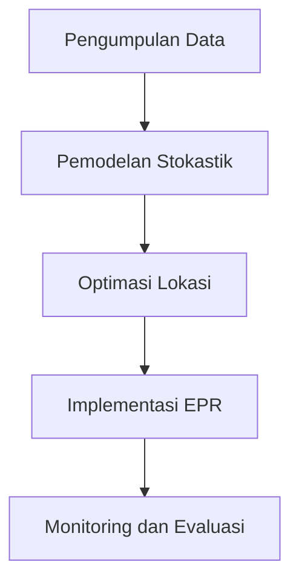

# 831 — Desain Jaringan Logistik Terbalik Tertutup untuk E-Waste (WEEE): Pemodelan Tingkat Pengembalian Stokastik, Lokasi Pusat Depolusi Multi-Echelon, dan Tanggung Jawab Produsen yang Diperluas (EPR)

**Domain:** Teknik Industri & Rekayasa Sistem Industri  
**Topik Spesialis:** Closed-Loop Reverse Logistics Network Design for E-Waste (WEEE): Stochastic Return Rate Modeling, Multi-Echelon Depollution Center Location, and Extended Producer Responsibility (EPR)  
**Standar & Referensi Utama:** Govindan et al. (2023, Eur. J. Oper. Res.); EU Directive 2012/19/EU; Guide & Van Wassenhove (Closed-Loop Supply Chains, CRC Press)

---

## 1. Pendahuluan dan Konteks Industri

Dalam era digital saat ini, limbah elektronik (e-waste) telah menjadi salah satu tantangan lingkungan yang paling mendesak. Menurut laporan dari United Nations University, diperkirakan bahwa pada tahun 2021, dunia menghasilkan sekitar 53,6 juta ton e-waste, dan angka ini diperkirakan akan meningkat menjadi 74,7 juta ton pada tahun 2030. E-waste mengandung bahan berbahaya yang dapat mencemari lingkungan jika tidak dikelola dengan baik. Oleh karena itu, desain jaringan logistik terbalik tertutup untuk e-waste menjadi penting untuk memastikan bahwa produk yang sudah tidak terpakai dapat diproses dengan cara yang ramah lingkungan dan efisien.

Tantangan utama dalam desain jaringan logistik terbalik ini meliputi ketidakpastian dalam tingkat pengembalian produk, lokasi pusat depolusi yang optimal, dan kepatuhan terhadap regulasi seperti EU Directive 2012/19/EU yang mengatur pengelolaan e-waste. Selain itu, tanggung jawab produsen yang diperluas (EPR) menuntut produsen untuk mengambil kembali dan mendaur ulang produk mereka, yang menambah kompleksitas dalam perencanaan dan pengelolaan rantai pasok. Oleh karena itu, diperlukan pendekatan yang sistematis dan berbasis data untuk mengatasi tantangan ini dan mencapai keberlanjutan dalam pengelolaan e-waste.

## 2. Landasan Teori & Formulasi Matematis

### 2.1. Pemodelan Tingkat Pengembalian Stokastik

Tingkat pengembalian produk dapat dimodelkan sebagai variabel acak yang mengikuti distribusi probabilitas tertentu. Misalkan $R$ adalah tingkat pengembalian yang mengikuti distribusi normal dengan rata-rata $\mu$ dan deviasi standar $\sigma$. Maka, fungsi distribusi kumulatif (CDF) dapat dinyatakan sebagai:

$$
F(R) = \frac{1}{2} \left(1 + \text{erf}\left(\frac{R - \mu}{\sigma \sqrt{2}}\right)\right)
$$

di mana $\text{erf}$ adalah fungsi kesalahan.

### 2.2. Lokasi Pusat Depolusi Multi-Echelon

Untuk menentukan lokasi pusat depolusi, kita menggunakan model pemrograman linier. Misalkan $x_i$ adalah variabel biner yang menunjukkan apakah pusat depolusi $i$ dibangun (1) atau tidak (0). Fungsi tujuan untuk meminimalkan total biaya transportasi dan operasional dapat dinyatakan sebagai:

$$
\text{Minimize } Z = \sum_{i=1}^{n} \sum_{j=1}^{m} c_{ij} x_i d_j
$$

di mana $c_{ij}$ adalah biaya transportasi dari lokasi $i$ ke pelanggan $j$, dan $d_j$ adalah permintaan pelanggan.

### 2.3. Tanggung Jawab Produsen yang Diperluas (EPR)

EPR mengharuskan produsen untuk bertanggung jawab atas produk mereka sepanjang siklus hidupnya. Model EPR dapat dinyatakan sebagai:

$$
\text{Minimize } C = \sum_{k=1}^{p} C_k \cdot R_k
$$

di mana $C_k$ adalah biaya pengelolaan untuk jenis produk $k$, dan $R_k$ adalah tingkat pengembalian untuk produk $k$.

## 3. Metodologi Rekayasa & Standar Prosedur Operasional (SOP)

### 3.1. Langkah-Langkah Implementasi

1. **Identifikasi dan Pengumpulan Data**: Kumpulkan data terkait tingkat pengembalian, biaya transportasi, dan lokasi potensial untuk pusat depolusi.
2. **Pemodelan Stokastik**: Gunakan model distribusi probabilitas untuk memprediksi tingkat pengembalian produk.
3. **Optimasi Lokasi**: Terapkan pemrograman linier untuk menentukan lokasi pusat depolusi yang optimal.
4. **Implementasi EPR**: Rancang program EPR yang sesuai dengan regulasi yang berlaku.
5. **Monitoring dan Evaluasi**: Lakukan evaluasi berkala terhadap kinerja jaringan logistik terbalik.

### 3.2. Diagram Alir Proses

## 4. Studi Kasus Kuantitatif Industri & Perhitungan Numerik

### 4.1. Contoh Kasus

Misalkan sebuah perusahaan elektronik memiliki data sebagai berikut:
- Rata-rata tingkat pengembalian ($\mu$) = 30%
- Deviasi standar ($\sigma$) = 10%
- Biaya transportasi ($c_{ij}$) = $100
- Permintaan pelanggan ($d_j$) = $500 unit

### 4.2. Langkah Kalkulasi

1. **Hitung CDF untuk Tingkat Pengembalian**:
   Menggunakan rumus CDF, kita dapat menghitung probabilitas pengembalian untuk tingkat pengembalian tertentu.

2. **Optimasi Lokasi**:
   Menggunakan pemrograman linier, kita dapat menentukan lokasi pusat depolusi yang meminimalkan biaya transportasi:

   $$ 
   Z = \sum_{i=1}^{n} \sum_{j=1}^{m} c_{ij} x_i d_j 
   $$

   Misalkan kita memiliki 3 lokasi pusat depolusi dan 5 pelanggan, kita dapat menghitung total biaya berdasarkan data yang ada.

### 4.3. Interpretasi Hasil

Setelah melakukan perhitungan, jika total biaya yang diperoleh adalah $Z = $5000, maka perusahaan dapat mengevaluasi apakah biaya tersebut sebanding dengan manfaat yang diperoleh dari pengelolaan e-waste yang lebih baik.

## 5. Evaluasi Kritis, Aplikasi Lintas Sektor & Standar Masa Depan

Desain jaringan logistik terbalik untuk e-waste tidak hanya relevan untuk industri elektronik, tetapi juga dapat diterapkan pada sektor lain seperti otomotif dan perangkat medis. Dengan meningkatnya kesadaran akan keberlanjutan, perusahaan di berbagai sektor harus mempertimbangkan tanggung jawab mereka dalam pengelolaan limbah.

Namun, metodologi ini memiliki batasan, terutama dalam hal ketidakpastian tingkat pengembalian dan biaya yang mungkin berubah seiring waktu. Oleh karena itu, riset masa depan harus fokus pada pengembangan model yang lebih adaptif dan responsif terhadap perubahan kondisi pasar dan regulasi.

Dengan demikian, desain jaringan logistik terbalik tertutup untuk e-waste menjadi elemen kunci dalam mencapai keberlanjutan dan kepatuhan terhadap regulasi, serta memberikan nilai tambah bagi perusahaan dalam jangka panjang.